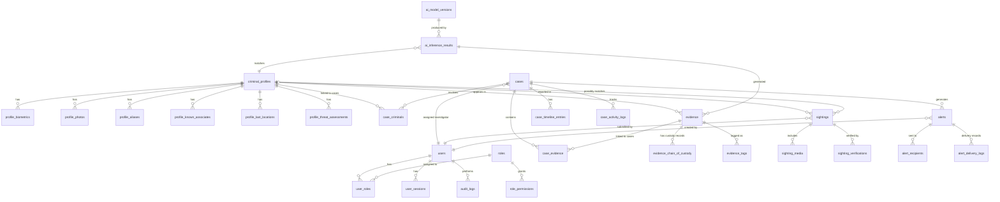

# Sentinel360 — Database Schema

> **Document:** 02-DATABASE-SCHEMA.md  
> **Version:** 1.0  
> **Status:** Approved  
> **Last Updated:** June 2026

---

## Design Principles

1. **Normalized to 3NF** — Minimal redundancy; JSONB used only where truly variable schema is required
2. **Immutable audit trail** — Audit logs are append-only; no updates or deletes permitted
3. **Cryptographic integrity** — Every evidence record carries a SHA-256 hash of its content
4. **Domain namespacing** — Tables prefixed by domain module (e.g., `case_`, `evidence_`, `profile_`)
5. **Soft deletes** — Destructive operations are logged, not executed; `deleted_at` timestamps used
6. **Temporal tracking** — Every table has `created_at` and `updated_at`; critical tables have `valid_from`/`valid_to` for temporal queries

---

## Entity Relationship Diagram



---

## Schema Definition

### 1. Users & Authentication Domain

#### `users`

Core user table for all roles. All authentication and identity information.

```sql
CREATE TABLE users (
    id                  UUID PRIMARY KEY DEFAULT gen_random_uuid(),
    email               VARCHAR(255) NOT NULL UNIQUE,
    email_verified_at   TIMESTAMPTZ,
    password_hash       VARCHAR(255) NOT NULL,
    password_salt       VARCHAR(64) NOT NULL,
    first_name          VARCHAR(100) NOT NULL,
    last_name           VARCHAR(100) NOT NULL,
    phone_number        VARCHAR(20),
    avatar_url          VARCHAR(512),
    is_active           BOOLEAN NOT NULL DEFAULT TRUE,
    is_locked           BOOLEAN NOT NULL DEFAULT FALSE,
    locked_until        TIMESTAMPTZ,
    failed_login_attempts INTEGER NOT NULL DEFAULT 0,
    last_login_at       TIMESTAMPTZ,
    last_login_ip       INET,
    requires_2fa        BOOLEAN NOT NULL DEFAULT FALSE,
    totp_secret         VARCHAR(64),
    totp_enabled_at     TIMESTAMPTZ,
    refresh_token_hash  VARCHAR(255),
    organization_id     UUID REFERENCES organizations(id),
    created_at          TIMESTAMPTZ NOT NULL DEFAULT NOW(),
    updated_at          TIMESTAMPTZ NOT NULL DEFAULT NOW(),
    deleted_at          TIMESTAMPTZ  -- soft delete
);

CREATE INDEX idx_users_email ON users(email) WHERE deleted_at IS NULL;
CREATE INDEX idx_users_organization ON users(organization_id) WHERE deleted_at IS NULL;
CREATE INDEX idx_users_active ON users(is_active) WHERE is_active = TRUE;
```

#### `roles`

```sql
CREATE TABLE roles (
    id          UUID PRIMARY KEY DEFAULT gen_random_uuid(),
    name        VARCHAR(50) NOT NULL UNIQUE,  -- community, security_operator, law_enforcement, admin, super_admin
    description TEXT,
    is_system   BOOLEAN NOT NULL DEFAULT FALSE,  -- system roles cannot be deleted
    created_at  TIMESTAMPTZ NOT NULL DEFAULT NOW()
);

-- Seed roles
INSERT INTO roles (name, description, is_system) VALUES
    ('community', 'Community member with basic access', TRUE),
    ('security_operator', 'Security company operator', TRUE),
    ('law_enforcement', 'Law enforcement officer', TRUE),
    ('admin', 'System administrator', TRUE),
    ('super_admin', 'Super administrator with full access', TRUE);
```

#### `user_roles`

```sql
CREATE TABLE user_roles (
    user_id     UUID NOT NULL REFERENCES users(id) ON DELETE CASCADE,
    role_id     UUID NOT NULL REFERENCES roles(id) ON DELETE CASCADE,
    assigned_by UUID REFERENCES users(id),
    assigned_at TIMESTAMPTZ NOT NULL DEFAULT NOW(),
    revoked_at  TIMESTAMPTZ,
    PRIMARY KEY (user_id, role_id)
);

CREATE INDEX idx_user_roles_user ON user_roles(user_id) WHERE revoked_at IS NULL;
```

#### `role_permissions`

```sql
CREATE TABLE role_permissions (
    id          UUID PRIMARY KEY DEFAULT gen_random_uuid(),
    role_id     UUID NOT NULL REFERENCES roles(id) ON DELETE CASCADE,
    resource    VARCHAR(100) NOT NULL,  -- e.g., 'cases', 'evidence', 'users', 'alerts', 'sightings', 'audit_logs', 'criminal_profiles'
    action      VARCHAR(50) NOT NULL,   -- e.g., 'create', 'read', 'update', 'delete', 'verify', 'approve', 'export'
    conditions  JSONB,                  -- optional row-level security conditions
    created_at  TIMESTAMPTZ NOT NULL DEFAULT NOW(),
    UNIQUE(role_id, resource, action)
);
```

#### `user_sessions`

```sql
CREATE TABLE user_sessions (
    id              UUID PRIMARY KEY DEFAULT gen_random_uuid(),
    user_id         UUID NOT NULL REFERENCES users(id) ON DELETE CASCADE,
    refresh_token_hash VARCHAR(255) NOT NULL,
    ip_address      INET,
    user_agent      TEXT,
    device_info     JSONB,
    is_revoked      BOOLEAN NOT NULL DEFAULT FALSE,
    revoked_at      TIMESTAMPTZ,
    expires_at      TIMESTAMPTZ NOT NULL,
    created_at      TIMESTAMPTZ NOT NULL DEFAULT NOW()
);

CREATE INDEX idx_user_sessions_user ON user_sessions(user_id) WHERE is_revoked = FALSE;
CREATE INDEX idx_user_sessions_expires ON user_sessions(expires_at) WHERE is_revoked = FALSE;
```

#### `organizations`

```sql
CREATE TABLE organizations (
    id              UUID PRIMARY KEY DEFAULT gen_random_uuid(),
    name            VARCHAR(200) NOT NULL,
    type            VARCHAR(50) NOT NULL,  -- security_company, police_department, community_group
    contact_email   VARCHAR(255),
    contact_phone   VARCHAR(20),
    address         JSONB,
    is_active       BOOLEAN NOT NULL DEFAULT TRUE,
    created_at      TIMESTAMPTZ NOT NULL DEFAULT NOW(),
    updated_at      TIMESTAMPTZ NOT NULL DEFAULT NOW(),
    deleted_at      TIMESTAMPTZ
);
```

---

### 2. Criminal Profiles Domain

#### `criminal_profiles`

Central table for persons of interest. Contains core identification and case linkage.

```sql
CREATE TABLE criminal_profiles (
    id                  UUID PRIMARY KEY DEFAULT gen_random_uuid(),
    external_id         VARCHAR(100) UNIQUE,  -- external system ID (national police database)
    first_name          VARCHAR(100) NOT NULL,
    last_name           VARCHAR(100) NOT NULL,
    date_of_birth       DATE,
    gender              VARCHAR(20),
    nationality         VARCHAR(100),
    id_number           VARCHAR(50),          -- national ID / passport
    physical_description JSONB,               -- height, weight, build, eye_color, hair_color, distinguishing_marks
    risk_level          VARCHAR(20) DEFAULT 'unknown',  -- low, medium, high, critical
    status              VARCHAR(30) NOT NULL DEFAULT 'active',  -- active, arrested, cleared, deceased, archived
    status_changed_at   TIMESTAMPTZ,
    status_changed_by   UUID REFERENCES users(id),
    is_public           BOOLEAN NOT NULL DEFAULT TRUE,  -- visible on public wanted feed
    is_wanted           BOOLEAN NOT NULL DEFAULT TRUE,
    last_known_location GEOGRAPHY(Point, 4326),
    last_seen_at        TIMESTAMPTZ,
    default_confidence_threshold DECIMAL(5,2) DEFAULT 80.00,  -- minimum % for alert
    notes               TEXT,
    merged_into         UUID REFERENCES criminal_profiles(id),  -- profile deduplication
    created_by          UUID REFERENCES users(id),
    created_at          TIMESTAMPTZ NOT NULL DEFAULT NOW(),
    updated_at          TIMESTAMPTZ NOT NULL DEFAULT NOW(),
    deleted_at          TIMESTAMPTZ
);

-- Indexes
CREATE INDEX idx_criminal_profiles_status ON criminal_profiles(status) WHERE deleted_at IS NULL;
CREATE INDEX idx_criminal_profiles_name ON criminal_profiles(last_name, first_name) WHERE deleted_at IS NULL;
CREATE INDEX idx_criminal_profiles_public ON criminal_profiles(is_public) WHERE is_public = TRUE AND deleted_at IS NULL;
CREATE INDEX idx_criminal_profiles_geo ON criminal_profiles USING GIST(last_known_location) WHERE deleted_at IS NULL;
CREATE INDEX idx_criminal_profiles_external ON criminal_profiles(external_id) WHERE deleted_at IS NULL;
```

#### `profile_biometrics`

```sql
CREATE TABLE profile_biometrics (
    id              UUID PRIMARY KEY DEFAULT gen_random_uuid(),
    profile_id      UUID NOT NULL REFERENCES criminal_profiles(id) ON DELETE CASCADE,
    biometric_type  VARCHAR(50) NOT NULL,  -- face_embedding, fingerprint_hash, iris_hash, voice_print
    embedding_vector VECTOR(512),           -- pgvector for face embeddings (512-dim ArcFace)
    algorithm       VARCHAR(100),          -- e.g., 'ArcFace-R100', 'DeepPrint'
    algorithm_version VARCHAR(50),
    quality_score   DECIMAL(5,2),          -- 0-100 quality metric
    source          VARCHAR(50),           -- 'upload', 'ai_capture', 'external_import'
    is_primary      BOOLEAN NOT NULL DEFAULT FALSE,
    created_at      TIMESTAMPTZ NOT NULL DEFAULT NOW(),
    UNIQUE(profile_id, biometric_type, algorithm)
);

-- pgvector index for fast similarity search
CREATE INDEX idx_profile_biometrics_embedding ON profile_biometrics USING ivfflat (embedding_vector vector_cosine_ops)
    WHERE biometric_type = 'face_embedding';
CREATE INDEX idx_profile_biometrics_profile ON profile_biometrics(profile_id);
```

#### `profile_photos`

```sql
CREATE TABLE profile_photos (
    id              UUID PRIMARY KEY DEFAULT gen_random_uuid(),
    profile_id      UUID NOT NULL REFERENCES criminal_profiles(id) ON DELETE CASCADE,
    s3_key          VARCHAR(512) NOT NULL,
    cdn_url         VARCHAR(512),
    photo_type      VARCHAR(30) NOT NULL,  -- mugshot, surveillance, uploaded, ai_capture
    is_primary      BOOLEAN NOT NULL DEFAULT FALSE,
    width           INTEGER,
    height          INTEGER,
    file_size_bytes BIGINT,
    mime_type       VARCHAR(50) NOT NULL DEFAULT 'image/jpeg',
    sha256_hash     VARCHAR(64) NOT NULL,
    source          VARCHAR(50),
    source_url      VARCHAR(512),
    taken_at        TIMESTAMPTZ,
    created_at      TIMESTAMPTZ NOT NULL DEFAULT NOW(),
    deleted_at      TIMESTAMPTZ
);

CREATE INDEX idx_profile_photos_profile ON profile_photos(profile_id) WHERE deleted_at IS NULL;
```

#### `profile_aliases`

```sql
CREATE TABLE profile_aliases (
    id          UUID PRIMARY KEY DEFAULT gen_random_uuid(),
    profile_id  UUID NOT NULL REFERENCES criminal_profiles(id) ON DELETE CASCADE,
    alias       VARCHAR(200) NOT NULL,
    alias_type  VARCHAR(30) DEFAULT 'aka',  -- aka, nickname, street_name, former_name
    created_at  TIMESTAMPTZ NOT NULL DEFAULT NOW()
);

CREATE INDEX idx_profile_aliases_profile ON profile_aliases(profile_id);
CREATE INDEX idx_profile_aliases_alias ON profile_aliases(alias);
```

#### `profile_known_associates`

```sql
CREATE TABLE profile_known_associates (
    id                  UUID PRIMARY KEY DEFAULT gen_random_uuid(),
    profile_id          UUID NOT NULL REFERENCES criminal_profiles(id) ON DELETE CASCADE,
    associate_id        UUID NOT NULL REFERENCES criminal_profiles(id) ON DELETE CASCADE,
    relationship_type   VARCHAR(50) NOT NULL,  -- accomplice, family, gang_member, associate
    confidence_score    DECIMAL(5,2),          -- strength of association (0-100)
    source              TEXT,                  -- how this association was established
    is_active           BOOLEAN NOT NULL DEFAULT TRUE,
    valid_from          TIMESTAMPTZ NOT NULL DEFAULT NOW(),
    valid_to            TIMESTAMPTZ,
    created_by          UUID REFERENCES users(id),
    created_at          TIMESTAMPTZ NOT NULL DEFAULT NOW(),
    CHECK (profile_id != associate_id),
    UNIQUE(profile_id, associate_id)
);

CREATE INDEX idx_known_associates_profile ON profile_known_associates(profile_id) WHERE is_active = TRUE;
CREATE INDEX idx_known_associates_associate ON profile_known_associates(associate_id) WHERE is_active = TRUE;
```

#### `profile_last_locations`

```sql
CREATE TABLE profile_last_locations (
    id              UUID PRIMARY KEY DEFAULT gen_random_uuid(),
    profile_id      UUID NOT NULL REFERENCES criminal_profiles(id) ON DELETE CASCADE,
    location        GEOGRAPHY(Point, 4326) NOT NULL,
    address         TEXT,
    source          VARCHAR(50) NOT NULL,  -- sighting, ai_detection, gps_tag, manual_entry
    source_id       UUID,                  -- FK to sightings.id or evidence.id
    accuracy_meters DECIMAL(10,2),
    noted_at        TIMESTAMPTZ NOT NULL,   -- when the person was actually seen here
    created_at      TIMESTAMPTZ NOT NULL DEFAULT NOW()
);

CREATE INDEX idx_last_locations_profile ON profile_last_locations(profile_id);
CREATE INDEX idx_last_locations_geo ON profile_last_locations USING GIST(location);
CREATE INDEX idx_last_locations_noted ON profile_last_locations(profile_id, noted_at DESC);
```

#### `profile_threat_assessments`

```sql
CREATE TABLE profile_threat_assessments (
    id                  UUID PRIMARY KEY DEFAULT gen_random_uuid(),
    profile_id          UUID NOT NULL REFERENCES criminal_profiles(id) ON DELETE CASCADE,
    assessed_by         UUID NOT NULL REFERENCES users(id),
    threat_level        VARCHAR(20) NOT NULL,  -- low, medium, high, critical
    risk_factors        JSONB,                 -- array of risk factor objects
    assessment_notes    TEXT,
    recommended_actions TEXT,
    valid_from          TIMESTAMPTZ NOT NULL DEFAULT NOW(),
    valid_to            TIMESTAMPTZ,
    is_current          BOOLEAN NOT NULL DEFAULT TRUE,
    created_at          TIMESTAMPTZ NOT NULL DEFAULT NOW()
);

CREATE INDEX idx_threat_assessments_profile ON profile_threat_assessments(profile_id, is_current);
```

---

### 3. Cases / Dockets Domain

#### `cases`

```sql
CREATE TABLE cases (
    id                  UUID PRIMARY KEY DEFAULT gen_random_uuid(),
    case_number         VARCHAR(50) NOT NULL UNIQUE,  -- e.g., "S360-2026-00001"
    title               VARCHAR(300) NOT NULL,
    description         TEXT,
    category            VARCHAR(100) NOT NULL,          -- theft, assault, robbery, hijacking, vandalism, missing_person, etc.
    priority            VARCHAR(20) NOT NULL DEFAULT 'medium',  -- low, medium, high, critical
    status              VARCHAR(30) NOT NULL DEFAULT 'open',    -- open, under_investigation, awaiting_review, closed, archived
    status_changed_at   TIMESTAMPTZ,
    status_changed_by   UUID REFERENCES users(id),
    assigned_investigator UUID REFERENCES users(id),
    assigned_team       TEXT[],                    -- array of investigator names/IDs
    jurisdiction        VARCHAR(200),              -- police precinct, area
    incident_location   GEOGRAPHY(Point, 4326),
    incident_address    TEXT,
    incident_started_at TIMESTAMPTZ,
    incident_ended_at   TIMESTAMPTZ,
    reported_by         UUID REFERENCES users(id),
    reported_at         TIMESTAMPTZ,
    is_sensitive        BOOLEAN NOT NULL DEFAULT FALSE,  -- restricted access
    closure_notes       TEXT,
    closed_at           TIMESTAMPTZ,
    closed_by           UUID REFERENCES users(id),
    created_at          TIMESTAMPTZ NOT NULL DEFAULT NOW(),
    updated_at          TIMESTAMPTZ NOT NULL DEFAULT NOW(),
    deleted_at          TIMESTAMPTZ
);

-- Indexes
CREATE INDEX idx_cases_number ON cases(case_number);
CREATE INDEX idx_cases_status ON cases(status) WHERE deleted_at IS NULL;
CREATE INDEX idx_cases_category ON cases(category) WHERE deleted_at IS NULL;
CREATE INDEX idx_cases_investigator ON cases(assigned_investigator) WHERE deleted_at IS NULL;
CREATE INDEX idx_cases_geo ON cases USING GIST(incident_location) WHERE deleted_at IS NULL;
CREATE INDEX idx_cases_incident_start ON cases(incident_started_at) WHERE deleted_at IS NULL;
CREATE INDEX idx_cases_created ON cases(created_at DESC) WHERE deleted_at IS NULL;
```

#### `case_criminals`

```sql
CREATE TABLE case_criminals (
    id              UUID PRIMARY KEY DEFAULT gen_random_uuid(),
    case_id         UUID NOT NULL REFERENCES cases(id) ON DELETE CASCADE,
    profile_id      UUID NOT NULL REFERENCES criminal_profiles(id) ON DELETE CASCADE,
    role            VARCHAR(50) NOT NULL DEFAULT 'suspect',  -- suspect, person_of_interest, witness, victim, arrested
    involvement_description TEXT,
    arrested_at     TIMESTAMPTZ,
    arrested_by     UUID REFERENCES users(id),
    UNIQUE(case_id, profile_id)
);

CREATE INDEX idx_case_criminals_case ON case_criminals(case_id);
CREATE INDEX idx_case_criminals_profile ON case_criminals(profile_id);
```

#### `case_evidence`

Linking table with ordering and notes.

```sql
CREATE TABLE case_evidence (
    id              UUID PRIMARY KEY DEFAULT gen_random_uuid(),
    case_id         UUID NOT NULL REFERENCES cases(id) ON DELETE CASCADE,
    evidence_id     UUID NOT NULL REFERENCES evidence(id) ON DELETE CASCADE,
    relevance_notes TEXT,
    sort_order      INTEGER NOT NULL DEFAULT 0,
    added_by        UUID REFERENCES users(id),
    added_at        TIMESTAMPTZ NOT NULL DEFAULT NOW(),
    removed_at      TIMESTAMPTZ,
    UNIQUE(case_id, evidence_id)
);

CREATE INDEX idx_case_evidence_case ON case_evidence(case_id) WHERE removed_at IS NULL;
```

#### `case_timeline_entries`

```sql
CREATE TABLE case_timeline_entries (
    id              UUID PRIMARY KEY DEFAULT gen_random_uuid(),
    case_id         UUID NOT NULL REFERENCES cases(id) ON DELETE CASCADE,
    event_type      VARCHAR(50) NOT NULL,   -- incident_occurred, evidence_added, suspect_identified, arrest_made, status_change
    title           VARCHAR(300) NOT NULL,
    description     TEXT,
    occurred_at     TIMESTAMPTZ NOT NULL,   -- when the event actually happened
    source          VARCHAR(50),            -- system, manual, ai_detection
    source_id       UUID,                   -- FK to related entity
    created_by      UUID REFERENCES users(id),
    created_at      TIMESTAMPTZ NOT NULL DEFAULT NOW()
);

CREATE INDEX idx_case_timeline_case ON case_timeline_entries(case_id, occurred_at);
```

#### `case_activity_logs`

```sql
CREATE TABLE case_activity_logs (
    id              UUID PRIMARY KEY DEFAULT gen_random_uuid(),
    case_id         UUID NOT NULL REFERENCES cases(id) ON DELETE CASCADE,
    user_id         UUID REFERENCES users(id),
    action          VARCHAR(100) NOT NULL,  -- case_created, evidence_linked, status_changed, investigator_assigned
    description     TEXT,
    metadata        JSONB,                  -- additional context (previous status, new status, etc.)
    ip_address      INET,
    created_at      TIMESTAMPTZ NOT NULL DEFAULT NOW()
);

CREATE INDEX idx_case_activity_case ON case_activity_logs(case_id, created_at DESC);
CREATE INDEX idx_case_activity_user ON case_activity_logs(user_id);
```

---

### 4. Evidence Domain

#### `evidence`

Core evidence table. Every piece of evidence gets a SHA-256 hash for chain of custody.

```sql
CREATE TABLE evidence (
    id                  UUID PRIMARY KEY DEFAULT gen_random_uuid(),
    evidence_type       VARCHAR(50) NOT NULL,  -- snapshot, video_clip, witness_statement, document, 3d_reconstruction, audio, alpr_record
    title               VARCHAR(300) NOT NULL,
    description         TEXT,
    
    -- File metadata
    s3_key              VARCHAR(512),
    cdn_url             VARCHAR(512),
    file_size_bytes     BIGINT,
    mime_type           VARCHAR(100),
    width               INTEGER,               -- for images/video
    height              INTEGER,
    duration_seconds    DECIMAL(10,2),         -- for video/audio
    thumbnail_s3_key    VARCHAR(512),
    
    -- Cryptographic integrity
    sha256_hash         VARCHAR(64) NOT NULL,   -- SHA-256 of the file content
    previous_hash       VARCHAR(64),            -- previous evidence hash in chain (linked list)
    chain_position      INTEGER NOT NULL DEFAULT 1,
    
    -- Source
    source              VARCHAR(50) NOT NULL,   -- ai_capture, upload, system_generated, external_import, sighting
    source_id           UUID,                   -- FK to source record (sighting, ai_inference, etc.)
    captured_at         TIMESTAMPTZ,            -- when the evidence was originally captured
    captured_by_device  VARCHAR(200),           -- camera ID, device ID
    
    -- Geolocation
    location            GEOGRAPHY(Point, 4326),
    location_address    TEXT,
    
    -- Status
    status              VARCHAR(30) NOT NULL DEFAULT 'pending',  -- pending, verified, rejected, admitted, archived
    verified_by         UUID REFERENCES users(id),
    verified_at         TIMESTAMPTZ,
    verification_notes  TEXT,
    
    -- AI metadata
    ai_confidence_score DECIMAL(5,2),          -- if AI-generated, the confidence score
    ai_model_version_id UUID REFERENCES ai_model_versions(id),
    
    -- Audit
    created_by          UUID REFERENCES users(id),
    created_at          TIMESTAMPTZ NOT NULL DEFAULT NOW(),
    updated_at          TIMESTAMPTZ NOT NULL DEFAULT NOW(),
    deleted_at          TIMESTAMPTZ
);

-- Indexes
CREATE INDEX idx_evidence_type ON evidence(evidence_type) WHERE deleted_at IS NULL;
CREATE INDEX idx_evidence_status ON evidence(status) WHERE deleted_at IS NULL;
CREATE INDEX idx_evidence_source ON evidence(source, source_id) WHERE deleted_at IS NULL;
CREATE INDEX idx_evidence_hash ON evidence(sha256_hash);
CREATE INDEX idx_evidence_geo ON evidence USING GIST(location) WHERE deleted_at IS NULL;
CREATE INDEX idx_evidence_captured ON evidence(captured_at DESC) WHERE deleted_at IS NULL;
CREATE INDEX idx_evidence_ai_score ON evidence(ai_confidence_score DESC) WHERE ai_confidence_score IS NOT NULL;
```

#### `evidence_chain_of_custody`

```sql
CREATE TABLE evidence_chain_of_custody (
    id              UUID PRIMARY KEY DEFAULT gen_random_uuid(),
    evidence_id     UUID NOT NULL REFERENCES evidence(id) ON DELETE CASCADE,
    action          VARCHAR(50) NOT NULL,   -- created, accessed, viewed, exported, transferred, verified, modified, archived
    performed_by    UUID NOT NULL REFERENCES users(id),
    performed_at    TIMESTAMPTZ NOT NULL DEFAULT NOW(),
    ip_address      INET,
    user_agent      TEXT,
    previous_hash   VARCHAR(64),
    current_hash    VARCHAR(64) NOT NULL,    -- SHA-256 of: previous_hash + evidence_id + action + user_id + timestamp
    notes           TEXT,
    metadata        JSONB,
    
    -- Ensure chain integrity
    CONSTRAINT fk_previous_hash
        FOREIGN KEY (evidence_id, previous_hash) 
        REFERENCES evidence_chain_of_custody(evidence_id, current_hash)
);

CREATE INDEX idx_chain_evidence ON evidence_chain_of_custody(evidence_id, performed_at);
CREATE INDEX idx_chain_user ON evidence_chain_of_custody(performed_by);
CREATE INDEX idx_chain_hash ON evidence_chain_of_custody(current_hash);
```

#### `evidence_tags`

```sql
CREATE TABLE evidence_tags (
    id          UUID PRIMARY KEY DEFAULT gen_random_uuid(),
    evidence_id UUID NOT NULL REFERENCES evidence(id) ON DELETE CASCADE,
    tag         VARCHAR(100) NOT NULL,
    created_at  TIMESTAMPTZ NOT NULL DEFAULT NOW(),
    UNIQUE(evidence_id, tag)
);

CREATE INDEX idx_evidence_tags_tag ON evidence_tags(tag);
CREATE INDEX idx_evidence_tags_evidence ON evidence_tags(evidence_id);
```

---

### 5. Sightings Domain

#### `sightings`

Community-submitted reports of wanted persons.

```sql
CREATE TABLE sightings (
    id                  UUID PRIMARY KEY DEFAULT gen_random_uuid(),
    profile_id          UUID REFERENCES criminal_profiles(id),  -- resolved after AI matching
    submitted_by        UUID NOT NULL REFERENCES users(id),
    anonymous_submission BOOLEAN NOT NULL DEFAULT FALSE,
    
    -- Content
    description         TEXT NOT NULL,
    location            GEOGRAPHY(Point, 4326) NOT NULL,
    location_address    TEXT,
    location_accuracy_meters DECIMAL(10,2),
    observed_at         TIMESTAMPTZ NOT NULL,    -- when the person was seen
    
    -- Status
    status              VARCHAR(30) NOT NULL DEFAULT 'pending',  -- pending, under_review, verified, duplicate, false_report, actioned
    status_changed_at   TIMESTAMPTZ,
    status_changed_by   UUID REFERENCES users(id),
    
    -- AI Matching
    ai_match_processed  BOOLEAN NOT NULL DEFAULT FALSE,
    ai_match_profile_id UUID REFERENCES criminal_profiles(id),
    ai_confidence_score DECIMAL(5,2),
    ai_model_version_id UUID REFERENCES ai_model_versions(id),
    ai_processed_at     TIMESTAMPTZ,
    
    -- Verification
    verified_by         UUID REFERENCES users(id),
    verified_at         TIMESTAMPTZ,
    verification_notes  TEXT,
    
    -- Reference
    reference_number    VARCHAR(30) NOT NULL UNIQUE,  -- e.g., "ST-2026-00001"
    is_public           BOOLEAN NOT NULL DEFAULT FALSE,  -- visible on public feed
    created_at          TIMESTAMPTZ NOT NULL DEFAULT NOW(),
    updated_at          TIMESTAMPTZ NOT NULL DEFAULT NOW(),
    deleted_at          TIMESTAMPTZ
);

-- Indexes
CREATE INDEX idx_sightings_status ON sightings(status) WHERE deleted_at IS NULL;
CREATE INDEX idx_sightings_submitter ON sightings(submitted_by) WHERE deleted_at IS NULL;
CREATE INDEX idx_sightings_profile ON sightings(profile_id) WHERE deleted_at IS NULL;
CREATE INDEX idx_sightings_geo ON sightings USING GIST(location) WHERE deleted_at IS NULL;
CREATE INDEX idx_sightings_observed ON sightings(observed_at DESC) WHERE deleted_at IS NULL;
CREATE INDEX idx_sightings_reference ON sightings(reference_number);
CREATE INDEX idx_sightings_ai_match ON sightings(ai_match_processed, ai_confidence_score) WHERE ai_match_processed = TRUE;
```

#### `sighting_media`

```sql
CREATE TABLE sighting_media (
    id              UUID PRIMARY KEY DEFAULT gen_random_uuid(),
    sighting_id     UUID NOT NULL REFERENCES sightings(id) ON DELETE CASCADE,
    media_type      VARCHAR(20) NOT NULL,  -- image, video
    s3_key          VARCHAR(512) NOT NULL,
    cdn_url         VARCHAR(512),
    file_size_bytes BIGINT,
    mime_type       VARCHAR(50),
    sha256_hash     VARCHAR(64) NOT NULL,
    is_primary      BOOLEAN NOT NULL DEFAULT FALSE,
    width           INTEGER,
    height          INTEGER,
    created_at      TIMESTAMPTZ NOT NULL DEFAULT NOW()
);

CREATE INDEX idx_sighting_media_sighting ON sighting_media(sighting_id);
```

#### `sighting_verifications`

```sql
CREATE TABLE sighting_verifications (
    id              UUID PRIMARY KEY DEFAULT gen_random_uuid(),
    sighting_id     UUID NOT NULL REFERENCES sightings(id) ON DELETE CASCADE,
    verified_by     UUID NOT NULL REFERENCES users(id),
    decision        VARCHAR(30) NOT NULL,   -- verified, duplicate, false_report
    confidence      DECIMAL(5,2),           -- officer's confidence in their decision
    notes           TEXT,
    created_at      TIMESTAMPTZ NOT NULL DEFAULT NOW(),
    UNIQUE(sighting_id, verified_by)
);
```

---

### 6. Alerts Domain

#### `alerts`

```sql
CREATE TABLE alerts (
    id                  UUID PRIMARY KEY DEFAULT gen_random_uuid(),
    alert_type          VARCHAR(50) NOT NULL,     -- wanted_person_sighting, suspicious_behavior, vehicle_match, threat_alert, system
    severity            VARCHAR(20) NOT NULL,     -- low, medium, high, critical
    title               VARCHAR(300) NOT NULL,
    description         TEXT NOT NULL,
    
    -- Source
    source              VARCHAR(50) NOT NULL,     -- ai_detection, sighting, manual, system
    source_id           UUID,                     -- FK to related entity
    case_id             UUID REFERENCES cases(id),
    profile_id          UUID REFERENCES criminal_profiles(id),
    
    -- Targeting
    target_role         VARCHAR(50),              -- community, security_operator, law_enforcement, all
    target_region       GEOGRAPHY(Polygon, 4326), -- geographic targeting
    target_radius_meters DECIMAL(10,2),
    
    -- Location
    location            GEOGRAPHY(Point, 4326),
    location_address    TEXT,
    
    -- Timing
    expires_at          TIMESTAMPTZ,
    is_read             BOOLEAN NOT NULL DEFAULT FALSE,
    
    -- Audit
    created_by          UUID REFERENCES users(id),
    created_at          TIMESTAMPTZ NOT NULL DEFAULT NOW(),
    updated_at          TIMESTAMPTZ NOT NULL DEFAULT NOW(),
    deleted_at          TIMESTAMPTZ
);

-- Indexes
CREATE INDEX idx_alerts_type ON alerts(alert_type) WHERE deleted_at IS NULL;
CREATE INDEX idx_alerts_severity ON alerts(severity) WHERE deleted_at IS NULL;
CREATE INDEX idx_alerts_created ON alerts(created_at DESC) WHERE deleted_at IS NULL;
CREATE INDEX idx_alerts_case ON alerts(case_id) WHERE deleted_at IS NULL;
CREATE INDEX idx_alerts_profile ON alerts(profile_id) WHERE deleted_at IS NULL;
CREATE INDEX idx_alerts_geo ON alerts USING GIST(location) WHERE deleted_at IS NULL;
CREATE INDEX idx_alerts_expires ON alerts(expires_at) WHERE expires_at IS NOT NULL AND deleted_at IS NULL;
```

#### `alert_recipients`

```sql
CREATE TABLE alert_recipients (
    id              UUID PRIMARY KEY DEFAULT gen_random_uuid(),
    alert_id        UUID NOT NULL REFERENCES alerts(id) ON DELETE CASCADE,
    user_id         UUID NOT NULL REFERENCES users(id) ON DELETE CASCADE,
    read_at         TIMESTAMPTZ,
    acknowledged_at TIMESTAMPTZ,
    dismissed_at    TIMESTAMPTZ,
    created_at      TIMESTAMPTZ NOT NULL DEFAULT NOW(),
    UNIQUE(alert_id, user_id)
);

CREATE INDEX idx_alert_recipients_alert ON alert_recipients(alert_id);
CREATE INDEX idx_alert_recipients_user ON alert_recipients(user_id);
```

#### `alert_delivery_logs`

```sql
CREATE TABLE alert_delivery_logs (
    id              UUID PRIMARY KEY DEFAULT gen_random_uuid(),
    alert_id        UUID NOT NULL REFERENCES alerts(id) ON DELETE CASCADE,
    recipient_id    UUID REFERENCES alert_recipients(id),
    channel         VARCHAR(30) NOT NULL,    -- push_notification, in_app, email, sms
    status          VARCHAR(30) NOT NULL,    -- pending, delivered, failed, bounced
    delivered_at    TIMESTAMPTZ,
    failed_at       TIMESTAMPTZ,
    failure_reason  TEXT,
    retry_count     INTEGER NOT NULL DEFAULT 0,
    provider_message_id VARCHAR(255),        -- FCM/APNS message ID
    created_at      TIMESTAMPTZ NOT NULL DEFAULT NOW()
);

CREATE INDEX idx_alert_delivery_alert ON alert_delivery_logs(alert_id);
CREATE INDEX idx_alert_delivery_status ON alert_delivery_logs(status) WHERE status = 'pending';
```

---

### 7. Audit Logs Domain

#### `audit_logs`

**IMMUTABLE** — This table is append-only. No updates, no deletes. Write access restricted to the Audit Service only.

```sql
CREATE TABLE audit_logs (
    id              UUID PRIMARY KEY DEFAULT gen_random_uuid(),
    user_id         UUID REFERENCES users(id),
    user_role       VARCHAR(50),
    action          VARCHAR(100) NOT NULL,    -- user.login, case.created, evidence.verified, profile.updated, etc.
    resource_type   VARCHAR(100) NOT NULL,    -- users, cases, evidence, profiles, sightings, alerts, settings
    resource_id     UUID,                     -- the ID of the affected resource
    description     TEXT,
    metadata        JSONB,                    -- structured data about what changed
    ip_address      INET NOT NULL,
    user_agent      TEXT,
    session_id      UUID,
    request_id      UUID,                     -- correlation ID for tracing
    geographic_location GEOGRAPHY(Point, 4326),
    created_at      TIMESTAMPTZ NOT NULL DEFAULT NOW()
)
PARTITION BY RANGE (created_at);

-- Create partitions (monthly)
CREATE TABLE audit_logs_2026_06 PARTITION OF audit_logs
    FOR VALUES FROM ('2026-06-01') TO ('2026-07-01');
CREATE TABLE audit_logs_2026_07 PARTITION OF audit_logs
    FOR VALUES FROM ('2026-07-01') TO ('2026-08-01');
-- ... additional partitions created by cron job

-- Indexes on parent — propagates to partitions
CREATE INDEX idx_audit_logs_user ON audit_logs(user_id, created_at DESC);
CREATE INDEX idx_audit_logs_action ON audit_logs(action, created_at DESC);
CREATE INDEX idx_audit_logs_resource ON audit_logs(resource_type, resource_id);
CREATE INDEX idx_audit_logs_created ON audit_logs(created_at DESC);
CREATE INDEX idx_audit_logs_ip ON audit_logs(ip_address);
```

---

### 8. AI Model Domain

#### `ai_model_versions`

```sql
CREATE TABLE ai_model_versions (
    id                  UUID PRIMARY KEY DEFAULT gen_random_uuid(),
    model_name          VARCHAR(100) NOT NULL,  -- face_detection, face_recognition, alpr, behaviour_detection, reid, 3d_reconstruction
    model_framework     VARCHAR(50),            -- PyTorch, TensorFlow, ONNX
    version             VARCHAR(50) NOT NULL,
    description         TEXT,
    
    -- Performance metrics
    accuracy            DECIMAL(5,2),
    precision           DECIMAL(5,2),
    recall              DECIMAL(5,2),
    f1_score            DECIMAL(5,2),
    latency_ms          DECIMAL(10,2),
    
    -- Artifacts
    model_s3_key        VARCHAR(512),           -- trained model file
    model_sha256        VARCHAR(64),
    config_json         JSONB,
    
    -- Lifecycle
    status              VARCHAR(30) NOT NULL DEFAULT 'staging',  -- development, staging, production, deprecated, archived
    promoted_by         UUID REFERENCES users(id),
    promoted_at         TIMESTAMPTZ,
    deprecated_at       TIMESTAMPTZ,
    
    -- Lineage
    parent_model_id     UUID REFERENCES ai_model_versions(id),
    training_dataset_id VARCHAR(200),
    training_notes      TEXT,
    
    created_at          TIMESTAMPTZ NOT NULL DEFAULT NOW(),
    UNIQUE(model_name, version)
);

CREATE INDEX idx_ai_models_name ON ai_model_versions(model_name, status);
```

#### `ai_inference_results`

Raw inference output from AI models, linked to evidence and profiles.

```sql
CREATE TABLE ai_inference_results (
    id                  UUID PRIMARY KEY DEFAULT gen_random_uuid(),
    model_version_id    UUID NOT NULL REFERENCES ai_model_versions(id),
    evidence_id         UUID REFERENCES evidence(id),
    profile_id          UUID REFERENCES criminal_profiles(id),
    
    -- Detection
    detection_class     VARCHAR(100),           -- person, vehicle, face, license_plate, abnormal_activity
    detection_confidence DECIMAL(5,2) NOT NULL,
    bounding_box        JSONB,                  -- {x, y, width, height} in normalized coords
    
    -- Identification
    match_profile_id    UUID REFERENCES criminal_profiles(id),
    match_confidence    DECIMAL(5,2),            -- similarity score if matched
    
    -- Embedding
    embedding_vector    VECTOR(512),              -- for future re-identification
    
    -- Source
    source_camera_id    VARCHAR(200),
    source_frame_timestamp TIMESTAMPTZ,
    raw_output          JSONB,                    -- complete model output
    
    created_at          TIMESTAMPTZ NOT NULL DEFAULT NOW()
);

CREATE INDEX idx_ai_inference_evidence ON ai_inference_results(evidence_id);
CREATE INDEX idx_ai_inference_profile ON ai_inference_results(profile_id);
CREATE INDEX idx_ai_inference_model ON ai_inference_results(model_version_id);
CREATE INDEX idx_ai_inference_confidence ON ai_inference_results(match_confidence DESC) WHERE match_confidence IS NOT NULL;
CREATE INDEX idx_ai_inference_created ON ai_inference_results(created_at DESC);
```

---

### 9. Additional Support Tables

#### `case_notes`

```sql
CREATE TABLE case_notes (
    id          UUID PRIMARY KEY DEFAULT gen_random_uuid(),
    case_id     UUID NOT NULL REFERENCES cases(id) ON DELETE CASCADE,
    author_id   UUID NOT NULL REFERENCES users(id),
    content     TEXT NOT NULL,
    is_private  BOOLEAN NOT NULL DEFAULT FALSE,  -- only visible to investigators
    edited_at   TIMESTAMPTZ,
    created_at  TIMESTAMPTZ NOT NULL DEFAULT NOW(),
    deleted_at  TIMESTAMPTZ
);

CREATE INDEX idx_case_notes_case ON case_notes(case_id, created_at DESC);
```

#### `alpr_records`

Specialized table for license plate recognition data.

```sql
CREATE TABLE alpr_records (
    id                  UUID PRIMARY KEY DEFAULT gen_random_uuid(),
    license_plate       VARCHAR(20) NOT NULL,
    plate_country       VARCHAR(10),
    plate_state         VARCHAR(50),
    vehicle_make        VARCHAR(100),
    vehicle_model       VARCHAR(100),
    vehicle_color       VARCHAR(50),
    vehicle_year        INTEGER,
    confidence_score    DECIMAL(5,2) NOT NULL,
    
    evidence_id         UUID REFERENCES evidence(id),
    profile_id          UUID REFERENCES criminal_profiles(id),
    
    location            GEOGRAPHY(Point, 4326),
    captured_at         TIMESTAMPTZ NOT NULL,
    camera_id           VARCHAR(200),
    
    created_at          TIMESTAMPTZ NOT NULL DEFAULT NOW()
);

CREATE INDEX idx_alpr_plate ON alpr_records(license_plate);
CREATE INDEX idx_alpr_captured ON alpr_records(captured_at DESC);
CREATE INDEX idx_alpr_geo ON alpr_records USING GIST(location);
CREATE INDEX idx_alpr_evidence ON alpr_records(evidence_id);
```

#### `system_configuration`

```sql
CREATE TABLE system_configuration (
    id              UUID PRIMARY KEY DEFAULT gen_random_uuid(),
    config_key      VARCHAR(200) NOT NULL UNIQUE,
    config_value    JSONB NOT NULL,
    description     TEXT,
    is_encrypted    BOOLEAN NOT NULL DEFAULT FALSE,
    updated_by      UUID REFERENCES users(id),
    created_at      TIMESTAMPTZ NOT NULL DEFAULT NOW(),
    updated_at      TIMESTAMPTZ NOT NULL DEFAULT NOW()
);

-- Seed initial configurations
INSERT INTO system_configuration (config_key, config_value, description) VALUES
    ('alert.default_confidence_threshold', '{"value": 80}', 'Default minimum confidence % for automatic alerts'),
    ('sighting.auto_match_enabled', '{"value": true}', 'Enable automatic AI matching of sightings to profiles'),
    ('evidence.hash_algorithm', '{"value": "SHA-256"}', 'Cryptographic hash algorithm for evidence chain'),
    ('auth.max_failed_attempts', '{"value": 5}', 'Max failed login attempts before account lockout'),
    ('auth.lockout_duration_minutes', '{"value": 30}', 'Account lockout duration after failed attempts'),
    ('pagination.default_page_size', '{"value": 20}', 'Default records per page'),
    ('pagination.max_page_size', '{"value": 100}', 'Maximum records per page'),
    ('video.processing_resolution', '{"value": "1080p"}', 'Video processing resolution'),
    ('video.keyframe_interval_seconds', '{"value": 2}', 'Interval between AI analysis frames');
```

---

## Full Schema Summary

| Domain | Tables | Count |
|--------|--------|-------|
| Users & Auth | `users`, `roles`, `user_roles`, `role_permissions`, `user_sessions`, `organizations` | 6 |
| Criminal Profiles | `criminal_profiles`, `profile_biometrics`, `profile_photos`, `profile_aliases`, `profile_known_associates`, `profile_last_locations`, `profile_threat_assessments` | 7 |
| Cases | `cases`, `case_criminals`, `case_evidence`, `case_timeline_entries`, `case_activity_logs`, `case_notes` | 6 |
| Evidence | `evidence`, `evidence_chain_of_custody`, `evidence_tags` | 3 |
| Sightings | `sightings`, `sighting_media`, `sighting_verifications` | 3 |
| Alerts | `alerts`, `alert_recipients`, `alert_delivery_logs` | 3 |
| Audit | `audit_logs` (partitioned) | 1 |
| AI | `ai_model_versions`, `ai_inference_results` | 2 |
| Additional | `alpr_records`, `system_configuration` | 2 |
| **Total** | | **33** |

---

## Index Strategy Summary

| Index Type | Count | Purpose |
|-----------|-------|---------|
| B-tree (primary) | 33 | Primary key lookups |
| B-tree (secondary) | ~45 | Foreign key joins, filtered queries |
| GIST (geospatial) | 6 | Location-based queries |
| IVFFlat (pgvector) | 2 | Face embedding similarity search |
| Partial (WHERE) | ~15 | Active/not-deleted filtered queries |
| Partitioning | 1 | Time-based partitioning for audit_logs |

---

## Revision History

| Version | Date | Author | Changes |
|---------|------|--------|---------|
| 1.0 | June 2026 | Software Architect | Initial database schema |
