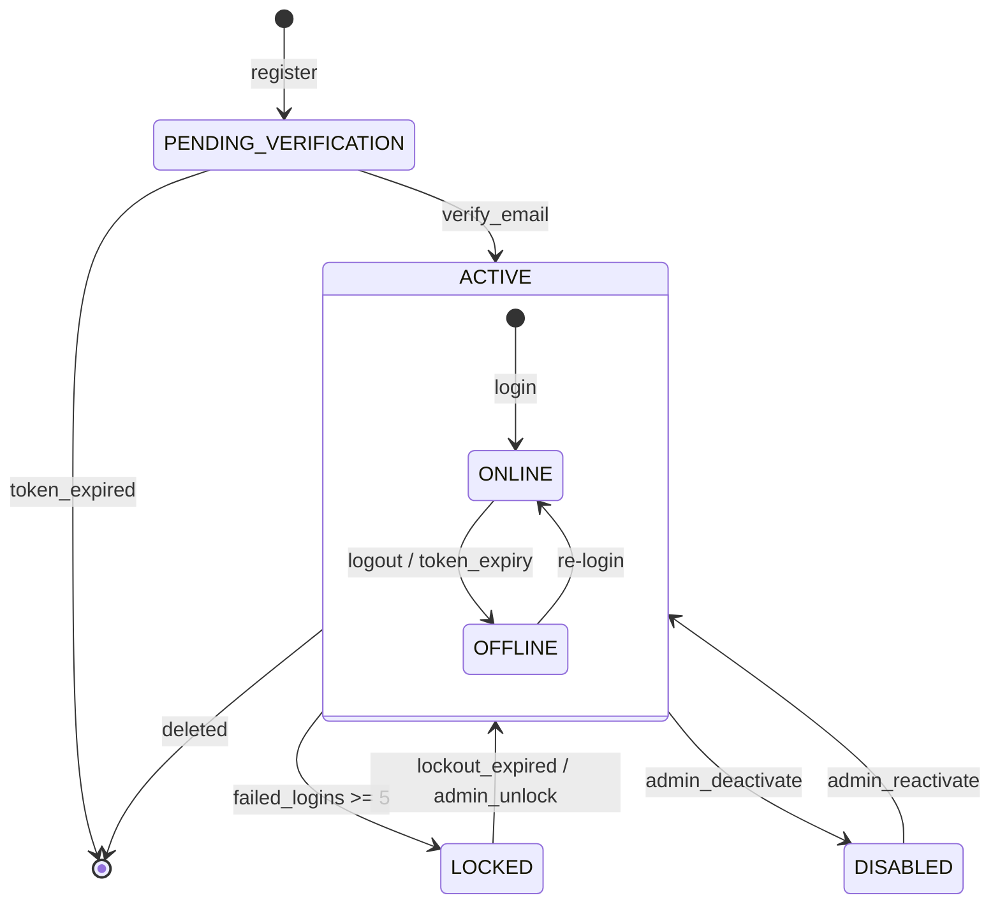

# Domain: Authentication & User Management

> **Document:** 01-auth-domain.md  
> **Version:** 1.0  
> **Status:** Draft  
> **Last Updated:** June 2026

---

## Overview

This domain handles **user identity, authentication, session management, and organization membership** across the Sentinel360 platform. It provides registration, login, token-based session management, multi-factor authentication (2FA), account security (lockout, password policies), and organizational grouping for multi-tenant deployments.

It acts as the **gatekeeper domain** — all other domains depend on it for identity verification, authorization context, and audit traceability.

---

## Use Cases

---

### UC-01: User Registration

- **Purpose**: Allow new community members to register an account
- **Actors**: Unauthenticated user (Community Member)
- **Preconditions**: Email not already registered

#### Main Success Flow

1. User submits registration form (email, password, first name, last name, phone)
2. System validates email format, password strength (12+ chars, upper+lower+number+special)
3. System checks password against HaveIBeenPwned API
4. System checks email uniqueness in `users` table
5. System hashes password with bcrypt (cost factor 12) + per-user salt
6. System creates user record with `is_active = TRUE`, `is_locked = FALSE`
7. System assigns default `community` role via `user_roles`
8. System generates email verification token
9. System sends verification email
10. System emits `user.registered` audit event

#### Alternate / Exception Flows

- Email already exists → 409 Conflict
- Password too weak → 422 Validation Error
- Email delivery fails → Retry queue (BullMQ) with 3 attempts

#### Result

New user created in `users` table, default `community` role assigned, verification email sent.

---

### UC-02: User Login

- **Purpose**: Authenticate user and issue JWT tokens
- **Actors**: Registered user
- **Preconditions**: Account is active and not locked

#### Main Success Flow

1. User submits email + password + device info
2. System looks up user by email (active + not deleted)
3. System verifies password hash with bcrypt
4. System checks if account is locked (failed attempts >= 5 → 30-min lockout)
5. System resets `failed_login_attempts` to 0
6. System updates `last_login_at`, `last_login_ip`
7. System generates access token (15-min TTL, RS256) and refresh token (7-day TTL)
8. System creates `user_session` record
9. System returns JWT pair to client
10. System emits `user.login` audit event

#### Alternate / Exception Flows

- Invalid email → 401 Unauthorized (generic "invalid credentials")
- Invalid password → Increment `failed_login_attempts`; if >= 5, lock account 30 min
- Account locked → 423 Locked with `locked_until` timestamp
- Email not verified → 403 Forbidden (configurable: can be enforced)
- 2FA required → Return `requires_2fa: true` and 2FA token (5-min TTL)

#### Result

User authenticated, JWT pair issued, session recorded.

---

### UC-03: Token Refresh

- **Purpose**: Issue new access token using refresh token
- **Actors**: Authenticated user
- **Preconditions**: Refresh token is valid, not revoked, not expired

#### Main Success Flow

1. Client submits refresh token
2. System validates refresh token signature and expiry
3. System checks Redis blacklist (immediate revocation check)
4. System rotates refresh token (invalidates old one)
5. System issues new access token + new refresh token
6. System updates `refresh_token_hash` in `user_sessions`

#### Result

New JWT pair issued, old refresh token invalidated.

---

### UC-04: Logout

- **Purpose**: Terminate user session
- **Actors**: Authenticated user
- **Preconditions**: Valid access token

#### Main Success Flow

1. Client submits logout request with refresh token
2. System revokes `user_session` (sets `is_revoked = TRUE`, `revoked_at`)
3. System adds refresh token to Redis blacklist
4. System emits `user.logout` audit event

#### Result

Session terminated, tokens invalidated.

---

### UC-05: 2FA Setup (Super Admin)

- **Purpose**: Enable TOTP-based two-factor authentication
- **Actors**: Super Admin
- **Preconditions**: User is authenticated as Super Admin

#### Main Success Flow

1. User initiates 2FA setup
2. System generates TOTP secret (RFC 6238, 30-second window)
3. System generates QR code URL (`otpauth://totp/Sentinel360:{email}`)
4. System generates 10 backup codes (one-time use)
5. System stores `totp_secret` (encrypted), `backup_codes` (hashed)
6. User scans QR code with authenticator app
7. User verifies with TOTP code → System confirms and sets `requires_2fa = TRUE`
8. System emits `user.2fa_enabled` audit event

#### Result

TOTP configured, backup codes generated, QR code displayed.

---

### UC-06: Password Reset

- **Purpose**: Allow user to reset forgotten password
- **Actors**: Unauthenticated user
- **Preconditions**: User account exists

#### Main Success Flow

1. User requests password reset (email)
2. System generates password reset token (15-min TTL)
3. System sends reset link via email
4. User clicks link, enters new password
5. System validates new password strength
6. System updates `password_hash` with new bcrypt hash
7. System revokes all existing sessions
8. System emits `user.password_changed` audit event

#### Alternate / Exception Flows

- Email not found → Return success (prevent enumeration)
- Token expired → Return 410 Gone, user re-requests
- Rate limit: max 3 reset requests per hour

---

### UC-07: Organization Membership

- **Purpose**: Associate user with an organization (security company, police department)
- **Actors**: Super Admin
- **Preconditions**: Both user and organization exist

#### Main Success Flow

1. Super Admin assigns user to organization
2. System updates `users.organization_id`
3. System emits `user.organization_assigned` audit event

---

## Core Entities

---

### Entity: User

- **Description**: Core user record. Every human actor in the system maps to one user record.

#### Fields

| Field | Type | Description |
|-------|------|-------------|
| `id` | UUID | Primary key |
| `email` | VARCHAR(255) | Unique, verified email address |
| `email_verified_at` | TIMESTAMPTZ | When email was verified (null = unverified) |
| `password_hash` | VARCHAR(255) | bcrypt hash of password |
| `password_salt` | VARCHAR(64) | Per-user salt |
| `first_name` | VARCHAR(100) | User's first name |
| `last_name` | VARCHAR(100) | User's last name |
| `phone_number` | VARCHAR(20) | Contact number |
| `avatar_url` | VARCHAR(512) | Profile photo URL |
| `is_active` | BOOLEAN | Whether account is active |
| `is_locked` | BOOLEAN | Whether account is temporarily locked |
| `locked_until` | TIMESTAMPTZ | When lockout expires |
| `failed_login_attempts` | INTEGER | Count of consecutive failed logins |
| `last_login_at` | TIMESTAMPTZ | Last successful login |
| `last_login_ip` | INET | IP of last login |
| `requires_2fa` | BOOLEAN | Whether 2FA is enforced for this user |
| `totp_secret` | VARCHAR(64) | Encrypted TOTP secret |
| `totp_enabled_at` | TIMESTAMPTZ | When TOTP was configured |
| `refresh_token_hash` | VARCHAR(255) | Current refresh token hash |
| `organization_id` | UUID | FK to organizations |
| `created_at` | TIMESTAMPTZ | Row creation timestamp |
| `updated_at` | TIMESTAMPTZ | Row last update timestamp |
| `deleted_at` | TIMESTAMPTZ | Soft delete timestamp |

#### Constraints

- `email` must be unique (unique index on active records)
- `password_hash` must not be null
- Password must be >= 12 chars, include upper + lower + number + special
- `failed_login_attempts` resets to 0 on successful login

#### Relationships

- Has many `user_roles` (current and historical role assignments)
- Has many `user_sessions` (active sessions across devices)
- Belongs to `organization` (optional)
- Performs many `audit_logs`

---

### Entity: Session

- **Description**: Active user session tracking for token management and revocation.

#### Fields

| Field | Type | Description |
|-------|------|-------------|
| `id` | UUID | Primary key |
| `user_id` | UUID | FK to users |
| `refresh_token_hash` | VARCHAR(255) | Hashed refresh token |
| `ip_address` | INET | Client IP at session creation |
| `user_agent` | TEXT | Client user-agent string |
| `device_info` | JSONB | Device type, OS, app version |
| `is_revoked` | BOOLEAN | Whether session is terminated |
| `revoked_at` | TIMESTAMPTZ | When session was revoked |
| `expires_at` | TIMESTAMPTZ | Token expiration |
| `created_at` | TIMESTAMPTZ | Session creation time |

#### Constraints

- A user may have multiple concurrent sessions (different devices)
- Sessions past `expires_at` or with `is_revoked = TRUE` are invalid

#### Relationships

- Belongs to `user`

---

### Entity: Account (via `user_sessions`)

- **Description**: Represents an authenticated device session. Not a separate DB table — the logical "account" is the aggregate of `user` + `session`.

#### Fields

Derived from `user` + `session` data at query time.

---

### Entity: Verification

- **Description**: Tracks email verification and password reset tokens.

> **Note**: Verification tokens may be stored in Redis (short-lived) or a dedicated `verification_tokens` table. For simplicity in v1, Redis TTL-based storage is used.

#### Fields (Logical)

| Field | Type | Description |
|-------|------|-------------|
| `user_id` | UUID | FK to users |
| `token` | VARCHAR(64) | Cryptographically random token |
| `type` | VARCHAR(30) | `email_verification`, `password_reset`, `2fa_backup` |
| `expires_at` | TIMESTAMPTZ | Token expiry |
| `used_at` | TIMESTAMPTZ | Null until consumed |

#### Constraints

- Tokens are single-use
- Tokens expire after configured TTL (15 min for password reset, 24h for email verification)

---

### Entity: Organization

- **Description**: Groups users into organizational units (security companies, police departments, community groups). Enables multi-tenant data isolation.

#### Fields

| Field | Type | Description |
|-------|------|-------------|
| `id` | UUID | Primary key |
| `name` | VARCHAR(200) | Organization name |
| `type` | VARCHAR(50) | `security_company`, `police_department`, `community_group` |
| `contact_email` | VARCHAR(255) | Primary contact |
| `contact_phone` | VARCHAR(20) | Primary phone |
| `address` | JSONB | Physical address |
| `is_active` | BOOLEAN | Whether org is active |
| `created_at` | TIMESTAMPTZ | Creation timestamp |
| `updated_at` | TIMESTAMPTZ | Last update |
| `deleted_at` | TIMESTAMPTZ | Soft delete |

#### Constraints

- `name` must be unique (not enforced in schema but validated at application layer)
- Cannot delete organizations with active users

#### Relationships

- Has many `users`

---

## State Machines



---

### States

| State | Description |
|-------|-------------|
| `PENDING_VERIFICATION` | Registered but email not confirmed |
| `ACTIVE` | Fully active account, can authenticate |
| `LOCKED` | Temporarily locked due to failed attempts |
| `DISABLED` | Admin-deactivated account |
| `ONLINE` | Active session exists |
| `OFFLINE` | No active session |

---

### Transitions & Guards

| From → To | Event | Condition |
|----------|-------|----------|
| PENDING_VERIFICATION → ACTIVE | `verify_email` | Token valid and not expired |
| ACTIVE → LOCKED | `failed_login` | failed_login_attempts >= 5 |
| LOCKED → ACTIVE | `lockout_expired` | NOW() >= locked_until |
| LOCKED → ACTIVE | `admin_unlock` | Actor has super_admin role |
| ACTIVE → DISABLED | `admin_deactivate` | Actor has super_admin role |
| DISABLED → ACTIVE | `admin_reactivate` | Actor has super_admin role |
| ACTIVE → [*] | `delete` | Soft delete (deleted_at set) |

---

## Business Rules (Invariants)

1. **Email uniqueness**: No two active users can share the same email address.
2. **Password security**: Passwords must be ≥ 12 characters with complexity requirements; hashed with bcrypt (cost 12).
3. **Account lockout**: After 5 consecutive failed login attempts, account is locked for 30 minutes.
4. **Token rotation**: Each refresh token can be used once; refresh always issues a new pair.
5. **Immediate revocation**: Password change, role change, or account suspension invalidates all existing sessions.
6. **2FA enforcement**: Super Admin must have 2FA enabled for all destructive actions.
7. **Email verification**: Registration creates unverified users; certain actions may require verified email.
8. **Soft deletes**: User records are never hard-deleted (except by permanent deletion with 2FA confirmation).
9. **Rate limiting**: Login attempts limited to 5 per 15 minutes per IP; password resets to 3 per hour.
10. **Password history**: Last 5 passwords remembered and prevented from reuse.

---

## Processing Flows

### Registration Flow

```
┌─────────┐     ┌──────────┐     ┌──────────┐     ┌──────────┐
│ Client  │────►│ Validate │────►│ Check    │────►│ Create   │
│ Submit  │     │ Input    │     │ Uniqueness│    │ User     │
└─────────┘     └──────────┘     └──────────┘     └────┬─────┘
                                                        │
                                          ┌─────────────▼─────┐
                                          │ Assign Role      │
                                          │ (community)      │
                                          └─────────┬─────────┘
                                                    │
                                          ┌─────────▼─────────┐
                                          │ Send Verification │
                                          │ Email             │
                                          └───────────────────┘
```

### Login Flow

```
┌─────────┐     ┌──────────┐     ┌──────────┐     ┌──────────┐
│ Client  │────►│ Find     │────►│ Verify   │────►│ Check    │
│ Submit  │     │ User     │     │ Password │     │ Lockout  │
└─────────┘     └──────────┘     └──────────┘     └────┬─────┘
                                                        │
                                              ┌─────────▼─────────┐
                                              │ Generate JWT      │
                                              │ Create Session    │
                                              └───────────────────┘
```

### 2FA Verification Flow

```
┌─────────┐     ┌──────────┐     ┌──────────┐     ┌──────────┐
│ Client  │────►│ Verify   │────►│ Issue    │────►│ Log      │
│ TOTP    │     │ TOTP     │     │ 2FA Token│     │ Event    │
└─────────┘     └──────────┘     └──────────┘     └──────────┘
```

### Session Revocation Flow

```
┌─────────┐     ┌──────────┐     ┌──────────┐     ┌──────────┐
│ Trigger │────►│ Find     │────►│ Revoke   │────►│ Blacklist│
│ Event   │     │ Sessions │     │ DB Record│     │ Redis    │
└─────────┘     └──────────┘     └──────────┘     └──────────┘
```

---

## Interfaces

### List View (User Management — Super Admin only)

- **Filters**: role, organization, status (active/locked/disabled), search (name, email)
- **Columns**: Name, Email, Role, Organization, Status, Last Login, Created
- **Sorting**: Name (A-Z), Created (newest), Last Login
- **Pagination**: Offset-based, max 100 per page

### Detail View (User Profile)

- Identity: name, email, phone, avatar
- Role assignments (current + historical with assigner info)
- Active sessions (device, IP, created, expires)
- Audit history (recent actions)
- Actions: Edit, Deactivate, Assign Role, Reset Password, Force Logout

---

## Notifications

| Event | Recipient | Channel | Message |
|-------|-----------|---------|---------|
| `user.registered` | User | Email | "Verify your email address" |
| `user.password_reset` | User | Email | "Password reset instructions" |
| `user.2fa_enabled` | Super Admin | In-app | "2FA has been enabled" |
| `user.account_locked` | User | Email | "Account temporarily locked" |
| `user.session_revoked` | User | In-app | "Session terminated from {device}" |

---

## Audit Logging

| Event | Description |
|-------|-------------|
| `user.registered` | New account created |
| `user.login` | Successful login |
| `user.login_failed` | Failed login attempt (tracked per email/IP) |
| `user.logout` | User logged out |
| `user.password_changed` | Password updated |
| `user.2fa_enabled` | 2FA configured |
| `user.2fa_verified` | 2FA TOTP validated |
| `user.locked` | Account auto-locked (failed attempts) |
| `user.unlocked` | Admin unlocked account |
| `user.deactivated` | Admin deactivated account |
| `user.reactivated` | Admin reactivated account |
| `user.deleted` | Account soft-deleted |
| `user.organization_assigned` | User added to organization |
| `user.organization_removed` | User removed from organization |
| `session.revoked` | Session explicitly revoked |
| `session.expired` | Session auto-expired |

---

## Invariants

1. Email uniqueness must always hold for active users.
2. Password hash must always be bcrypt (cost 12+) with per-user salt.
3. Failed login counter must reset to 0 on successful authentication.
4. Token refresh must always rotate the refresh token (old one invalidated).
5. Account lockout must enforce minimum 30-minute duration.
6. All sensitive authentication events must be logged to `audit_logs`.

---

## Key Decisions

| Decision | Choice | Rationale |
|----------|--------|-----------|
| **Password hashing** | bcrypt (cost 12) | Industry standard; resists GPU cracking |
| **Token format** | RS256 JWT (asymmetric) | Allows API Gateway to validate without shared secret |
| **Token storage** | Access token: client memory; Refresh token: HTTP-only Secure cookie | Prevents XSS token theft |
| **Session store** | Redis + PostgreSQL (dual) | Redis for fast lookup; PostgreSQL for durability |
| **2FA algorithm** | TOTP (RFC 6238) | Standard; works with any authenticator app |
| **Account lockout** | 5 attempts → 30 min lockout | Balances security vs usability |
| **Verification tokens** | Redis (TTL-based) | Self-expiring; no cleanup needed |

---

## Optional Extensions

- OAuth 2.0 / SSO integration for Law Enforcement (national police systems)
- WebAuthn / FIDO2 passkey support for passwordless authentication
- Session management UI for users (view/terminate sessions)
- IP-based geo-fencing for high-security accounts
- Automated account cleanup for unverified registrations (>30 days)
