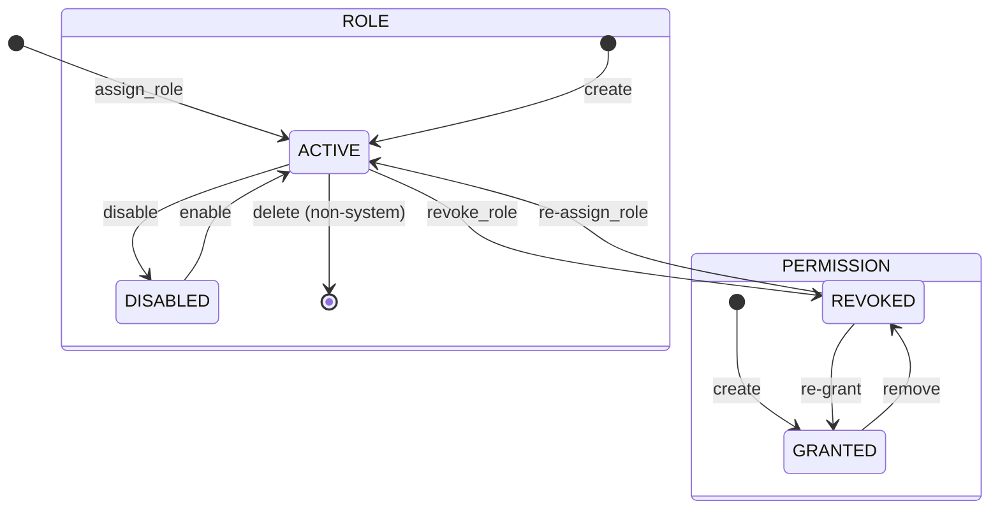

# Domain: Role-Based Access Control

> **Document:** 02-rbac-domain.md  
> **Version:** 1.0  
> **Status:** Draft  
> **Last Updated:** June 2026

---

## Overview

This domain handles **role hierarchy, permission assignment, and data classification levels** across the Sentinel360 platform. It defines who can access what resources and under what conditions. The RBAC model supports five roles with strict hierarchical ordering, resource/action-based permissions, and row-level security conditions (e.g., "own records only", "assigned cases only").

It acts as the **authorization backbone domain** — every API request is validated against this domain's rules before any data access is granted.

---

## Use Cases

---

### UC-01: Assign Role to User

- **Purpose**: Grant a role to a user
- **Actors**: Super Admin
- **Preconditions**: Both user and role exist; actor has super_admin role

#### Main Success Flow

1. Super Admin selects user and role to assign
2. System validates that the role assignment is allowed (cannot self-elevate)
3. System checks for existing active role (same role cannot be double-assigned)
4. System creates `user_roles` record with `assigned_by`, `assigned_at`
5. System invalidates user's cached permissions
6. System revokes all existing sessions (force re-login to pick up new permissions)
7. System emits `role.assigned` audit event

#### Alternate / Exception Flows

- Role already assigned → 409 Conflict
- Cannot assign role higher than own → 403 Forbidden

---

### UC-02: Revoke Role from User

- **Purpose**: Remove a role from a user
- **Actors**: Super Admin
- **Preconditions**: User currently has the role

#### Main Success Flow

1. Super Admin selects user and role to revoke
2. System sets `revoked_at` on the `user_roles` record (soft revocation)
3. System invalidates user's cached permissions
4. System revokes all existing sessions
5. System ensures user retains at least one role (default: community)
6. System emits `role.revoked` audit event

#### Result

Role revoked, permissions recalculated, sessions terminated.

---

### UC-03: Update Role Permissions

- **Purpose**: Modify what resources/actions a role can access
- **Actors**: Super Admin
- **Preconditions**: Role must be mutable (system roles have restricted modification)

#### Main Success Flow

1. Super Admin selects role and updates permission matrix
2. System validates that system roles (community, security, LEO, admin, super_admin) maintain minimum required permissions
3. System updates `role_permissions` records (add/remove/replace)
4. System invalidates permission cache for all users with that role
5. System emits `permissions.updated` audit event

#### Result

Permission matrix updated, cached permissions invalidated.

---

### UC-04: Check Permission (Authorization)

- **Purpose**: Determine if a user has permission to perform an action on a resource
- **Actors**: System (internal call from API Gateway)
- **Preconditions**: User is authenticated

#### Main Success Flow

1. API Gateway receives request with JWT (contains user_id, roles)
2. Gateway calls Authorization Service with (user_id, resource, action, context)
3. System loads user's active roles from cache (or DB if cache miss)
4. System loads role permissions from cache
5. System evaluates: does any role grant `resource:action`?
6. If conditions exist in permissions, evaluate row-level conditions against context
7. Return Allow or Deny

#### Alternate / Exception Flows

- No matching permission → Deny (403)
- Row-level condition fails → Deny (403)

---

## Core Entities

---

### Entity: Role

- **Description**: Named role with a hierarchy level and associated permissions. Five system roles are seeded; custom roles may be added.

#### Fields

| Field | Type | Description |
|-------|------|-------------|
| `id` | UUID | Primary key |
| `name` | VARCHAR(50) | Unique role name |
| `description` | TEXT | Human-readable description |
| `is_system` | BOOLEAN | System roles cannot be deleted |
| `created_at` | TIMESTAMPTZ | Creation timestamp |

#### Hierarchy (by authority)

```
community (level 0)
    → security_operator (level 1)
        → law_enforcement (level 2)
            → admin (level 3)
                → super_admin (level 4)
```

#### Constraints

- `name` must be unique
- System roles (`is_system = TRUE`) cannot be deleted or renamed
- The five seed roles are immutable in name

#### Relationships

- Has many `user_roles` (users assigned this role)
- Has many `role_permissions` (permissions granted by this role)

---

### Entity: Permission

- **Description**: A grant of a specific action on a specific resource. Not a standalone table — permissions are stored as `role_permissions` records.

#### Logical Fields

| Field | Type | Description |
|-------|------|-------------|
| `role_id` | UUID | FK to roles |
| `resource` | VARCHAR(100) | Resource name (e.g., 'cases', 'evidence', 'users') |
| `action` | VARCHAR(50) | Action (e.g., 'create', 'read', 'update', 'delete', 'verify') |
| `conditions` | JSONB | Optional row-level security conditions |
| `created_at` | TIMESTAMPTZ | Creation timestamp |

#### Standard Resources

| Resource | Available Actions |
|----------|------------------|
| `users` | create, read, update, delete |
| `roles` | create, read, update, delete |
| `cases` | create, read, update, delete |
| `evidence` | create, read, update, delete, verify |
| `criminal_profiles` | create, read, update, delete, merge |
| `sightings` | create, read, update, verify |
| `alerts` | create, read, update, send |
| `audit_logs` | read, export |
| `analytics` | read |
| `system_config` | read, update |
| `ai_models` | read, promote |

---

### Entity: UserRole

- **Description**: Join table linking users to roles with temporal tracking.

#### Fields

| Field | Type | Description |
|-------|------|-------------|
| `user_id` | UUID | FK to users |
| `role_id` | UUID | FK to roles |
| `assigned_by` | UUID | FK to users (who assigned this role) |
| `assigned_at` | TIMESTAMPTZ | When role was assigned |
| `revoked_at` | TIMESTAMPTZ | When role was revoked (null = active) |

#### Constraints

- Composite PK: `(user_id, role_id)`
- A user cannot have the same role assigned twice simultaneously
- A user must have at least one active role

---

### Entity: RolePermission

- **Description**: Grant of a specific action on a resource for a role.

#### Fields

| Field | Type | Description |
|-------|------|-------------|
| `id` | UUID | Primary key |
| `role_id` | UUID | FK to roles |
| `resource` | VARCHAR(100) | Resource name |
| `action` | VARCHAR(50) | Action name |
| `conditions` | JSONB | Optional row-level conditions |
| `created_at` | TIMESTAMPTZ | Creation timestamp |

#### Constraints

- Unique constraint: `(role_id, resource, action)`
- Cannot have duplicate permission grants for same role/resource/action

---

### Entity: Data Classification

- **Description**: Logical classification level applied to resources to control access. Not a separate DB table — classification is enforced via `conditions` in `role_permissions` and `is_sensitive` flags on entities.

#### Classification Levels

| Level | Description | Examples |
|-------|-------------|----------|
| `PUBLIC` | Visible to all (no auth required) | Public wanted feed |
| `INTERNAL` | Visible to all authenticated users | Alert notifications |
| `RESTRICTED` | Visible to security, LE, admin, super_admin | Case metadata |
| `SENSITIVE` | Visible to LE, admin, super_admin only | Evidence details |
| `HIGHLY_SENSITIVE` | Visible to assigned investigators, admin, super_admin | Biometric data, witness statements |
| `CLASSIFIED` | Visible to super_admin only (with 2FA) | Audit logs, system config |

---

## State Machines



---

### States

| State | Description |
|-------|-------------|
| `ACTIVE` (role) | Role is assignable and functional |
| `DISABLED` (role) | Role temporarily disabled (cannot be assigned) |
| `ACTIVE` (user_role) | Role is actively granted to the user |
| `REVOKED` (user_role) | Role was revoked from the user |
| `GRANTED` (permission) | Permission is active |
| `REVOKED` (permission) | Permission was removed |

---

### Transitions & Guards

| From → To | Event | Condition |
|----------|-------|----------|
| ACTIVE → REVOKED | `revoke_role` | Actor cannot revoke own role |
| REVOKED → ACTIVE | `reassign_role` | Same role reassignment allowed |
| GRANTED → REVOKED | `remove_permission` | System role minimum permissions must remain |

---

## Business Rules (Invariants)

1. **Role hierarchy cannot be violated**: A user cannot assign a role higher than their own level.
2. **Self-protection**: A Super Admin cannot revoke their own Super Admin role.
3. **Minimum permissions**: System roles must always retain their minimum required permissions (cannot strip `read` from a role that needs it).
4. **Least privilege**: Users should only have the roles they need to perform their duties.
5. **Permission cache**: Permissions are cached with 5-minute TTL; cache is invalidated on any role/permission change.
6. **Audit trail**: All role assignments, revocations, and permission changes are immutable audit events.
7. **Classification enforcement**: Data access is restricted to roles with appropriate classification level clearance.
8. **Session invalidation**: Role changes force immediate session revocation (user must re-login).

---

## Permission Matrix

| Resource | Action | Community | Security | LEO | Admin | Super Admin |
|----------|--------|-----------|----------|-----|-------|-------------|
| Public Feed | read | ✓ | ✓ | ✓ | ✓ | ✓ |
| Own Profile | create, read, update | ✓ | ✓ | ✓ | ✓ | ✓ |
| Users | create | — | — | — | — | ✓ |
| Users | read | — | — | — | ✓ (limited) | ✓ |
| Users | update | — | — | — | ✓ (limited) | ✓ |
| Users | delete | — | — | — | — | ✓ |
| Cases | create | — | — | ✓ | ✓ | ✓ |
| Cases | read | — | ✓ (assigned) | ✓ | ✓ | ✓ |
| Cases | update | — | — | ✓ (assigned) | ✓ | ✓ |
| Cases | delete | — | — | — | — | ✓ |
| Evidence | create | — | ✓ (limited) | ✓ | ✓ | ✓ |
| Evidence | read | — | ✓ (own) | ✓ | ✓ | ✓ |
| Evidence | verify | — | — | ✓ | ✓ | ✓ |
| Criminal Profiles | create | — | — | — | ✓ | ✓ |
| Criminal Profiles | read | — | ✓ | ✓ | ✓ | ✓ |
| Criminal Profiles | update | — | — | — | ✓ | ✓ |
| Criminal Profiles | delete (soft) | — | — | — | ✓ | ✓ |
| Criminal Profiles | delete (permanent) | — | — | — | — | ✓ (2FA) |
| Criminal Profiles | merge | — | — | — | — | ✓ (2FA) |
| Sightings | submit | ✓ | ✓ | ✓ | ✓ | ✓ |
| Sightings | read | ✓ (own) | ✓ (own) | ✓ | ✓ | ✓ |
| Sightings | verify | — | — | ✓ | ✓ | ✓ |
| Alerts | receive | ✓ | ✓ | ✓ | ✓ | ✓ |
| Alerts | create | — | — | — | ✓ | ✓ |
| Alerts | bulk send | — | — | — | ✓ | ✓ |
| Audit Logs | read | — | — | — | — | ✓ |
| Audit Logs | export | — | — | — | — | ✓ (2FA) |
| System Config | read | — | — | — | — | ✓ |
| System Config | update | — | — | — | — | ✓ (2FA) |
| AI Models | read | — | — | — | ✓ | ✓ |
| AI Models | promote | — | — | — | — | ✓ |
| Analytics | read | — | — | ✓ (limited) | ✓ | ✓ |
| Roles | manage | — | — | — | — | ✓ (2FA) |

---

## Processing Flows

### Authorization Check Flow

```
┌─────────┐     ┌──────────┐     ┌──────────┐     ┌──────────┐
│ Request  │────►│ Extract  │────►│ Load     │────►│ Evaluate │
│ Incoming │     │ User +   │     │ Roles +  │     │ Permis-  │
│          │     │ Resource │     │ Perms    │     │ sions    │
└─────────┘     └──────────┘     └──────────┘     └────┬─────┘
                                                        │
                                           ┌────────────▼─────┐
                                           │ Allow?           │
                                           │  YES → Route     │
                                           │  NO → 403        │
                                           └──────────────────┘
```

### Role Assignment Flow

```
┌─────────┐     ┌──────────┐     ┌──────────┐     ┌──────────┐
│ Select  │────►│ Validate │────►│ Create   │────►│ Invalidate│
│ User +  │     │ Hierarchy│     │ user_role│     │ Cache +  │
│ Role    │     │          │     │ Record   │     │ Sessions │
└─────────┘     └──────────┘     └──────────┘     └──────────┘
```

### Permission Update Flow

```
┌─────────┐     ┌──────────┐     ┌──────────┐     ┌──────────┐
│ Select  │────►│ Validate │────►│ Update   │────►│ Invalidate│
│ Role    │     │ System   │     │ role_    │     │ Cache for│
│         │     │ Role Min │     │ perms    │     │ All Users│
└─────────┘     └──────────┘     └──────────┘     └──────────┘
```

---

## Interfaces

### List View (Role Management — Super Admin only)

- **Filters**: Role name, is_system
- **Columns**: Role Name, Description, User Count, Permission Count, System Role
- **Sorting**: Name, User Count
- **Detail drill-down**: Shows permission matrix with resource/action grid

### Permission Editor

- Resource grid (rows = resources, columns = actions)
- Checkbox per cell (granted/not granted)
- Conditions editor (JSON) for row-level security
- "Reset to defaults" for system roles

---

## Notifications

| Event | Recipient | Channel | Message |
|-------|-----------|---------|---------|
| `role.assigned` | User | In-app | "You've been granted {role} role" |
| `role.revoked` | User | In-app | "Your {role} role has been removed" |
| `permissions.updated` | Admins | In-app | "Role permissions updated for {role}" |

---

## Audit Logging

| Event | Description |
|-------|-------------|
| `role.assigned` | Role granted to user |
| `role.revoked` | Role removed from user |
| `permission.granted` | Permission added to role |
| `permission.revoked` | Permission removed from role |
| `permission.bulk_updated` | Bulk permission matrix update |
| `role.created` | New role created (non-system) |
| `role.disabled` | Role disabled |
| `role.enabled` | Role re-enabled |

---

## Invariants

1. Every user must have at least one active role at all times.
2. Role hierarchy must be strictly enforced (no upward privilege escalation).
3. System roles cannot be deleted or renamed.
4. Permission cache TTL must not exceed 5 minutes.
5. All role/permission changes must be logged with actor identity and timestamp.
6. Row-level security conditions must be validated at query time (not just at auth check).
7. Permission changes must propagate to active sessions within 5 minutes (cache invalidation).

---

## Key Decisions

| Decision | Choice | Rationale |
|----------|--------|-----------|
| **RBAC model** | Hierarchical roles + resource/action permissions | Simple, auditable, well-understood |
| **Permission storage** | PostgreSQL (normalized) | Enables complex queries for row-level security |
| **Permission caching** | Redis (5-min TTL) | Fast authorization checks without DB load |
| **Row-level security** | JSONB conditions on role_permissions | Flexible; evaluated at application layer |
| **Role assignment** | Temporal (valid_from/revoked_at) | Full audit trail of who had what role when |
| **System roles** | Immutable seed data | Prevents accidental lockout from system |

---

## Optional Extensions

- Custom roles (non-system roles with configurable permissions)
- Attribute-Based Access Control (ABAC) for finer-grained rules
- Delegated administration (org-level admins who can manage users within their org)
- Temporary role grants with automatic expiry
- Permission approval workflow (request → approve → grant)
