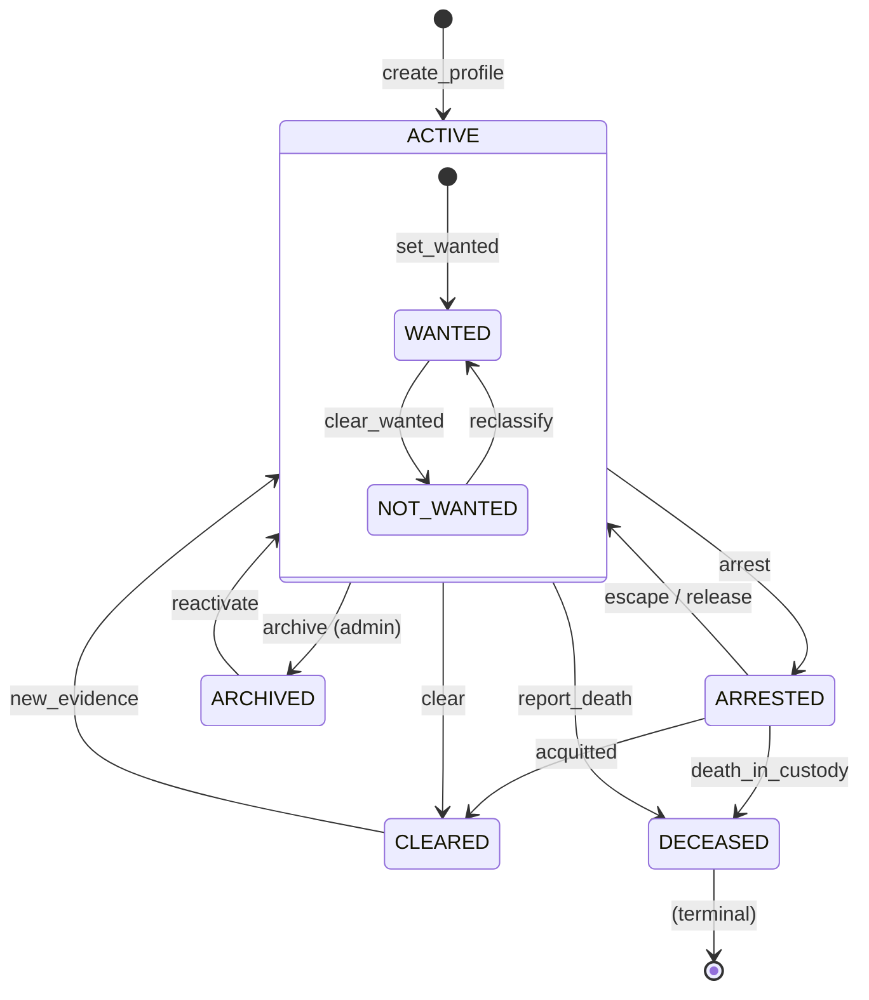

# Domain: Criminal Profiles & Watchlist

> **Document:** 03-criminal-profiles-domain.md  
> **Version:** 1.0  
> **Status:** Draft  
> **Last Updated:** June 2026

---

## Overview

This domain manages **persons of interest, their biometric identities, known associates, location history, threat assessments, and the public wanted feed**. It is the central identity hub — every sighting, case, evidence item, and AI detection can be linked to a criminal profile. The domain supports profile lifecycle management, deduplication (merging), threat scoring, and public/private visibility controls.

It acts as the **identity core domain** — the single source of truth for who is being tracked, investigated, or sought by law enforcement.

---

## Use Cases

---

### UC-01: Create Criminal Profile

- **Purpose**: Add a new person of interest to the system
- **Actors**: Admin, Super Admin
- **Preconditions**: Person does not already exist in system

#### Main Success Flow

1. Admin fills in identity details (name, DOB, gender, nationality, ID number)
2. Admin uploads primary photo (mugshot or surveillance image)
3. Admin sets risk level and status (default: active)
4. System creates `criminal_profile` record
5. System creates `profile_photo` record (primary photo)
6. System calculates initial threat assessment (if risk factors provided)
7. System emits `profile.created` audit event

#### Result

New criminal profile created with active status.

---

### UC-02: Update Criminal Status

- **Purpose**: Change a profile's lifecycle status
- **Actors**: Law Enforcement, Admin, Super Admin
- **Preconditions**: Profile exists and is not deleted

#### Main Success Flow

1. Authorized user selects new status with reason
2. System validates state transition (see State Machine)
3. System updates `status`, `status_changed_at`, `status_changed_by`
4. If status changed to `arrested` → remove from public wanted feed (`is_public = FALSE`)
5. If status changed to `cleared` → remove from public feed
6. If status changed to `deceased` → archive profile
7. System emits `profile.status_changed` audit event
8. System triggers notification to relevant parties

#### Result

Profile status updated, public visibility adjusted accordingly.

---

### UC-03: Add Biometric Data

- **Purpose**: Register facial embeddings or other biometrics for AI matching
- **Actors**: Admin, Super Admin, System (AI pipeline)
- **Preconditions**: Profile exists

#### Main Success Flow

1. Source provides biometric image/data (upload, AI capture, external import)
2. System validates quality score (minimum threshold for face: 0.7)
3. System extracts embedding vector (ArcFace, 512-dim)
4. System creates `profile_biometrics` record
5. If this is the first biometric of its type, mark as `is_primary = TRUE`
6. System emits `profile.biometrics_added` audit event

#### Result

Biometric data registered and available for AI matching.

---

### UC-04: Merge Duplicate Profiles

- **Purpose**: Deduplicate when two profiles are confirmed to be the same person
- **Actors**: Super Admin (with 2FA)
- **Preconditions**: Both profiles exist; identity match is confirmed

#### Main Success Flow

1. Super Admin selects source profile and target profile
2. System validates merge is not circular (cannot merge into self)
3. System reassigns all foreign key references from source to target:
   - `profile_biometrics` → target
   - `profile_photos` → target
   - `profile_aliases` → target
   - `profile_known_associates` → target
   - `profile_last_locations` → target
   - `profile_threat_assessments` → target
   - `case_criminals` → target
   - `evidence` references → target
   - `sightings` references → target
4. System sets `merged_into` on source profile pointing to target
5. System soft-deletes source profile (deleted_at)
6. System recalculates threat assessment on target (merge risk factors)
7. System emits `profile.merged` audit event with full mapping

#### Result

Duplicate profiles consolidated; source profile archived with merge pointer.

---

### UC-05: Perform Threat Assessment

- **Purpose**: Evaluate and record risk level for a person of interest
- **Actors**: Law Enforcement, Admin, Super Admin
- **Preconditions**: Profile exists

#### Main Success Flow

1. Authorized user assesses threat level (low, medium, high, critical)
2. User selects risk factors from structured checklist
3. User adds assessment notes and recommended actions
4. System creates `profile_threat_assessment` record
5. System sets previous current assessment to `is_current = FALSE`
6. System marks new assessment as `is_current = TRUE`
7. System updates `risk_level` on `criminal_profile`
8. System emits `profile.threat_assessment_updated` audit event

#### Result

Threat assessment recorded; profile risk level updated.

---

### UC-06: View Public Wanted Feed

- **Purpose**: Display active wanted persons to the public
- **Actors**: Unauthenticated users, Community Members
- **Preconditions**: None (public endpoint)

#### Main Success Flow

1. User accesses `/profiles/public` endpoint
2. System queries profiles where `is_public = TRUE`, `is_wanted = TRUE`, `status = 'active'`, `deleted_at IS NULL`
3. System returns limited fields: photo, name, aliases, last known location, risk level, wanted for crimes
4. System paginates results (cursor-based, 20 per page)
5. System caches response (30s TTL via CDN)
6. System logs anonymous access metric

#### Result

Public wanted feed rendered with paginated results.

---

## Core Entities

---

### Entity: CriminalProfile

- **Description**: Central person-of-interest record. Contains core identity, status, risk, and case linkage.

#### Fields

| Field | Type | Description |
|-------|------|-------------|
| `id` | UUID | Primary key |
| `external_id` | VARCHAR(100) | External system ID (national police database) |
| `first_name` | VARCHAR(100) | Legal first name |
| `last_name` | VARCHAR(100) | Legal last name |
| `date_of_birth` | DATE | Date of birth |
| `gender` | VARCHAR(20) | Gender |
| `nationality` | VARCHAR(100) | Nationality |
| `id_number` | VARCHAR(50) | National ID / passport number |
| `physical_description` | JSONB | Height, weight, build, eye/hair color, distinguishing marks |
| `risk_level` | VARCHAR(20) | Low, medium, high, critical, unknown |
| `status` | VARCHAR(30) | Active, arrested, cleared, deceased, archived |
| `status_changed_at` | TIMESTAMPTZ | When status last changed |
| `status_changed_by` | UUID | Who changed the status |
| `is_public` | BOOLEAN | Visible on public wanted feed |
| `is_wanted` | BOOLEAN | Actively wanted by law enforcement |
| `last_known_location` | GEOGRAPHY(Point) | Most recent location |
| `last_seen_at` | TIMESTAMPTZ | When last seen |
| `default_confidence_threshold` | DECIMAL(5,2) | Min % for alert triggering |
| `notes` | TEXT | General notes |
| `merged_into` | UUID | Self-reference for deduplication |
| `created_by` | UUID | Who created the profile |
| `created_at` | TIMESTAMPTZ | Creation timestamp |
| `updated_at` | TIMESTAMPTZ | Last update timestamp |
| `deleted_at` | TIMESTAMPTZ | Soft delete |

#### Constraints

- `external_id` must be unique if provided
- `status` must be one of: active, arrested, cleared, deceased, archived
- `risk_level` must be one of: unknown, low, medium, high, critical

#### Relationships

- Has many `profile_biometrics` (face embeddings, fingerprint hashes, etc.)
- Has many `profile_photos` (mugshots, surveillance captures)
- Has many `profile_aliases` (AKA, nicknames, street names)
- Has many `profile_known_associates` (links to other profiles)
- Has many `profile_last_locations` (location history)
- Has many `profile_threat_assessments` (risk evaluations)
- Has many `case_criminals` (links to cases as suspect/witness/victim)
- Has many `sightings` (community reports)
- Has many `evidence` (appears in evidence)
- Has many `ai_inference_results` (AI recognition events)

---

### Entity: ProfileBiometrics

- **Description**: Biometric data used for AI matching and identification.

#### Fields

| Field | Type | Description |
|-------|------|-------------|
| `id` | UUID | Primary key |
| `profile_id` | UUID | FK to criminal_profiles |
| `biometric_type` | VARCHAR(50) | face_embedding, fingerprint_hash, iris_hash, voice_print |
| `embedding_vector` | VECTOR(512) | pgvector for face embeddings |
| `algorithm` | VARCHAR(100) | e.g., ArcFace-R100, DeepPrint |
| `algorithm_version` | VARCHAR(50) | Model version used |
| `quality_score` | DECIMAL(5,2) | 0-100 quality metric |
| `source` | VARCHAR(50) | upload, ai_capture, external_import |
| `is_primary` | BOOLEAN | Default biometric for matching |
| `created_at` | TIMESTAMPTZ | Creation timestamp |

#### Constraints

- Unique per `(profile_id, biometric_type, algorithm)`
- Quality score must be >= 70 for face embeddings to be used in matching

---

### Entity: ProfilePhoto

- **Description**: Photographic images of the person (mugshots, surveillance, etc.).

#### Fields

| Field | Type | Description |
|-------|------|-------------|
| `id` | UUID | Primary key |
| `profile_id` | UUID | FK to criminal_profiles |
| `s3_key` | VARCHAR(512) | S3 object key |
| `cdn_url` | VARCHAR(512) | CDN delivery URL |
| `photo_type` | VARCHAR(30) | mugshot, surveillance, uploaded, ai_capture |
| `is_primary` | BOOLEAN | Primary display photo |
| `width` | INTEGER | Image width in pixels |
| `height` | INTEGER | Image height in pixels |
| `file_size_bytes` | BIGINT | File size |
| `mime_type` | VARCHAR(50) | MIME type |
| `sha256_hash` | VARCHAR(64) | File integrity hash |
| `source` | VARCHAR(50) | Source of the photo |
| `source_url` | VARCHAR(512) | Original source URL |
| `taken_at` | TIMESTAMPTZ | When photo was taken |
| `created_at` | TIMESTAMPTZ | Creation timestamp |
| `deleted_at` | TIMESTAMPTZ | Soft delete |

---

### Entity: ProfileAlias

- **Description**: Alternative names, nicknames, and street names for a person.

#### Fields

| Field | Type | Description |
|-------|------|-------------|
| `id` | UUID | Primary key |
| `profile_id` | UUID | FK to criminal_profiles |
| `alias` | VARCHAR(200) | The alias name |
| `alias_type` | VARCHAR(30) | aka, nickname, street_name, former_name |
| `created_at` | TIMESTAMPTZ | Creation timestamp |

---

### Entity: ProfileKnownAssociate

- **Description**: Links between profiles representing known relationships.

#### Fields

| Field | Type | Description |
|-------|------|-------------|
| `id` | UUID | Primary key |
| `profile_id` | UUID | FK to source profile |
| `associate_id` | UUID | FK to associate profile |
| `relationship_type` | VARCHAR(50) | accomplice, family, gang_member, associate |
| `confidence_score` | DECIMAL(5,2) | Strength of association (0-100) |
| `source` | TEXT | How this association was established |
| `is_active` | BOOLEAN | Whether association is current |
| `valid_from` | TIMESTAMPTZ | When association started |
| `valid_to` | TIMESTAMPTZ | When association ended |
| `created_by` | UUID | Who recorded the association |
| `created_at` | TIMESTAMPTZ | Creation timestamp |

#### Constraints

- `CHECK (profile_id != associate_id)` — cannot associate with self
- Unique per `(profile_id, associate_id)`

---

### Entity: ProfileLastLocation

- **Description**: Historical location records for a person.

#### Fields

| Field | Type | Description |
|-------|------|-------------|
| `id` | UUID | Primary key |
| `profile_id` | UUID | FK to criminal_profiles |
| `location` | GEOGRAPHY(Point) | Geographic location |
| `address` | TEXT | Human-readable address |
| `source` | VARCHAR(50) | sighting, ai_detection, gps_tag, manual_entry |
| `source_id` | UUID | FK to source record |
| `accuracy_meters` | DECIMAL(10,2) | GPS accuracy |
| `noted_at` | TIMESTAMPTZ | When person was actually seen |
| `created_at` | TIMESTAMPTZ | Record creation timestamp |

---

### Entity: ProfileThreatAssessment

- **Description**: Structured threat and risk evaluation for a person.

#### Fields

| Field | Type | Description |
|-------|------|-------------|
| `id` | UUID | Primary key |
| `profile_id` | UUID | FK to criminal_profiles |
| `assessed_by` | UUID | FK to users (assessor) |
| `threat_level` | VARCHAR(20) | low, medium, high, critical |
| `risk_factors` | JSONB | Array of risk factor objects |
| `assessment_notes` | TEXT | Assessor's notes |
| `recommended_actions` | TEXT | Recommended next steps |
| `valid_from` | TIMESTAMPTZ | Assessment effective date |
| `valid_to` | TIMESTAMPTZ | Assessment expiry |
| `is_current` | BOOLEAN | Currently active assessment |
| `created_at` | TIMESTAMPTZ | Creation timestamp |

---

### Entity: WatchlistEntry

- **Description**: Logical view — not a separate table. The public wanted feed is a filtered query on `criminal_profiles` where `is_public = TRUE AND is_wanted = TRUE AND status = 'active'`.

---

## State Machines



---

### States

| State | Description |
|-------|-------------|
| `ACTIVE` | Person is actively being tracked/investigated |
| `ARRESTED` | Person has been arrested |
| `CLEARED` | Person cleared of suspicion (no longer wanted) |
| `DECEASED` | Person is deceased |
| `ARCHIVED` | Profile archived (inactive but preserved) |
| `WANTED` | Person is actively wanted (sub-state of ACTIVE) |
| `NOT_WANTED` | Person is monitored but not actively wanted |

---

### Transitions & Guards

| From → To | Event | Condition |
|----------|-------|----------|
| ACTIVE → ARRESTED | `arrest` | Valid arrest record required |
| ACTIVE → CLEARED | `clear` | Reason must be provided |
| ACTIVE → DECEASED | `report_death` | Verification required (LEO/Super Admin) |
| ACTIVE → ARCHIVED | `archive` | Only if no active cases |
| ARRESTED → ACTIVE | `escape_or_release` | Documentation required |
| CLEARED → ACTIVE | `new_evidence` | Super Admin authorization required |

---

## Business Rules (Invariants)

1. **Profile uniqueness**: No two active profiles can have the same `id_number` or `external_id`.
2. **Public feed visibility**: Only profiles with `is_public = TRUE`, `is_wanted = TRUE`, and `status = 'active'` appear on the public feed.
3. **Merge integrity**: When profiles are merged, all foreign key references must be reassigned; the source profile is soft-deleted with a `merged_into` pointer.
4. **Threat assessment currency**: Only one threat assessment can be current (`is_current = TRUE`) per profile at any time.
5. **Biometric quality**: Face embeddings used for automated matching must have `quality_score >= 70`.
6. **Self-association**: A profile cannot be listed as its own known associate.
7. **Status change audit**: Every status change must record who changed it, when, and why.
8. **Arrested visibility**: When a profile status changes to `arrested`, it is automatically removed from the public wanted feed.
9. **Confidence threshold**: The `default_confidence_threshold` sets the minimum AI confidence required to trigger an alert for this person.

---

## Processing Flows

### Profile Creation Flow

```
┌─────────┐     ┌──────────┐     ┌──────────┐     ┌──────────┐
│ Submit  │────►│ Validate │────►│ Check    │────►│ Create   │
│ Details │     │ Required │     │ Duplicate│     │ Profile  │
└─────────┘     └──────────┘     └──────────┘     └────┬─────┘
                                                        │
                                              ┌─────────▼─────────┐
                                              │ Add Primary Photo │
                                              │ (if provided)     │
                                              └───────────────────┘
```

### Status Change Flow

```
┌─────────┐     ┌──────────┐     ┌──────────┐     ┌──────────┐
│ Select  │────►│ Validate │────►│ Update   │────►│ Adjust   │
│ Status  │     │ Transition│    │ Profile  │     │ Visibility│
└─────────┘     └──────────┘     └──────────┘     └────┬─────┘
                                                        │
                                              ┌─────────▼─────────┐
                                              │ Notify Relevant   │
                                              │ Parties           │
                                              └───────────────────┘
```

### Profile Merge Flow

```
┌─────────┐     ┌──────────┐     ┌──────────┐     ┌──────────┐
│ Select  │────►│ Validate │────►│ Reassign │────►│ Soft-    │
│ Source  │     │ (2FA)    │     │ FK Refs  │     │ Delete   │
│ + Target│     │          │     │          │     │ Source   │
└─────────┘     └──────────┘     └──────────┘     └──────────┘
```

### Threat Assessment Flow

```
┌─────────┐     ┌──────────┐     ┌──────────┐     ┌──────────┐
│ Evaluate│────►│ Select   │────►│ Create   │────►│ Mark     │
│ Threat  │     │ Risk     │     │ Assessment│    │ Previous │
│ Level   │     │ Factors  │     │ Record   │    │ Inactive │
└─────────┘     └──────────┘     └──────────┘     └──────────┘
```

---

## Interfaces

### List View (Criminal Profiles)

- **Filters**: Status, risk level, nationality, age range, is_public, is_wanted, search (name/alias/ID)
- **Columns**: Photo, Name, Aliases, DOB, Risk Level, Status, Last Seen, Cases
- **Sorting**: Name, created date, last seen, risk level
- **Pagination**: Cursor-based (public feed), offset-based (internal)

### Detail View (Profile Detail)

- **Header**: Photo, name, status badge, risk badge, wanted indicator
- **Identity**: Full name, DOB, gender, nationality, ID number, physical description
- **Biometrics**: Face embeddings with quality scores, algorithm versions
- **Photos**: Gallery with primary photo indicator
- **Aliases**: List of known aliases
- **Associates**: Network graph of known associates
- **Location History**: Map with timeline of last known locations
- **Threat Assessment**: Current assessment with history
- **Case History**: List of linked cases
- **Sightings**: Community reports linked to this profile
- **Activity Log**: Audit trail of all changes
- **Actions**: Edit, Update Status, Add Photo, Add Biometrics, Add Associate, Threat Assessment, Merge, Delete

---

## Notifications

| Event | Recipient | Channel | Message |
|-------|-----------|---------|---------|
| `profile.status_changed` | Assigned LEO | In-app | "Profile {name} status → {status}" |
| `profile.threat_assessment_updated` | Assigned LEO | In-app | "Threat level for {name} → {level}" |
| `profile.merged` | Super Admin | In-app | "Profile {source} merged into {target}" |
| `profile.new_associate` | Assigned LEO | In-app | "New associate link: {name} ↔ {associate}" |

---

## Audit Logging

| Event | Description |
|-------|-------------|
| `profile.created` | New criminal profile created |
| `profile.updated` | Profile details updated |
| `profile.status_changed` | Profile status changed |
| `profile.biometrics_added` | Biometric data registered |
| `profile.biometrics_removed` | Biometric data removed |
| `profile.photo_added` | Photo added to profile |
| `profile.photo_removed` | Photo removed from profile |
| `profile.alias_added` | Alias added |
| `profile.associate_added` | Known associate link created |
| `profile.associate_removed` | Known associate link removed |
| `profile.threat_assessment_updated` | Threat assessment created/updated |
| `profile.merged` | Profiles merged |
| `profile.deleted` | Profile soft-deleted |
| `profile.permanently_deleted` | Profile permanently deleted (2FA) |

---

## Invariants

1. No two active profiles may share the same national ID or external ID.
2. Status transitions must follow the defined state machine.
3. Merged profiles must retain a pointer to the surviving profile.
4. Only one current threat assessment per profile at any time.
5. Public feed must only show profiles with `is_public = TRUE`, `is_wanted = TRUE`, `status = 'active'`.
6. All biometric data must have a minimum quality score for operational use.
7. Status changes must always include actor identification and reason.

---

## Key Decisions

| Decision | Choice | Rationale |
|----------|--------|-----------|
| **Identity linking** | All entities link to `criminal_profiles` | Central identity hub enables cross-referencing |
| **Biometric storage** | pgvector (IVFFlat index) | Native PostgreSQL extension for vector similarity |
| **Photo storage** | S3 + CDN | Scalable, cost-effective, global delivery |
| **Deduplication** | Merge strategy (not delete) | Preserves audit trail and relationships |
| **Public feed** | Filtered query (not separate table) | Always consistent with profile state |
| **Threat assessment** | Temporal assessments with `is_current` | Enables full history and trending |

---

## Optional Extensions

- Gang/group affiliation entity with hierarchy tracking
- Automated threat scoring based on case severity and associate network
- Facial age progression for long-term wanted persons
- Public tip submission linked directly to profiles
- Profile similarity search using biometric data (find potential duplicates)
- Integration with national police databases for automatic profile syncing
