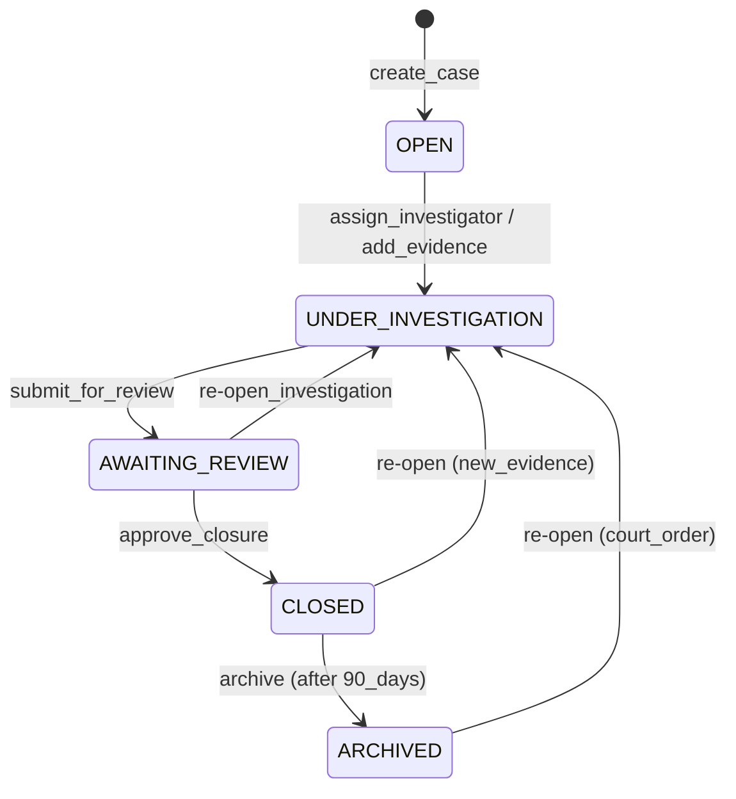

# Domain: Cases & Investigations

> **Document:** 04-cases-domain.md  
> **Version:** 1.0  
> **Status:** Draft  
> **Last Updated:** June 2026

---

## Overview

This domain manages **investigative cases (dockets), their lifecycle, linked persons of interest, evidence associations, timeline management, investigator assignments, and case activity logging**. A case is the central organizing structure for an investigation — it aggregates evidence, criminal profiles, timeline events, notes, and generates final reports.

It acts as the **investigation workspace domain** — the primary interface through which law enforcement and security personnel manage the end-to-end investigative workflow.

---

## Use Cases

---

### UC-01: Create Case

- **Purpose**: Open a new investigation case
- **Actors**: Law Enforcement, Admin, Super Admin
- **Preconditions**: User has `cases:create` permission

#### Main Success Flow

1. User creates case with title, description, category, priority, incident location/time
2. System auto-generates case number (`S360-{year}-{sequential:00001}`)
3. System sets status to `open`
4. System assigns the creator as the default investigator (optional: assign different investigator)
5. System creates `case` record
6. System creates initial `case_timeline_entry` ("Case created")
7. System creates initial `case_activity_log` entry
8. System emits `case.created` audit event

#### Result

New case created with `open` status and auto-generated case number.

---

### UC-02: Assign Investigator

- **Purpose**: Assign or change the lead investigator on a case
- **Actors**: Law Enforcement (assigned), Admin, Super Admin
- **Preconditions**: Case exists; target user has law_enforcement or higher role

#### Main Success Flow

1. Authorized user selects investigator to assign
2. System updates `assigned_investigator` and `assigned_team` on case
3. System adds `investigator_assigned` timeline entry
4. System logs activity: `case.investigator_assigned`
5. System notifies the newly assigned investigator
6. System emits `case.investigator_assigned` audit event

#### Result

Investigator assigned; investigator receives notification.

---

### UC-03: Update Case Status

- **Purpose**: Advance the case through its lifecycle stages
- **Actors**: Law Enforcement (assigned), Admin, Super Admin
- **Preconditions**: Case exists; status transition is valid

#### Main Success Flow

1. User selects new status and provides reason
2. System validates state transition (see State Machine)
3. System updates `status`, `status_changed_at`, `status_changed_by`
4. System adds timeline entry with status change event
5. If status → `closed`: set `closed_at`, `closed_by`, `closure_notes` required
6. If status → `archived`: validate no pending actions
7. System logs activity with previous and new status
8. System emits `case.status_changed` audit event

#### Result

Case status updated; timeline and activity log recorded.

---

### UC-04: Link Criminal Profile to Case

- **Purpose**: Associate a person of interest with the case
- **Actors**: Law Enforcement, Admin, Super Admin
- **Preconditions**: Both case and profile exist

#### Main Success Flow

1. User selects criminal profile and specifies role (suspect, person_of_interest, witness, victim, arrested)
2. System creates `case_criminals` record
3. System adds timeline entry ("Suspect identified: {name}")
4. System logs activity
5. System emits `case.criminal_linked` audit event

#### Result

Criminal profile linked to case with specified role.

---

### UC-05: Update Case Priority

- **Purpose**: Escalate or de-escalate case priority
- **Actors**: Law Enforcement (assigned), Admin, Super Admin
- **Preconditions**: Case exists

#### Main Success Flow

1. User selects new priority level
2. System updates `priority` field
3. System logs activity with previous and new priority
4. System emits `case.priority_changed` audit event

#### Result

Case priority updated.

---

### UC-06: Add Case Timeline Entry

- **Purpose**: Record an event on the case timeline
- **Actors**: Law Enforcement, Admin, Super Admin, System (auto-generated)
- **Preconditions**: Case exists

#### Main Success Flow

1. User or system provides event type, title, description, and timestamp
2. System creates `case_timeline_entry` record
3. System logs activity
4. If evidence-linked → creates association in `case_evidence`

#### Result

Timeline entry recorded.

---

### UC-07: Add Case Note

- **Purpose**: Record investigative notes on a case
- **Actors**: Security Operator (own org), Law Enforcement, Admin, Super Admin
- **Preconditions**: Case exists; user has read access

#### Main Success Flow

1. User writes note with content
2. User sets visibility: `is_private = FALSE` (team-visible) or `TRUE` (investigator-only)
3. System creates `case_note` record
4. System logs activity

#### Result

Case note recorded with specified visibility.

---

### UC-08: Close Case

- **Purpose**: Close an investigation after resolution
- **Actors**: Law Enforcement (assigned), Admin, Super Admin
- **Preconditions**: Case is in `awaiting_review` status

#### Main Success Flow

1. User provides closure notes and outcome summary
2. System validates all evidence is in final state
3. System sets status → `closed`, sets `closed_at`, `closed_by`, `closure_notes`
4. System adds final timeline entry
5. System emits `case.closed` audit event
6. If configured → send webhook to external LEO case management system

#### Result

Case closed; closure recorded.

---

## Core Entities

---

### Entity: Case

- **Description**: The central investigation record. Aggregates all information related to a specific incident or pattern of criminal activity.

#### Fields

| Field | Type | Description |
|-------|------|-------------|
| `id` | UUID | Primary key |
| `case_number` | VARCHAR(50) | Auto-generated unique number |
| `title` | VARCHAR(300) | Case title |
| `description` | TEXT | Detailed case description |
| `category` | VARCHAR(100) | theft, assault, robbery, hijacking, vandalism, missing_person, etc. |
| `priority` | VARCHAR(20) | low, medium, high, critical |
| `status` | VARCHAR(30) | open, under_investigation, awaiting_review, closed, archived |
| `status_changed_at` | TIMESTAMPTZ | Last status change timestamp |
| `status_changed_by` | UUID | Who changed the status |
| `assigned_investigator` | UUID | FK to users (lead investigator) |
| `assigned_team` | TEXT[] | Array of investigator names/IDs |
| `jurisdiction` | VARCHAR(200) | Police precinct, area |
| `incident_location` | GEOGRAPHY(Point) | Where incident occurred |
| `incident_address` | TEXT | Human-readable address |
| `incident_started_at` | TIMESTAMPTZ | When incident began |
| `incident_ended_at` | TIMESTAMPTZ | When incident ended |
| `reported_by` | UUID | Who reported the incident |
| `reported_at` | TIMESTAMPTZ | When incident was reported |
| `is_sensitive` | BOOLEAN | Restricted access flag |
| `closure_notes` | TEXT | Reason for closure |
| `closed_at` | TIMESTAMPTZ | When case was closed |
| `closed_by` | UUID | Who closed the case |
| `created_at` | TIMESTAMPTZ | Creation timestamp |
| `updated_at` | TIMESTAMPTZ | Last update timestamp |
| `deleted_at` | TIMESTAMPTZ | Soft delete |

#### Constraints

- `case_number` must be unique (auto-generated format: `S360-YYYY-NNNNN`)
- `status` must be one of: open, under_investigation, awaiting_review, closed, archived
- `priority` must be one of: low, medium, high, critical

#### Relationships

- Has many `case_criminals` (linked persons of interest)
- Has many `case_evidence` (linked evidence items)
- Has many `case_timeline_entries` (chronological events)
- Has many `case_activity_logs` (audit trail)
- Has many `case_notes` (investigative notes)
- Has many `alerts` (alerts generated from this case)
- Belongs to `assigned_investigator` (user)
- Belongs to `reported_by` (user)

---

### Entity: CaseCriminal

- **Description**: Links a criminal profile to a case with a specific role.

#### Fields

| Field | Type | Description |
|-------|------|-------------|
| `id` | UUID | Primary key |
| `case_id` | UUID | FK to cases |
| `profile_id` | UUID | FK to criminal_profiles |
| `role` | VARCHAR(50) | suspect, person_of_interest, witness, victim, arrested |
| `involvement_description` | TEXT | Description of involvement |
| `arrested_at` | TIMESTAMPTZ | When arrested (if applicable) |
| `arrested_by` | UUID | FK to users (arresting officer) |

#### Constraints

- Unique per `(case_id, profile_id)`
- One profile can appear in many cases

---

### Entity: CaseEvidence

- **Description**: Linking table with ordering and relevance tracking.

#### Fields

| Field | Type | Description |
|-------|------|-------------|
| `id` | UUID | Primary key |
| `case_id` | UUID | FK to cases |
| `evidence_id` | UUID | FK to evidence |
| `relevance_notes` | TEXT | How this evidence relates to the case |
| `sort_order` | INTEGER | Display ordering |
| `added_by` | UUID | Who added the evidence |
| `added_at` | TIMESTAMPTZ | When evidence was linked |
| `removed_at` | TIMESTAMPTZ | When evidence was unlinked |

#### Constraints

- Unique per `(case_id, evidence_id)`

---

### Entity: CaseTimelineEntry

- **Description**: Chronological events in the case lifecycle.

#### Fields

| Field | Type | Description |
|-------|------|-------------|
| `id` | UUID | Primary key |
| `case_id` | UUID | FK to cases |
| `event_type` | VARCHAR(50) | incident_occurred, evidence_added, suspect_identified, arrest_made, status_change |
| `title` | VARCHAR(300) | Event title |
| `description` | TEXT | Detailed description |
| `occurred_at` | TIMESTAMPTZ | When the event actually happened |
| `source` | VARCHAR(50) | system, manual, ai_detection |
| `source_id` | UUID | FK to related entity |
| `created_by` | UUID | Who created the entry |
| `created_at` | TIMESTAMPTZ | Record creation timestamp |

---

### Entity: CaseActivityLog

- **Description**: Immutable audit trail of all actions on a case.

#### Fields

| Field | Type | Description |
|-------|------|-------------|
| `id` | UUID | Primary key |
| `case_id` | UUID | FK to cases |
| `user_id` | UUID | FK to users (actor) |
| `action` | VARCHAR(100) | case_created, evidence_linked, status_changed, investigator_assigned |
| `description` | TEXT | Human-readable description |
| `metadata` | JSONB | Previous/current values, context |
| `ip_address` | INET | Actor's IP address |
| `created_at` | TIMESTAMPTZ | Event timestamp |

---

### Entity: CaseNote

- **Description**: Investigative notes attached to a case.

#### Fields

| Field | Type | Description |
|-------|------|-------------|
| `id` | UUID | Primary key |
| `case_id` | UUID | FK to cases |
| `author_id` | UUID | FK to users |
| `content` | TEXT | Note content |
| `is_private` | BOOLEAN | Only visible to investigators |
| `edited_at` | TIMESTAMPTZ | Last edit timestamp |
| `created_at` | TIMESTAMPTZ | Creation timestamp |
| `deleted_at` | TIMESTAMPTZ | Soft delete |

---

### Entity: CaseReport

- **Description**: Generated incident report for the case. Not a separate DB table — reports are generated on-demand and stored as PDF/JSON in S3.

#### Logical Fields

| Field | Type | Description |
|-------|------|-------------|
| `case_id` | UUID | FK to cases |
| `s3_key` | VARCHAR(512) | Report file location |
| `format` | VARCHAR(20) | pdf, json, xml |
| `generated_at` | TIMESTAMPTZ | Generation timestamp |
| `generated_by` | UUID | Who requested the report |

---

## State Machines



---

### States

| State | Description |
|-------|-------------|
| `OPEN` | Case created, awaiting initial investigation |
| `UNDER_INVESTIGATION` | Active investigation in progress |
| `AWAITING_REVIEW` | Investigation complete, pending supervisory review |
| `CLOSED` | Case resolved and closed |
| `ARCHIVED` | Case archived for long-term retention |

---

### Transitions & Guards

| From → To | Event | Condition |
|----------|-------|----------|
| OPEN → UNDER_INVESTIGATION | `start_investigation` | Investigator assigned |
| UNDER_INVESTIGATION → AWAITING_REVIEW | `submit_for_review` | At least one piece of evidence linked |
| AWAITING_REVIEW → CLOSED | `approve_closure` | Closure notes provided |
| AWAITING_REVIEW → UNDER_INVESTIGATION | `reopen` | Valid reason required |
| CLOSED → UNDER_INVESTIGATION | `reopen` | New evidence discovered; Super Admin approval |
| CLOSED → ARCHIVED | `archive` | Case closed > 90 days |
| ARCHIVED → UNDER_INVESTIGATION | `reopen` | Court order required |

---

## Business Rules (Invariants)

1. **Case number uniqueness**: Every case receives a unique, sequentially generated case number.
2. **Status transitions**: Cases must follow the defined state machine; invalid transitions are rejected.
3. **Evidence linkage**: Evidence can only be linked to a case if the evidence status is `verified` or `pending`.
4. **Investigator assignment**: Only users with `law_enforcement` role or higher can be assigned as investigators.
5. **Sensitive cases**: Cases marked `is_sensitive = TRUE` are only visible to assigned investigators, admins, and super admins.
6. **Closure requirements**: Closing a case requires closure notes and all evidence in final state.
7. **Timeline integrity**: Timeline entries are immutable (no edits, no deletes) — corrections require new entries.
8. **Activity logging**: Every state change, evidence link, and investigator assignment is automatically logged.
9. **Soft deletes**: Cases are soft-deleted; only Super Admin can permanently delete.
10. **Report generation**: Reports are generated on-demand and reflect the latest case state.

---

## Processing Flows

### Case Creation Flow

```
┌─────────┐     ┌──────────┐     ┌──────────┐     ┌──────────┐
│ Submit  │────►│ Validate │────►│ Generate │────►│ Create   │
│ Details │     │ Required │     │ Case #   │     │ Case     │
└─────────┘     └──────────┘     └──────────┘     └────┬─────┘
                                                        │
                                              ┌─────────▼─────────┐
                                              │ Add Initial       │
                                              │ Timeline Entry    │
                                              └───────────────────┘
```

### Status Change Flow

```
┌─────────┐     ┌──────────┐     ┌──────────┐     ┌──────────┐
│ Select  │────►│ Validate │────►│ Update   │────►│ Add      │
│ Status  │     │ Transition│    │ Case     │     │ Timeline │
└─────────┘     └──────────┘     └──────────┘     └────┬─────┘
                                                        │
                                              ┌─────────▼─────────┐
                                              │ Log Activity      │
                                              └───────────────────┘
```

### Evidence Linking Flow

```
┌─────────┐     ┌──────────┐     ┌──────────┐     ┌──────────┐
│ Select  │────►│ Validate │────►│ Create   │────►│ Add      │
│ Evidence│     │ Access   │     │ case_    │     │ Timeline │
│         │     │          │     │ evidence │     │ Entry    │
└─────────┘     └──────────┘     └──────────┘     └──────────┘
```

### Report Generation Flow

```
┌─────────┐     ┌──────────┐     ┌──────────┐     ┌──────────┐
│ Request │────►│ Aggregate│────►│ Generate │────►│ Store in │
│ Report  │     │ Case Data│     │ PDF/JSON │     │ S3       │
└─────────┘     └──────────┘     └──────────┘     └──────────┘
```

---

## Interfaces

### List View (Case List)

- **Filters**: Status, priority, category, assigned investigator, date range, jurisdiction, search
- **Columns**: Case Number, Title, Category, Priority, Status, Investigator, Created, Last Updated
- **Sorting**: Created (newest), Priority (highest), Status, Case Number
- **Pagination**: Offset-based, max 100 per page
- **Bulk actions**: Change status, assign investigator, export

### Detail View (Docket Page)

- **Left Sidebar**: Case info (number, status, priority, category), investigator card, timeline preview, quick actions
- **Center Panel**: Suspect portrait (linked profiles), evidence carousel, AI analysis summary
- **Right Sidebar**: Suspect details, known associates, last known locations, threat assessment
- **Bottom Panel**: Tabbed interface:
  - **Evidence Log**: Table of evidence with type, title, source, date, status
  - **Timeline**: Chronological event list with filters
  - **Chain of Custody**: For selected evidence item
  - **Activity Log**: Full audit trail
  - **3D Scene**: 3D crime scene viewer (if reconstruction available)

---

## Notifications

| Event | Recipient | Channel | Message |
|-------|-----------|---------|---------|
| `case.created` | Assigned investigator | In-app | "New case assigned: {case_number}" |
| `case.status_changed` | Case team | In-app | "Case {case_number} status → {status}" |
| `case.investigator_assigned` | New investigator | In-app | "You've been assigned to case {case_number}" |
| `case.evidence_linked` | Case team | In-app | "New evidence linked to {case_number}" |
| `case.suspect_identified` | Case team | In-app | "Suspect identified in case {case_number}" |
| `case.ready_for_review` | Supervisor | In-app | "Case {case_number} is ready for review" |

---

## Audit Logging

| Event | Description |
|-------|-------------|
| `case.created` | New case opened |
| `case.updated` | Case details modified |
| `case.status_changed` | Case status advanced |
| `case.priority_changed` | Priority level modified |
| `case.investigator_assigned` | Lead investigator changed |
| `case.investigator_unassigned` | Investigator removed |
| `case.evidence_linked` | Evidence attached to case |
| `case.evidence_unlinked` | Evidence removed from case |
| `case.criminal_linked` | Criminal profile linked |
| `case.criminal_unlinked` | Criminal profile unlinked |
| `case.note_added` | Investigative note added |
| `case.note_edited` | Note edited |
| `case.note_deleted` | Note deleted |
| `case.report_generated` | Incident report generated |
| `case.deleted` | Case soft-deleted |

---

## Invariants

1. Case numbers must be unique and sequentially generated.
2. Status transitions must strictly follow the state machine.
3. Closure requires notes and all evidence in final verified state.
4. Timeline entries are immutable after creation.
5. Evidence can only be linked to cases the user has access to.
6. Sensitive cases enforce restricted visibility.
7. All status changes must be logged with before/after values.
8. Soft-deleted cases must preserve all relationships and audit data.

---

## Key Decisions

| Decision | Choice | Rationale |
|----------|--------|-----------|
| **Case numbering** | `S360-YYYY-NNNNN` | Human-readable, sortable, unique |
| **Status workflow** | 5 states with specific transitions | Matches investigative workflow |
| **Timeline immutability** | Append-only event log | Audit integrity |
| **Sensitive cases** | Boolean flag on case | Simple; row-level security at query time |
| **Report generation** | On-demand (not stored in DB) | Always reflects latest data; S3 for storage |
| **Investigator assignment** | Single lead + team array | Clear ownership with team visibility |

---

## Optional Extensions

- Case templates for common crime types (pre-populated fields)
- Automated case scoring (priority based on AI analysis of severity)
- Multi-jurisdiction case sharing
- Court case linking (case → prosecution → trial tracking)
- Victim/witness management portal
- Case closure checklist and quality assurance workflow
