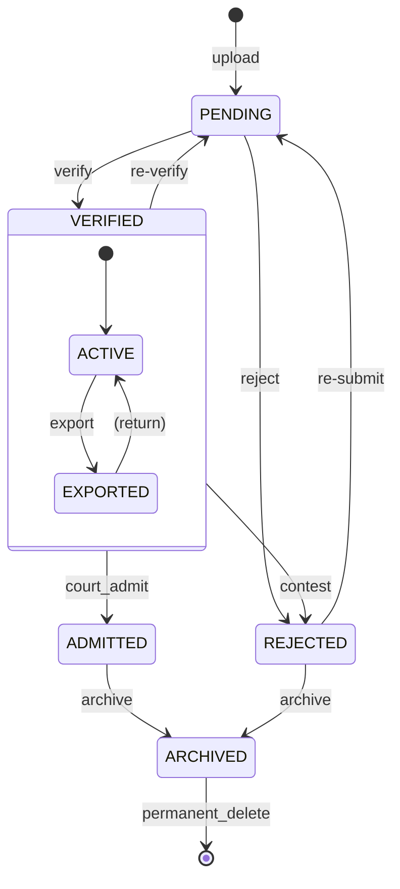

# Domain: Evidence & Chain of Custody

> **Document:** 05-evidence-domain.md  
> **Version:** 1.0  
> **Status:** Draft  
> **Last Updated:** June 2026

---

## Overview

This domain manages **the lifecycle of forensic evidence, from ingestion through verification to archival**. Every piece of evidence is cryptographically hashed (SHA-256) and linked into an immutable chain of custody that records every access, transfer, and modification. The domain ensures forensic admissibility through cryptographic integrity verification, access logging, and strict status workflows.

It acts as the **forensic integrity domain** — the foundation for court-admissible evidence with tamper-proof provenance tracking.

---

## Use Cases

---

### UC-01: Upload Evidence

- **Purpose**: Ingest a new piece of evidence into the system
- **Actors**: Security Operator (limited), Law Enforcement, Admin, Super Admin, System (AI pipeline)
- **Preconditions**: User has `evidence:create` permission

#### Main Success Flow

1. User submits evidence file + metadata (type, title, description, capture time, location)
2. System performs file validation chain:
   - MIME type check (whitelist: image/jpeg, image/png, video/mp4, application/pdf, audio/mp3)
   - File size check (images: 20MB, video: 500MB)
   - Magic byte verification
   - Virus scan (ClamAV)
   - Image: Re-encode to strip EXIF/metadata
   - Video: Transcode to H.264 + AAC in MP4 container
3. System computes SHA-256 hash of the final processed file
4. System stores file in S3 (bucket based on evidence type)
5. System creates `evidence` record with hash, metadata, and `status = 'pending'`
6. System creates first `evidence_chain_of_custody` entry (action: `created`)
7. System links chain entry: `previous_hash = NULL`, `current_hash = SHA-256(evidence_id + action + user_id + timestamp)`
8. System emits `evidence.uploaded` audit event

#### Alternate / Exception Flows

- File fails virus scan → 422, file deleted, error logged
- File exceeds size limit → 413 Payload Too Large
- Unsupported MIME type → 400 Bad Request

#### Result

Evidence uploaded, hashed, stored in S3, chain of custody initialized with `created` entry.

---

### UC-02: Verify Evidence

- **Purpose**: Approve evidence as forensically sound and admissible
- **Actors**: Law Enforcement, Admin
- **Preconditions**: Evidence status is `pending`; user has `evidence:verify` permission

#### Main Success Flow

1. User reviews evidence file and metadata
2. User approves with verification notes
3. System updates evidence status to `verified`, sets `verified_by`, `verified_at`
4. System creates chain of custody entry (action: `verified`)
5. System emits `evidence.verified` audit event

#### Alternate / Exception Flows

- Evidence is rejected → status set to `rejected`, rejection reason required
- Evidence needs re-verification → status set back to `pending`

---

### UC-03: Access Evidence (Chain of Custody Record)

- **Purpose**: Track every access to evidence for audit integrity
- **Actors**: Any user with read permission
- **Preconditions**: User has `evidence:read` permission

#### Main Success Flow

1. User requests to view or download evidence
2. System verifies user has permission (RBAC check)
3. System logs access in `evidence_chain_of_custody` (action: `viewed` or `exported`)
4. System generates presigned S3 URL (15-min TTL) for download
5. System returns evidence details + download URL

#### Result

Access recorded in chain of custody; download URL generated.

---

### UC-04: Verify Chain Integrity

- **Purpose**: Cryptographically verify that evidence has not been tampered with
- **Actors**: Law Enforcement, Admin, Super Admin
- **Preconditions**: Evidence exists

#### Main Success Flow

1. User requests chain integrity verification
2. System loads all chain-of-custody entries for the evidence (ordered by `performed_at`)
3. System recomputes `current_hash` for each entry:
   - `hash = SHA-256(previous_hash + evidence_id + action + user_id + timestamp)`
4. System verifies each computed hash matches the stored `current_hash`
5. System verifies each entry's `previous_hash` matches the previous entry's `current_hash`
6. System verifies evidence file's SHA-256 matches the evidence record's `sha256_hash`
7. System returns verification result: INTACT or TAMPERED

#### Alternate / Exception Flows

- Any hash mismatch → return TAMPERED with details of where chain breaks
- Missing entries → return INCOMPLETE

#### Result

Cryptographic integrity report generated.

---

### UC-05: Tag Evidence

- **Purpose**: Add searchable tags to evidence for categorization
- **Actors**: Law Enforcement, Admin, Super Admin
- **Preconditions**: Evidence exists

#### Main Success Flow

1. User adds tags to evidence
2. System creates `evidence_tags` records
3. System emits `evidence.tagged` audit event

#### Result

Tags attached to evidence for improved searchability.

---

### UC-06: Request Evidence (Transfer)

- **Purpose**: Request transfer of evidence to another case or jurisdiction
- **Actors**: Law Enforcement, Admin
- **Preconditions**: Evidence status is `verified`

#### Main Success Flow

1. User creates evidence request with reason and destination
2. System records `evidence_request` (logical entity, tracked via chain of custody)
3. Authorizing user approves/rejects request
4. On approval: chain of custody entry (action: `transferred`)
5. System emits `evidence.transferred` audit event

---

## Core Entities

---

### Entity: Evidence

- **Description**: Core evidence record. Every piece of digital forensic evidence is represented here.

#### Fields

| Field | Type | Description |
|-------|------|-------------|
| `id` | UUID | Primary key |
| `evidence_type` | VARCHAR(50) | snapshot, video_clip, witness_statement, document, 3d_reconstruction, audio, alpr_record |
| `title` | VARCHAR(300) | Evidence title |
| `description` | TEXT | Detailed description |
| `s3_key` | VARCHAR(512) | S3 object key |
| `cdn_url` | VARCHAR(512) | CDN delivery URL |
| `file_size_bytes` | BIGINT | File size in bytes |
| `mime_type` | VARCHAR(100) | MIME type |
| `width` | INTEGER | Image/video width |
| `height` | INTEGER | Image/video height |
| `duration_seconds` | DECIMAL(10,2) | Video/audio duration |
| `thumbnail_s3_key` | VARCHAR(512) | Thumbnail for preview |
| `sha256_hash` | VARCHAR(64) | SHA-256 of file content |
| `previous_hash` | VARCHAR(64) | Previous evidence hash in chain |
| `chain_position` | INTEGER | Position in hash-linked list |
| `source` | VARCHAR(50) | ai_capture, upload, system_generated, external_import, sighting |
| `source_id` | UUID | FK to source record |
| `captured_at` | TIMESTAMPTZ | When evidence was originally captured |
| `captured_by_device` | VARCHAR(200) | Camera/device ID |
| `location` | GEOGRAPHY(Point) | Where evidence was captured |
| `location_address` | TEXT | Address of capture location |
| `status` | VARCHAR(30) | pending, verified, rejected, admitted, archived |
| `verified_by` | UUID | Who verified the evidence |
| `verified_at` | TIMESTAMPTZ | When verified |
| `verification_notes` | TEXT | Notes from verifier |
| `ai_confidence_score` | DECIMAL(5,2) | AI confidence (if AI-generated) |
| `ai_model_version_id` | UUID | FK to ai_model_versions |
| `created_by` | UUID | Who uploaded the evidence |
| `created_at` | TIMESTAMPTZ | Creation timestamp |
| `updated_at` | TIMESTAMPTZ | Last update timestamp |
| `deleted_at` | TIMESTAMPTZ | Soft delete |

#### Constraints

- `sha256_hash` must be non-null for all evidence
- `chain_position` starts at 1 for new evidence, increments on each chain entry
- `evidence_type` must be a valid type from the enumeration

#### Relationships

- Has many `evidence_chain_of_custody` (access/action history)
- Has many `case_evidence` (links to cases)
- Has many `evidence_tags` (categorization)
- Has one `ai_inference_results` (if AI-generated)
- Has one `alpr_records` (if ALPR evidence)

---

### Entity: EvidenceChainOfCustody

- **Description**: Immutable, cryptographically linked log of every action performed on an evidence item.

#### Fields

| Field | Type | Description |
|-------|------|-------------|
| `id` | UUID | Primary key |
| `evidence_id` | UUID | FK to evidence |
| `action` | VARCHAR(50) | created, accessed, viewed, exported, transferred, verified, modified, archived |
| `performed_by` | UUID | FK to users (actor) |
| `performed_at` | TIMESTAMPTZ | When action occurred |
| `ip_address` | INET | Actor's IP |
| `user_agent` | TEXT | Actor's user agent |
| `previous_hash` | VARCHAR(64) | Previous entry's current_hash (null for first) |
| `current_hash` | VARCHAR(64) | SHA-256 of: previous_hash + evidence_id + action + user_id + timestamp |
| `notes` | TEXT | Optional notes |
| `metadata` | JSONB | Additional context |

#### Hash Computation

```
current_hash = SHA-256(
    previous_hash || evidence_id || action || performed_by || performed_at || nonce
)
```

#### Constraints

- `current_hash` must be unique per evidence (enforced via self-referencing FK)
- `previous_hash` must reference the previous entry's `current_hash` for the same evidence
- `action` must be a valid action from the enumeration

#### Relationships

- Belongs to `evidence`
- Self-referencing: `(evidence_id, previous_hash)` → `(evidence_id, current_hash)`

---

### Entity: EvidenceTag

- **Description**: Categorization tags attached to evidence for searchability.

#### Fields

| Field | Type | Description |
|-------|------|-------------|
| `id` | UUID | Primary key |
| `evidence_id` | UUID | FK to evidence |
| `tag` | VARCHAR(100) | Tag value |
| `created_at` | TIMESTAMPTZ | Creation timestamp |

#### Constraints

- Unique per `(evidence_id, tag)`

---

### Entity: EvidenceIntegrityCheck

- **Description**: Record of a chain integrity verification. Not a separate table — integrity checks are logged in the chain of custody (action: `verified`) and the full verification is computed on demand.

#### Logical Fields

| Field | Type | Description |
|-------|------|-------------|
| `evidence_id` | UUID | FK to evidence |
| `verified_at` | TIMESTAMPTZ | When verification was performed |
| `verified_by` | UUID | Who performed verification |
| `result` | VARCHAR(20) | INTACT, TAMPERED, INCOMPLETE |
| `details` | JSONB | Per-entry verification results |

---

### Entity: EvidenceRequest

- **Description**: Request to transfer evidence between cases or jurisdictions. Managed via chain of custody entries.

#### Logical Fields

| Field | Type | Description |
|-------|------|-------------|
| `id` | UUID | Primary key |
| `evidence_id` | UUID | Evidence to transfer |
| `requested_by` | UUID | Who requested |
| `requested_to` | UUID | Target user/org |
| `reason` | TEXT | Transfer reason |
| `status` | VARCHAR(30) | pending, approved, rejected |
| `decided_by` | UUID | Who approved/rejected |
| `decided_at` | TIMESTAMPTZ | Decision timestamp |

---

## State Machines



---

### States

| State | Description |
|-------|-------------|
| `PENDING` | Uploaded, awaiting verification |
| `VERIFIED` | Forensically verified and approved |
| `REJECTED` | Rejected (insufficient quality, irrelevant, tampered) |
| `ADMITTED` | Admitted as evidence in court proceedings |
| `ARCHIVED` | Archived for long-term retention |
| `ACTIVE` | Available for case use (sub-state of VERIFIED) |
| `EXPORTED` | Exported to external system (sub-state of VERIFIED) |

---

### Transitions & Guards

| From → To | Event | Condition |
|----------|-------|----------|
| PENDING → VERIFIED | `verify` | User has verify permission |
| PENDING → REJECTED | `reject` | Rejection reason required |
| VERIFIED → REJECTED | `contest` | Requires admin/super_admin |
| VERIFIED → ADMITTED | `court_admit` | Court order/reference required |
| VERIFIED → PENDING | `re-verify` | Super Admin authorization |
| ADMITTED → ARCHIVED | `archive` | Case closed |
| REJECTED → PENDING | `re-submit` | New verification required |
| REJECTED → ARCHIVED | `archive` | After 90 days in rejected state |

---

## Business Rules (Invariants)

1. **Cryptographic integrity**: Every evidence file must have a SHA-256 hash computed before storage.
2. **Chain immutability**: Chain-of-custody entries are append-only. No updates or deletes are permitted.
3. **Hash chaining**: Each chain entry's `current_hash` must be a function of the previous entry's hash plus the current entry's data.
4. **Evidence identity**: Two pieces of evidence with the same SHA-256 hash are considered duplicates (unless encoding differs).
5. **Verification authority**: Only Law Enforcement and Admin roles can verify evidence.
6. **Access recording**: Every view or download of evidence creates a chain-of-custody entry.
7. **Soft deletes**: Evidence is soft-deleted; only Super Admin can permanently delete.
8. **File retention**: Evidence files in S3 are immutable (object lock enabled); deletion is a lifecycle policy.
9. **Chain position**: Evidence chain positions are sequential integers starting at 1.
10. **Thumbnail generation**: Image and video evidence must have a thumbnail generated for preview.

---

## Processing Flows

### Evidence Upload Flow

```
┌─────────┐     ┌──────────┐     ┌──────────┐     ┌──────────┐
│ Submit  │────►│ Validate │────►│ Virus    │────►│ Re-encode│
│ File    │     │ MIME/Size│     │ Scan     │     │ (if img/ │
└─────────┘     └──────────┘     └──────────┘     │  video)  │
                                                   └────┬─────┘
                                                   ┌────▼─────┐
                                                   │ Compute  │
                                                   │ SHA-256  │
                                                   └────┬─────┘
                                                   ┌────▼─────┐
                                                   │ Store in │
                                                   │ S3       │
                                                   └────┬─────┘
                                                   ┌────▼─────┐
                                                   │ Create   │
                                                   │ Evidence │
                                                   │ Record   │
                                                   └────┬─────┘
                                                   ┌────▼─────┐
                                                   │ Init     │
                                                   │ Chain of │
                                                   │ Custody  │
                                                   └──────────┘
```

### Chain of Custody Recording Flow

```
┌─────────┐     ┌──────────┐     ┌──────────┐     ┌──────────┐
│ Action  │────►│ Load     │────►│ Compute  │────►│ Insert   │
│ Performed│    │ Previous │     │ current_ │     │ Chain    │
│         │     │ Hash     │     │ hash     │     │ Entry    │
└─────────┘     └──────────┘     └──────────┘     └──────────┘
```

### Integrity Verification Flow

```
┌─────────┐     ┌──────────┐     ┌──────────┐     ┌──────────┐
│ Request │────►│ Load All │────►│ Recompute│────►│ Compare  │
│ Verify  │     │ Chain    │     │ Hashes   │     │ Hashes   │
│         │     │ Entries  │     │          │     │          │
└─────────┘     └──────────┘     └──────────┘     └────┬─────┘
                                                        │
                                           ┌────────────▼─────┐
                                           │ Verify File Hash │
                                           │ vs stored hash   │
                                           └──────────┬───────┘
                                           ┌──────────▼───────┐
                                           │ Return Result    │
                                           │ INTACT / TAMPERED│
                                           └──────────────────┘
```

### Evidence Download Flow

```
┌─────────┐     ┌──────────┐     ┌──────────┐     ┌──────────┐
│ Request │────►│ Check    │────►│ Record   │────►│ Generate │
│ Download│     │ RBAC     │     │ Chain    │     │ Presigned│
│         │     │          │     │ Entry    │     │ URL      │
└─────────┘     └──────────┘     └──────────┘     └──────────┘
```

---

## Interfaces

### List View (Evidence Repository)

- **Filters**: Evidence type, status, source, case, date range, confidence score range, tags, search
- **Columns**: Thumbnail, Title, Type, Source, Status, Confidence, Captured, Linked Cases
- **Sorting**: Captured date, confidence score, title, status
- **Pagination**: Offset-based, max 100 per page

### Detail View (Evidence Detail)

- **Viewer**: Image viewer / video player / document preview / audio player (based on type)
- **Metadata**: Type, title, description, file size, MIME type, dimensions/duration
- **Source Info**: Captured at, captured by device, location (map), source system
- **AI Metadata**: Confidence score, model version, inference details (if AI-generated)
- **Status**: Current status badge, verified by, verified at
- **Chain of Custody**: Full timeline of all actions with hash verification
- **Linked Cases**: Cases this evidence belongs to
- **Tags**: Applied tags with management
- **Actions**: Verify, Reject, Download, Add to Case, Tag, View Hash, Verify Integrity

---

## Notifications

| Event | Recipient | Channel | Message |
|-------|-----------|---------|---------|
| `evidence.uploaded` | Case team | In-app | "New evidence uploaded: {title}" |
| `evidence.verified` | Case team | In-app | "Evidence verified: {title}" |
| `evidence.rejected` | Uploader | In-app | "Evidence rejected: {title} — {reason}" |
| `evidence.accessed` | Case owner | In-app | "Evidence {title} accessed by {user}" |
| `evidence.hash_mismatch` | Super Admin | In-app + Email | "CRITICAL: Evidence hash mismatch detected" |

---

## Audit Logging

| Event | Description |
|-------|-------------|
| `evidence.uploaded` | New evidence ingested |
| `evidence.verified` | Evidence verified by LEO/Admin |
| `evidence.rejected` | Evidence rejected |
| `evidence.admitted` | Evidence admitted in court |
| `evidence.accessed` | Evidence viewed/downloaded |
| `evidence.exported` | Evidence exported to external system |
| `evidence.transferred` | Evidence transferred between cases/orgs |
| `evidence.tagged` | Tags added to evidence |
| `evidence.archived` | Evidence archived |
| `evidence.deleted` | Evidence soft-deleted |
| `evidence.chain_verified` | Chain integrity checked |
| `evidence.chain_broken` | Chain integrity check failed |

---

## Invariants

1. Every evidence record must have a non-null `sha256_hash`.
2. Chain-of-custody entries are immutable — no updates, no deletes.
3. Each chain entry's `current_hash` must be cryptographically derived from the previous entry.
4. Evidence status transitions must follow the defined state machine.
5. Every evidence access must create a chain-of-custody entry.
6. The evidence file's computed SHA-256 must match the stored hash at all times.
7. Only verified evidence can be linked to closed cases or admitted in court.
8. Soft-deleted evidence must retain all chain-of-custody records.

---

## Key Decisions

| Decision | Choice | Rationale |
|----------|--------|-----------|
| **Hash algorithm** | SHA-256 | NIST-approved, sufficient for forensic admissibility |
| **Chain structure** | Linked list (previous_hash → current_hash) | Tamper-evident; each entry validates the chain |
| **File storage** | S3 with object lock (immutable) | Prevents post-ingestion modification |
| **Chain storage** | Same DB as evidence (PostgreSQL) | Transactional integrity; self-referencing FK |
| **Access control** | Chain entry on every view/download | Complete audit trail for every access |
| **Evidence verification** | Manual (LEO/Admin) | Human-in-the-loop for forensic admissibility |
| **Thumbnail generation** | Automatic on upload | Enables grid view without downloading full files |

---

## Optional Extensions

- Automated hash verification on a schedule (cron job)
- Blockchain-anchored hash for additional tamper evidence
- Evidence bundling for court submission (ZIP with manifest)
- Advanced video forensic analysis (frame-level authentication)
- Integration with external forensic tools (Autopsy, FTK)
- Evidence redaction for privacy (face blurring, plate blurring)
