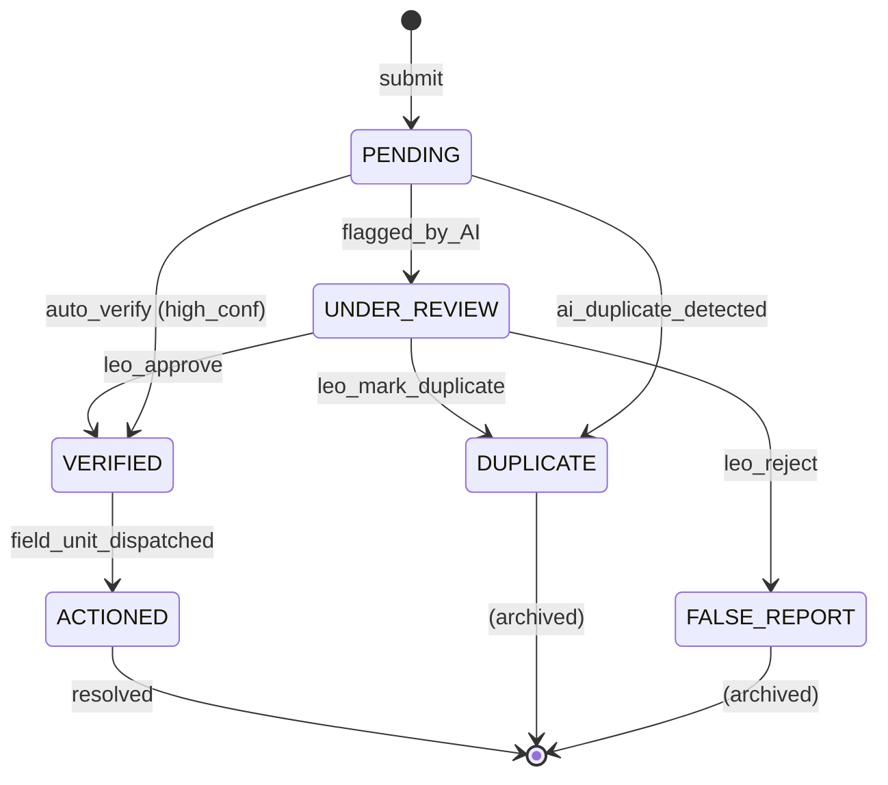

# Domain: Community Sightings

> **Document:** 06-sightings-domain.md  
> **Version:** 1.0  
> **Status:** Draft  
> **Last Updated:** June 2026

---

## Overview

This domain handles **community-submitted reports of wanted persons**, including sighting details, photo/video media, AI-powered matching to criminal profiles, law enforcement verification, and anonymous tip processing. It bridges the gap between community vigilance and law enforcement action by enabling real-time reporting with automated suspect matching.

It acts as the **community intelligence domain** — the primary channel for citizens and security personnel to contribute sightings that feed into the broader investigative ecosystem.

---

## Use Cases

---

### UC-01: Submit Sighting (Community)

- **Purpose**: Report a sighting of a wanted person
- **Actors**: Community Member, Security Operator
- **Preconditions**: User is authenticated (or anonymous submission allowed)

#### Main Success Flow

1. User captures photo(s) and GPS location via mobile app or web
2. User provides description of the sighting
3. User optionally marks submission as anonymous
4. System validates required fields (description, location, at least one photo)
5. System processes media (virus scan, re-encode, compute SHA-256)
6. System stores media in S3 (`sentinel360-sightings` bucket)
7. System creates `sighting` record with `status = 'pending'`
8. System auto-generates reference number (`ST-YYYY-NNNNN`)
9. System returns confirmation with reference number to user
10. System publishes `sighting.submitted` event to Kafka
11. System enqueues AI matching job

#### Alternate / Exception Flows

- Anonymous submission: `anonymous_submission = TRUE`, submitter identity hidden
- Rate limit exceeded (>10 sightings/hour) → 429 Too Many Requests
- Media fails processing → 422 with specific error

#### Result

Sighting created with `pending` status, media stored, AI matching queued.

---

### UC-02: AI Match Sighting to Profile

- **Purpose**: Automatically match sighting photos against criminal profile database
- **Actors**: System (AI pipeline)
- **Preconditions**: Sighting exists and is not deleted

#### Main Success Flow

1. AI Orchestrator consumes `sighting.submitted` event
2. System extracts face embeddings from sighting photos (ArcFace)
3. System compares embeddings against criminal profile gallery (cosine similarity)
4. If match confidence >= `default_confidence_threshold` (default: 80%):
   - System sets `ai_match_profile_id` and `ai_confidence_score` on sighting
   - System publishes `sighting.ai_match_found` event
   - Alert Service creates alert for matched profile
5. If match confidence < threshold but >= 50%:
   - System flags for manual review
   - System sets `ai_match_profile_id` (candidate) with confidence score
6. If no match found (confidence < 50%):
   - System marks `ai_match_processed = TRUE` with no match
7. System sets `ai_processed_at` timestamp
8. System emits `sighting.ai_matched` audit event

#### Result

Sighting processed by AI; match results recorded.

---

### UC-03: Verify Sighting (Law Enforcement)

- **Purpose**: Confirm or reject a community sighting
- **Actors**: Law Enforcement, Admin
- **Preconditions**: Sighting status is `pending` or `under_review`; user has `sightings:verify` permission

#### Main Success Flow

1. Officer reviews sighting details: photos, description, location, AI match results
2. Officer makes decision: `verified`, `duplicate`, or `false_report`
3. Officer provides confidence in their decision and notes
4. System creates `sighting_verification` record
5. System updates sighting status:
   - `verified` → status = `verified`, trigger alert to field units
   - `duplicate` → status = `duplicate`, link to original sighting
   - `false_report` → status = `false_report`
6. If verified and profile matched → update profile's `last_known_location`
7. If verified → make sighting visible on public feed (`is_public = TRUE`)
8. System notifies the submitter of the decision
9. System emits `sighting.verified` audit event

#### Result

Sighting verified/rejected; submitter notified; profile updated if applicable.

---

### UC-04: Submit Anonymous Tip

- **Purpose**: Submit a sighting without revealing identity
- **Actors**: Unauthenticated user (anonymous)
- **Preconditions**: None

#### Main Success Flow

1. User submits sighting without logging in
2. System creates sighting with `anonymous_submission = TRUE`
3. System generates unique reference number
4. System provides reference number to tipster (no account linkage)
5. AI matching proceeds as normal (UC-02)
6. System prevents any PII of the tipster from being stored

#### Result

Anonymous tip submitted; identity fully protected.

---

### UC-05: View User's Own Sightings

- **Purpose**: Allow submitters to track their sighting status
- **Actors**: Community Member, Security Operator
- **Preconditions**: User is authenticated

#### Main Success Flow

1. User navigates to "My Sightings" view
2. System queries sightings where `submitted_by = current_user_id`
3. System returns paginated list with status, reference number, created date
4. User can click individual sighting for full details

#### Result

User's sighting history displayed.

---

## Core Entities

---

### Entity: Sighting (Community)

- **Description**: A community-submitted report of a possible wanted person sighting.

#### Fields

| Field | Type | Description |
|-------|------|-------------|
| `id` | UUID | Primary key |
| `profile_id` | UUID | FK to criminal_profiles (resolved after AI matching) |
| `submitted_by` | UUID | FK to users (submitter) |
| `anonymous_submission` | BOOLEAN | Whether submission is anonymous |
| `description` | TEXT | Submitter's description |
| `location` | GEOGRAPHY(Point) | GPS coordinates of sighting |
| `location_address` | TEXT | Human-readable address |
| `location_accuracy_meters` | DECIMAL(10,2) | GPS accuracy |
| `observed_at` | TIMESTAMPTZ | When the person was seen |
| `status` | VARCHAR(30) | pending, under_review, verified, duplicate, false_report, actioned |
| `status_changed_at` | TIMESTAMPTZ | Last status change |
| `status_changed_by` | UUID | Who changed the status |
| `ai_match_processed` | BOOLEAN | Whether AI matching has run |
| `ai_match_profile_id` | UUID | FK to matched criminal profile (candidate) |
| `ai_confidence_score` | DECIMAL(5,2) | AI match confidence percentage |
| `ai_model_version_id` | UUID | FK to AI model version used |
| `ai_processed_at` | TIMESTAMPTZ | When AI matching completed |
| `verified_by` | UUID | FK to verifying user |
| `verified_at` | TIMESTAMPTZ | When verification occurred |
| `verification_notes` | TEXT | Verifier's notes |
| `reference_number` | VARCHAR(30) | Unique, human-readable reference |
| `is_public` | BOOLEAN | Visible on public feed |
| `created_at` | TIMESTAMPTZ | Creation timestamp |
| `updated_at` | TIMESTAMPTZ | Last update timestamp |
| `deleted_at` | TIMESTAMPTZ | Soft delete |

#### Constraints

- `reference_number` must be unique (auto-generated: `ST-YYYY-NNNNN`)
- `status` must be one of: pending, under_review, verified, duplicate, false_report, actioned
- At least one `sighting_media` record must exist

#### Relationships

- Belongs to `submitted_by` (user)
- Belongs to `profile_id` (criminal_profile, optional until matched)
- Has many `sighting_media` (photos/videos)
- Has many `sighting_verifications` (LEO decisions)

---

### Entity: SightingMedia

- **Description**: Photo or video media attached to a sighting.

#### Fields

| Field | Type | Description |
|-------|------|-------------|
| `id` | UUID | Primary key |
| `sighting_id` | UUID | FK to sightings |
| `media_type` | VARCHAR(20) | image, video |
| `s3_key` | VARCHAR(512) | S3 object key |
| `cdn_url` | VARCHAR(512) | CDN URL for delivery |
| `file_size_bytes` | BIGINT | File size |
| `mime_type` | VARCHAR(50) | MIME type |
| `sha256_hash` | VARCHAR(64) | File integrity hash |
| `is_primary` | BOOLEAN | Primary display media |
| `width` | INTEGER | Image/video width |
| `height` | INTEGER | Image/video height |
| `created_at` | TIMESTAMPTZ | Creation timestamp |

#### Constraints

- At least one media item per sighting must be `is_primary = TRUE`

---

### Entity: SightingVerification

- **Description**: Record of a law enforcement officer's verification decision.

#### Fields

| Field | Type | Description |
|-------|------|-------------|
| `id` | UUID | Primary key |
| `sighting_id` | UUID | FK to sightings |
| `verified_by` | UUID | FK to users (officer) |
| `decision` | VARCHAR(30) | verified, duplicate, false_report |
| `confidence` | DECIMAL(5,2) | Officer's confidence in decision |
| `notes` | TEXT | Officer's notes |
| `created_at` | TIMESTAMPTZ | Verification timestamp |

#### Constraints

- Unique per `(sighting_id, verified_by)` — one verification per officer

---

### Entity: AnonymousTip

- **Description**: Logical entity — anonymous sightings are stored in the `sightings` table with `anonymous_submission = TRUE`. No separate table needed.

#### Fields

Derived from `sightings` where `anonymous_submission = TRUE`. Key difference: no linkable identity information is stored.

---

## State Machines



---

### States

| State | Description |
|-------|-------------|
| `PENDING` | Awaiting initial review / AI matching |
| `UNDER_REVIEW` | Flagged for manual LEO review |
| `VERIFIED` | Confirmed as legitimate sighting |
| `DUPLICATE` | Already reported (linked to original) |
| `FALSE_REPORT` | Determined to be inaccurate or malicious |
| `ACTIONED` | Field unit dispatched based on sighting |

---

### Transitions & Guards

| From → To | Event | Condition |
|----------|-------|----------|
| PENDING → UNDER_REVIEW | `flag_for_review` | AI confidence between 50% and 80% |
| PENDING → VERIFIED | `auto_verify` | AI confidence >= 80% (configurable) |
| PENDING → DUPLICATE | `duplicate_detected` | AI or LEO identifies duplicate |
| UNDER_REVIEW → VERIFIED | `leo_approve` | LEO confirms sighting |
| UNDER_REVIEW → DUPLICATE | `leo_mark_duplicate` | LEO identifies duplicate |
| UNDER_REVIEW → FALSE_REPORT | `leo_reject` | LEO determines false report |
| VERIFIED → ACTIONED | `dispatch_field_unit` | Field unit available |

---

## Business Rules (Invariants)

1. **Reference uniqueness**: Every sighting receives a unique, sequentially generated reference number.
2. **Media requirement**: Every sighting must have at least one media item (photo or video).
3. **AI matching**: Every sighting is processed through the AI matching pipeline (async, within 5 minutes).
4. **Verification authority**: Only Law Enforcement and Admin roles can verify sightings.
5. **Anonymous privacy**: Anonymous submissions must not store any identifying information about the submitter.
6. **Duplicate handling**: Duplicate sightings are linked to the original and archived.
7. **Rate limiting**: Community members are limited to 10 sightings per hour (anti-abuse).
8. **Public visibility**: Only verified sightings can be made public (`is_public = TRUE`).
9. **Profile update**: When a sighting is verified and matched to a profile, the profile's `last_known_location` is updated.
10. **Submitter notification**: The submitter must be notified (via push/in-app) when their sighting status changes.

---

## Processing Flows

### Sighting Submission Flow

```
┌──────────┐     ┌──────────┐     ┌──────────┐     ┌──────────┐
│ Mobile   │────►│ Upload   │────►│ Validate │────►│ Process  │
│ App      │     │ Media +  │     │ + Virus  │     │ Media    │
│ Capture  │     │ Metadata │     │ Scan     │     │ (re-enc) │
└──────────┘     └──────────┘     └──────────┘     └────┬─────┘
                                                         │
                                               ┌─────────▼─────────┐
                                               │ Create Sighting   │
                                               │ Record + Media    │
                                               └─────────┬─────────┘
                                                         │
                                               ┌─────────▼─────────┐
                                               │ Publish to Kafka  │
                                               │ (AI matching)     │
                                               └───────────────────┘
```

### AI Matching Flow

```
┌──────────┐     ┌──────────┐     ┌──────────┐     ┌──────────┐
│ Kafka    │────►│ Extract  │────►│ Compare   │────►│ Confidence│
│ Consume  │     │ Face     │     │ to        │     │ Score     │
│ Event    │     │ Embedding│     │ Gallery   │     │ Decision  │
└──────────┘     └──────────┘     └──────────┘     └────┬─────┘
                                                         │
                                              ┌──────────▼──────────┐
                                              │ Match >= Threshold? │
                                              │  YES → Update       │
                                              │         Sighting    │
                                              │  NO → Mark processed│
                                              └─────────────────────┘
```

### Verification Flow (LEO)

```
┌──────────┐     ┌──────────┐     ┌──────────┐     ┌──────────┐
│ Review   │────►│ Analyze  │────►│ Make     │────►│ Create   │
│ Sighting │     │ Media +  │     │ Decision │     │ Verifi-  │
│ Details  │     │ AI Match │     │          │     │ cation   │
└──────────┘     └──────────┘     └──────────┘     └────┬─────┘
                                                         │
                                              ┌──────────▼──────────┐
                                              │ Update Sighting     │
                                              │ Status + Notify     │
                                              │ Submitter           │
                                              └─────────────────────┘
```

---

## Interfaces

### List View (Sighting Management — LEO/Admin)

- **Filters**: Status, date range, region (geographic), has AI match, confidence range
- **Columns**: Reference Number, Photo, Submitter (or "Anonymous"), Location, Observed At, Status, AI Match, Confidence
- **Sorting**: Newest, highest confidence, closest to current location
- **Pagination**: Cursor-based (real-time feed)

### Detail View (Sighting Detail)

- **Media**: Photo/video viewer with zoom
- **Submitter Info**: Name (if not anonymous), submitted at
- **Location Map**: GPS pin with address
- **Description**: Submitter's description
- **AI Match Results**: Matched profile (if any), confidence score, model version
- **Verification**: Current status, verification history (officer, decision, notes)
- **Actions**: Verify, Mark Duplicate, Reject, Dispatch Field Unit, View Matched Profile

### Public Submission Form (Mobile/Web)

- Photo capture (camera or gallery)
- GPS location (auto-detected with manual override)
- Description (free text)
- Anonymous toggle
- Submit button with confirmation

---

## Notifications

| Event | Recipient | Channel | Message |
|-------|-----------|---------|---------|
| `sighting.submitted` | Submitter | In-app | "Sighting submitted: {reference}" |
| `sighting.status_changed` | Submitter | Push/In-app | "Your sighting {ref} is now {status}" |
| `sighting.ai_match_found` | Relevant LEO | In-app | "AI matched sighting to {profile_name} ({confidence}%)" |
| `sighting.verified` | Field units | Push | "Verified sighting at {location} — dispatch advised" |
| `sighting.new_pending` | LEOs in region | In-app | "New pending sighting in your area" |

---

## Audit Logging

| Event | Description |
|-------|-------------|
| `sighting.submitted` | New sighting submitted |
| `sighting.ai_matched` | AI matching completed |
| `sighting.verified` | LEO verified sighting |
| `sighting.marked_duplicate` | Sighting marked as duplicate |
| `sighting.rejected` | Sighting marked as false report |
| `sighting.actioned` | Field unit dispatched |
| `sighting.media_added` | Media added to sighting |
| `sighting.deleted` | Sighting soft-deleted |

---

## Invariants

1. Every sighting must have at least one media file.
2. Reference numbers must be unique and sequential.
3. Anonymous sightings must not leak submitter identity.
4. AI matching must process every sighting within 5 minutes of submission.
5. Verification requires a non-null decision and verifier identity.
6. Duplicate sightings must be linked to the original sighting record.
7. Sighting status transitions must follow the defined state machine.
8. Submitter must be notified of all status changes.

---

## Key Decisions

| Decision | Choice | Rationale |
|----------|--------|-----------|
| **Submission channel** | Mobile + Web | Maximum accessibility for community |
| **Anonymous reporting** | `anonymous_submission` flag | Encourages reporting while protecting identity |
| **AI matching** | Async (Kafka) | Non-blocking submission; results arrive within minutes |
| **Auto-verification** | AI confidence >= 80% → auto-verified | Reduces LEO workload for high-confidence matches |
| **Rate limiting** | 10/hour per user | Prevents spam and abuse |
| **Reference numbering** | `ST-YYYY-NNNNN` | Human-readable, sortable, unique |

---

## Optional Extensions

- In-app rewards/recognition for frequent accurate submitters
- Geofenced push notifications ("Wanted person recently seen near you — report sightings")
- Sighting heat map for community awareness
- Anonymous tipster follow-up via encrypted channel (reference number based)
- Automated false report detection (pattern analysis of submitter history)
- Multi-language submission forms
