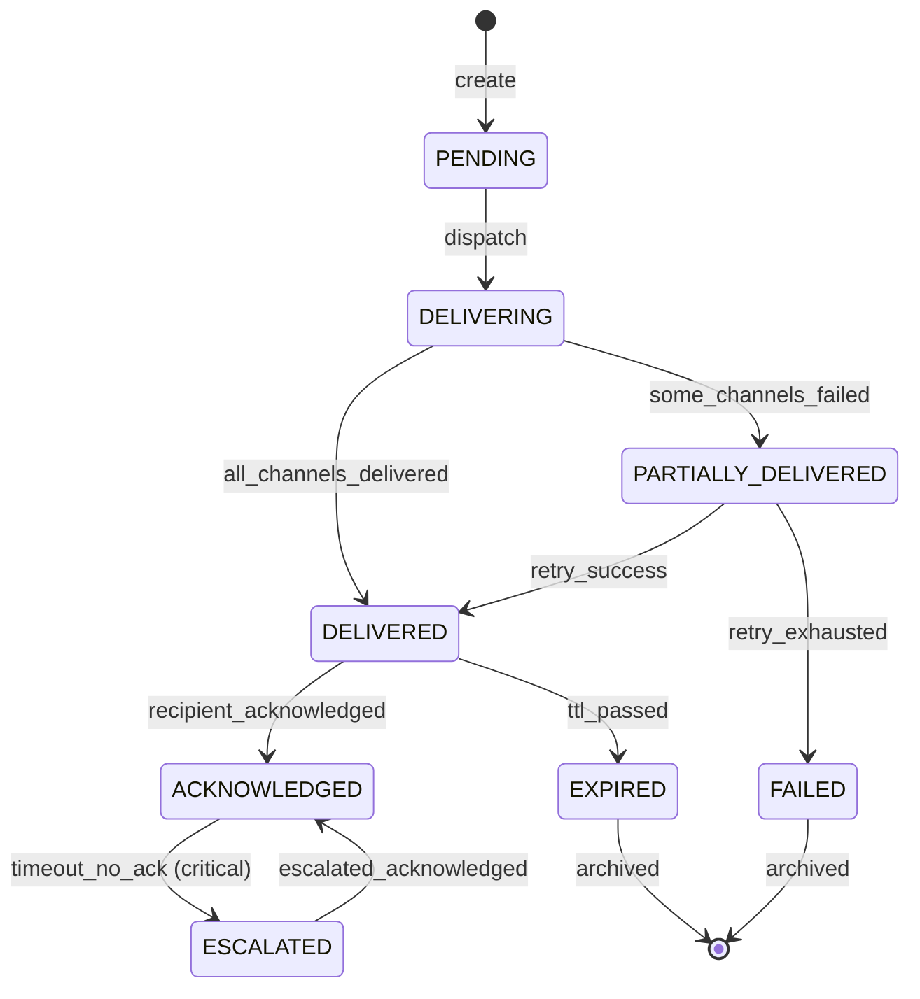

# Domain: Alerts & Notifications

> **Document:** 07-alerts-domain.md  
> **Version:** 1.0  
> **Status:** Draft  
> **Last Updated:** June 2026

---

## Overview

This domain handles **alert creation, routing, multi-channel delivery, user notification preferences, escalation chains, and geo-targeted alerting**. Alerts are generated from multiple sources — AI detections, community sightings, manual creation by administrators — and routed to the appropriate recipients based on role, region, and severity. The domain ensures that critical alerts reach the right people through the right channels with acknowledgment tracking.

It acts as the **rapid notification domain** — the bridge between detection events and human response, with delivery guarantees and escalation for unacknowledged critical alerts.

---

## Use Cases

---

### UC-01: Create Alert (System-Generated)

- **Purpose**: Automatically create an alert when an AI detection or matched sighting occurs
- **Actors**: System (AI pipeline, Sighting Service)
- **Preconditions**: Detection event has sufficient confidence (>= threshold)

#### Main Success Flow

1. AI pipeline or Sighting Service publishes detection event to Kafka
2. Alert Service consumes event
3. System determines alert type, severity, and target audience based on:
   - Type of detection (wanted person, vehicle match, behaviour anomaly)
   - Confidence score (>= 95% → critical, >= 90% → high, >= 80% → medium)
   - Geographic location (for geo-targeting)
4. System creates `alert` record with source reference
5. System evaluates routing rules to determine recipients
6. System creates `alert_recipient` records for each target user
7. System enqueues delivery jobs for each channel (push, email, in-app)
8. System publishes `alert.created` event
9. System emits `alert.created` audit event

#### Result

Alert created, recipients determined, delivery jobs queued.

---

### UC-02: Create Alert (Manual — Admin)

- **Purpose**: Manually create and send a targeted alert
- **Actors**: Admin, Super Admin
- **Preconditions**: User has `alerts:create` permission

#### Main Success Flow

1. Admin composes alert: title, description, severity, type
2. Admin selects targeting criteria:
   - Role (community, security, law_enforcement, all)
   - Geographic region (radius from point, or polygon)
   - Specific users or user groups
3. Admin sets optional expiry time
4. System creates `alert` record
5. System evaluates targeting criteria and creates `alert_recipient` records
6. System delivers via configured channels
7. System emits `alert.created` (manual) audit event

#### Result

Manual alert created and delivered to targeted recipients.

---

### UC-03: Deliver Alert (Multi-Channel)

- **Purpose**: Deliver an alert to recipients via push notification, in-app, and/or email
- **Actors**: System (Alert Dispatcher worker)
- **Preconditions**: Alert exists with pending recipients

#### Main Success Flow

1. Alert Dispatcher consumes delivery job
2. For each recipient, system checks `notification_preferences`:
   - Preferred channels for this alert type and severity
   - Quiet hours (do not disturb)
3. System attempts delivery via each preferred channel:
   - **Push notification**: Send via FCM (Android) / APNs (iOS)
   - **In-app**: Mark as unread in recipient's alert list
   - **Email**: Send via SMTP/SES
4. System creates `alert_delivery_log` record for each channel attempt
5. On success: set `status = 'delivered'`, `delivered_at`
6. On failure: set `status = 'failed'`, `failure_reason`, increment `retry_count`
7. Retry logic: failed delivery retried up to 3 times with exponential backoff

#### Result

Alert delivered via configured channels; delivery status recorded.

---

### UC-04: Acknowledge Alert

- **Purpose**: Confirm receipt and awareness of an alert
- **Actors**: Security Operator, Law Enforcement, Admin
- **Preconditions**: Alert exists and user is a recipient

#### Main Success Flow

1. Recipient opens alert and clicks "Acknowledge"
2. System updates `alert_recipients.acknowledged_at`
3. If alert is part of an escalation chain → cancel escalation timer
4. System emits `alert.acknowledged` audit event

#### Result

Alert acknowledged; escalation timer cancelled.

---

### UC-05: Escalate Unacknowledged Alert

- **Purpose**: Escalate critical alerts that are not acknowledged within a time window
- **Actors**: System (Escalation worker)
- **Preconditions**: Alert severity is `high` or `critical`; acknowledgment timeout exceeded

#### Main Success Flow

1. Escalation worker runs on a schedule (every 60 seconds)
2. System queries alerts where:
   - Severity is `high` or `critical`
   - `acknowledged_at` IS NULL for all recipients
   - `created_at` + escalation delay has passed
3. For each unacknowledged alert:
   - System creates new `alert` with escalated severity
   - System targets higher-authority recipients (supervisors, admin)
   - System sends escalation notification via SMS/push
   - System logs escalation in audit

#### Result

Alert escalated to higher authority; notification sent.

---

### UC-06: Configure Notification Preferences

- **Purpose**: Allow users to control how they receive different types of alerts
- **Actors**: Any authenticated user
- **Preconditions**: User is authenticated

#### Main Success Flow

1. User navigates to notification settings
2. System displays current preferences
3. User configures per alert type and severity:
   - Channel preference (push, email, in-app, none)
   - Quiet hours (start/end time)
   - Geographic scope (radius for area alerts)
4. System updates `notification_preference` record

#### Result

User's notification preferences updated.

---

### UC-07: Acknowledge High-Risk Alert Prompt

- **Purpose**: Add an extra prompt requiring active confirmation for high-severity alerts
- **Actors**: System upon high or critical alert creation
- **Preconditions**: Alert severity is `high` or `critical`

#### Main Success Flow

1. High or critical alert arrives
2. Recipients receive alert with prominent UI treatment
3. An extra prompt asks: "Do you acknowledge this alert?"
4. Timer starts for acknowledgment
5. If not acknowledged within time window, escalation triggers

#### Result

Recipient prompted to acknowledge; escalation triggered if no response.

---

## Core Entities

---

### Entity: Alert

- **Description**: A notification event triggered by a detection, sighting, or manual action.

#### Fields

| Field | Type | Description |
|-------|------|-------------|
| `id` | UUID | Primary key |
| `alert_type` | VARCHAR(50) | wanted_person_sighting, suspicious_behavior, vehicle_match, threat_alert, system |
| `severity` | VARCHAR(20) | low, medium, high, critical |
| `title` | VARCHAR(300) | Alert title |
| `description` | TEXT | Detailed alert description |
| `source` | VARCHAR(50) | ai_detection, sighting, manual, system |
| `source_id` | UUID | FK to source entity |
| `case_id` | UUID | FK to cases (optional) |
| `profile_id` | UUID | FK to criminal_profiles (optional) |
| `target_role` | VARCHAR(50) | community, security_operator, law_enforcement, all |
| `target_region` | GEOGRAPHY(Polygon) | Geographic targeting boundary |
| `target_radius_meters` | DECIMAL(10,2) | Radius around a point |
| `location` | GEOGRAPHY(Point) | Alert location |
| `location_address` | TEXT | Address of alert location |
| `expires_at` | TIMESTAMPTZ | When alert auto-expires |
| `is_read` | BOOLEAN | Whether alert has been read (recipient-level) |
| `created_by` | UUID | Who created the alert |
| `created_at` | TIMESTAMPTZ | Creation timestamp |
| `updated_at` | TIMESTAMPTZ | Last update |
| `deleted_at` | TIMESTAMPTZ | Soft delete |

#### Constraints

- `severity` must be one of: low, medium, high, critical
- `alert_type` must be a recognized type
- If `target_region` is set, `target_role` should also be set

#### Relationships

- Has many `alert_recipients` (users who received this alert)
- Has many `alert_delivery_logs` (delivery channel records)
- Belongs to `case` (optional)
- Belongs to `profile` (optional)
- Belongs to `created_by` (user)

---

### Entity: AlertRecipient

- **Description**: Links an alert to a user who should receive it, with tracking.

#### Fields

| Field | Type | Description |
|-------|------|-------------|
| `id` | UUID | Primary key |
| `alert_id` | UUID | FK to alerts |
| `user_id` | UUID | FK to users |
| `read_at` | TIMESTAMPTZ | When user first viewed the alert |
| `acknowledged_at` | TIMESTAMPTZ | When user acknowledged the alert |
| `dismissed_at` | TIMESTAMPTZ | When user dismissed the alert |
| `created_at` | TIMESTAMPTZ | Record creation |

#### Constraints

- Unique per `(alert_id, user_id)`

---

### Entity: AlertDeliveryLog

- **Description**: Tracks delivery of an alert through each channel.

#### Fields

| Field | Type | Description |
|-------|------|-------------|
| `id` | UUID | Primary key |
| `alert_id` | UUID | FK to alerts |
| `recipient_id` | UUID | FK to alert_recipients (optional) |
| `channel` | VARCHAR(30) | push_notification, in_app, email, sms |
| `status` | VARCHAR(30) | pending, delivered, failed, bounced |
| `delivered_at` | TIMESTAMPTZ | When delivery succeeded |
| `failed_at` | TIMESTAMPTZ | When delivery failed |
| `failure_reason` | TEXT | Why delivery failed |
| `retry_count` | INTEGER | Number of retry attempts |
| `provider_message_id` | VARCHAR(255) | FCM/APNS/SES message ID |
| `created_at` | TIMESTAMPTZ | Record creation |

---

### Entity: AlertRoutingRule

- **Description**: Configuration rules that determine who receives which alerts. Not a separate table — routing is determined by alert type, severity, target_role, and geographic targeting combined with user roles and notification preferences.

#### Logical Fields

| Field | Type | Description |
|-------|------|-------------|
| `alert_type` | VARCHAR(50) | Type of alert |
| `severity_min` | VARCHAR(20) | Minimum severity to trigger |
| `target_roles` | TEXT[] | Array of target roles |
| `geo_scope` | GEOGRAPHY(Polygon) | Geographic boundary |
| `escalation_delay_minutes` | INTEGER | Time before escalation |
| `channels` | TEXT[] | Delivery channels to use |

---

### Entity: Notification

- **Description**: In-app notification record for a user. This is the in-app channel representation of an alert.

#### Logical Fields

| Field | Type | Description |
|-------|------|-------------|
| `id` | UUID | Primary key |
| `user_id` | UUID | FK to users |
| `alert_id` | UUID | FK to alerts |
| `title` | VARCHAR(300) | Notification title |
| `body` | TEXT | Notification body |
| `is_read` | BOOLEAN | Read status |
| `read_at` | TIMESTAMPTZ | When read |
| `created_at` | TIMESTAMPTZ | Creation timestamp |

---

### Entity: NotificationPreference

- **Description**: User's preferences for receiving notifications.

#### Logical Fields

| Field | Type | Description |
|-------|------|-------------|
| `user_id` | UUID | FK to users |
| `alert_type` | VARCHAR(50) | Type of alert |
| `severity` | VARCHAR(20) | Minimum severity |
| `channels` | TEXT[] | Preferred delivery channels |
| `quiet_hours_start` | TIME | Do-not-disturb start |
| `quiet_hours_end` | TIME | Do-not-disturb end |
| `geo_radius_meters` | DECIMAL(10,2) | Alert radius for area alerts |

---

### Entity: AlertAcknowledgment

- **Description**: Record of acknowledgment for time-sensitive alerts. Tracked via `alert_recipients.acknowledged_at`.

---

## State Machines



---

### States

| State | Description |
|-------|-------------|
| `PENDING` | Alert created, awaiting dispatch |
| `DELIVERING` | Delivery in progress |
| `DELIVERED` | Successfully delivered via all channels |
| `PARTIALLY_DELIVERED` | Some channels succeeded, some failed |
| `FAILED` | All delivery attempts exhausted |
| `ACKNOWLEDGED` | Recipient has acknowledged receipt |
| `ESCALATED` | Escalated due to timeout |
| `EXPIRED` | Alert TTL has passed |

---

### Transitions & Guards

| From → To | Event | Condition |
|----------|-------|----------|
| PENDING → DELIVERING | `dispatch` | Recipients determined |
| DELIVERING → DELIVERED | `all_delivered` | All channels report success |
| DELIVERING → PARTIALLY_DELIVERED | `partial_delivery` | Some channels failed |
| PARTIALLY_DELIVERED → DELIVERED | `retry_success` | Retry succeeds before limit |
| PARTIALLY_DELIVERED → FAILED | `retry_exhausted` | Max retries reached |
| DELIVERED → ACKNOWLEDGED | `acknowledge` | User acknowledges |
| ACKNOWLEDGED → ESCALATED | `escalate_timeout` | Severity high/critical, no ack in window |
| DELIVERED → EXPIRED | `ttl_expired` | expires_at passed |

---

## Business Rules (Invariants)

1. **Severity mapping**: Alert severity is derived from the triggering event's confidence score (AI >= 95% → critical, >= 90% → high, >= 80% → medium).
2. **Routing accuracy**: Alerts must be routed only to users whose role matches `target_role` and whose location falls within `target_region`.
3. **Delivery guarantees**: Critical alerts are retried up to 3 times; failure after all retries triggers an escalation.
4. **Escalation**: High/critical alerts not acknowledged within configurable time window (default: 5 min critical, 15 min high) are escalated.
5. **Expiration**: Alerts have a configurable TTL after which they auto-expire.
6. **Channel preference**: Users can opt out of specific channels but cannot disable critical alerts entirely.
7. **Quiet hours**: During quiet hours, only critical alerts are delivered via push; others are queued.
8. **Deduplication**: Duplicate alerts for the same source event are prevented (idempotency key on source_id + alert_type).
9. **Audit trail**: All alert lifecycle events (create, deliver, acknowledge, escalate) are logged.

---

## Routing Rules

| Alert Type | Minimum Severity | Target Roles | Geo-Targeted | Escalation Delay |
|-----------|-----------------|-------------|--------------|------------------|
| `wanted_person_sighting` | medium | security_operator, law_enforcement | Yes (10km radius) | 5 min (critical), 15 min (high) |
| `suspicious_behavior` | low | security_operator | Yes (site radius) | 15 min |
| `vehicle_match` | medium | law_enforcement | Yes (20km radius) | 5 min |
| `threat_alert` | high | law_enforcement, admin | Yes (50km radius) | 2 min (critical) |
| `system` | low | admin, super_admin | No | 30 min |

---

## Processing Flows

### Alert Creation & Delivery Flow

```
┌─────────┐     ┌──────────┐     ┌──────────┐     ┌──────────┐
│ Source  │────►│ Determine│────►│ Create   │────►│ Evaluate │
│ Event   │     │ Type +   │     │ Alert    │     │ Routing  │
│ (Kafka) │     │ Severity │     │ Record   │     │ Rules    │
└─────────┘     └──────────┘     └──────────┘     └────┬─────┘
                                                         │
                                               ┌─────────▼─────────┐
                                               │ Create Recipients │
                                               │ (alert_recipients)│
                                               └─────────┬─────────┘
                                                         │
                                               ┌─────────▼─────────┐
                                               │ Enqueue Delivery  │
                                               │ Jobs (per channel)│
                                               └───────────────────┘
```

### Multi-Channel Delivery Flow

```
┌──────────┐     ┌──────────┐     ┌──────────┐
│ Delivery │────►│ Check    │────►│ Attempt  │
│ Job      │     │ Prefs +  │     │ Channel  │
│ (BullMQ) │     │ Quiet    │     │ Delivery │
└──────────┘     └──────────┘     └────┬─────┘
                                        │
                              ┌─────────▼─────────┐
                              │ Success?           │
                              │  YES → Log success │
                              │  NO → Retry?       │
                              │       YES → Re-queue│
                              │       NO → Mark fail│
                              └─────────────────────┘
```

### Escalation Flow

```
┌──────────┐     ┌──────────┐     ┌──────────┐     ┌──────────┐
│ Schedule │────►│ Find     │────►│ Create   │────►│ Notify   │
│ Check    │     │ Unack'd  │     │ Escalated│     │ Superiors│
│ (every   │     │ Critical │     │ Alert    │     │          │
│  60s)    │     │ Alerts   │     │          │     │          │
└──────────┘     └──────────┘     └──────────┘     └──────────┘
```

### Acknowledgment Flow

```
┌─────────┐     ┌──────────┐     ┌──────────┐     ┌──────────┐
│ User    │────►│ Update   │────►│ Cancel   │────►│ Log      │
│ Opens   │     │ alert_   │     │ Escalation│    │ Audit    │
│ Alert   │     │ recipient │    │ Timer    │     │ Event    │
└─────────┘     └──────────┘     └──────────┘     └──────────┘
```

---

## Interfaces

### List View (Alert History)

- **Filters**: Alert type, severity, date range, status (read/unread), source
- **Columns**: Severity badge, Title, Type, Source, Location, Created, Status
- **Sorting**: Newest, severity (critical first), type
- **Pagination**: Cursor-based (real-time feed)

### Detail View (Alert Detail)

- **Header**: Title, severity badge, type, timestamp
- **Description**: Full alert description
- **Source Info**: Source type, source entity link (case/profile/sighting)
- **Location**: Map pin with address
- **Delivery Status**: Per-channel delivery status for this user
- **Recipients**: List of recipients and their acknowledgment status (admin view)
- **Actions**: Acknowledge, Dismiss, View Source, Share

### Alert Creation Form (Admin)

- Title, description, severity, type
- Targeting: role selector, region picker (map), user search
- Expiry time
- Preview before send

---

## Notifications

| Event | Recipient | Channel | Message |
|-------|-----------|---------|---------|
| `alert.new` | Target users | Push + In-app | "{title} — {description}" |
| `alert.escalated` | Supervisor | Push + In-app | "ESCALATED: {title} unacknowledged" |
| `alert.acknowledged` | Alert creator | In-app | "{user} acknowledged alert: {title}" |
| `alert.expired` | Admin | In-app | "Alert expired: {title}" |

---

## Audit Logging

| Event | Description |
|-------|-------------|
| `alert.created` | Alert created (system or manual) |
| `alert.dispatched` | Alert enqueued for delivery |
| `alert.delivered` | Alert delivered via channel |
| `alert.delivery_failed` | Channel delivery failed |
| `alert.acknowledged` | Recipient acknowledged |
| `alert.escalated` | Alert escalated to higher authority |
| `alert.expired` | Alert TTL expired |

---

## Invariants

1. Alerts must always have a valid source and severity.
2. Delivery must be attempted through at least one channel.
3. Critical alerts must be retried on delivery failure.
4. Escalation must occur if critical alerts remain unacknowledged.
5. Users cannot opt out of critical alert delivery.
6. Duplicate alerts for the same event must be prevented.
7. Alert lifecycle transitions must follow the defined state machine.
8. All delivery attempts must be logged with status and timestamps.

---

## Key Decisions

| Decision | Choice | Rationale |
|----------|--------|-----------|
| **Delivery channels** | Push, In-app, Email (SMS future) | Covers primary communication paths |
| **Push infrastructure** | FCM + APNs via Firebase | Industry standard; cross-platform |
| **Alert targeting** | Role + Geo + User level | Flexible targeting for different scenarios |
| **Escalation** | Timeout-based with hierarchy | Ensures critical alerts are never ignored |
| **Deduplication** | Idempotency key (source_id + type) | Prevents alert storms from duplicate detections |
| **Delivery tracking** | Per-channel delivery log | Full visibility into delivery status |
| **Acknowledgment** | Required for high+ severity | Confirms human attention to critical events |

---

## Optional Extensions

- SMS delivery channel (Twilio integration)
- WhatsApp / Telegram bot integration for community alerts
- Alert analytics dashboard (response times, acknowledgment rates)
- Machine learning-based alert prioritization
- Escalation chain configuration (who gets alerted after whom)
- Automated alert suppression for false-positive-prone patterns
- Incident command system integration for large-scale events
