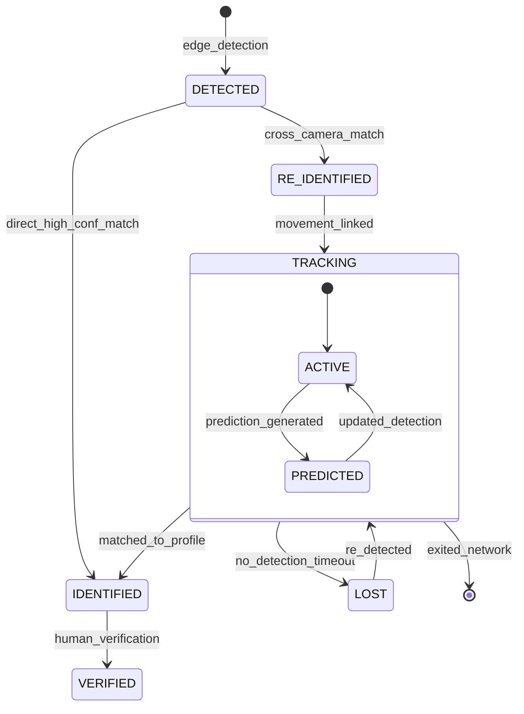

# Domain: AI Detection & Entity Tracking

> **Document:** 08-ai-detection-domain.md  
> **Version:** 1.0  
> **Status:** Draft  
> **Last Updated:** June 2026

---

## Overview

This domain handles **AI-powered detection, recognition, and tracking of entities (persons, vehicles, behaviours) across the surveillance network**. It encompasses edge inference (face detection, ALPR, behaviour analysis), cloud-based re-identification (cross-camera person matching), movement path tracking, geofencing violation detection, and movement prediction. Every detection is logged with full provenance — model version, confidence scores, timestamps, and geolocation — to ensure forensic traceability.

It acts as the **intelligence processing domain** — the core AI layer that transforms raw video frames into structured, actionable forensic intelligence.

---

## Use Cases

---

### UC-01: Detect Entity on Edge

- **Purpose**: Run real-time inference on camera frames to detect persons, vehicles, and behaviours
- **Actors**: System (Edge Node — NVIDIA Jetson Orin)
- **Preconditions**: Camera feed is active; model is deployed to edge node

#### Main Success Flow

1. Frame Grabber captures frames at 5 FPS (configurable)
2. YOLOv8 detector runs on each frame:
   - Person detection (bounding boxes)
   - Vehicle detection (bounding boxes)
   - Face detection (RetinaFace)
3. For each detected person:
   - ArcFace extracts 512-dim face embedding
   - DeepSORT assigns/reassigns tracklet ID
4. For each detected vehicle:
   - ALPR sub-pipeline runs: plate detection → OCR → vehicle attribute extraction
5. For behaviour analysis (every 16 frames):
   - 3D CNN classifies activity (loitering, fighting, trespassing, etc.)
6. Results are buffered locally and published to Kafka:
   - `detection-events` topic
   - `video-frames` topic (frame metadata + embeddings)
7. Edge node emits `detection.completed` signal

#### Result

Detections extracted, embeddings computed, results published to Kafka.

---

### UC-02: Cross-Camera Re-Identification

- **Purpose**: Match a person detected on one camera to the same person on another camera
- **Actors**: System (Cloud AI — Face Re-ID Service)
- **Preconditions**: Face embeddings exist from at least two different cameras

#### Main Success Flow

1. Face Re-ID Service consumes detection events from Kafka
2. For each new face embedding, system queries pgvector gallery:
   - Cosine similarity against known profile embeddings
   - Cosine similarity against recent unknown embeddings (temporary gallery)
3. If similarity >= 0.92 to a known profile:
   - System identifies person as a matched wanted person
   - System publishes `entity.identified` event
4. If similarity >= 0.75 to a recent unknown tracklet:
   - System links detections to same temporary entity ID
   - System updates movement timeline
5. If no match found:
   - System creates new temporary entity profile (unknown)
   - System stores embedding in temporary gallery (7-day TTL)
6. System emits `entity.reid_result` audit event

#### Result

Detections linked across cameras; matched to known profiles or grouped as unknown entities.

---

### UC-03: Track Entity Movement

- **Purpose**: Build a chronological movement path for an entity across the surveillance network
- **Actors**: System (Entity Tracking Service)
- **Preconditions**: Entity has been detected on at least two camera nodes

#### Main Success Flow

1. Entity Tracking Service consumes re-identification events
2. System creates or updates `entity_track` record for the entity
3. System creates `track_segment` for each camera-to-camera transition
4. System synthesizes movement data into `movement_timeline`:
   - Ordered list of detection events with timestamps and locations
   - Path tracing between camera nodes
5. System updates `movement_pattern`:
   - Common routes, frequent locations, dwell times
   - Time-of-day patterns
6. System emits `entity.track_updated` event

#### Result

Movement track updated with new segment; timeline and patterns recalculated.

---

### UC-04: Detect Geofencing Violation

- **Purpose**: Alert when a tracked entity enters or exits a defined geofence
- **Actors**: System (Geofencing Service)
- **Preconditions**: Geofence zones are defined; entity tracking is active

#### Main Success Flow

1. System monitors entity location updates against active geofences
2. When entity enters a geofenced zone:
   - System creates geofence violation event
   - System determines violation type (entry, exit, dwell)
   - System publishes `geofence.violation` event
3. Alert Service consumes event and creates alert
4. System emits `geofence.violation_detected` audit event

#### Result

Geofence violation detected; alert generated.

---

### UC-05: Predict Movement Path

- **Purpose**: Predict future movement of an entity based on historical patterns
- **Actors**: System (Movement Prediction Service)
- **Preconditions**: Entity has sufficient movement history (>= 3 track segments)

#### Main Success Flow

1. System loads entity's movement patterns (historical routes, time-of-day)
2. System applies prediction model (Markov chain or LSTM-based):
   - Next likely camera node
   - Estimated time of arrival
   - Confidence score
3. System creates `movement_prediction` record
4. System publishes predicted path to alert service (for proactive alerting)
5. System emits `movement.prediction_generated` audit event

#### Result

Movement prediction generated; proactive alerting possible.

---

### UC-06: Run AI Inference on Uploaded Media

- **Purpose**: Process user-uploaded media through AI detection pipeline
- **Actors**: Law Enforcement, Admin
- **Preconditions**: Media file is uploaded and accessible

#### Main Success Flow

1. User submits media file to `/ai/analyze` endpoint
2. System creates analysis job (BullMQ)
3. Job processes media through appropriate pipeline(s):
   - Face detection + recognition (if persons expected)
   - ALPR (if vehicles expected)
   - Behaviour analysis (if video)
4. System creates `ai_inference_result` records
5. System creates `evidence` records from detected content
6. System notifies user of completion
7. System emits `ai.analysis_completed` audit event

#### Result

Media analyzed; inference results and evidence created.

---

## Core Entities

---

### Entity: EntityProfile

- **Description**: A tracked entity (person or vehicle) that may or may not be linked to a criminal profile. Temporary profiles are created for unknown entities.

#### Logical Fields

| Field | Type | Description |
|-------|------|-------------|
| `id` | UUID | Primary key |
| `entity_type` | VARCHAR(30) | person, vehicle, unknown |
| `profile_id` | UUID | FK to criminal_profiles (optional, if matched) |
| `is_known` | BOOLEAN | Whether entity is linked to a known profile |
| `first_seen_at` | TIMESTAMPTZ | First detection timestamp |
| `last_seen_at` | TIMESTAMPTZ | Most recent detection |
| `first_camera_id` | VARCHAR(200) | Camera of first detection |
| `last_camera_id` | VARCHAR(200) | Camera of most recent detection |
| `track_count` | INTEGER | Number of tracking segments |
| `best_embedding` | VECTOR(512) | Highest quality face embedding |
| `attributes` | JSONB | Aggregated attributes (clothing, vehicle, etc.) |
| `created_at` | TIMESTAMPTZ | Creation timestamp |

---

### Entity: FaceDetection

- **Description**: A face detected in a video frame, with embedding.

#### Logical Fields

| Field | Type | Description |
|-------|------|-------------|
| `id` | UUID | Primary key |
| `inference_result_id` | UUID | FK to ai_inference_results |
| `bounding_box` | JSONB | {x, y, width, height} normalized |
| `landmarks` | JSONB | Facial landmarks (eyes, nose, mouth) |
| `embedding_vector` | VECTOR(512) | ArcFace embedding |
| `quality_score` | DECIMAL(5,2) | Detection quality |
| `face_angle` | DECIMAL(5,2) | Yaw angle (profile vs frontal) |

---

### Entity: PlateDetection

- **Description**: A license plate detected and recognized.

#### Logical Fields

| Field | Type | Description |
|-------|------|-------------|
| `id` | UUID | Primary key |
| `inference_result_id` | UUID | FK to ai_inference_results |
| `plate_text` | VARCHAR(20) | Recognized plate text |
| `plate_region` | VARCHAR(50) | Region/province |
| `vehicle_make` | VARCHAR(100) | Vehicle manufacturer |
| `vehicle_model` | VARCHAR(100) | Vehicle model |
| `vehicle_color` | VARCHAR(50) | Vehicle color |
| `vehicle_year` | INTEGER | Vehicle year |
| `confidence` | DECIMAL(5,2) | Overall ALPR confidence |

---

### Entity: PersonAttributes

- **Description**: Soft biometric attributes extracted for a detected person.

#### Logical Fields

| Field | Type | Description |
|-------|------|-------------|
| `id` | UUID | Primary key |
| `inference_result_id` | UUID | FK to ai_inference_results |
| `clothing` | JSONB | {top_color, bottom_color, top_type, bottom_type, has_hat, has_glasses} |
| `height_estimate` | DECIMAL(5,2) | Estimated height in cm |
| `build` | VARCHAR(30) | slim, medium, athletic, heavy |
| `carrying_items` | JSONB | Detected carried objects |
| `gait` | VARCHAR(30) | Observed walking style |

---

### Entity: EntityMatch

- **Description**: A match between a detected entity and a known profile.

#### Logical Fields

| Field | Type | Description |
|-------|------|-------------|
| `id` | UUID | Primary key |
| `entity_profile_id` | UUID | FK to entity_profile |
| `profile_id` | UUID | FK to criminal_profiles |
| `confidence` | DECIMAL(5,2) | Match confidence |
| `similarity_metric` | VARCHAR(50) | cosine, euclidean |
| `matched_at` | TIMESTAMPTZ | When match was made |
| `is_verified` | BOOLEAN | Whether human-verified |
| `verified_by` | UUID | FK to users |

---

### Entity: EntityTrack

- **Description**: A tracking session for an entity across camera nodes.

#### Logical Fields

| Field | Type | Description |
|-------|------|-------------|
| `id` | UUID | Primary key |
| `entity_profile_id` | UUID | FK to entity_profile |
| `started_at` | TIMESTAMPTZ | When tracking started |
| `ended_at` | TIMESTAMPTZ | When tracking ended |
| `camera_ids` | TEXT[] | Cameras involved |
| `segment_count` | INTEGER | Number of track segments |
| `total_distance_meters` | DECIMAL(10,2) | Estimated travel distance |
| `is_active` | BOOLEAN | Whether entity is still being tracked |

---

### Entity: MovementTimeline

- **Description**: Chronological list of entity detection events.

#### Logical Fields

| Field | Type | Description |
|-------|------|-------------|
| `id` | UUID | Primary key |
| `entity_profile_id` | UUID | FK to entity_profile |
| `camera_id` | VARCHAR(200) | Camera that detected entity |
| `location` | GEOGRAPHY(Point) | Detection location |
| `detected_at` | TIMESTAMPTZ | Detection timestamp |
| `detection_type` | VARCHAR(30) | face, full_body, alpr, behaviour |
| `confidence` | DECIMAL(5,2) | Detection confidence |
| `evidence_id` | UUID | FK to evidence (if captured) |

---

### Entity: TrackSegment

- **Description**: A movement segment between two camera detections.

#### Logical Fields

| Field | Type | Description |
|-------|------|-------------|
| `id` | UUID | Primary key |
| `entity_track_id` | UUID | FK to entity_track |
| `from_camera_id` | VARCHAR(200) | Source camera |
| `to_camera_id` | VARCHAR(200) | Destination camera |
| `from_location` | GEOGRAPHY(Point) | Start location |
| `to_location` | GEOGRAPHY(Point) | End location |
| `started_at` | TIMESTAMPTZ | Departure time |
| `ended_at` | TIMESTAMPTZ | Arrival time |
| `duration_seconds` | DECIMAL(10,2) | Travel time |
| `distance_meters` | DECIMAL(10,2) | Distance between cameras |
| `speed_mps` | DECIMAL(10,2) | Estimated speed |
| `route_taken` | GEOGRAPHY(LineString) | Plausible route |

---

### Entity: MovementPattern

- **Description**: Learned pattern of entity movement over time.

#### Logical Fields

| Field | Type | Description |
|-------|------|-------------|
| `id` | UUID | Primary key |
| `entity_profile_id` | UUID | FK to entity_profile |
| `pattern_type` | VARCHAR(30) | daily_route, frequent_location, dwell_zone |
| `time_of_day_start` | TIME | Pattern start time |
| `time_of_day_end` | TIME | Pattern end time |
| `days_of_week` | INTEGER[] | Bitmask of days |
| `location` | GEOGRAPHY(Point) | Pattern location |
| `camera_id` | VARCHAR(200) | Related camera |
| `frequency` | INTEGER | Observed count |
| `confidence` | DECIMAL(5,2) | Pattern confidence |
| `first_observed` | TIMESTAMPTZ | First observation |
| `last_observed` | TIMESTAMPTZ | Most recent observation |

---

### Entity: MovementPrediction

- **Description**: Predicted future movement of an entity.

#### Logical Fields

| Field | Type | Description |
|-------|------|-------------|
| `id` | UUID | Primary key |
| `entity_profile_id` | UUID | FK to entity_profile |
| `predicted_camera_id` | VARCHAR(200) | Predicted next camera |
| `predicted_location` | GEOGRAPHY(Point) | Predicted location |
| `estimated_arrival_at` | TIMESTAMPTZ | ETA |
| `confidence` | DECIMAL(5,2) | Prediction confidence |
| `prediction_model` | VARCHAR(100) | Model used |
| `predicted_at` | TIMESTAMPTZ | When prediction was made |
| `was_accurate` | BOOLEAN | Whether prediction was correct (evaluated later) |

---

### Entity: AiInferenceResult

- **Description**: Raw inference output from an AI model, linked to evidence and profiles. Stored in `ai_inference_results` table.

#### Fields

(Defined in database schema — includes detection_class, confidence, bounding_box, embedding_vector, etc.)

---

### Entity: Detection

- **Description**: A single detection event (face, vehicle, behaviour) from the edge or cloud pipeline.

#### Logical Fields

| Field | Type | Description |
|-------|------|-------------|
| `id` | UUID | Primary key |
| `inference_result_id` | UUID | FK to ai_inference_results |
| `detection_class` | VARCHAR(100) | person, vehicle, face, license_plate, abnormal_activity |
| `confidence` | DECIMAL(5,2) | Detection confidence |
| `bounding_box` | JSONB | Bounding box coordinates |
| `camera_id` | VARCHAR(200) | Source camera |
| `frame_timestamp` | TIMESTAMPTZ | Frame timestamp |
| `tracklet_id` | VARCHAR(100) | Tracking ID across frames |

---

### Entity: DetectionConfiguration

- **Description**: Per-camera or per-node configuration for AI detection parameters.

#### Logical Fields

| Field | Type | Description |
|-------|------|-------------|
| `id` | UUID | Primary key |
| `camera_id` | VARCHAR(200) | Camera identifier |
| `detection_classes` | TEXT[] | Enabled detection classes |
| `confidence_threshold` | DECIMAL(5,2) | Minimum detection confidence |
| `frame_interval` | INTEGER | Frames between analysis |
| `roi` | JSONB | Region of interest polygon |
| `behaviour_config` | JSONB | Behaviour detection parameters |
| `is_active` | BOOLEAN | Whether configuration is active |

---

## State Machines



---

### States

| State | Description |
|-------|-------------|
| `DETECTED` | Entity first detected by a camera node |
| `RE_IDENTIFIED` | Entity matched across multiple cameras |
| `TRACKING` | Entity actively tracked across network |
| `IDENTIFIED` | Entity matched to a known criminal profile |
| `VERIFIED` | Match confirmed by human operator |
| `LOST` | Entity exited coverage area or not seen for timeout |
| `ACTIVE` | Currently being tracked (sub-state) |
| `PREDICTED` | Movement prediction generated (sub-state) |

---

### Transitions & Guards

| From → To | Event | Condition |
|----------|-------|----------|
| DETECTED → RE_IDENTIFIED | `cross_camera_match` | Similarity >= 0.75 |
| RE_IDENTIFIED → TRACKING | `movement_linked` | >= 3 detections across cameras |
| TRACKING → IDENTIFIED | `matched_to_profile` | Similarity >= 0.92 to known profile |
| IDENTIFIED → VERIFIED | `human_verification` | LEO/Admin confirms match |
| DETECTED → IDENTIFIED | `direct_match` | Similarity >= 0.95 |
| TRACKING → LOST | `timeout` | No detection for > 30 minutes |
| LOST → TRACKING | `re_detected` | Entity detected again |
| TRACKING → [*] | `exited_network` | No detection for > 24 hours |

---

## Business Rules (Invariants)

1. **Edge-first processing**: All real-time detection runs on edge nodes to minimize latency.
2. **Minimum confidence**: Detections below 50% confidence are discarded.
3. **Temporal consistency**: Face matches require detection across >= 3 consecutive frames before alerting.
4. **Gallery retention**: Temporary (unknown) entity embeddings are retained for 7 days.
5. **Model traceability**: Every inference result records the model version used.
6. **Privacy preservation**: Face embeddings are stored encrypted; raw images are retained only as evidence.
7. **Prediction validation**: Movement predictions are evaluated against actual detections for model improvement.
8. **Geofencing accuracy**: Geofence violations are only triggered when entity location confidence >= 70%.
9. **Cross-camera matching**: Spatial constraints ensure matched entities are within plausible travel distance.
10. **Activity logging**: All AI pipeline decisions (detections, matches, predictions) are logged.

---

## Processing Flows

### Edge Detection Pipeline

```
┌──────────┐     ┌──────────┐     ┌──────────┐     ┌──────────┐
│ Camera   │────►│ Frame    │────►│ YOLOv8   │────►│ Object   │
│ RTSP     │     │ Grabber  │     │ Detection│     │ Tracking │
│ Stream   │     │ (5 FPS)  │     │          │     │ (DeepSORT)│
└──────────┘     └──────────┘     └──────────┘     └────┬─────┘
                                        ┌───────────────┴───────────────┐
                                        │ Person?          │ Vehicle?  │
                                        ▼                  ▼           │
                                   ┌────────┐         ┌────────┐      │
                                   │ ArcFace│         │ ALPR   │      │
                                   │ Embed  │         │ Engine │      │
                                   └───┬────┘         └───┬────┘      │
                                       │                  │           │
                                       └────────┬─────────┘           │
                                                │                     │
                                        ┌───────▼─────────────────────▼──┐
                                        │ Publish to Kafka              │
                                        │ (detection-events topic)      │
                                        └───────────────────────────────┘
```

### Re-Identification Pipeline

```
┌──────────┐     ┌──────────┐     ┌──────────┐     ┌──────────┐
│ Kafka    │────►│ Query    │────►│ Compare  │────►│ Update   │
│ Detection│     │ pgvector │     │ Embedding│     │ Entity   │
│ Event    │     │ Gallery  │     │ Similarity│    │ Profile  │
└──────────┘     └──────────┘     └──────────┘     └────┬─────┘
                                                         │
                                              ┌──────────▼──────────┐
                                              │ Match Found?        │
                                              │  YES → Update Track │
                                              │  NO → Create Temp   │
                                              │         Entity      │
                                              └─────────────────────┘
```

### Movement Tracking Pipeline

```
┌──────────┐     ┌──────────┐     ┌──────────┐     ┌──────────┐
│ Re-ID    │────►│ Create   │────►│ Update   │────►│ Detect   │
│ Match    │     │ Track    │     │ Timeline │     │ Geofence │
│ Event    │     │ Segment  │     │          │     │ Violation│
└──────────┘     └──────────┘     └──────────┘     └────┬─────┘
                                                         │
                                              ┌──────────▼──────────┐
                                              │ Generate Movement   │
                                              │ Pattern Prediction  │
                                              └─────────────────────┘
```

---

## Interfaces

### List View (Entity Tracking Dashboard)

- **Filters**: Entity type (person/vehicle), match status (known/unknown), camera, date range, geofence
- **Columns**: Entity ID, Type, Match Status, First Seen, Last Seen, Camera Count, Track Segments
- **Map View**: Real-time entity positions on map overlay
- **Timeline**: Entity detection history with playback controls

### Detail View (Entity Track Detail)

- **Identity**: Entity ID, matched profile (if known), attributes
- **Movement Map**: Full path trace on map with camera nodes, timestamps, speed
- **Timeline**: Chronological detection list with evidence snapshots
- **Predictions**: Predicted next locations with confidence
- **Patterns**: Learned movement patterns (time-of-day, frequent routes)
- **Detections**: Gallery of detection snapshots with confidence scores

---

## Notifications

| Event | Recipient | Channel | Message |
|-------|-----------|---------|---------|
| `entity.identified` | LEO/Admin | In-app | "Known entity {name} detected at {camera}" |
| `entity.high_value_match` | LEO | Push | "HIGH CONFIDENCE: {name} match ({confidence}%)" |
| `geofence.violation` | Security | Push | "Geofence violation at {zone}: {entity}" |
| `entity.movement_prediction` | LEO | In-app | "Predicted movement: {entity} likely at {camera} by {time}" |

---

## Audit Logging

| Event | Description |
|-------|-------------|
| `entity.detected` | Entity detected by edge node |
| `entity.reidentified` | Entity matched across cameras |
| `entity.identified` | Entity matched to known profile |
| `entity.match_verified` | Human verified AI match |
| `entity.track_updated` | Movement track updated |
| `entity.lost` | Entity tracking timed out |
| `entity.prediction_generated` | Movement prediction created |
| `geofence.violation_detected` | Geofence boundary crossed |
| `ai.analysis_initiated` | AI analysis job started |
| `ai.analysis_completed` | AI analysis job completed |

---

## Invariants

1. All real-time detections must be processed on edge nodes (cloud fallback for offline edge).
2. Every inference must record the model version used for traceability.
3. Unknown entity embeddings must be automatically purged after 7 days.
4. Match decisions must consider temporal consistency (>= 3 frames).
5. Geofence violations must only trigger when location confidence >= 70%.
6. Movement predictions must be evaluated against actual detections for accuracy tracking.
7. Cross-camera matches must enforce spatial and temporal plausibility constraints.
8. All AI pipeline decisions must be logged with full provenance data.

---

## Key Decisions

| Decision | Choice | Rationale |
|----------|--------|-----------|
| **Detection at edge** | YOLOv8 + ArcFace + DeepSORT | Low latency, proven accuracy on Jetson |
| **Face embedding** | ArcFace (ResNet-100, 512-dim) | State-of-the-art; native pgvector support |
| **Re-ID matching** | Cosine similarity + temporal consistency | Simple, effective, auditable |
| **Temporary gallery** | Redis (7-day TTL) | Fast access, auto-cleanup |
| **Embedding storage** | pgvector (IVFFlat index) | Native PostgreSQL; no additional infrastructure |
| **Movement prediction** | Markov chain (v1), LSTM (future) | Balance of accuracy and complexity |
| **Model versioning** | MLflow registry | Full lineage tracking and A/B testing |

---

## Optional Extensions

- Multi-object tracking (MOT) metrics for pipeline performance monitoring
- Vehicle re-identification (vehicle Re-ID) for non-ALPR tracking
- Scene-level anomaly detection (beyond individual behaviour)
- Interactive query: "Show me all entities matching these attributes in the last 24 hours"
- Adversarial detection (identifying attempts to evade recognition: masks, face coverings)
- Cross-site entity linking (matching entities across different deployment locations)
- Real-time alert for persons of interest approaching sensitive locations
