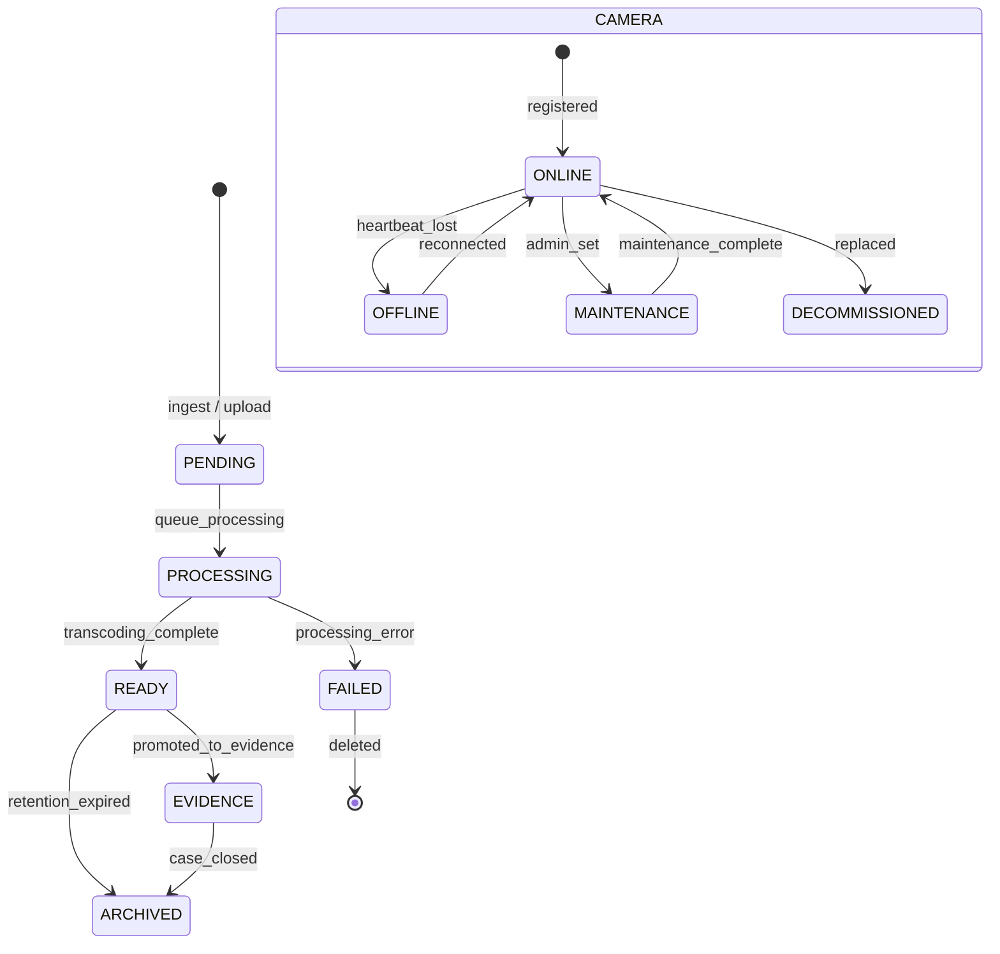

# Domain: Media Assets & Camera Infrastructure

> **Document:** 09-media-cameras-domain.md  
> **Version:** 1.0  
> **Status:** Draft  
> **Last Updated:** June 2026

---

## Overview

This domain manages **the lifecycle of media assets (video, images, audio) and the physical camera infrastructure** across the Sentinel360 surveillance network. It handles media ingestion from edge nodes and uploads, transcoding into multiple quality variants, retention policy enforcement, metadata extraction, and camera node management including monitoring zone configuration and operator shift assignments.

It acts as the **media and infrastructure domain** — the storage and management layer for all visual forensic data and the physical devices that capture it.

---

## Use Cases

---

### UC-01: Ingest Media from Edge Node

- **Purpose**: Receive and store video frames and snapshots from edge camera nodes
- **Actors**: System (Edge Node)
- **Preconditions**: Edge node is authenticated and authorized

#### Main Success Flow

1. Edge node publishes frame batch to Kafka (`video-frames` topic)
2. Video Processor worker consumes batch
3. System validates frame integrity (check SHA-256 hash)
4. System stores raw frames in S3 (`sentinel360-raw-video` bucket)
5. System creates `media_asset` record with metadata
6. System enqueues transcoding job for video assets
7. System extracts keyframes for AI analysis (if applicable)
8. System publishes `media.ingested` event

#### Result

Media ingested, raw data stored, processing jobs queued.

---

### UC-02: Upload Media (Manual)

- **Purpose**: Allow authorized users to upload media evidence
- **Actors**: Law Enforcement, Security Operator, Admin
- **Preconditions**: User has appropriate upload permission

#### Main Success Flow

1. User uploads media file via API (multipart/form-data)
2. System validates MIME type and file size (image: 20MB max, video: 500MB max)
3. System runs virus scan (ClamAV)
4. System re-encodes image (strip EXIF/metadata) or transcodes video (H.264 + AAC)
5. System computes SHA-256 hash
6. System stores processed file in S3 (`sentinel360-snapshots` or `sentinel360-evidence`)
7. System creates `media_asset` and `media_metadata` records
8. System generates thumbnail (for images) or preview clip (for video)
9. System creates transcoded variants (for video: 480p, 720p, 1080p)
10. System emits `media.uploaded` audit event

#### Result

Media uploaded, processed, and stored with variants.

---

### UC-03: Transcode Video

- **Purpose**: Generate multiple resolution variants of a video asset
- **Actors**: System (Video Processor worker)
- **Preconditions**: Video asset exists and is not already transcoded

#### Main Success Flow

1. Video Processor consumes transcoding job
2. System loads original video from S3
3. System transcodes to target resolutions:
   - 480p (854x480) — mobile, low bandwidth
   - 720p (1280x720) — standard web
   - 1080p (1920x1080) — full quality
4. System stores each variant in S3
5. System creates `media_transcoded_variant` records
6. System generates thumbnail at 00:00:01, midpoint, and end
7. System generates preview clip (10 seconds, 720p)
8. System updates `media_asset` with `is_transcoded = TRUE`
9. System emits `media.transcoded` event

#### Result

Video transcoded into multiple quality variants.

---

### UC-04: Apply Retention Policy

- **Purpose**: Enforce data retention rules on media assets
- **Actors**: System (Retention worker — cron job)
- **Preconditions**: Media assets exist with retention policies configured

#### Main Success Flow

1. Retention worker runs on schedule (daily)
2. System queries media assets where `created_at + retention_period < NOW()`
3. For each expiring asset:
   - If asset is linked to an open case → extend retention (case-duration based)
   - If asset is verified evidence → permanent retention
   - If asset is raw/unprocessed → move to Glacier or delete based on policy
4. System creates `media_retention_record` for disposition
5. System executes disposition (delete or archive)
6. System emits `media.retention_enforced` audit event

#### Result

Retention policies enforced; data archived or deleted per policy.

---

### UC-05: Register Camera Node

- **Purpose**: Add a new camera to the Sentinel360 network
- **Actors**: Admin, Super Admin
- **Preconditions**: Camera hardware is physically installed

#### Main Success Flow

1. Admin registers camera with:
   - Camera ID (unique hardware identifier)
   - Location (GPS coordinates)
   - Model/specs
   - RTSP stream URL
   - Assigned edge node
2. System creates `camera` record
3. System assigns camera to a `monitoring_zone`
4. System deploys detection configuration to associated edge node
5. System verifies camera connectivity (test RTSP stream)
6. System emits `camera.registered` audit event

#### Result

Camera registered and connected to processing pipeline.

---

### UC-06: Configure Monitoring Zone

- **Purpose**: Define geographic zones with specific monitoring parameters
- **Actors**: Admin, Super Admin
- **Preconditions**: Cameras exist in the target area

#### Main Success Flow

1. Admin defines zone boundary (polygon on map)
2. Admin configures zone parameters:
   - Detection sensitivity
   - Behaviour classes enabled
   - Alert threshold
   - Operating hours
3. Admin assigns cameras to zone
4. System creates `monitoring_zone` record
5. System updates edge node configurations for affected cameras
6. System emits `zone.configured` audit event

#### Result

Monitoring zone configured with detection parameters.

---

### UC-07: Manage Operator Shift

- **Purpose**: Assign security operators to monitoring sessions
- **Actors**: Admin, Super Admin
- **Preconditions**: Operators exist in the system

#### Main Success Flow

1. Admin creates shift schedule
2. System creates `operator_shift` record
3. System creates `monitoring_session` records for the shift duration
4. Operators receive notification of assigned shift
5. System tracks active monitoring sessions in real-time
6. System emits `shift.assigned` audit event

#### Result

Operator shift scheduled and monitored.

---

## Core Entities

---

### Entity: MediaAsset

- **Description**: Core record for any media file (video, image, audio) ingested into the system.

#### Fields

| Field | Type | Description |
|-------|------|-------------|
| `id` | UUID | Primary key |
| `media_type` | VARCHAR(30) | video, image, audio, document |
| `original_filename` | VARCHAR(500) | Original file name |
| `s3_key` | VARCHAR(512) | Primary S3 object key |
| `cdn_url` | VARCHAR(512) | CDN delivery URL |
| `file_size_bytes` | BIGINT | File size |
| `mime_type` | VARCHAR(100) | MIME type |
| `sha256_hash` | VARCHAR(64) | File integrity hash |
| `width` | INTEGER | Frame width (image/video) |
| `height` | INTEGER | Frame height (image/video) |
| `duration_seconds` | DECIMAL(10,2) | Duration (video/audio) |
| `fps` | DECIMAL(5,2) | Frames per second (video) |
| `bitrate_kbps` | INTEGER | Encoding bitrate (video) |
| `is_transcoded` | BOOLEAN | Whether variants exist |
| `thumbnail_s3_key` | VARCHAR(512) | Thumbnail image key |
| `source` | VARCHAR(50) | edge_capture, upload, system_generated, external_import |
| `source_id` | UUID | FK to source record |
| `camera_id` | VARCHAR(200) | Capturing camera (if applicable) |
| `captured_at` | TIMESTAMPTZ | When media was captured |
| `retention_days` | INTEGER | Retention period in days |
| `retention_policy` | VARCHAR(30) | standard, evidence, case_linked, permanent |
| `status` | VARCHAR(30) | pending, processing, ready, failed, archived |
| `created_by` | UUID | FK to users (uploader) |
| `created_at` | TIMESTAMPTZ | Creation timestamp |
| `updated_at` | TIMESTAMPTZ | Last update |
| `deleted_at` | TIMESTAMPTZ | Soft delete |

#### Constraints

- `sha256_hash` must be non-null for all media
- `status` must be one of: pending, processing, ready, failed, archived

#### Relationships

- Has many `media_transcoded_variants` (quality variants)
- Has one `media_metadata` (extracted metadata)
- Has many `media_retention_records` (retention history)
- Has many `evidence` (if promoted to evidence)
- Has many `sighting_media` (if part of a sighting)

---

### Entity: MediaMetadata

- **Description**: Extracted metadata from media files (EXIF, video metadata, etc.).

#### Fields

| Field | Type | Description |
|-------|------|-------------|
| `id` | UUID | Primary key |
| `media_asset_id` | UUID | FK to media_assets |
| `exif_data` | JSONB | EXIF metadata (images) |
| `video_codec` | VARCHAR(50) | Video codec (e.g., H.264, H.265) |
| `audio_codec` | VARCHAR(50) | Audio codec (e.g., AAC, MP3) |
| `audio_channels` | INTEGER | Number of audio channels |
| `sample_rate` | INTEGER | Audio sample rate |
| `color_space` | VARCHAR(30) | Color space (e.g., sRGB, Rec.709) |
| `gps_latitude` | DECIMAL(10,7) | GPS latitude from EXIF |
| `gps_longitude` | DECIMAL(10,7) | GPS longitude from EXIF |
| `gps_altitude` | DECIMAL(10,2) | GPS altitude |
| `camera_make` | VARCHAR(100) | Camera manufacturer |
| `camera_model` | VARCHAR(100) | Camera model |
| `lens_model` | VARCHAR(100) | Lens information |
| `focal_length` | DECIMAL(10,2) | Focal length in mm |
| `aperture` | VARCHAR(10) | Aperture value |
| `iso` | INTEGER | ISO setting |
| `exposure_time` | VARCHAR(20) | Exposure time |
| `flash` | BOOLEAN | Flash fired |
| `software` | VARCHAR(100) | Processing software |
| `created_at` | TIMESTAMPTZ | Creation timestamp |

---

### Entity: MediaTranscodedVariant

- **Description**: A transcoded quality variant of a video asset.

#### Fields

| Field | Type | Description |
|-------|------|-------------|
| `id` | UUID | Primary key |
| `media_asset_id` | UUID | FK to media_assets |
| `variant_name` | VARCHAR(30) | 480p, 720p, 1080p, thumbnail, preview |
| `s3_key` | VARCHAR(512) | Variant S3 key |
| `cdn_url` | VARCHAR(512) | Variant CDN URL |
| `file_size_bytes` | BIGINT | Variant file size |
| `width` | INTEGER | Variant width |
| `height` | INTEGER | Variant height |
| `bitrate_kbps` | INTEGER | Variant bitrate |
| `codec` | VARCHAR(50) | Variant codec |
| `sha256_hash` | VARCHAR(64) | Variant integrity hash |
| `created_at` | TIMESTAMPTZ | Creation timestamp |

---

### Entity: MediaRetentionRecord

- **Description**: Tracks retention policy application and disposition decisions.

#### Fields

| Field | Type | Description |
|-------|------|-------------|
| `id` | UUID | Primary key |
| `media_asset_id` | UUID | FK to media_assets |
| `policy_applied` | VARCHAR(30) | standard, evidence, case_linked, permanent |
| `action_taken` | VARCHAR(30) | retained, archived_to_glacier, deleted, extended |
| `action_reason` | TEXT | Why this action was taken |
| `extension_days` | INTEGER | If extended, how many days |
| `performed_by` | UUID | System or user who performed action |
| `archive_s3_key` | VARCHAR(512) | Glacier archive key (if archived) |
| `performed_at` | TIMESTAMPTZ | When action occurred |
| `created_at` | TIMESTAMPTZ | Record creation |

---

### Entity: MediaAnnotation

- **Description**: Manual annotations added to media assets (bounding boxes, text overlays, comments).

#### Logical Fields

| Field | Type | Description |
|-------|------|-------------|
| `id` | UUID | Primary key |
| `media_asset_id` | UUID | FK to media_assets |
| `annotation_type` | VARCHAR(30) | bounding_box, text, circle, arrow, highlight |
| `coordinates` | JSONB | Annotation geometry |
| `label` | VARCHAR(200) | Annotation label |
| `color` | VARCHAR(20) | Display color |
| `created_by` | UUID | FK to users |
| `created_at` | TIMESTAMPTZ | Creation timestamp |

---

### Entity: Camera

- **Description**: A physical camera device in the Sentinel360 surveillance network.

#### Fields

| Field | Type | Description |
|-------|------|-------------|
| `id` | UUID | Primary key |
| `camera_id` | VARCHAR(200) | Unique hardware identifier |
| `name` | VARCHAR(200) | Human-readable name |
| `model` | VARCHAR(100) | Camera model |
| `location` | GEOGRAPHY(Point) | GPS location |
| `location_address` | TEXT | Physical address |
| `rtsp_url` | VARCHAR(512) | RTSP stream URL |
| `status` | VARCHAR(30) | online, offline, maintenance, decommissioned |
| `last_heartbeat_at` | TIMESTAMPTZ | Last communication |
| `firmware_version` | VARCHAR(50) | Current firmware |
| `orientation` | VARCHAR(30) | fixed, pan, tilt, 360 |
| `resolution` | VARCHAR(20) | Max resolution (e.g., 4K, 1080p) |
| `fov_degrees` | INTEGER | Field of view |
| `edge_node_id` | UUID | FK to edge_node |
| `monitoring_zone_id` | UUID | FK to monitoring_zone |
| `is_active` | BOOLEAN | Whether camera is actively monitored |
| `configuration` | JSONB | Camera-specific configuration |
| `created_at` | TIMESTAMPTZ | Registration timestamp |
| `updated_at` | TIMESTAMPTZ | Last update |
| `deleted_at` | TIMESTAMPTZ | Soft delete |

#### Constraints

- `camera_id` must be unique across all cameras
- `rtsp_url` must be a valid RTSP URL

#### Relationships

- Belongs to `edge_node`
- Belongs to `monitoring_zone`
- Has many `media_assets` (captured media)

---

### Entity: MonitoringZone

- **Description**: A geographic area with specific monitoring configuration.

#### Fields

| Field | Type | Description |
|-------|------|-------------|
| `id` | UUID | Primary key |
| `name` | VARCHAR(200) | Zone name |
| `boundary` | GEOGRAPHY(Polygon) | Zone boundary |
| `description` | TEXT | Zone description |
| `detection_config` | JSONB | Detection parameters for this zone |
| `risk_level` | VARCHAR(20) | low, medium, high, critical |
| `operating_hours` | JSONB | Active monitoring hours |
| `is_active` | BOOLEAN | Whether zone is active |
| `created_by` | UUID | FK to users |
| `created_at` | TIMESTAMPTZ | Creation timestamp |
| `updated_at` | TIMESTAMPTZ | Last update |
| `deleted_at` | TIMESTAMPTZ | Soft delete |

---

### Entity: MonitoringSession

- **Description**: A real-time monitoring session assigned to an operator.

#### Logical Fields

| Field | Type | Description |
|-------|------|-------------|
| `id` | UUID | Primary key |
| `operator_id` | UUID | FK to users |
| `zone_id` | UUID | FK to monitoring_zone |
| `started_at` | TIMESTAMPTZ | Session start |
| `ended_at` | TIMESTAMPTZ | Session end |
| `status` | VARCHAR(30) | active, paused, completed, interrupted |
| `camera_ids` | TEXT[] | Cameras assigned to this session |
| `notes` | TEXT | Operator notes |
| `incidents_handled` | INTEGER | Number of incidents during session |

---

### Entity: OperatorShift

- **Description**: Scheduled shift assignment for operators.

#### Logical Fields

| Field | Type | Description |
|-------|------|-------------|
| `id` | UUID | Primary key |
| `operator_id` | UUID | FK to users |
| `zone_id` | UUID | FK to monitoring_zone |
| `shift_date` | DATE | Shift date |
| `start_time` | TIME | Shift start |
| `end_time` | TIME | Shift end |
| `status` | VARCHAR(30) | scheduled, active, completed, missed |
| `assigned_by` | UUID | FK to users (scheduler) |
| `created_at` | TIMESTAMPTZ | Creation timestamp |

---

## State Machines



---

### States

| State | Description |
|-------|-------------|
| `PENDING` | Media received, awaiting processing |
| `PROCESSING` | Transcoding/virus scan in progress |
| `READY` | Fully processed and available |
| `FAILED` | Processing failed |
| `ARCHIVED` | Moved to long-term cold storage |
| `EVIDENCE` | Promoted to evidence (immutable) |
| `ONLINE` (camera) | Camera is connected and streaming |
| `OFFLINE` (camera) | Camera is not responding |
| `MAINTENANCE` (camera) | Camera under maintenance |
| `DECOMMISSIONED` (camera) | Camera retired |

---

### Transitions & Guards

| From → To | Event | Condition |
|----------|-------|----------|
| PENDING → PROCESSING | `start_processing` | Valid file and metadata |
| PROCESSING → READY | `processing_complete` | All variants generated |
| PROCESSING → FAILED | `processing_error` | Error during transcoding |
| READY → ARCHIVED | `archive` | Retention period expired, not evidence-linked |
| READY → EVIDENCE | `promote` | Evidence created from this media |
| ONLINE → OFFLINE | `heartbeat_timeout` | No heartbeat for > 5 minutes |
| OFFLINE → ONLINE | `reconnected` | Heartbeat received |

---

## Business Rules (Invariants)

1. **File integrity**: Every media asset's SHA-256 hash must be computed and stored before acceptance.
2. **Retention periods**: Raw video: 90 days; snapshots: 365 days; evidence: permanent.
3. **Evidence promotion**: Media promoted to evidence becomes immutable (object lock on S3).
4. **Camera heartbeat**: Cameras must send a heartbeat every 60 seconds; timeout after 5 minutes triggers offline status.
5. **Transcoding**: All video assets must be transcoded to at least 720p for web delivery.
6. **Thumbnail generation**: Image and video assets must have a thumbnail generated for preview.
7. **Virus scanning**: All uploaded files must pass virus scanning before storage.
8. **Metadata stripping**: Uploaded images must be re-encoded to strip EXIF/metadata for privacy.
9. **Operator assignment**: An operator can only monitor one active monitoring session at a time.
10. **Zone configuration**: Each camera must belong to at least one monitoring zone.

---

## Processing Flows

### Media Ingestion Flow (Edge)

```
┌──────────┐     ┌──────────┐     ┌──────────┐     ┌──────────┐
│ Edge     │────►│ Kafka    │────►│ Video    │────►│ Validate │
│ Frame    │     │ (video-  │     │ Processor│     │ Hash +   │
│ Batch    │     │  frames) │     │ Worker   │     │ Store S3 │
└──────────┘     └──────────┘     └──────────┘     └────┬─────┘
                                                         │
                                               ┌─────────▼─────────┐
                                               │ Create MediaAsset │
                                               │ + Metadata        │
                                               └─────────┬─────────┘
                                                         │
                                               ┌─────────▼─────────┐
                                               │ Enqueue Transcode │
                                               │ + Extract Frames  │
                                               └───────────────────┘
```

### Video Transcoding Flow

```
┌──────────┐     ┌──────────┐     ┌──────────┐     ┌──────────┐
│ Transcode│────►│ Load     │────►│ Generate │────►│ Store    │
│ Job      │     │ Original │     │ Variants │     │ Variants │
│ (BullMQ) │     │ from S3  │     │ 480/720/ │     │ in S3    │
│          │     │          │     │ 1080p    │     │          │
└──────────┘     └──────────┘     └──────────┘     └────┬─────┘
                                                         │
                                               ┌─────────▼─────────┐
                                               │ Generate          │
                                               │ Thumbnails +      │
                                               │ Preview Clip      │
                                               └───────────────────┘
```

### Retention Enforcement Flow

```
┌──────────┐     ┌──────────┐     ┌──────────┐     ┌──────────┐
│ Daily    │────►│ Query    │────►│ Check    │────►│ Execute  │
│ Cron Job │     │ Expiring │     │ Case Link│     │ Disposi- │
│          │     │ Assets   │     │ + Status │     │ tion     │
└──────────┘     └──────────┘     └──────────┘     └────┬─────┘
                                                         │
                                               ┌─────────▼─────────┐
                                               │ Record Retention  │
                                               │ Action + Audit    │
                                               └───────────────────┘
```

---

## Interfaces

### List View (Media Assets)

- **Filters**: Media type, source, camera, date range, status, retention policy
- **Columns**: Thumbnail, Filename, Type, Size, Duration, Camera, Captured, Status, Retention
- **Sorting**: Captured date, file size, duration
- **Pagination**: Offset-based, max 100 per page
- **Grid View**: Thumbnail gallery for visual browsing

### Detail View (Media Asset)

- **Preview**: Image viewer / video player / audio player
- **Metadata**: File info, codec details, resolution, EXIF data (if available)
- **Variants**: List of transcoded variants with download links
- **Source Info**: Camera, edge node, capture timestamp, GPS location
- **Retention**: Current policy, expiry date, retention history
- **Annotations**: Overlay annotations on media (time-coded for video)
- **Actions**: Download, Promote to Evidence, Annotate, Extend Retention, Delete

### Camera Management Map View

- Map with camera markers showing status (green=online, red=offline, yellow=maintenance)
- Camera detail popup on click: ID, name, model, status, last heartbeat, stream preview
- Zone overlay with boundaries and risk levels

---

## Notifications

| Event | Recipient | Channel | Message |
|-------|-----------|---------|---------|
| `camera.offline` | Admin | Push | "Camera {name} at {location} is offline" |
| `camera.online` | Admin | In-app | "Camera {name} reconnected" |
| `media.ready` | Uploader | In-app | "Media {filename} processing complete" |
| `media.failed` | Uploader | In-app | "Media {filename} processing failed: {reason}" |
| `retention.applied` | Admin | In-app | "Retention policy applied to {count} assets" |
| `shift.reminder` | Operator | Push | "Your monitoring shift starts in 15 minutes" |

---

## Audit Logging

| Event | Description |
|-------|-------------|
| `media.ingested` | Media received from edge node |
| `media.uploaded` | Media uploaded by user |
| `media.transcoded` | Video transcoding completed |
| `media.thumbnail_generated` | Thumbnail created |
| `media.archived` | Media moved to Glacier |
| `media.deleted` | Media permanently deleted |
| `media.retention_extended` | Retention period extended |
| `media.promoted_to_evidence` | Media became evidence |
| `camera.registered` | New camera added |
| `camera.status_changed` | Camera online/offline/maintenance |
| `camera.configuration_updated` | Camera settings changed |
| `zone.created` | Monitoring zone created |
| `zone.updated` | Zone configuration modified |
| `shift.assigned` | Operator shift scheduled |
| `shift.completed` | Operator shift ended |

---

## Invariants

1. All media must have a valid SHA-256 hash before storage.
2. Video assets must be transcoded to at least one streaming variant.
3. Retention policies must be enforced for all media assets.
4. Evidence-promoted media must be immutable (object lock).
5. Cameras must report heartbeat every 60 seconds or be marked offline.
6. Uploaded files must pass virus scanning before storage.
7. Operator shifts must not overlap for the same operator.
8. Each camera must belong to exactly one active monitoring zone.

---

## Key Decisions

| Decision | Choice | Rationale |
|----------|--------|-----------|
| **Media storage** | S3 with CDN (CloudFront) | Scalable, cost-effective, global delivery |
| **Video encoding** | H.264 + AAC in MP4 | Universal compatibility, hardware acceleration |
| **Transcoding** | FFmpeg on worker pods | Open source, mature, GPU-accelerated |
| **Retention tiers** | Standard (90d), Evidence (permanent), Case-linked (case duration) | Balances storage cost with legal requirements |
| **Thumbnails** | Extracted at 1s, midpoint, last second | Representative preview without full playback |
| **Camera heartbeat** | 60s interval, 5min timeout | Quick detection of camera failures |
| **Zone model** | Polygon-based geographic zones | Flexible boundaries for any deployment |

---

## Optional Extensions

- Live stream viewing via HLS/WebRTC in the browser
- PTZ (pan-tilt-zoom) camera control from the dashboard
- Automated camera health scoring (based on uptime, stream quality, detection accuracy)
- Media similarity detection (find near-duplicate images)
- Advanced video analytics (motion heatmaps, dwell time analysis)
- Integration with external VMS (Video Management Systems) via ONVIF protocol
- Bandwidth management (adaptive streaming based on network conditions)
