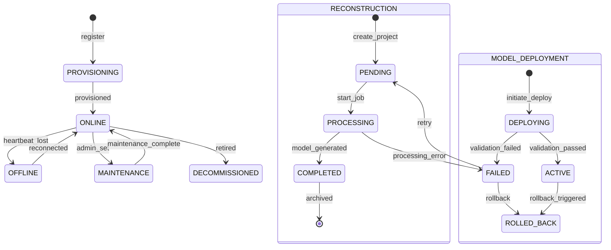

# Domain: Edge Computing & 3D Reconstruction

> **Document:** 10-edge-reconstruction-domain.md  
> **Version:** 1.0  
> **Status:** Draft  
> **Last Updated:** June 2026

---

## Overview

This domain manages **the edge computing infrastructure that powers real-time AI inference, and the 3D crime scene reconstruction pipeline** that synthesizes 360-degree video into interactive forensic models. It covers edge node lifecycle (deployment, configuration, health monitoring, model deployment), the 3D reconstruction pipeline (frame selection, feature matching, NeRF/3D Gaussian Splatting synthesis), evidence markers, scene measurements, and source file management.

It acts as the **edge infrastructure and advanced visualization domain** — bridging physical camera hardware with cloud processing and delivering immersive 3D investigative experiences.

---

## Use Cases

---

### UC-01: Provision Edge Node

- **Purpose**: Register and deploy a new edge compute node (NVIDIA Jetson Orin)
- **Actors**: Admin, Super Admin
- **Preconditions**: Edge hardware is physically installed and network-connected

#### Main Success Flow

1. Admin registers edge node with:
   - Unique node ID
   - Location (GPS coordinates)
   - Hardware specs (GPU, CPU, RAM)
   - Assigned cameras
2. System creates `edge_node` record
3. System generates device certificate (X.509) for mTLS
4. System deploys base configuration to edge node:
   - Docker containers (frame-grabber, ai-inference, edge-buffer)
   - Model artifacts (YOLOv8, ArcFace, ALPR)
   - Network configuration (Kafka endpoints, S3 endpoints)
5. System verifies node connectivity and runs health check
6. System deploys initial `edge_model_deployment` records
7. System emits `edge_node.provisioned` audit event

#### Result

Edge node registered, configured, and operational.

---

### UC-02: Deploy Model to Edge Node

- **Purpose**: Deploy or update an AI model on an edge node
- **Actors**: System (Model Registry), Admin
- **Preconditions**: Model version is in `production` status; edge node is online

#### Main Success Flow

1. MLflow promotes model version to production
2. System triggers model deployment to applicable edge nodes
3. System downloads model artifact from S3 (model's `s3_key`)
4. System verifies model SHA-256 hash
5. System creates `edge_model_deployment` record
6. System deploys model to edge node container:
   - Hot-reload if model supports it
   - Rolling restart if necessary
7. System runs validation inference on test data
8. System verifies model accuracy meets thresholds
9. On success: set deployment `status = 'active'`
10. On failure: rollback to previous model version
11. System emits `model.deployed_to_edge` audit event

#### Result

Model deployed to edge node; validation passed.

---

### UC-03: Monitor Edge Node Health

- **Purpose**: Track edge node operational status and performance metrics
- **Actors**: System (Health monitor)
- **Preconditions**: Edge node is provisioned

#### Main Success Flow

1. Edge node sends health metrics every 30 seconds:
   - GPU utilization, temperature, memory usage
   - Inference latency per model
   - Frame processing rate (FPS)
   - Disk usage, network throughput
   - Uptime, process status
2. System creates `edge_health_metric` records
3. System evaluates health against thresholds:
   - GPU temp > 85°C → warning
   - Inference latency > 2x baseline → warning
   - No heartbeat for 5 minutes → offline
4. System updates `edge_node` status based on health
5. If critical threshold exceeded → trigger alert
6. System emits `edge_node.health_updated` event

#### Result

Edge node health recorded; alerts triggered for anomalies.

---

### UC-04: Sync Edge Data to Cloud

- **Purpose**: Ensure buffered edge data is reliably transferred to cloud storage
- **Actors**: System (Edge sync worker)
- **Preconditions**: Edge node has buffered data; cloud connectivity is available

#### Main Success Flow

1. Edge node detects sync trigger (periodic or buffer threshold reached)
2. Edge node establishes secure connection (mTLS) to cloud
3. Edge node transfers data:
   - Detection events (JSON)
   - Frame metadata + embeddings
   - Buffered video clips (if incident-triggered)
4. System verifies data integrity (SHA-256 checksums)
5. System creates `edge_sync_record` for the batch
6. System acknowledges successful sync to edge node
7. Edge node clears acknowledged data from local buffer
8. System emits `edge.sync_completed` event

#### Alternate / Exception Flows

- Connection lost during sync → resume from last successful checkpoint
- Data corruption detected → request retransmission of affected batch

#### Result

Buffered edge data successfully synced to cloud.

---

### UC-05: Create 3D Reconstruction Project

- **Purpose**: Initiate a 3D crime scene reconstruction from 360-degree video
- **Actors**: Law Enforcement, Admin, Super Admin
- **Preconditions**: 360-degree video footage is available (minimum 2 camera angles)

#### Main Success Flow

1. User selects video segments and camera angles for reconstruction
2. User defines reconstruction parameters:
   - Quality preset (draft, standard, forensic)
   - Region of interest (spatial crop)
   - Time range (before/during/after incident)
3. System creates `reconstruction_project` record
4. System selects keyframes from source video (2 FPS)
5. System enqueues 3D reconstruction job (GPU batch, A100)
6. System returns project ID to user
7. System emits `reconstruction.created` audit event

#### Result

Reconstruction project created; processing job queued.

---

### UC-06: Generate 3D Model

- **Purpose**: Process 360-degree video into a 3D scene model
- **Actors**: System (3D Reconstruction Worker)
- **Preconditions**: Reconstruction project exists with keyframes extracted

#### Main Success Flow

1. Worker loads keyframes from S3
2. Pipeline executes:
   - Structure from Motion (SfM): feature matching, camera pose estimation
   - Multi-View Stereo (MVS): depth estimation
   - Neural Radiance Fields (NeRF) or 3D Gaussian Splatting: model synthesis
3. System post-processes model:
   - Mesh simplification (for web performance)
   - Texture mapping (4K resolution)
   - Dimension calibration (scale verification)
4. System stores model artifacts in S3 (`sentinel360-3d-models`):
   - glTF/GLB (web viewer)
   - PLY (point cloud)
   - OBJ + MTL (forensic tools)
5. System creates `reconstruction_asset` records
6. System updates project status to `completed`
7. System notifies requesting user
8. System emits `reconstruction.completed` audit event

#### Alternate / Exception Flows

- Insufficient camera coverage → status = `failed`, suggest additional angles
- Processing error → status = `failed`, logs available for debugging

#### Result

3D model generated and stored; user notified.

---

### UC-07: Add Evidence Marker to 3D Scene

- **Purpose**: Place evidence markers on the reconstructed scene for forensic analysis
- **Actors**: Law Enforcement, Investigator, Admin
- **Preconditions**: Reconstruction is complete and viewable

#### Main Success Flow

1. User opens 3D scene viewer
2. User places marker at specific 3D coordinates in the scene:
   - Marker type: shell_casing, weapon, blood_stain, footprint, object_of_interest
   - Label and description
   - Link to evidence item (if applicable)
3. System creates `evidence_marker` record
4. Marker appears on the 3D scene for all authorized viewers
5. System emits `reconstruction.marker_added` audit event

#### Result

Evidence marker placed at precise 3D location in the scene.

---

### UC-08: Perform Scene Measurement

- **Purpose**: Take accurate measurements within the 3D scene
- **Actors**: Law Enforcement, Investigator
- **Preconditions**: Reconstruction is complete and calibrated

#### Main Success Flow

1. User activates measurement tool in 3D viewer
2. User places measurement points in the 3D scene:
   - Distance between two points
   - Area of a polygon
   - Height of an object/person
3. System computes measurement in real-world units (meters, cm)
4. System records measurement as `scene_measurement`
5. Measurement is saved and visible to other investigators
6. System emits `reconstruction.measurement_added` audit event

#### Result

Accurate scene measurement recorded and displayed.

---

## Core Entities

---

### Entity: EdgeNode

- **Description**: An edge compute device (NVIDIA Jetson Orin) deployed at a camera site.

#### Fields

| Field | Type | Description |
|-------|------|-------------|
| `id` | UUID | Primary key |
| `node_id` | VARCHAR(100) | Unique hardware identifier |
| `name` | VARCHAR(200) | Human-readable name |
| `location` | GEOGRAPHY(Point) | GPS location |
| `location_address` | TEXT | Physical address |
| `hardware_specs` | JSONB | GPU, CPU, RAM, storage specs |
| `firmware_version` | VARCHAR(50) | Current firmware |
| `os_version` | VARCHAR(100) | Operating system version |
| `status` | VARCHAR(30) | provisioning, online, offline, maintenance, decommissioned |
| `last_heartbeat_at` | TIMESTAMPTZ | Last health check received |
| `certificate_serial` | VARCHAR(100) | X.509 certificate serial |
| `certificate_expires_at` | TIMESTAMPTZ | Certificate expiry |
| `ip_address` | INET | Node IP address |
| `public_key` | TEXT | Node's public key for mTLS |
| `is_active` | BOOLEAN | Whether node is operational |
| `created_by` | UUID | FK to users (provisioner) |
| `created_at` | TIMESTAMPTZ | Creation timestamp |
| `updated_at` | TIMESTAMPTZ | Last update |
| `deleted_at` | TIMESTAMPTZ | Soft delete |

#### Constraints

- `node_id` must be unique across all edge nodes

#### Relationships

- Has many `cameras` (cameras connected to this node)
- Has many `edge_model_deployments` (models deployed to this node)
- Has many `edge_health_metrics` (health data points)

---

### Entity: EdgeModelDeployment

- **Description**: Tracks which AI models are deployed to which edge nodes.

#### Fields

| Field | Type | Description |
|-------|------|-------------|
| `id` | UUID | Primary key |
| `edge_node_id` | UUID | FK to edge_node |
| `model_version_id` | UUID | FK to ai_model_versions |
| `model_name` | VARCHAR(100) | Model name for reference |
| `model_version` | VARCHAR(50) | Version string |
| `deployed_at` | TIMESTAMPTZ | When deployment occurred |
| `status` | VARCHAR(30) | deploying, active, failed, rolled_back |
| `rollback_version_id` | UUID | FK to previous ai_model_versions |
| `validation_passed` | BOOLEAN | Whether validation succeeded |
| `validation_metrics` | JSONB | Validation results |
| `deployed_by` | UUID | FK to users (deployer) |
| `created_at` | TIMESTAMPTZ | Creation timestamp |

---

### Entity: EdgeNodeConfig

- **Description**: Runtime configuration for an edge node.

#### Logical Fields

| Field | Type | Description |
|-------|------|-------------|
| `edge_node_id` | UUID | FK to edge_node |
| `config_key` | VARCHAR(200) | Configuration key |
| `config_value` | JSONB | Configuration value |
| `updated_by` | UUID | FK to users |
| `updated_at` | TIMESTAMPTZ | Last update |

---

### Entity: EdgeHealthMetric

- **Description**: Point-in-time health metrics from an edge node.

#### Fields

| Field | Type | Description |
|-------|------|-------------|
| `id` | UUID | Primary key |
| `edge_node_id` | UUID | FK to edge_node |
| `gpu_utilization_pct` | DECIMAL(5,2) | GPU utilization percentage |
| `gpu_temperature_c` | DECIMAL(5,2) | GPU temperature in Celsius |
| `gpu_memory_used_mb` | INTEGER | GPU memory usage |
| `gpu_memory_total_mb` | INTEGER | Total GPU memory |
| `cpu_utilization_pct` | DECIMAL(5,2) | CPU utilization |
| `memory_used_mb` | INTEGER | System memory usage |
| `memory_total_mb` | INTEGER | Total system memory |
| `disk_used_gb` | DECIMAL(10,2) | Disk usage |
| `disk_total_gb` | DECIMAL(10,2) | Total disk space |
| `inference_latency_ms` | JSONB | Per-model latency |
| `frames_processed_total` | BIGINT | Total frames processed |
| `frames_per_second` | DECIMAL(5,2) | Current FPS |
| `network_bytes_sent` | BIGINT | Outbound data since boot |
| `network_bytes_received` | BIGINT | Inbound data since boot |
| `uptime_seconds` | BIGINT | Node uptime |
| `process_status` | JSONB | Status of critical processes |
| `recorded_at` | TIMESTAMPTZ | When metric was recorded |

---

### Entity: EdgeSyncRecord

- **Description**: Records of data synchronization between edge node and cloud.

#### Fields

| Field | Type | Description |
|-------|------|-------------|
| `id` | UUID | Primary key |
| `edge_node_id` | UUID | FK to edge_node |
| `sync_type` | VARCHAR(30) | detections, frames, video_clips, logs |
| `batch_id` | VARCHAR(100) | Unique batch identifier |
| `record_count` | INTEGER | Number of records in batch |
| `data_size_bytes` | BIGINT | Size of synced data |
| `sha256_checksum` | VARCHAR(64) | Batch integrity hash |
| `status` | VARCHAR(30) | in_progress, completed, failed |
| `started_at` | TIMESTAMPTZ | Sync start |
| `completed_at` | TIMESTAMPTZ | Sync completion |
| `retry_count` | INTEGER | Number of retry attempts |
| `error_message` | TEXT | Error details if failed |
| `created_at` | TIMESTAMPTZ | Record creation |

---

### Entity: EdgeConfiguration

- **Description**: System-wide configuration template for edge nodes.

#### Logical Fields

| Field | Type | Description |
|-------|------|-------------|
| `id` | UUID | Primary key |
| `config_key` | VARCHAR(200) | Configuration key |
| `config_value` | JSONB | Configuration value |
| `description` | TEXT | Configuration description |
| `is_encrypted` | BOOLEAN | Whether value is encrypted |
| `applies_to_all` | BOOLEAN | Whether applies to all nodes |
| `created_at` | TIMESTAMPTZ | Creation timestamp |
| `updated_at` | TIMESTAMPTZ | Last update |

---

### Entity: ReconstructionProject

- **Description**: A 3D crime scene reconstruction project initiated by an investigator.

#### Fields

| Field | Type | Description |
|-------|------|-------------|
| `id` | UUID | Primary key |
| `case_id` | UUID | FK to cases (optional) |
| `title` | VARCHAR(300) | Project title |
| `description` | TEXT | Project description |
| `quality_preset` | VARCHAR(30) | draft, standard, forensic |
| `status` | VARCHAR(30) | pending, processing, completed, failed |
| `source_video_ids` | UUID[] | Source evidence IDs |
| `camera_count` | INTEGER | Number of camera angles used |
| `frame_count` | INTEGER | Number of keyframes processed |
| `region_of_interest` | JSONB | Spatial crop coordinates |
| `time_range_start` | TIMESTAMPTZ | Start of reconstruction window |
| `time_range_end` | TIMESTAMPTZ | End of reconstruction window |
| `reconstruction_method` | VARCHAR(50) | NeRF, 3DGS, SfM+MVS |
| `processing_duration_seconds` | DECIMAL(10,2) | Processing time |
| `error_message` | TEXT | Error details if failed |
| `created_by` | UUID | FK to users (requester) |
| `created_at` | TIMESTAMPTZ | Creation timestamp |
| `updated_at` | TIMESTAMPTZ | Last update |
| `deleted_at` | TIMESTAMPTZ | Soft delete |

#### Constraints

- Must have at least 2 source video files (minimum 2 camera angles)
- `status` must be one of: pending, processing, completed, failed

#### Relationships

- Has many `reconstruction_assets` (generated model files)
- Has many `evidence_markers` (annotations on the scene)
- Has many `scene_measurements` (recorded measurements)
- Has many `scene_annotations` (free-form annotations)
- Has many `source_files` (source video evidence)

---

### Entity: ReconstructionAsset

- **Description**: A generated 3D model file from a reconstruction project.

#### Fields

| Field | Type | Description |
|-------|------|-------------|
| `id` | UUID | Primary key |
| `project_id` | UUID | FK to reconstruction_project |
| `asset_type` | VARCHAR(30) | gltf_glb, pointcloud_ply, obj_mtl, mesh |
| `s3_key` | VARCHAR(512) | S3 object key |
| `cdn_url` | VARCHAR(512) | CDN delivery URL |
| `file_size_bytes` | BIGINT | File size |
| `sha256_hash` | VARCHAR(64) | Integrity hash |
| `vertex_count` | INTEGER | Mesh vertex count |
| `face_count` | INTEGER | Mesh face count |
| `texture_resolution` | VARCHAR(20) | Texture map resolution |
| `is_primary_viewer` | BOOLEAN | Primary asset for 3D viewer |
| `created_at` | TIMESTAMPTZ | Creation timestamp |

---

### Entity: EvidenceMarker

- **Description**: A point-of-interest marker placed on the 3D reconstruction scene.

#### Fields

| Field | Type | Description |
|-------|------|-------------|
| `id` | UUID | Primary key |
| `project_id` | UUID | FK to reconstruction_project |
| `evidence_id` | UUID | FK to evidence (optional, if linked) |
| `marker_type` | VARCHAR(50) | shell_casing, weapon, blood_stain, footprint, object_of_interest, general |
| `label` | VARCHAR(200) | Marker label |
| `description` | TEXT | Detailed description |
| `position_x` | DECIMAL(10,3) | 3D X coordinate |
| `position_y` | DECIMAL(10,3) | 3D Y coordinate |
| `position_z` | DECIMAL(10,3) | 3D Z coordinate |
| `color` | VARCHAR(20) | Display color |
| `icon` | VARCHAR(50) | Marker icon |
| `created_by` | UUID | FK to users |
| `created_at` | TIMESTAMPTZ | Creation timestamp |
| `deleted_at` | TIMESTAMPTZ | Soft delete |

---

### Entity: SceneMeasurement

- **Description**: A measurement recorded within the 3D scene.

#### Fields

| Field | Type | Description |
|-------|------|-------------|
| `id` | UUID | Primary key |
| `project_id` | UUID | FK to reconstruction_project |
| `measurement_type` | VARCHAR(30) | distance, area, height, angle |
| `label` | VARCHAR(200) | Measurement label |
| `value` | DECIMAL(10,3) | Measured value |
| `unit` | VARCHAR(20) | meters, cm, degrees |
| `points` | JSONB | Array of 3D points used |
| `created_by` | UUID | FK to users |
| `created_at` | TIMESTAMPTZ | Creation timestamp |

---

### Entity: SceneAnnotation

- **Description**: Free-form annotation on the 3D scene (text, drawing, highlight).

#### Logical Fields

| Field | Type | Description |
|-------|------|-------------|
| `id` | UUID | Primary key |
| `project_id` | UUID | FK to reconstruction_project |
| `annotation_type` | VARCHAR(30) | text_label, freehand_drawing, highlight_area, arrow |
| `content` | JSONB | Annotation data (text, path, area) |
| `position` | JSONB | 3D position/transform |
| `color` | VARCHAR(20) | Display color |
| `created_by` | UUID | FK to users |
| `created_at` | TIMESTAMPTZ | Creation timestamp |

---

### Entity: SourceFile

- **Description**: A source video file used as input for a reconstruction project.

#### Logical Fields

| Field | Type | Description |
|-------|------|-------------|
| `id` | UUID | Primary key |
| `project_id` | UUID | FK to reconstruction_project |
| `evidence_id` | UUID | FK to evidence (source video) |
| `camera_id` | VARCHAR(200) | Camera that captured this angle |
| `camera_angle` | DECIMAL(5,2) | Camera orientation |
| `file_duration_seconds` | DECIMAL(10,2) | Duration used |
| `frame_count` | INTEGER | Keyframes extracted |
| `created_at` | TIMESTAMPTZ | Creation timestamp |

---

## State Machines



---

### States

| State | Description |
|-------|-------------|
| `PROVISIONING` (edge) | Edge node being configured |
| `ONLINE` (edge) | Edge node operational |
| `OFFLINE` (edge) | Edge node not responding |
| `MAINTENANCE` (edge) | Edge node under maintenance |
| `DECOMMISSIONED` (edge) | Edge node retired |
| `PENDING` (reconstruction) | Project created, awaiting processing |
| `PROCESSING` (reconstruction) | 3D model generation in progress |
| `COMPLETED` (reconstruction) | Model successfully generated |
| `FAILED` (reconstruction) | Processing failed |
| `DEPLOYING` (model) | Model being deployed to edge |
| `ACTIVE` (model) | Model deployed and active |
| `ROLLED_BACK` (model) | Deployment reverted |

---

### Transitions & Guards

| From → To | Event | Condition |
|----------|-------|----------|
| PROVISIONING → ONLINE | `provisioned` | All services verified running |
| ONLINE → OFFLINE | `heartbeat_timeout` | No heartbeat for 5 minutes |
| OFFLINE → ONLINE | `reconnected` | Heartbeat received |
| ONLINE → MAINTENANCE | `set_maintenance` | Admin authorization |
| MAINTENANCE → ONLINE | `maintenance_done` | Health check passed |
| PENDING → PROCESSING | `start_job` | >= 2 source files available |
| PROCESSING → COMPLETED | `model_generated` | All pipeline stages succeeded |
| PROCESSING → FAILED | `processing_error` | Pipeline stage failed |
| DEPLOYING → ACTIVE | `validation_passed` | Accuracy meets thresholds |
| DEPLOYING → FAILED | `validation_failed` | Accuracy below threshold |
| FAILED → ROLLED_BACK | `rollback` | Previous version available |

---

## Business Rules (Invariants)

1. **Edge node identity**: Each edge node must have a unique hardware identifier and X.509 certificate.
2. **mTLS required**: All communication between edge nodes and cloud must use mutual TLS.
3. **Health monitoring**: Edge nodes must report health metrics every 30 seconds.
4. **Offline detection**: An edge node is marked offline after 5 minutes without heartbeat.
5. **Model validation**: Every model deployed to an edge node must pass validation inference before activation.
6. **Sync reliability**: Edge-to-cloud sync must use checksum verification and resume capability.
7. **3D reconstruction inputs**: Minimum 2 camera angles required; 4+ recommended for forensic quality.
8. **Accuracy calibration**: 3D reconstructions must achieve < 2cm error at 5m distance for forensic use.
9. **Evidence markers**: Markers placed on 3D scenes are immutable (no deletion after placement, only supersession).
10. **Asset versioning**: Reconstruction assets are versioned; previous versions preserved for audit.

---

## Processing Flows

### Edge Node Provisioning Flow

```
┌──────────┐     ┌──────────┐     ┌──────────┐     ┌──────────┐
│ Register │────►│ Generate │────►│ Deploy   │────►│ Verify   │
│ Node +   │     │ X.509    │     │ Base     │     │ Connect- │
│ Hardware │     │ Cert     │     │ Config   │     │ ivity    │
└──────────┘     └──────────┘     └──────────┘     └────┬─────┘
                                                         │
                                               ┌─────────▼─────────┐
                                               │ Deploy Models     │
                                               │ + Run Validation  │
                                               └───────────────────┘
```

### Model Deployment Flow

```
┌──────────┐     ┌──────────┐     ┌──────────┐     ┌──────────┐
│ Model    │────►│ Download │────►│ Verify   │────►│ Deploy   │
│ Promoted │     │ Artifact │     │ SHA-256  │     │ to Edge  │
│ (MLflow) │     │ from S3  │     │ Hash     │     │ Node     │
└──────────┘     └──────────┘     └──────────┘     └────┬─────┘
                                                         │
                                               ┌─────────▼─────────┐
                                               │ Run Validation    │
                                               │ Inference         │
                                               └─────────┬─────────┘
                                               ┌─────────▼─────────┐
                                               │ Pass?             │
                                               │  YES → Set Active │
                                               │  NO → Rollback    │
                                               └───────────────────┘
```

### 3D Reconstruction Pipeline

```
┌──────────┐     ┌──────────┐     ┌──────────┐     ┌──────────┐
│ Select   │────►│ Extract  │────►│ Structure│────►│ Multi-   │
│ Source   │     │ Keyframes│     │ from     │     │ View     │
│ Videos   │     │ (2 FPS)  │     │ Motion   │     │ Stereo   │
└──────────┘     └──────────┘     └──────────┘     └────┬─────┘
                                                         │
                                               ┌─────────▼─────────┐
                                               │ NeRF / 3DGS       │
                                               │ Model Synthesis   │
                                               └─────────┬─────────┘
                                               ┌─────────▼─────────┐
                                               │ Post-process:     │
                                               │ Mesh Simplify     │
                                               │ Texture Map       │
                                               │ Calibrate Scale   │
                                               └─────────┬─────────┘
                                               ┌─────────▼─────────┐
                                               │ Export Formats    │
                                               │ glTF + PLY + OBJ  │
                                               └───────────────────┘
```

### Health Monitoring Flow

```
┌──────────┐     ┌──────────┐     ┌──────────┐     ┌──────────┐
│ Edge     │────►│ Ingest   │────►│ Evaluate │────►│ Update   │
│ Heartbeat│     │ Metric   │     │ vs       │     │ Node     │
│ (30s)    │     │ Record   │     │ Threshold│     │ Status   │
└──────────┘     └──────────┘     └──────────┘     └────┬─────┘
                                                         │
                                              ┌──────────▼──────────┐
                                              │ Threshold Exceeded? │
                                              │  YES → Trigger Alert│
                                              │  NO → Continue      │
                                              └─────────────────────┘
```

---

## Interfaces

### List View (Edge Nodes)

- **Filters**: Status, location, model version, health score
- **Columns**: Node ID, Name, Location, Status, Last Heartbeat, Models Deployed, Uptime, Health Score
- **Map View**: Geographic placement of edge nodes with status indicators
- **Detail Drill-down**: Node details, connected cameras, deployed models, health history

### Detail View (Edge Node)

- **Hardware**: GPU/CPU/RAM specs, firmware version, OS
- **Status**: Current status, uptime, last heartbeat, health metrics
- **Models**: Deployed models with versions and validation status
- **Cameras**: Connected cameras with stream health
- **Health Charts**: GPU utilization, temperature, memory, FPS over time
- **Sync Status**: Recent sync records, data volume, pending syncs
- **Actions**: Update config, deploy model, reboot, set maintenance, decommission

### 3D Scene Viewer

- **Viewer**: Three.js / React Three Fiber with orbit controls
- **Toolbar**: Measure, Annotate, Add Marker, Screenshot, Export
- **Evidence Panel**: List of evidence markers with toggle visibility
- **Measurements**: Saved measurements with values
- **Timeline Slider**: Scrub through temporal reconstruction
- **Camera Positions**: Show camera frustums in 3D space
- **Path Trace**: Overlay suspect/vehicle movement paths

### Reconstruction Project Management

- **Filters**: Status, case, date range, quality preset
- **Columns**: Project Title, Case, Status, Camera Count, Method, Created, Duration
- **Actions**: View 3D Scene, Download Models, Retry (failed), Delete

---

## Notifications

| Event | Recipient | Channel | Message |
|-------|-----------|---------|---------|
| `edge_node.offline` | Admin | Push | "Edge node {name} at {location} is offline" |
| `edge_node.health_critical` | Admin | Push | "Edge node {name}: GPU temp critical ({temp}°C)" |
| `model.deployed_to_edge` | Admin | In-app | "Model {name} v{version} deployed to {node}" |
| `model.deployment_failed` | Admin | Push | "Model deployment failed: {reason}" |
| `reconstruction.completed` | Requester | In-app | "3D reconstruction ready: {project_title}" |
| `reconstruction.failed` | Requester | In-app | "3D reconstruction failed: {reason}" |

---

## Audit Logging

| Event | Description |
|-------|-------------|
| `edge_node.provisioned` | New edge node registered |
| `edge_node.config_updated` | Node configuration changed |
| `edge_node.status_changed` | Node online/offline/maintenance |
| `edge_node.decommissioned` | Node retired |
| `edge.sync_completed` | Edge data sync to cloud |
| `edge.sync_failed` | Edge data sync failed |
| `model.deployed_to_edge` | Model deployed to edge |
| `model.deployment_rolled_back` | Model deployment reverted |
| `reconstruction.created` | Reconstruction project created |
| `reconstruction.completed` | 3D model generated |
| `reconstruction.failed` | Reconstruction failed |
| `reconstruction.marker_added` | Evidence marker placed |
| `reconstruction.marker_removed` | Evidence marker removed |
| `reconstruction.measurement_added` | Scene measurement recorded |
| `reconstruction.annotation_added` | Scene annotation created |

---

## Invariants

1. Every edge node must have a unique hardware ID and valid X.509 certificate.
2. Edge-to-cloud communication must use mTLS at all times.
3. Health metrics must be reported every 30 seconds; 5-minute silence = offline.
4. Model deployments must pass validation inference before activation.
5. Edge data sync must verify checksums for every batch.
6. 3D reconstructions require a minimum of 2 camera angles.
7. Forensic-grade reconstructions must achieve < 2cm error at 5m distance.
8. Evidence markers on 3D scenes are immutable (append-only audit).
9. Reconstruction assets must be versioned with previous versions preserved.
10. All edge node and reconstruction actions must be audit-logged with actor identity.

---

## Key Decisions

| Decision | Choice | Rationale |
|----------|--------|-----------|
| **Edge hardware** | NVIDIA Jetson Orin (32GB) | Sufficient GPU for multi-model inference |
| **Edge OS** | Ubuntu 22.04 + Docker | Standard, well-supported, containerized apps |
| **Device auth** | X.509 certificates (mTLS) | Industry standard for IoT device identity |
| **Model format** | ONNX + TensorRT | Optimized for Jetson GPU inference |
| **3D method** | NeRF (quality) / 3D Gaussian Splatting (speed) | Choice based on use case requirements |
| **Web viewer** | Three.js / React Three Fiber | Browser-based, no plugins required |
| **Model registry** | MLflow | Open source, experiment tracking, versioning |
| **Sync protocol** | Kafka (real-time) + S3 (batch) | Low-latency for events; reliable for bulk data |

---

## Optional Extensions

- Edge node auto-scaling (provision new nodes based on coverage demand)
- Meshroom/COLMAP integration as alternative reconstruction pipeline
- Real-time 3D streaming (WebRTC) for live scene viewing
- AI-assisted evidence marker suggestion (auto-detect objects of interest)
- Multi-user collaboration in 3D scene (synchronized viewing)
- Photogrammetry from drone footage integration
- Edge node over-the-air (OTA) firmware updates
- Thermal camera integration for heat signature analysis in 3D scenes
