# Sentinel360 — Database Schema Design

> **Document:** 07-DATABASE/01-schema-design.md  
> **Version:** 1.0  
> **Status:** Draft  
> **Last Updated:** June 2026

---

## Table of Contents

1. [Design Principles](#design-principles)
2. [Technology Stack & Key Decisions](#technology-stack--key-decisions)
3. [Entity Summary by Domain](#entity-summary-by-domain)
4. [Entity Relationship Diagram](#entity-relationship-diagram)
5. [Index Strategy Overview](#index-strategy-overview)
6. [Partitioning Strategy](#partitioning-strategy)
7. [Revision History](#revision-history)

---

## Design Principles

The Sentinel360 database schema is governed by six core design principles, each rooted in the operational requirements of a law-enforcement-grade surveillance and case-management platform.

### 1. Normalized to Third Normal Form (3NF)

All relational data is normalized to 3NF to eliminate redundancy and maintain referential integrity. JSONB is used **only** where the schema is genuinely variable:

- **Physical descriptions** on `criminal_profiles` (`physical_description` JSONB) — because the attributes differ per person
- **Risk factors** on `profile_threat_assessments` (`risk_factors` JSONB) — because assessments have variable numbers of factors
- **Metadata** on `audit_logs`, `evidence_chain_of_custody`, `case_activity_logs` — because structured context varies by action
- **Config values** on `system_configuration` (`config_value` JSONB) — because configuration payloads differ by key

All core entity fields (names, dates, FKs, statuses) use strict typed columns.

### 2. Immutable Audit Trail

The `audit_logs` table is **append-only**. Once written, a row is never updated or deleted. This guarantees:

- A complete, non-repudiable history of every action in the system
- Compliance with legal discovery and subpoena requirements
- Forensic traceability for internal investigations

Write access to `audit_logs` is restricted to the **Audit Service** exclusively — no application code outside the audit layer may insert rows.

### 3. Cryptographic Integrity

Every piece of evidence stored in the system carries a **SHA-256 hash** of its file content (`sha256_hash`). The `evidence_chain_of_custody` table forms a **cryptographic linked list**:

```
current_hash = SHA256(previous_hash + evidence_id + action + user_id + timestamp)
```

This provides:

- **Tamper detection** — any modification invalidates the hash chain
- **Evidence admissibility** — meets forensics standards for chain of custody
- **Immutable provenance** — every access, transfer, or modification is permanently recorded

### 4. Domain Namespacing

Tables are prefixed by their owning domain module to create clear ownership boundaries and prevent naming collisions:

| Prefix | Domain |
|--------|--------|
| `user_` / `role_` | Users & Authentication |
| `profile_` | Criminal Profiles |
| `case_` | Cases / Dockets |
| `evidence_` | Evidence |
| `sighting_` | Sightings |
| `alert_` | Alerts & Notifications |
| `audit_` | Audit Logs |
| `ai_` | AI / ML Models |
| `alpr_` | License Plate Recognition |

Unprefixed core tables (`users`, `roles`, `cases`, `evidence`, `sightings`, `alerts`) represent the root entity of each domain.

### 5. Soft Deletes

Destructive operations are **logged, not executed**. Every major entity carries a `deleted_at TIMESTAMPTZ` column:

```sql
deleted_at TIMESTAMPTZ  -- NULL = active, non-NULL = deleted
```

All queries on soft-deletable tables are filtered via partial indexes:

```sql
CREATE INDEX idx_evidence_status ON evidence(status) WHERE deleted_at IS NULL;
```

This provides:

- Point-in-time recovery of accidentally deleted records
- Audit trail of deletions (who deleted what, when)
- Cascading restores during incident reconstruction

### 6. Temporal Tracking

Every table has `created_at` and `updated_at` timestamps. Critical tables additionally carry **valid-time dimensions** for temporal queries:

| Table | Temporal Columns | Purpose |
|-------|-----------------|---------|
| `profile_known_associates` | `valid_from`, `valid_to` | Track when associations were active |
| `profile_threat_assessments` | `valid_from`, `valid_to`, `is_current` | Threat level history |
| `case_timeline_entries` | `occurred_at` | When the event actually happened |
| `sightings` | `observed_at` | When the person was actually seen |
| `audit_logs` | `created_at` (partition key) | Time-based partitioning |

---

## Technology Stack & Key Decisions

### Core Database: PostgreSQL 17

**Managed via Supabase** on a dedicated project instance.

| Attribute | Decision |
|-----------|----------|
| **Engine** | PostgreSQL 17 (latest stable) |
| **Hosting** | Supabase Managed — dedicated project (not shared) |
| **Tier** | Supabase Pro / Team (scales with data volume) |
| **Region** | Closest to primary deployment region (e.g., `eu-west-1`, `us-east-1`) |
| **Point-in-Time Recovery** | Enabled — 7-day recovery window |
| **Connection Pooling** | Supabase internal pooler (`transaction` mode, pool size: 20) |
| **SSL Enforcement** | Enforced for all connections |

### Extensions

| Extension | Version | Purpose |
|-----------|---------|---------|
| `pgcrypto` | Built-in | UUID generation, cryptographic hashing |
| `PostGIS` | 3.4+ | Geospatial types (`GEOGRAPHY`, `GEOMETRY`), spatial indexes (GIST) |
| `pgvector` | 0.7+ | Vector similarity search for face embeddings |

### Why Supabase Managed?

| Factor | Assessment |
|--------|------------|
| **Operational overhead** | Zero — automated backups, failover, patching |
| **Auth integration** | Native Supabase Auth for user management; custom `users` table for app-level roles |
| **Realtime** | Built-in real-time subscriptions for alerts and sightings |
| **Storage** | Supabase Storage for evidence files (S3-compatible) |
| **Edge Functions** | Deno-based edge functions for AI inference callbacks |
| **Migration tooling** | Native Supabase CLI migrations (`supabase migration`) |
| **Cost efficiency** | No separate RDS instance to manage; bundled in Supabase plan |

### Why Not Alternatives?

| Option | Reason Against |
|--------|----------------|
| **AWS RDS PostgreSQL** | Higher operational overhead; no built-in realtime or auth |
| **Neon** | Excellent serverless PostgreSQL but lacks built-in storage/edge functions |
| **PlanetScale (MySQL)** | No PostGIS or pgvector; MySQL ecosystem not suited for GIS workloads |
| **MongoDB / Document DB** | Relational integrity is critical for case management; 3NF is a hard requirement |

---

## Entity Summary by Domain

The schema comprises approximately **67 tables** across **14 domains**. Below is the full inventory grouped by domain, combining the target architecture schema with supporting tables carried forward from the existing migration baseline.

### 1. Users & Authentication (8 tables)

| # | Table | Description | Source |
|---|-------|-------------|--------|
| 1 | `users` | Core user table — all roles (community, security, LE, admin) | Architecture |
| 2 | `roles` | Role definitions (community, security_operator, law_enforcement, admin, super_admin) | Architecture |
| 3 | `user_roles` | Many-to-many user-to-role assignment with revocation tracking | Architecture |
| 4 | `role_permissions` | Role-based access control — resource/action pairs with optional RLS conditions | Architecture |
| 5 | `user_sessions` | Refresh token tracking, device info, revocation | Architecture |
| 6 | `organizations` | Tenant organisations (security companies, police departments, community groups) | Architecture |
| 7 | `law_enforcement_officer` | LE-specific attributes (badge number, department, clearance level) | Existing |
| 8 | `officer_verification` | Verification workflow for law enforcement credentials | Existing |

### 2. Criminal Profiles (7 tables)

| # | Table | Description | Source |
|---|-------|-------------|--------|
| 9 | `criminal_profiles` | Central person-of-interest record — core identity, risk, status, location | Architecture |
| 10 | `profile_biometrics` | Biometric data (face embeddings via pgvector, fingerprints, iris) | Architecture |
| 11 | `profile_photos` | Photo gallery with SHA-256 integrity, CDN URLs, source tracking | Architecture |
| 12 | `profile_aliases` | Known aliases, nicknames, street names, former names | Architecture |
| 13 | `profile_known_associates` | Association graph — accomplices, family, gang members (temporal) | Architecture |
| 14 | `profile_last_locations` | Geo-tagged location history (point-in-time) with source attribution | Architecture |
| 15 | `profile_threat_assessments` | Threat level evaluations with temporal validity and risk factors | Architecture |

### 3. Cases / Dockets (7 tables)

| # | Table | Description | Source |
|---|-------|-------------|--------|
| 16 | `cases` | Case records — incident details, investigator assignment, jurisdiction | Architecture |
| 17 | `case_criminals` | Case-to-person linking (suspect, POI, witness, victim, arrested) | Architecture |
| 18 | `case_evidence` | Case-to-evidence linking with relevance notes and ordering | Architecture |
| 19 | `case_timeline_entries` | Temporal case timeline (incidents, arrests, evidence additions) | Architecture |
| 20 | `case_activity_logs` | Activity stream for each case (status changes, assignments) | Architecture |
| 21 | `case_notes` | Investigative notes (public/private) with edit tracking | Architecture |
| 22 | `case_report` | Generated case reports (PDF, DOCX) with file hash integrity | Existing |

### 4. Evidence (3 tables)

| # | Table | Description | Source |
|---|-------|-------------|--------|
| 23 | `evidence` | Core evidence — file metadata, SHA-256 hash, chain position, AI metadata, geo | Architecture |
| 24 | `evidence_chain_of_custody` | Cryptographic chain-of-custody ledger (linked-list hash chain) | Architecture |
| 25 | `evidence_tags` | Tag-based classification for evidence | Architecture |

### 5. Sightings (5 tables)

| # | Table | Description | Source |
|---|-------|-------------|--------|
| 26 | `sightings` | Community/officer-reported sightings with AI matching pipeline | Architecture |
| 27 | `sighting_media` | Photo/video attachments for sightings with SHA-256 | Architecture |
| 28 | `sighting_verifications` | Verification decisions (verified, duplicate, false_report) | Architecture |
| 29 | `community_sighting` | Extended community sighting report with moderation | Existing |
| 30 | `anonymous_tip` | Anonymous tip submissions with case linkage | Existing |

### 6. Alerts & Notifications (5 tables)

| # | Table | Description | Source |
|---|-------|-------------|--------|
| 31 | `alerts` | Alert records — type, severity, geo-targeting, expiry, source linking | Architecture |
| 32 | `alert_recipients` | Per-user alert delivery status (read, acknowledged, dismissed) | Architecture |
| 33 | `alert_delivery_logs` | Channel-level delivery tracking (push, email, SMS) with retries | Architecture |
| 34 | `notification` | Notification message queue per recipient per alert | Existing |
| 35 | `alert_acknowledgment` | Audit trail of alert acknowledgment actions | Existing |

### 7. Audit & Integrity (3 tables)

| # | Table | Description | Source |
|---|-------|-------------|--------|
| 36 | `audit_logs` | **Immutable** — append-only audit trail, partitioned by month | Architecture |
| 37 | `chain_of_custody` | General chain-of-custody records (prior to evidence-specific refactor) | Existing |
| 38 | `evidence_integrity_check` | Scheduled integrity verification results | Existing |

### 8. AI / Machine Learning (5 tables)

| # | Table | Description | Source |
|---|-------|-------------|--------|
| 39 | `ai_model_versions` | Model registry — versions, metrics, artifacts, lifecycle | Architecture |
| 40 | `ai_inference_results` | Inference output — detections, embeddings, matches | Architecture |
| 41 | `detection` | Raw detection events from AI models | Existing |
| 42 | `detection_configuration` | Per-camera/zone detection settings | Existing |
| 43 | `media_annotation` | Human and AI annotations on media assets | Existing |

### 9. Media & Cameras (4 tables)

| # | Table | Description | Source |
|---|-------|-------------|--------|
| 44 | `media_asset` | Media file registry (video, images) with storage URLs and processing status | Existing |
| 45 | `media_metadata` | Extracted metadata from media files | Existing |
| 46 | `camera` | Camera registry — location, stream URL, capabilities, status | Existing |
| 47 | `monitoring_zone` | Geofenced monitoring zones with detection configuration | Existing |

### 10. Entity Intelligence (5 tables)

| # | Table | Description | Source |
|---|-------|-------------|--------|
| 48 | `entity_profile` | Cross-domain entity profiles (persons, vehicles) with attributes | Existing |
| 49 | `entity_match` | Match records between known entities and new detections | Existing |
| 50 | `watchlist_entry` | Watchlist management — priority, reason, expiry, case linkage | Existing |
| 51 | `entity_track` | Entity movement tracks across cameras and zones | Existing |
| 52 | `geofence` | Geofence boundaries with rules, entity filters, and enable/disable | Existing |

### 11. Infrastructure & Edge (4 tables)

| # | Table | Description | Source |
|---|-------|-------------|--------|
| 53 | `edge_node` | Edge device registry — hardware specs, network address, status | Existing |
| 54 | `edge_model_deployment` | AI model deployment tracking per edge node | Existing |
| 55 | `edge_health_metric` | Edge device health telemetry (CPU, memory, FPS, latency) | Existing |
| 56 | `infrastructure_environment` | Environment definitions (dev, staging, prod) with service registry | Existing |

### 12. External Integrations (3 tables)

| # | Table | Description | Source |
|---|-------|-------------|--------|
| 57 | `external_integration` | Third-party system connections (SAPS, Interpol, private security) | Existing |
| 58 | `webhook_config` | Webhook subscriptions with event type filters | Existing |
| 59 | `api_key` | API key management for integration authentication | Existing |

### 13. System & Configuration (4 tables)

| # | Table | Description | Source |
|---|-------|-------------|--------|
| 60 | `system_configuration` | Key-value configuration store with encryption support | Architecture |
| 61 | `feature_flag` | Feature toggle management with rollout percentage | Existing |
| 62 | `security_policy` | Security policy definitions (password rules, session limits) | Existing |
| 63 | `retention_policy` | Data retention schedules per category | Existing |

### 14. 3D Reconstruction (4 tables)

| # | Table | Description | Source |
|---|-------|-------------|--------|
| 64 | `reconstruction_project` | 3D scene reconstruction project metadata | Existing |
| 65 | `reconstruction_asset` | 3D model assets (point clouds, meshes, textures) | Existing |
| 66 | `evidence_marker` | 3D evidence markers with spatial coordinates | Existing |
| 67 | `scene_measurement` | Scene measurements (distances, angles, areas) | Existing |

---

## Entity Relationship Diagram

```mermaid
erDiagram
    %% ======================
    %% USERS & AUTH
    %% ======================
    users ||--o{ user_roles : "has"
    users ||--o{ user_sessions : "has"
    users ||--o{ audit_logs : "performs"
    users ||--o{ law_enforcement_officer : "verified as"
    roles ||--o{ user_roles : "assigned to"
    roles ||--o{ role_permissions : "grants"
    law_enforcement_officer ||--o{ officer_verification : "undergoes"
    organizations ||--o{ users : "belongs to"

    %% ======================
    %% CRIMINAL PROFILES
    %% ======================
    criminal_profiles ||--o{ profile_biometrics : "has biometrics"
    criminal_profiles ||--o{ profile_photos : "has photos"
    criminal_profiles ||--o{ profile_aliases : "has aliases"
    criminal_profiles ||--o{ profile_known_associates : "has associates"
    criminal_profiles ||--o{ profile_last_locations : "tracked at"
    criminal_profiles ||--o{ profile_threat_assessments : "assessed"
    criminal_profiles ||--o{ case_criminals : "linked to cases"
    criminal_profiles ||--o{ evidence : "appears in"
    criminal_profiles ||--o{ sightings : "sighted in"
    criminal_profiles ||--o{ ai_inference_results : "matched by AI"
    criminal_profiles ||--o{ alpr_records : "vehicle linked"
    criminal_profiles ||--o{ watchlist_entry : "watchlisted"
    criminal_profiles ||--o{ entity_profile : "merged with"

    %% ======================
    %% CASES
    %% ======================
    cases ||--o{ case_criminals : "involves"
    cases ||--o{ case_evidence : "contains"
    cases ||--o{ case_timeline_entries : "has timeline"
    cases ||--o{ case_activity_logs : "tracks activity"
    cases ||--o{ case_notes : "has notes"
    cases ||--o{ alerts : "generates"
    cases ||--o{ case_report : "has reports"
    cases }o--|| users : "assigned investigator"
    cases ||--o{ case_share_record : "shared with"

    %% ======================
    %% EVIDENCE
    %% ======================
    evidence ||--o{ evidence_chain_of_custody : "custody trail"
    evidence ||--o{ case_evidence : "linked to cases"
    evidence ||--o{ evidence_tags : "tagged as"
    evidence ||--o{ ai_inference_results : "analysed by AI"
    evidence ||--o{ evidence_integrity_check : "integrity verified"

    %% ======================
    %% SIGHTINGS
    %% ======================
    sightings ||--o{ sighting_media : "includes media"
    sightings ||--o{ sighting_verifications : "verified by"
    sightings ||--o{ community_sighting : "extends"
    sightings }o--|| users : "submitted by"
    sightings }o--o| criminal_profiles : "possibly matches"

    %% ======================
    %% ALERTS
    %% ======================
    alerts ||--o{ alert_recipients : "sent to"
    alerts ||--o{ alert_delivery_logs : "delivery records"
    alerts ||--o{ notification : "triggers"
    alerts ||--o{ alert_acknowledgment : "acknowledged by"
    alerts }o--|| users : "created by"
    alerts }o--|| cases : "related to"
    alerts }o--|| criminal_profiles : "about"

    %% ======================
    %% AI
    %% ======================
    ai_model_versions ||--o{ ai_inference_results : "produced by"
    ai_model_versions ||--o{ detection : "powers"
    ai_inference_results ||--o{ evidence : "analyses"
    ai_inference_results }o--|| criminal_profiles : "matches"
    detection ||--o{ media_asset : "detects in"
    detection_configuration ||--o{ detection : "configures"
    camera ||--o{ detection : "captured by"
    monitoring_zone ||--o{ detection : "within zone"

    %% ======================
    %% MEDIA & CAMERAS
    %% ======================
    media_asset ||--o{ media_metadata : "has metadata"
    media_asset ||--o{ media_annotation : "annotated"
    media_asset ||--o{ detection : "detections from"
    camera ||--o{ monitoring_zone : "assigned to zone"

    %% ======================
    %% ENTITY INTELLIGENCE
    %% ======================
    entity_profile ||--o{ entity_match : "matched"
    entity_profile ||--o{ watchlist_entry : "on watchlist"
    entity_profile ||--o{ entity_track : "tracked"
    entity_track ||--o{ geofence : "intersects"
    geofence ||--o{ geofence_violation : "violated"

    %% ======================
    %% EDGE & INFRASTRUCTURE
    %% ======================
    edge_node ||--o{ edge_model_deployment : "deploys models"
    edge_node ||--o{ edge_health_metric : "reports health"
    infrastructure_environment ||--o{ service_instance : "hosts services"

    %% ======================
    %% INTEGRATIONS
    %% ======================
    external_integration ||--o{ webhook_config : "webhook endpoints"
    external_integration ||--o{ api_key : "API credentials"

    %% ======================
    %% 3D RECONSTRUCTION
    %% ======================
    reconstruction_project ||--o{ reconstruction_asset : "builds assets"
    reconstruction_project ||--o{ evidence_marker : "places markers"
    reconstruction_project ||--o{ scene_measurement : "records measurements"
```



---

## Index Strategy Overview

The index strategy is designed to balance read performance for common query patterns against write overhead on high-volume tables.

### Index Inventory

| Index Type | Count | Typical Use | Examples |
|-----------|-------|-------------|---------|
| **B-tree (Primary Key)** | ~67 | PK lookups on every table | `id UUID PRIMARY KEY` |
| **B-tree (Unique)** | ~15 | Uniqueness constraints | `email`, `case_number`, `reference_number` |
| **B-tree (Foreign Key)** | ~50 | FK join acceleration | `CREATE INDEX idx_evidence_case ON case_evidence(case_id)` |
| **B-tree (Filtered/Sorted)** | ~30 | Common filtered queries | `created_at DESC`, `status WHERE deleted_at IS NULL` |
| **GIST (Geospatial)** | 7 | Location-based queries | `USING GIST(location)`, `USING GIST(last_known_location)` |
| **IVFFlat (pgvector)** | 2 | Face embedding similarity search | `USING ivfflat (embedding_vector vector_cosine_ops)` |
| **Partial (WHERE clause)** | ~20 | Active-record filtering | `WHERE deleted_at IS NULL`, `WHERE is_active = TRUE` |
| **Composite** | ~10 | Multi-column query patterns | `(profile_id, noted_at DESC)`, `(user_id, created_at DESC)` |
| **Partitioning** | 1 | Time-based partitioning | `audit_logs PARTITION BY RANGE (created_at)` |

### Index Design Rules

1. **Every FK gets an index** — no unindexed foreign key columns
2. **Soft-delete tables get partial indexes** — all query paths filter `WHERE deleted_at IS NULL`
3. **GIST indexes use partial WHERE** — `WHERE deleted_at IS NULL` to keep index size manageable
4. **pgvector indexes target specific types** — `WHERE biometric_type = 'face_embedding'` limits index scope
5. **Descending order on time-series columns** — `created_at DESC`, `observed_at DESC` for recent-first queries
6. **Composite indexes for common join+sort patterns** — e.g., `(profile_id, noted_at DESC)` for location history
7. **No over-indexing** — write-heavy tables (audit_logs, ai_inference_results) keep index count under 5

### pgvector Configuration

```sql
-- Face embedding index: 512-dim ArcFace embeddings
-- Lists = sqrt(number_of_rows) recommended for IVFFlat
CREATE INDEX idx_profile_biometrics_embedding
    ON profile_biometrics
    USING ivfflat (embedding_vector vector_cosine_ops)
    WITH (lists = 100)
    WHERE biometric_type = 'face_embedding';

-- Inference embedding index (same schema, fewer rows expected)
CREATE INDEX idx_ai_inference_embedding
    ON ai_inference_results
    USING ivfflat (embedding_vector vector_cosine_ops)
    WITH (lists = 50);
```

> **Note:** For production at scale (>1M embeddings), consider migrating from IVFFlat to HNSW (supported in pgvector 0.8+) for better recall.

---

## Partitioning Strategy

### Target: `audit_logs`

The `audit_logs` table is the only partitioned table in the schema, justified by:

- **Write volume**: Expected 10k–100k+ rows/day across all services
- **Query pattern**: Almost exclusively recent-date queries (last 30–90 days)
- **Retention requirements**: Legal hold may require retaining data for 5+ years
- **Maintenance**: Older partitions can be detached, compressed, or archived

### Partition Scheme

```sql
CREATE TABLE audit_logs (
    id              UUID PRIMARY KEY DEFAULT gen_random_uuid(),
    user_id         UUID REFERENCES users(id),
    user_role       VARCHAR(50),
    action          VARCHAR(100) NOT NULL,
    resource_type   VARCHAR(100) NOT NULL,
    resource_id     UUID,
    description     TEXT,
    metadata        JSONB,
    ip_address      INET NOT NULL,
    user_agent      TEXT,
    session_id      UUID,
    request_id      UUID,
    geographic_location GEOGRAPHY(Point, 4326),
    created_at      TIMESTAMPTZ NOT NULL DEFAULT NOW()
) PARTITION BY RANGE (created_at);
```

### Partition Management

| Aspect | Strategy |
|--------|----------|
| **Granularity** | Monthly partitions (`audit_logs_YYYY_MM`) |
| **Retention** | Last 24 months hot; older partitions detached to archival storage |
| **Creation** | Automated via `pg_cron` — create next month's partition on the 25th of each month |
| **Archival** | Detached partitions stored as compressed CSV in S3 for compliance |
| **Legal hold** | Individual partitions can be kept beyond retention if under hold order |

### Partition Creation Procedure

```sql
-- Automated cron job (runs monthly)
CREATE OR REPLACE FUNCTION create_next_audit_partition()
RETURNS void AS $$
DECLARE
    next_month      DATE := date_trunc('month', NOW()) + INTERVAL '1 month';
    partition_name  TEXT := 'audit_logs_' || to_char(next_month, 'YYYY_MM');
    start_date      TEXT := to_char(next_month, 'YYYY-MM-DD');
    end_date        TEXT := to_char(next_month + INTERVAL '1 month', 'YYYY-MM-DD');
BEGIN
    EXECUTE format(
        'CREATE TABLE IF NOT EXISTS %I PARTITION OF audit_logs
         FOR VALUES FROM (%L) TO (%L)',
        partition_name, start_date, end_date
    );
END;
$$ LANGUAGE plpgsql;

SELECT cron.schedule('create-audit-partition', '0 0 25 * *',
    'SELECT create_next_audit_partition()');
```

### Seed Partitions (Initial Setup)

```sql
-- Pre-create 6 months of partitions during initial migration
CREATE TABLE audit_logs_2026_06 PARTITION OF audit_logs
    FOR VALUES FROM ('2026-06-01') TO ('2026-07-01');
CREATE TABLE audit_logs_2026_07 PARTITION OF audit_logs
    FOR VALUES FROM ('2026-07-01') TO ('2026-08-01');
CREATE TABLE audit_logs_2026_08 PARTITION OF audit_logs
    FOR VALUES FROM ('2026-08-01') TO ('2026-09-01');
CREATE TABLE audit_logs_2026_09 PARTITION OF audit_logs
    FOR VALUES FROM ('2026-09-01') TO ('2026-10-01');
CREATE TABLE audit_logs_2026_10 PARTITION OF audit_logs
    FOR VALUES FROM ('2026-10-01') TO ('2026-11-01');
CREATE TABLE audit_logs_2026_11 PARTITION OF audit_logs
    FOR VALUES FROM ('2026-11-01') TO ('2026-12-01');
```

### Consideration for Future Partitioning

As the platform scales, these tables are candidates for partitioning:

| Table | Partition Key | Rationale | Timeline |
|-------|---------------|-----------|----------|
| `ai_inference_results` | `created_at` (monthly) | High-volume write table; queries are time-windowed | Q3 2026 |
| `sightings` | `observed_at` (monthly) | Growing with community adoption | Q4 2026 |
| `profile_last_locations` | `noted_at` (monthly) | Very high write volume from tracking | Q4 2026 |

---

## Revision History

| Version | Date | Author | Changes |
|---------|------|--------|---------|
| 1.0 | June 2026 | Technical Writer | Initial schema design document |
