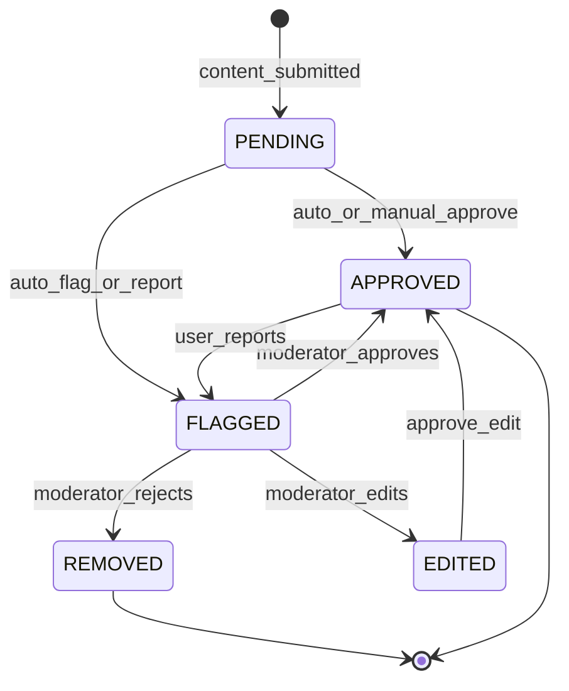

# Administration Domain

## Overview

This domain handles **platform administration for managing user profiles, content moderation, system configuration, and operational oversight**, including **user account management, role and permission administration, content moderation workflows, system settings configuration, and operational reporting**.

It acts as **a user interface domain** for administrators who manage the day-to-day operations of the Sentinel360 platform, ensuring user accounts are properly managed, content is moderated, and system settings are correctly configured.

---

## Use Cases

---

### UC-AD-01: Manage User Accounts

- **Purpose**: View, edit, and manage all user accounts on the platform
- **Actors**: Administrator
- **Preconditions**: Actor has `MANAGE_USERS` permission

#### Main Success Flow

1. Admin accesses user management panel
2. Admin searches/filters users by name, email, role, status
3. Admin views user detail including profile, roles, activity, and audit history
4. Admin performs account actions:
   - Edit profile details
   - Assign/revoke roles
   - Suspend or reactivate accounts
   - Reset passwords (send reset link)
   - Force logout (revoke all sessions)
5. System applies changes via Identity & Access domain
6. System records audit log

#### Alternate / Exception Flows

- **Cannot modify Super Admin** → Only Super Admins can modify other Super Admins
- **Self-modification limited** → Admins cannot change their own roles

#### Result

User account managed; changes applied and audited.

---

### UC-AD-02: Moderate Community Content

- **Purpose**: Review and moderate community-submitted content (sightings, tips, comments)
- **Actors**: Administrator
- **Preconditions**: Actor has `MODERATE_CONTENT` permission

#### Main Success Flow

1. Admin accesses moderation queue
2. System presents content flagged by automated moderation or user reports
3. Admin reviews content (text, images, video)
4. Admin takes action:
   - **Approve**: Content passes moderation and is published
   - **Reject**: Content is removed with reason
   - **Edit**: Content is modified to remove problematic portions
   - **Flag user**: Flag the submitting user for pattern of violations
5. System updates content moderation status
6. System notifies the content author if rejected
7. System records audit log

#### Alternate / Exception Flows

- **Content already moderated** → Show current moderation status
- **User previously flagged** → Show flag history for context

#### Result

Content moderated; appropriate action taken and audited.

---

### UC-AD-03: Configure System Settings

- **Purpose**: Manage platform-wide configuration settings
- **Actors**: Administrator
- **Preconditions**: Actor has `MANAGE_SETTINGS` permission

#### Main Success Flow

1. Admin accesses system configuration panel
2. Admin views current settings organized by category:
   - AI detection thresholds
   - Retention policies
   - Notification defaults
   - Security policies (password complexity, session timeouts)
   - Rate limits
   - Feature flags
3. Admin modifies a setting
4. System validates the new value
5. System applies the change (some may require restart)
6. System emits `SETTING_CHANGED` event
7. System records audit log with before/after values

#### Alternate / Exception Flows

- **Invalid value** → 422 with validation error
- **Setting requires restart** → Warning: "This change requires system restart to take effect"
- **Critical setting** → Require confirmation dialog

#### Result

System setting updated; change audited with before/after snapshot.

---

### UC-AD-04: View Operational Dashboard

- **Purpose**: Monitor platform health, usage, and key operational metrics
- **Actors**: Administrator
- **Preconditions**: Actor has `VIEW_DASHBOARD` permission

#### Main Success Flow

1. Admin opens the operational dashboard
2. System displays:
   - Active users (current, daily, monthly)
   - Incident and case statistics
   - AI detection metrics (detections, false positive rate, review SLA)
   - Storage usage and growth
   - Integration health
   - System performance metrics
   - Alert volume and response times
3. Admin can drill down into specific metrics

#### Alternate / Exception Flows

- **Metrics service unavailable** → Show cached data with staleness indicator

#### Result

Operational dashboard displayed with current platform metrics.

---

### UC-AD-05: Manage Retention Policies

- **Purpose**: Configure data retention policies for media and records
- **Actors**: Administrator
- **Preconditions**: Actor has `MANAGE_RETENTION` permission

#### Main Success Flow

1. Admin views existing retention policies
2. Admin creates or edits a policy: name, retention period, archive period, deletion period, applies to
3. System validates policy parameters
4. System persists the policy via Data Management domain
5. System applies the policy to matching media assets
6. System records audit log

#### Alternate / Exception Flows

- **Cannot shorten below legal minimum** → 422: "Minimum retention period is {days} days"
- **Active legal holds exist** → Warning: "Policy changes will not affect items under legal hold"

#### Result

Retention policy updated; applied to matching assets.

---

### UC-AD-06: Manage Officer Verification Requests

- **Purpose**: Review and process law enforcement officer verification requests
- **Actors**: Administrator
- **Preconditions**: Actor has `VERIFY_OFFICERS` permission

#### Main Success Flow

1. Admin accesses verification queue
2. Admin reviews pending officer credentials (badge, department, supporting documents)
3. Admin verifies against agency records (manual or system-assisted)
4. Admin approves or rejects the verification
5. System updates officer status via Law Enforcement domain
6. System notifies the officer
7. System records audit log

#### Alternate / Exception Flows

- **Cannot verify automatically** → Flag for manual investigation
- **Supporting documents missing** → Request additional documentation from officer

#### Result

Officer verification processed; officer notified of result.

---

### UC-AD-07: Generate Operational Reports

- **Purpose**: Generate reports on platform operations, usage, and compliance
- **Actors**: Administrator
- **Preconditions**: Actor has `GENERATE_REPORTS` permission

#### Main Success Flow

1. Admin selects report type: usage summary, incident metrics, compliance status, user activity
2. Admin specifies date range and scope parameters
3. System compiles data from relevant domains
4. System generates formatted report (PDF/CSV)
5. System stores the report
6. System records audit log

#### Alternate / Exception Flows

- **Large date range** → System estimates time; processes in background

#### Result

Operational report generated and available for download.

---

### UC-AD-08: Manage Feature Flags

- **Purpose**: Enable or disable platform features
- **Actors**: Administrator
- **Preconditions**: Actor has `MANAGE_FEATURES` permission

#### Main Success Flow

1. Admin views all feature flags with current status
2. Admin toggles a feature on/off
3. System applies the change
4. System records audit log

#### Alternate / Exception Flows

- **Dependent features** → Warning: "Disabling {feature} will also disable {dependent_features}"

#### Result

Feature flag updated; change takes effect immediately.

---

## Core Entities

---

### Entity: SystemSetting

- **Description**: A platform-wide configuration setting

#### Fields

- `id`: UUID — Unique identifier
- `category`: String — Setting category (e.g., `SECURITY`, `AI`, `RETENTION`, `NOTIFICATION`)
- `key`: String — Setting key (unique within category)
- `value`: JSONB — Setting value
- `value_type`: Enum — `STRING`, `INTEGER`, `FLOAT`, `BOOLEAN`, `JSON`
- `description`: String — Human-readable description
- `default_value`: JSONB — Default value
- `requires_restart`: Boolean — Whether a restart is needed for changes
- `is_sensitive`: Boolean — Whether the value should be masked in UI
- `updated_by`: UUID (nullable) — Last user to modify
- `updated_at`: Timestamp

#### Constraints

- `category` + `key` must be unique
- Values must match `value_type`
- Sensitive values are masked in UI and logs

#### Relationships

- Updated by `User`

---

### Entity: ModerationAction

- **Description**: A content moderation action taken by an admin

#### Fields

- `id`: UUID — Unique identifier
- `content_type`: Enum — `SIGHTING`, `TIP`, `COMMENT`, `MEDIA`
- `content_id`: UUID — Reference to the moderated content
- `action`: Enum — `APPROVE`, `REJECT`, `EDIT`, `FLAG_USER`
- `reason`: String (nullable) — Reason for the action (required for reject)
- `original_content_snapshot`: JSONB (nullable) — Snapshot before edit
- `moderator_id`: UUID — Admin who performed the action
- `created_at`: Timestamp

#### Constraints

- `REJECT` must include a reason
- `EDIT` must include original content snapshot
- Immutable after creation

#### Relationships

- Performed by `User` (moderator)
- References content polymorphically

---

### Entity: FeatureFlag

- **Description**: A toggleable platform feature

#### Fields

- `id`: UUID — Unique identifier
- `name`: String — Feature name (unique)
- `description`: String — What the feature does
- `is_enabled`: Boolean — Current state
- `dependencies`: JSONB (nullable) — Array of dependent feature names
- `rollout_percentage`: Float (nullable) — For gradual rollout (0.0–1.0)
- `updated_by`: UUID (nullable) — Last user to modify
- `updated_at`: Timestamp
- `created_at`: Timestamp

#### Constraints

- `name` must be unique
- Disabling a feature disables all dependents
- `rollout_percentage` between 0.0 and 1.0

#### Relationships

- Updated by `User`

---

### Entity: OperationalReport

- **Description**: A generated operational report

#### Fields

- `id`: UUID — Unique identifier
- `report_type`: Enum — `USAGE_SUMMARY`, `INCIDENT_METRICS`, `COMPLIANCE_STATUS`, `USER_ACTIVITY`, `SYSTEM_HEALTH`
- `title`: String — Report title
- `date_range_start`: Timestamp
- `date_range_end`: Timestamp
- `parameters`: JSONB — Report parameters
- `file_url`: String — Report file URL
- `file_hash`: String — SHA-256 hash
- `format`: Enum — `PDF`, `CSV`
- `generated_by`: UUID
- `status`: Enum — `GENERATING`, `COMPLETED`, `FAILED`
- `created_at`: Timestamp

#### Constraints

- Reports are immutable once generated

#### Relationships

- Generated by `User`

---

## State Machines

### Content Moderation Lifecycle

---

### States

| State      | Description                                       |
| ---------- | ------------------------------------------------- |
| `PENDING`  | Content submitted; awaiting moderation            |
| `APPROVED` | Content approved for public display               |
| `FLAGGED`  | Content flagged by auto-moderation or user report |
| `REMOVED`  | Content removed by moderator                      |
| `EDITED`   | Content edited by moderator                       |

---

### Transitions & Guards

| From → To          | Event                  | Condition                                      |
| ------------------ | ---------------------- | ---------------------------------------------- |
| PENDING → APPROVED | auto_or_manual_approve | Content passes moderation checks               |
| PENDING → FLAGGED  | auto_flag_or_report    | Automated filter flags content or user reports |
| FLAGGED → APPROVED | moderator_approves     | Moderator has `MODERATE_CONTENT` permission    |
| FLAGGED → REMOVED  | moderator_rejects      | Reason provided                                |
| APPROVED → FLAGGED | user_reports           | Content reported by community member(s)        |

---

## Business Rules (Invariants)

1. **Self-role restriction**: Administrators cannot modify their own role assignments
2. **Super Admin protection**: Only Super Admins can modify other Super Admin accounts
3. **Moderation SLA**: Flagged content must be reviewed within configurable SLA (default: 2 hours)
4. **Setting validation**: All system settings must be validated against their type and constraints
5. **Sensitive setting masking**: Sensitive settings (secrets, keys) must be masked in UI and logs
6. **Retention compliance**: Retention policies cannot be shorter than legal minimum requirements
7. **Feature flag dependencies**: Disabling a parent feature must cascade to dependent features
8. **Audit for all changes**: Every admin action must be recorded in the audit log with before/after values
9. **Moderation reason required**: Content rejection must always include a reason
10. **Report integrity**: Generated reports are immutable and stored with hash verification

---

## Processing Flows

### User Management Flow

1. Admin searches for user
2. System returns user with profile, roles, and activity
3. Admin performs action (edit, role change, suspend, etc.)
4. System validates permissions and constraints
5. System applies changes via Identity & Access domain
6. System emits appropriate events
7. System records audit log with before/after snapshot

### Content Moderation Flow

1. Content enters moderation queue (auto-flagged or user-reported)
2. Admin reviews content with context (author history, content type)
3. Admin selects action (approve, reject, edit, flag user)
4. System applies moderation action
5. System notifies content author (if rejected or edited)
6. System records moderation action
7. System updates moderation statistics

### System Configuration Flow

1. Admin navigates to setting category
2. System displays current values with descriptions
3. Admin modifies value
4. System validates against type constraints
5. System records before/after values
6. System applies change (immediate or flagged for restart)
7. System notifies relevant domains of configuration change

---

## Interfaces

### User Management Panel

- **Search**: Name, email, role, status filters
- **User list**: Paginated table with name, email, roles, status, last active
- **User detail**: Profile info, roles, sessions, audit history
- **Actions**: Edit, assign role, suspend, reactivate, reset password, force logout
- **Bulk actions**: Bulk role assignment, bulk status change

### Content Moderation Queue

- **Queue**: Priority-sorted by flagging severity and time
- **Preview**: Content preview with author info and flag reason
- **Actions**: Approve, reject (with reason), edit, flag user
- **Stats**: Queue depth, average review time, moderation rate

### System Settings

- **Categories**: Organized by domain (Security, AI, Storage, Notifications, etc.)
- **Settings**: Key-value pairs with descriptions and validation
- **History**: Change log with before/after values
- **Actions**: Edit value, restore default

### Operational Dashboard

- **Summary cards**: Active users, incidents today, storage usage, system health
- **Charts**: User growth, incident trends, detection volume, response times
- **Health**: Integration status, server metrics, error rates
- **Drill-down**: Click any metric for detailed view

### Feature Flag Management

- **List**: Features with toggle, rollout percentage, dependencies
- **Actions**: Enable, disable, set rollout percentage
- **Impact**: Show affected users/features before toggling

### Officer Verification Queue

- **Queue**: Pending verifications sorted by submission date
- **Detail**: Officer credentials, department info, supporting documents
- **Actions**: Approve, reject (with reason), request more info

---

## Notifications

| Event                        | Recipient           | Channel        | Message                                          |
| ---------------------------- | ------------------- | -------------- | ------------------------------------------------ |
| CONTENT_FLAGGED              | Moderator queue     | In-app         | "New content flagged for moderation: {type}"     |
| CONTENT_REJECTED             | Content author      | In-app         | "Your {type} has been removed: {reason}"         |
| SETTING_CHANGED_CRITICAL     | All admins          | Email + In-app | "Critical setting '{key}' changed by {admin}"    |
| USER_SUSPENDED               | Target user, Admins | Email + In-app | "Account suspended: {reason}"                    |
| OFFICER_VERIFICATION_PENDING | Admins              | In-app         | "New officer verification request from {name}"   |
| REPORT_GENERATED             | Requesting admin    | In-app         | "Report '{title}' is ready for download"         |
| FEATURE_FLAG_CHANGED         | All admins          | In-app         | "Feature '{name}' {enabled/disabled} by {admin}" |

---

## Audit Logging

- User account modifications (profile edits, role changes, suspensions)
- Content moderation actions with before/after content
- System setting changes with before/after values
- Feature flag toggles
- Retention policy changes
- Officer verification approvals/rejections
- Report generation
- All admin panel access

Includes:

- **Actor**: Admin User ID
- **Timestamp**: ISO 8601 UTC
- **Action**: Event code
- **Target**: User ID, content ID, setting key
- **Payload snapshot**: Before/after values where applicable
- **IP Address**: Admin's IP

---

## Invariants

1. Admin actions must always be audited with actor identification
2. Self-role modification is prohibited
3. Content rejection must include a documented reason
4. Sensitive settings must be masked in all user-facing surfaces
5. System settings must be type-validated before persistence
6. Generated reports are immutable once created
