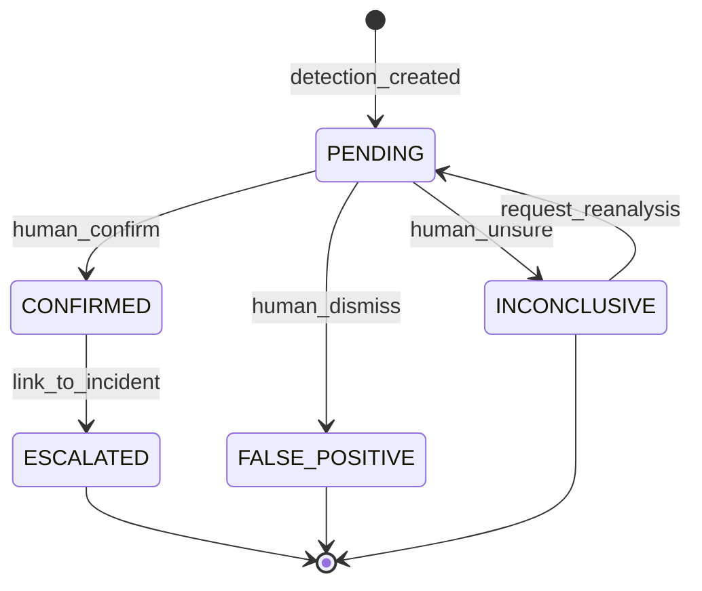

# AI Detection Domain

## Overview

This domain handles **automated detection of suspicious behavior, objects, and events in video feeds and images**, including **real-time video analysis, anomaly detection, object detection, behavior pattern recognition, and threat classification**.

It acts as **a core intelligence service** that provides the primary analytical capability of the Sentinel360 platform, transforming raw video data into actionable security intelligence.

---

## Use Cases

---

### UC-AI-01: Detect Suspicious Behavior in Video

- **Purpose**: Analyze video footage to identify suspicious or abnormal behaviors
- **Actors**: System (AI engine), Security Operator (initiates analysis)
- **Preconditions**: Video feed is active or footage is uploaded; AI models are loaded and operational

#### Main Success Flow

1. Video frame stream is fed to the AI detection pipeline
2. System preprocesses frames (resize, normalize, stabilize)
3. System runs behavior analysis models (loitering, aggression, unusual movement patterns, crowd anomalies)
4. System classifies detected behaviors with confidence scores
5. System filters results by confidence threshold (configurable, default ≥ 0.7)
6. System generates detection events for behaviors exceeding threshold
7. System annotates video frames with detection bounding boxes and labels
8. System emits `SUSPICIOUS_BEHAVIOR_DETECTED` event with metadata
9. System stores detection records linked to the media source

#### Alternate / Exception Flows

- **Low confidence detection (0.5–0.7)** → Logged but not alerted; flagged for human review
- **Model inference timeout** → Frame skipped; logged as `FRAME_SKIPPED`; alert if persistent
- **Model unavailable** → System falls back to secondary model or queues for deferred processing
- **False positive reported** → Detection marked as false positive; fed back for model improvement

#### Result

Suspicious behaviors detected, classified, and stored; alerts emitted for high-confidence detections.

---

### UC-AI-02: Detect Objects of Interest

- **Purpose**: Identify specific objects in video or images (weapons, bags, vehicles, etc.)
- **Actors**: System (AI engine)
- **Preconditions**: Video feed or image available; object detection model loaded

#### Main Success Flow

1. Video frames or images are fed to the object detection pipeline
2. System runs object detection model (YOLO/SSD/Faster R-CNN variants)
3. System identifies objects with bounding boxes, class labels, and confidence scores
4. System filters by configured object categories of interest (weapons, unattended bags, specific vehicle types)
5. High-priority objects (weapons) generate immediate alerts
6. System stores detection records with spatial and temporal coordinates
7. System emits `OBJECT_DETECTED` event

#### Alternate / Exception Flows

- **Occluded object** → Lower confidence; flagged for human review
- **Unknown object class** → Logged as `UNCLASSIFIED`
- **Multiple objects in frame** → All detections reported individually

#### Result

Objects of interest detected, classified, and stored with spatial/temporal metadata.

---

### UC-AI-03: Detect Events and Anomalies

- **Purpose**: Detect security-relevant events (break-ins, accidents, fires, crowd surges)
- **Actors**: System (AI engine)
- **Preconditions**: Sufficient video context (multiple frames/temporal window)

#### Main Success Flow

1. System analyzes temporal sequences of video frames
2. System applies event detection models (scene change detection, motion analysis, temporal pattern recognition)
3. System classifies events: `BREAK_IN`, `FIRE`, `ACCIDENT`, `CROWD_SURGE`, `VANDALISM`, `TRESPASSING`
4. System assigns severity level: `LOW`, `MEDIUM`, `HIGH`, `CRITICAL`
5. System generates event detection record with timestamps and evidence frames
6. System emits `EVENT_DETECTED` with severity and classification
7. `CRITICAL` and `HIGH` severity events trigger immediate alerts

#### Alternate / Exception Flows

- **Ambiguous event** → Classified with lower confidence; queued for human review
- **Camera obstruction detected** → Emits `CAMERA_OBSTRUCTED` alert
- **Environmental false positive (weather, lighting)** → System applies environmental filtering

#### Result

Security events detected and classified with severity; critical events trigger immediate alerts.

---

### UC-AI-04: Configure Detection Parameters

- **Purpose**: Allow operators to configure detection sensitivity, object categories, and alert thresholds
- **Actors**: Security Operator, Administrator
- **Preconditions**: Actor has `CONFIGURE_AI` permission

#### Main Success Flow

1. Actor accesses detection configuration for a camera or zone
2. Actor adjusts parameters: confidence threshold, enabled detection types, sensitivity, regions of interest (ROI)
3. System validates configuration
4. System persists configuration
5. System applies new configuration to active processing pipelines
6. System emits `DETECTION_CONFIG_UPDATED` event
7. System records audit log

#### Alternate / Exception Flows

- **Invalid threshold value** → 422: "Confidence threshold must be between 0.0 and 1.0"
- **Unknown detection type** → 422: "Unsupported detection type"

#### Result

Detection parameters updated and applied to active pipelines.

---

### UC-AI-05: Review and Classify Detection

- **Purpose**: Allow human operators to review, confirm, or dismiss AI detections
- **Actors**: Security Operator, Law Enforcement Officer
- **Preconditions**: Detection record exists; actor has `REVIEW_DETECTIONS` permission

#### Main Success Flow

1. Actor views a pending detection with video context
2. Actor reviews the detection and supporting evidence
3. Actor classifies: `CONFIRMED`, `FALSE_POSITIVE`, `INCONCLUSIVE`
4. If confirmed: Actor optionally escalates to incident or links to existing case
5. System updates detection record with classification
6. System records human feedback for model training data
7. System emits `DETECTION_REVIEWED` event
8. System records audit log

#### Alternate / Exception Flows

- **Detection expired** → Still reviewable but marked as late review
- **Insufficient video context** → Actor marks as `INCONCLUSIVE`

#### Result

Detection classified by human reviewer; feedback stored for model improvement.

---

### UC-AI-06: Run Detection on Archived Footage

- **Purpose**: Apply AI detection models to previously recorded footage
- **Actors**: Security Operator, Law Enforcement Officer
- **Preconditions**: Archived footage exists; actor has `ANALYZE_FOOTAGE` permission

#### Main Success Flow

1. Actor selects archived footage and detection types to apply
2. System queues footage for batch AI analysis
3. System processes footage through selected detection models
4. System generates detection records for findings
5. System notifies actor when analysis is complete
6. System emits `BATCH_ANALYSIS_COMPLETED` event

#### Alternate / Exception Flows

- **Large footage file** → System estimates processing time and notifies actor
- **Processing failure** → Retry up to 3 times; notify actor of failure

#### Result

Archived footage analyzed; detection records created; actor notified.

---

## Core Entities

---

### Entity: Detection

- **Description**: A single AI-generated detection of a behavior, object, or event

#### Fields

- `id`: UUID — Unique identifier
- `detection_type`: Enum — `BEHAVIOR`, `OBJECT`, `EVENT`
- `classification`: String — Specific class (e.g., `LOITERING`, `WEAPON`, `FIRE`)
- `confidence`: Float — AI confidence score (0.0–1.0)
- `severity`: Enum — `LOW`, `MEDIUM`, `HIGH`, `CRITICAL`
- `media_asset_id`: UUID — Reference to the source media
- `camera_id`: String (nullable) — Source camera identifier
- `timestamp_start`: Float — Start time in video (seconds)
- `timestamp_end`: Float (nullable) — End time in video (seconds)
- `bounding_box`: JSONB (nullable) — Spatial coordinates `{x, y, width, height}`
- `frame_url`: String (nullable) — URL to the captured evidence frame
- `metadata`: JSONB — Additional detection metadata (model version, processing info)
- `review_status`: Enum — `PENDING`, `CONFIRMED`, `FALSE_POSITIVE`, `INCONCLUSIVE`
- `reviewed_by`: UUID (nullable) — User who reviewed the detection
- `reviewed_at`: Timestamp (nullable)
- `escalated_to_incident_id`: UUID (nullable) — Linked incident if escalated
- `model_id`: String — AI model identifier used for detection
- `model_version`: String — Model version
- `zone_id`: UUID (nullable) — Detection zone reference
- `created_at`: Timestamp
- `updated_at`: Timestamp

#### Constraints

- `confidence` must be between 0.0 and 1.0
- `severity` must be assigned based on classification rules
- `review_status` defaults to `PENDING`
- Detections are immutable after review (except for linking to incidents)

#### Relationships

- Belongs to `MediaAsset`
- Optionally linked to `Incident` (cross-domain)
- Optionally reviewed by `User`
- Belongs to `DetectionZone` (optional)

---

### Entity: DetectionConfiguration

- **Description**: Configuration for AI detection on a specific camera feed or zone

#### Fields

- `id`: UUID — Unique identifier
- `camera_id`: String — Camera identifier
- `zone_id`: UUID (nullable) — Specific monitoring zone
- `enabled_detection_types`: JSONB — Array of enabled detection types
- `confidence_threshold`: Float — Minimum confidence to generate alert (default: 0.7)
- `sensitivity`: Enum — `LOW`, `MEDIUM`, `HIGH`
- `regions_of_interest`: JSONB (nullable) — ROI polygons for focused detection
- `active_schedule`: JSONB (nullable) — Time-based activation schedule
- `is_active`: Boolean — Whether this configuration is currently active
- `created_by`: UUID — User who created the configuration
- `updated_by`: UUID — Last user to modify
- `created_at`: Timestamp
- `updated_at`: Timestamp

#### Constraints

- `confidence_threshold` must be between 0.0 and 1.0
- One active configuration per camera/zone combination

#### Relationships

- References camera (cross-domain)
- Has many `Detection` results

---

### Entity: DetectionZone

- **Description**: A defined geographic or logical monitoring zone

#### Fields

- `id`: UUID — Unique identifier
- `name`: String — Zone name (e.g., "Main Entrance", "Parking Lot A")
- `description`: String (nullable) — Zone description
- `boundary`: JSONB — Geographic boundary (polygon coordinates)
- `camera_ids`: JSONB — Array of camera IDs covering this zone
- `threat_level`: Enum — `NORMAL`, `ELEVATED`, `HIGH`
- `is_active`: Boolean
- `created_at`: Timestamp
- `updated_at`: Timestamp

#### Constraints

- Zone name must be unique
- At least one camera must cover the zone

#### Relationships

- Has many `Detection`
- Has one `DetectionConfiguration`

---

### Entity: AIModel

- **Description**: Registered AI model used for detection

#### Fields

- `id`: String — Model identifier
- `name`: String — Human-readable name
- `version`: String — Model version
- `type`: Enum — `BEHAVIOR`, `OBJECT`, `EVENT`, `MULTI`
- `description`: String — Model description
- `accuracy_score`: Float — Last measured accuracy
- `supported_classes`: JSONB — Array of detectable classes
- `status`: Enum — `ACTIVE`, `DEPRECATED`, `TRAINING`
- `deployed_at`: Timestamp
- `created_at`: Timestamp

#### Constraints

- Only `ACTIVE` models can be used for real-time detection
- `DEPRECATED` models are available for reprocessing but not live feeds

#### Relationships

- Has many `Detection` results

---

## State Machines

### Detection Review Lifecycle

---

### States

| State            | Description                                       |
| ---------------- | ------------------------------------------------- |
| `PENDING`        | AI detection awaiting human review                |
| `CONFIRMED`      | Human operator confirmed the detection as valid   |
| `FALSE_POSITIVE` | Human operator dismissed as a false detection     |
| `INCONCLUSIVE`   | Insufficient evidence to confirm or dismiss       |
| `ESCALATED`      | Confirmed detection linked to an incident or case |

---

### Transitions & Guards

| From → To                | Event              | Condition                                       |
| ------------------------ | ------------------ | ----------------------------------------------- |
| PENDING → CONFIRMED      | human_confirm      | Reviewer has `REVIEW_DETECTIONS` permission     |
| PENDING → FALSE_POSITIVE | human_dismiss      | Reviewer has `REVIEW_DETECTIONS` permission     |
| PENDING → INCONCLUSIVE   | human_unsure       | Reviewer has `REVIEW_DETECTIONS` permission     |
| CONFIRMED → ESCALATED    | link_to_incident   | Incident exists or is created                   |
| INCONCLUSIVE → PENDING   | request_reanalysis | Different model or additional footage available |

---

## Business Rules (Invariants)

1. **Confidence threshold enforcement**: Only detections above the configured threshold trigger alerts
2. **Critical severity auto-alert**: `CRITICAL` severity detections bypass the review queue and generate immediate alerts
3. **Human-in-the-loop**: All non-critical detections should be reviewed by a human operator within configurable SLA
4. **False positive feedback loop**: False positive classifications must be stored and used for model retraining
5. **Model versioning**: All detections must record the exact model ID and version that generated them
6. **Multi-model consensus**: For critical classifications (e.g., weapons), require confirmation from at least 2 independent models
7. **Rate limiting**: Detection flood protection — maximum detections per minute per camera (configurable)
8. **Environmental compensation**: Detection algorithms must account for lighting changes, weather, and camera shake
9. **Privacy compliance**: Detections must not store raw facial data outside the Entity Intelligence domain
10. **Immutable detections**: Detection records cannot be deleted; only review status can be changed

---

## Processing Flows

### Real-time Detection Flow

1. Receive video frame from camera feed
2. Preprocess: resize, normalize, stabilize
3. Run through enabled detection models (parallel for different types)
4. Collect results with bounding boxes and confidence scores
5. Apply confidence threshold filter
6. Apply region of interest filter
7. Deduplicate across overlapping detections
8. Classify severity based on detection type and context
9. Persist detection records
10. Emit events for qualifying detections
11. Trigger alerts for HIGH/CRITICAL severity

### Batch Analysis Flow

1. Receive batch analysis request for archived footage
2. Estimate processing time and notify requester
3. Segment footage into processable chunks
4. Process chunks through requested detection models
5. Aggregate results and deduplicate
6. Store detection records
7. Notify requester of completion
8. Emit `BATCH_ANALYSIS_COMPLETED` event

### Detection Review Flow

1. Operator opens detection in review queue
2. System presents detection with video context (before/during/after clips)
3. Operator classifies detection
4. If confirmed: operator optionally links to incident
5. System updates detection record
6. System stores feedback for model training
7. System records audit log

---

## Interfaces

### Detection Feed (Real-time)

- **Layout**: Split-screen — live video grid + detection sidebar
- **Filters**: Camera, zone, detection type, severity, confidence
- **Indicators**: Color-coded severity badges, confidence bars
- **Actions**: Review, dismiss, escalate, view video context

### Detection Review Queue

- **Filters**: Status (pending/confirmed/dismissed), type, severity, date range, camera
- **Columns**: Thumbnail, Type, Classification, Confidence, Severity, Camera, Timestamp, Status
- **Sorting**: By severity (default), confidence, timestamp
- **Pagination**: 25 per page, with queue depth indicator
- **Actions**: Confirm, dismiss, mark inconclusive, escalate to incident

### Detection Analytics Dashboard

- **Summary cards**: Total detections, by type, by severity, false positive rate
- **Charts**: Detection trends over time, heatmap by zone, model accuracy over time
- **Tables**: Top detection types, most active cameras/zones
- **Filters**: Date range, camera, zone, model

### Detection Configuration View

- **Per-camera settings**: Enabled types, threshold, sensitivity, ROI editor
- **Schedule editor**: Time-based activation
- **Model selection**: Choose active models per detection type
- **Preview**: Live preview of ROI and detection overlay

---

## Notifications

| Event                                   | Recipient                          | Channel             | Message                                                             |
| --------------------------------------- | ---------------------------------- | ------------------- | ------------------------------------------------------------------- |
| SUSPICIOUS_BEHAVIOR_DETECTED (CRITICAL) | Security Operator, Admin           | Push + In-app + SMS | "CRITICAL: {classification} detected at {zone}"                     |
| SUSPICIOUS_BEHAVIOR_DETECTED (HIGH)     | Security Operator                  | Push + In-app       | "HIGH: {classification} detected at {zone}"                         |
| OBJECT_DETECTED (weapon)                | Security Operator, Law Enforcement | Push + In-app + SMS | "WEAPON DETECTED at {zone} — Confidence: {confidence}%"             |
| EVENT_DETECTED (CRITICAL)               | Security Operator, Admin           | Push + In-app + SMS | "CRITICAL EVENT: {classification} at {zone}"                        |
| BATCH_ANALYSIS_COMPLETED                | Requesting User                    | In-app              | "Analysis of '{footage_title}' complete. {count} detections found." |
| DETECTION_CONFIG_UPDATED                | Security Operator                  | In-app              | "Detection config updated for camera {camera_id}"                   |
| MODEL_ACCURACY_DEGRADED                 | Admin                              | Email + In-app      | "AI model {model_name} accuracy dropped below threshold"            |

---

## Audit Logging

- Detection creation (all AI-generated detections)
- Detection review actions (confirm, dismiss, inconclusive)
- Detection escalation to incident
- Configuration changes (thresholds, ROI, enabled types)
- Batch analysis requests and completions
- Model deployment and deprecation
- False positive feedback submissions

Includes:

- **Actor**: User ID or `SYSTEM`
- **Timestamp**: ISO 8601 UTC
- **Action**: Event code
- **Target**: Detection ID, camera ID, zone ID
- **Payload snapshot**: Detection metadata, configuration changes
- **Model info**: Model ID and version used

---

## Invariants

1. All detections must include model identification and confidence score
2. Detection review decisions are final (no re-reviewing the same detection by the same reviewer)
3. Critical detections must generate immediate alerts regardless of review status
4. Detection records are immutable — only review metadata can be updated
5. AI models must be versioned and tracked for all detections they produce
6. Privacy-sensitive data (faces, personal identifiers) must be delegated to the Entity Intelligence domain
