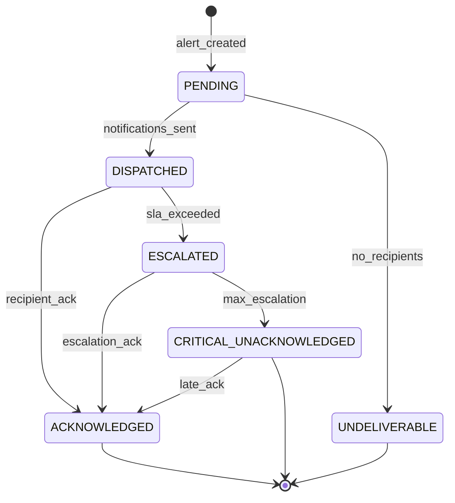
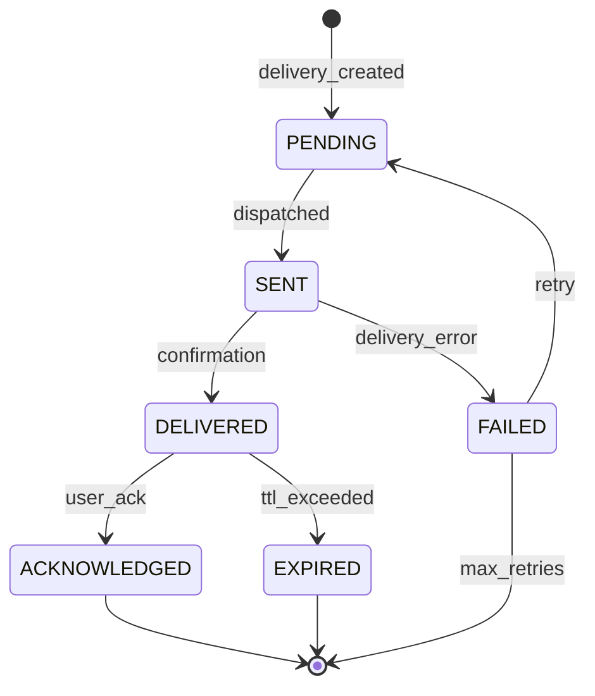

# Alert & Notification Domain# Alert & Notification Domain

6. Routing rules must resolve to at least one recipient for CRITICAL alerts5. User preference changes take effect immediately for future notifications4. Every notification delivery attempt must be tracked with status3. Escalation timers must fire even if the system is under load2. Alert deduplication must prevent notification spam1. CRITICAL alerts must be delivered within 60 seconds and cannot be suppressed## Invariants---- **Payload snapshot**: Severity, recipients, channels, delivery status- **Target**: Alert ID, notification ID- **Action**: Event code- **Timestamp**: ISO 8601 UTC- **Actor**: User ID or `SYSTEM`Includes:- Digest compilation and delivery- Routing rule changes- Notification preference changes- Alert resolution- Alert escalation- Alert acknowledgment- Delivery status changes (sent, delivered, failed, bounced)- Notification dispatch per recipient per channel- Alert creation with source event reference## Audit Logging---| DELIVERY_FAILURE | System Admin | In-app | "Notification delivery failure for alert {alert_id}" || ALERT_RESOLVED | All notified recipients | In-app | "Resolved: {alert_title}" || ALERT_ESCALATED | Escalation recipients | Push + SMS | "ESCALATED: {alert_title} — No response in {sla} min" || ALERT_CREATED (MEDIUM/LOW) | Routed recipients | In-app (or digest) | "{alert_title}" || ALERT_CREATED (HIGH) | Routed recipients | Push + In-app | "{alert_title}" || ALERT_CREATED (CRITICAL) | Routed recipients | Push + SMS + In-app | "{alert_title} — Immediate attention required" ||-------|-----------|---------|---------|| Event | Recipient | Channel | Message |## Notifications---- **Actions**: Create, edit, activate/deactivate, delete rules- **Testing**: Simulate an alert to preview routing- **Rule editor**: Alert type, severity, recipient criteria, channels, escalation chain- **Rule list**: Active routing rules with match criteria### Alert Routing Configuration (Admin)- **Alert type overrides**: Per-type configuration- **Digest settings**: Enable and frequency selector- **Quiet hours**: Time range picker with timezone and critical override toggle- **Severity matrix**: Channel × severity grid for fine-grained control- **Channel toggles**: Enable/disable per channel### Notification Preferences- **Actions**: Acknowledge, resolve, escalate manually, view source- **Recipients**: List of notified users with delivery and read status- **Timeline**: Alert lifecycle (created, dispatched, acknowledged, escalated, resolved)- **Context**: Source event details, location map, linked entities- **Header**: Title, severity badge, status, timestamps### Alert Detail View- **Indicators**: Unacknowledged count badge, escalation warning- **Real-time**: WebSocket-driven updates for new alerts- **Controls**: Acknowledge, resolve, view details, mute similar- **Filters**: Status, severity, type, date range, zone- **Layout**: Priority-sorted alert feed with severity color coding### Alert Center## Interfaces---5. Mark individual notifications as included in digest4. Send single digest email/notification3. Compile digest summary2. For each user with digest enabled: collect unread LOW/MEDIUM notifications1. Scheduled job runs per digest frequency (hourly/daily)### Digest Compilation Flow7. If max level reached: mark as `ESCALATION_EXHAUSTED`; notify Super Admin6. Increment escalation level on alert5. Create and dispatch escalation notifications4. Identify next-level recipients3. Load escalation chain configuration2. For each: determine current escalation level1. Scheduled job checks for unacknowledged alerts past SLA### Escalation Flow7. If all retries exhausted: mark as FAILED; try next channel6. If failed: increment retry counter; requeue if under max retries5. Record delivery status4. Send via channel-specific provider3. Compose message from template + alert data2. Resolve delivery channel (push/email/SMS/in-app)1. Pick notification from delivery queue### Notification Delivery Flow10. Emit `ALERT_DISPATCHED` event9. Start escalation timer8. Dispatch notifications to delivery services7. Create notification records per recipient per channel6. Load notification preferences for each recipient5. Resolve recipient list from routing rules4. If not duplicate: create alert record3. Check dedup window for existing similar alerts2. Evaluate against alert routing rules1. Receive domain event from event bus### Alert Generation Flow## Processing Flows---10. **Audit completeness**: All alert generation, delivery, acknowledgment, and resolution events must be audited9. **No suppression of CRITICAL**: Users cannot disable CRITICAL alert notifications8. **Delivery tracking**: Every notification must track its delivery status through the pipeline7. **Preference override**: System can override user preferences for CRITICAL alerts6. **Rate limiting**: Maximum 100 notifications per user per hour (except CRITICAL)5. **Quiet hours respect**: Non-critical notifications respect quiet hours; CRITICAL overrides4. **Channel fallback**: If primary channel fails, system must attempt alternate channels3. **Escalation enforcement**: Unacknowledged alerts must escalate per configured chain2. **Deduplication**: Alerts with the same dedup_key within the dedup window are suppressed1. **Critical alert guarantee**: CRITICAL alerts must reach at least one recipient within 60 seconds## Business Rules (Invariants)---| ACTIVE → EXPIRED | expiry_reached | Auto-expire time reached; severity is not CRITICAL || ACKNOWLEDGED → RESOLVED | issue_addressed | Resolution note provided || ESCALATED → ACKNOWLEDGED | acknowledged_after_escalation | Any escalation recipient acknowledges || ACTIVE → ESCALATED | sla_exceeded | Acknowledgment SLA time passed; escalation rules exist || ACTIVE → ACKNOWLEDGED | first_acknowledgment | Recipient is valid ||-----------|-------|-----------|| From → To | Event | Condition |### Transitions & Guards---| `EXPIRED` | Alert auto-expired (non-critical only) || `RESOLVED` | Alert has been resolved || `ESCALATED` | Alert has been escalated due to SLA breach || `ACKNOWLEDGED` | At least one recipient has acknowledged the alert || `ACTIVE` | Alert is active and awaiting acknowledgment ||-------|-------------|| State | Description |### States---`  EXPIRED --> [*]  RESOLVED --> [*]  ESCALATED --> RESOLVED: resolved_after_escalation  ACTIVE --> EXPIRED: expiry_reached  ACTIVE --> RESOLVED: resolved_directly  ACKNOWLEDGED --> RESOLVED: issue_addressed  ESCALATED --> ACKNOWLEDGED: acknowledged_after_escalation  ACTIVE --> ESCALATED: sla_exceeded  ACTIVE --> ACKNOWLEDGED: first_acknowledgment  [*] --> ACTIVE: alert_createdstateDiagram-v2`mermaid### Alert Lifecycle## State Machines---- Created by `User`#### Relationships- Escalation chain must have increasing timeouts- At least one recipient criterion must be specified#### Constraints- `updated_at`: Timestamp- `created_at`: Timestamp- `created_by`: UUID- `is_active`: Boolean- `dedup_window_seconds`: Integer — Deduplication window (default: 300)- `escalation_chain`: JSONB (nullable) — Escalation levels and timing- `channels`: JSONB — Channels to use for this rule- `recipient_criteria`: JSONB — Who receives: `{roles: [], zones: [], users: [], on_duty: true}`- `severity_filter`: JSONB — Severity levels that activate this rule- `alert_type`: String — Alert type pattern (exact or wildcard)- `id`: UUID — Unique identifier#### Fields- **Description**: Configuration for routing alerts to recipients### Entity: AlertRoutingRule---- Belongs to `User`#### Relationships- Quiet hours must respect CRITICAL override- CRITICAL severity cannot be fully suppressed- At least one channel must be enabled#### Constraints- `updated_at`: Timestamp- `created_at`: Timestamp- `alert_type_overrides`: JSONB (nullable) — Per-alert-type channel overrides- `digest_frequency`: Enum (nullable) — `HOURLY`, `DAILY`- `digest_enabled`: Boolean — Whether to batch non-critical notifications- `quiet_hours`: JSONB (nullable) — Quiet period `{start: "22:00", end: "07:00", timezone, except_critical: true}`- `channel_preferences`: JSONB — Per-channel settings `{push: {enabled, min_severity}, email: {...}, sms: {...}, in_app: {...}}`- `user_id`: UUID — Reference to user- `id`: UUID — Unique identifier#### Fields- **Description**: User-specific notification configuration### Entity: NotificationPreference---- Belongs to `User`- Belongs to `Alert`#### Relationships- One acknowledgment per user per alert#### Constraints- `notes`: String (nullable) — Optional acknowledgment notes- `channel`: String — Channel through which acknowledgment was received- `acknowledged_at`: Timestamp- `user_id`: UUID — User who acknowledged- `alert_id`: UUID — Reference to alert- `id`: UUID — Unique identifier#### Fields- **Description**: Records a user's acknowledgment of an alert### Entity: AlertAcknowledgment---- Belongs to `User` (recipient)- Belongs to `Alert`#### Relationships- Notifications are immutable after creation (only status fields update)- Max 3 retries for failed deliveries#### Constraints- `created_at`: Timestamp- `error_message`: String (nullable) — Delivery error details- `retry_count`: Integer — Number of delivery retries- `read_at`: Timestamp (nullable) — When the user read the notification- `delivered_at`: Timestamp (nullable) — When confirmed delivered- `sent_at`: Timestamp (nullable) — When sent to delivery service- `delivery_status`: Enum — `PENDING`, `SENT`, `DELIVERED`, `FAILED`, `BOUNCED`- `action_url`: String (nullable) — Action deep link- `body`: String — Notification body- `title`: String — Notification title- `channel`: Enum — `PUSH`, `EMAIL`, `SMS`, `IN_APP`- `recipient_id`: UUID — Target user- `alert_id`: UUID — Reference to parent alert- `id`: UUID — Unique identifier#### Fields- **Description**: A single notification delivery to a specific recipient via a specific channel### Entity: Notification---- References source event (cross-domain)- Has many `AlertAcknowledgment`- Has many `Notification`#### Relationships- Alerts are never deleted, only resolved or expired- `CRITICAL` alerts cannot auto-expire- `dedup_key` prevents duplicate alerts within the dedup window (configurable, default 5 min)#### Constraints- `updated_at`: Timestamp- `created_at`: Timestamp- `expires_at`: Timestamp (nullable) — Auto-resolution expiry- `resolution_note`: String (nullable) — Resolution description- `resolved_by`: UUID (nullable) — Resolver- `resolved_at`: Timestamp (nullable) — Resolution timestamp- `acknowledged_by`: UUID (nullable) — First acknowledger- `acknowledged_at`: Timestamp (nullable) — First acknowledgment- `escalation_sla_seconds`: Integer — SLA for acknowledgment before escalation- `escalation_level`: Integer — Current escalation level (0 = initial)- `dedup_key`: String — Deduplication key (hash of type + source + location + time window)- `metadata`: JSONB — Additional context from source event- `action_url`: String (nullable) — Deep link to relevant content- `location`: JSONB (nullable) — Alert location `{lat, lng, zone}`- `status`: Enum — Alert lifecycle status- `severity`: Enum — `LOW`, `MEDIUM`, `HIGH`, `CRITICAL`- `message`: String — Alert message body- `title`: String — Alert title- `source_event_id`: UUID — Reference to the triggering event- `source_domain`: String — Originating domain- `alert_type`: String — Type code (e.g., `SUSPICIOUS_BEHAVIOR`, `WATCHLIST_MATCH`, `GEOFENCE_VIOLATION`)- `id`: UUID — Unique identifier#### Fields- **Description**: A system-generated alert requiring attention### Entity: Alert---## Core Entities---User notification preferences updated.#### Result- **Cannot disable CRITICAL alerts** → 422: "CRITICAL alerts cannot be disabled"- **Cannot disable all channels** → 422: "At least one notification channel must remain active"#### Alternate / Exception Flows5. System records audit log4. System persists preferences3. System validates preferences - Digest preferences (immediate vs. batched summary) - Channel enable/disable (push, email, SMS, in-app) - Quiet hours (no push/SMS during specified hours, except CRITICAL) - Alert severity thresholds per channel (e.g., SMS only for CRITICAL)2. User configures per-category preferences:1. User accesses notification preferences#### Main Success Flow- **Preconditions**: User is authenticated- **Actors**: Authenticated User- **Purpose**: Allow users to configure their notification channel preferences### UC-AN-09: Manage Notification Preferences---Alert resolved; all recipients notified of resolution.#### Result- **Missing resolution note** → 422: "Resolution note is required"- **Already resolved** → 200 OK (idempotent)#### Alternate / Exception Flows5. System records audit log4. System emits `ALERT_RESOLVED` event3. System notifies all recipients of resolution2. System transitions alert to `RESOLVED`1. Actor resolves the alert with a resolution note#### Main Success Flow- **Preconditions**: Alert is `ACTIVE` or `ACKNOWLEDGED`; actor has `RESOLVE_ALERT` permission- **Actors**: Security Operator, Law Enforcement Officer- **Purpose**: Mark an alert as resolved after the underlying issue is addressed### UC-AN-08: Resolve Alert---Alert escalated to next-level recipients; original alert updated with escalation info.#### Result- **Original recipient acknowledges during escalation** → Continue but log escalation event- **Max escalation level reached** → Alert to Super Admin; mark as `ESCALATION_EXHAUSTED`#### Alternate / Exception Flows6. System emits `ALERT_ESCALATED` event5. System updates alert with escalation level4. System dispatches via high-priority channels (SMS + push)3. System creates new notifications for escalation recipients2. System identifies the escalation chain (next level of authority)1. System detects alert has exceeded acknowledgment SLA (configurable per severity)#### Main Success Flow- **Preconditions**: Alert is `ACTIVE` and unacknowledged; escalation SLA exceeded- **Actors**: System (escalation engine)- **Purpose**: Escalate an alert that has not been acknowledged within the SLA### UC-AN-07: Escalate Unacknowledged Alert---Alert acknowledged; escalation timer cancelled.#### Result- **Actor not a recipient** → 403 Forbidden- **Alert already resolved** → 200 OK (idempotent)#### Alternate / Exception Flows6. System records audit log5. System emits `ALERT_ACKNOWLEDGED` event4. System cancels escalation timer (if running) - All recipients acknowledged → Status option to move to `ACKNOWLEDGED` - First acknowledgment → Status remains `ACTIVE` but marked `ACKNOWLEDGED`3. System updates alert status based on acknowledgment:2. System records acknowledgment with timestamp and actor1. Actor acknowledges the alert (from any notification surface)#### Main Success Flow- **Preconditions**: Alert is `ACTIVE`; actor is a recipient- **Actors**: Security Operator, Law Enforcement Officer, Administrator- **Purpose**: Mark an alert as acknowledged by a recipient### UC-AN-06: Acknowledge Alert---SMS notification delivered to user.#### Result- **Cost threshold exceeded** → Admin approval required for continued SMS delivery- **SMS service unavailable** → Queue for retry- **Phone number invalid** → Mark as invalid; disable SMS channel#### Alternate / Exception Flows4. System updates notification record with delivery status3. System receives delivery receipt2. System sends via SMS provider (Twilio/similar)1. System composes SMS message (max 160 chars, with link)#### Main Success Flow- **Preconditions**: User has verified phone number; SMS service configured- **Actors**: System (notification delivery engine)- **Purpose**: Send an SMS notification for critical alerts### UC-AN-05: Deliver SMS Notification---Email notification sent to user.#### Result- **Template rendering error** → Fall back to plain text; log error- **Rate limit** → Queue for delayed delivery- **Email bounce** → Mark user's email as bounced; disable email channel until re-verified#### Alternate / Exception Flows5. System updates notification record4. System records delivery status3. System sends via email service (SMTP/SES/SendGrid)2. System renders email with alert details (subject, body, action links)1. System selects email template based on alert type#### Main Success Flow- **Preconditions**: User has verified email; email service configured- **Actors**: System (notification delivery engine)- **Purpose**: Send an email notification to a user### UC-AN-04: Deliver Email Notification---Push notification delivered to user's devices.#### Result- **User disabled push** → Skip; use alternate channels- **Push service unavailable** → Queue for retry (max 3 retries with exponential backoff)- **Device token invalid/expired** → Remove token from user's devices; mark undeliverable#### Alternate / Exception Flows6. System records delivery timestamp5. System updates notification record with delivery status4. System receives delivery confirmation3. System sends to push provider (FCM/APNs/Web Push)2. System composes push notification payload (title, body, data, action URL)1. System retrieves user's registered device tokens (mobile + web)#### Main Success Flow- **Preconditions**: User has registered device tokens; push service configured- **Actors**: System (notification delivery engine)- **Purpose**: Send a real-time push notification to a user's device### UC-AN-03: Deliver Push Notification---Recipient list resolved with per-recipient channel preferences.#### Result- **On-duty schedule excludes all** → Escalate to backup/supervisor- **No recipients matched** → Alert logged but not dispatched; admin alerted#### Alternate / Exception Flows5. System creates notification delivery records4. System determines channels per recipient (push, email, SMS, in-app)3. For each recipient, system loads notification preferences2. System resolves the recipient list - By on-duty schedule (if configured) - By watchlist ownership (e.g., officer who added watchlist entry) - By assignment (e.g., case investigator) - By zone (e.g., operators assigned to the incident zone) - By role (e.g., all Security Operators)1. System evaluates the alert against routing rules:#### Main Success Flow- **Preconditions**: Alert created; routing rules configured- **Actors**: System (alert routing engine)- **Purpose**: Determine which users should receive a specific alert### UC-AN-02: Route Alert to Recipients---Alert created; notifications dispatched to all relevant recipients via their preferred channels.#### Result- **All channels fail** → Alert marked `DELIVERY_FAILED`; admin notified- **Recipient unsubscribed from channel** → Skip that channel; use remaining preferences- **Channel delivery failure** → Retry with backoff; fall back to alternate channel- **Duplicate alert suppression** → If similar alert exists within dedup window, suppress duplicate#### Alternate / Exception Flows9. System records audit log8. System emits `ALERT_DISPATCHED` event7. System dispatches notifications via configured channels (push, email, SMS, in-app)6. System creates notification records for each recipient5. System identifies recipients based on alert routing rules (role, zone, assignment)4. System creates alert record with status `ACTIVE`3. System determines alert severity from the source event2. System evaluates alert rules to determine if notification is required1. System receives a domain event (e.g., `SUSPICIOUS_BEHAVIOR_DETECTED`, `WATCHLIST_MATCH`, `GEOFENCE_VIOLATION`)#### Main Success Flow- **Preconditions**: System event emitted from another domain- **Actors**: System (automated)- **Purpose**: Create an alert from a system-detected event (AI detection, geofence violation, etc.)### UC-AN-01: Generate Alert from System Event---## Use Cases---It acts as **a communication and integration service** that ensures all platform stakeholders receive timely, relevant alerts through their preferred channels based on event severity and user preferences.This domain handles **real-time alert generation, notification routing, and multi-channel delivery**, including **alert creation and prioritization, notification preferences management, push notifications, email alerts, SMS dispatch, in-app notifications, escalation workflows, and notification audit trails**.## Overview

## Overview

This domain handles **real-time alert generation, notification routing, and delivery across multiple channels**, including **alert creation and prioritization, notification preferences management, push notifications, SMS, email, and in-app messaging, alert escalation, and notification scheduling**.

It acts as **a communication integration service** that ensures the right people receive the right information at the right time across all channels supported by the Sentinel360 platform.

---

## Use Cases

---

### UC-AN-01: Generate Real-Time Alert

- **Purpose**: Create and dispatch an alert in real-time based on a system event
- **Actors**: System (event-driven)
- **Preconditions**: A triggering event has occurred; alert routing rules are configured

#### Main Success Flow

1. System receives a domain event (e.g., `SUSPICIOUS_BEHAVIOR_DETECTED`, `GEOFENCE_VIOLATION`, `WATCHLIST_MATCH`)
2. System evaluates alert routing rules for the event type
3. System determines alert priority based on event severity and context
4. System identifies recipient(s) based on routing rules (role, zone, assignment, on-duty status)
5. System creates alert record with status `PENDING`
6. System resolves each recipient's notification preferences (channels, quiet hours)
7. System dispatches notifications across configured channels (push, SMS, email, in-app)
8. System updates alert status to `DISPATCHED`
9. System emits `ALERT_DISPATCHED` event

#### Alternate / Exception Flows

- **No recipients found** → Alert created but flagged as `UNDELIVERABLE`; admin notified
- **Channel delivery failure** → Retry with exponential backoff (3 attempts); fallback to secondary channel
- **Recipient in quiet hours** → Queue for delivery at end of quiet hours (unless CRITICAL priority overrides)
- **Alert flood detected** → System throttles alerts; sends digest instead

#### Result

Alert dispatched to all identified recipients via their preferred channels.

---

### UC-AN-02: Acknowledge Alert

- **Purpose**: Mark an alert as seen/acknowledged by the recipient
- **Actors**: Authenticated User (recipient)
- **Preconditions**: Alert exists and was delivered to the actor

#### Main Success Flow

1. Recipient views the alert notification
2. Recipient acknowledges the alert
3. System updates alert status to `ACKNOWLEDGED`
4. System records acknowledgment time and actor
5. System stops escalation timer for this alert
6. System emits `ALERT_ACKNOWLEDGED` event

#### Alternate / Exception Flows

- **Alert already acknowledged** → 200 OK (idempotent)
- **Alert expired** → Still acknowledgeable; marked as late acknowledgment

#### Result

Alert marked as acknowledged; escalation stopped.

---

### UC-AN-03: Escalate Unacknowledged Alert

- **Purpose**: Escalate alerts that have not been acknowledged within SLA
- **Actors**: System (scheduled)
- **Preconditions**: Alert is `DISPATCHED` and acknowledgment SLA exceeded

#### Main Success Flow

1. System identifies alerts past their acknowledgment SLA
2. System determines escalation target (supervisor, next-level operator, admin)
3. System creates escalation record
4. System dispatches alert to escalation target with `ESCALATED` priority
5. System updates alert status to `ESCALATED`
6. System emits `ALERT_ESCALATED` event

#### Alternate / Exception Flows

- **Max escalation level reached** → Alert flagged as `CRITICAL_UNACKNOWLEDGED`; all admins notified
- **Escalation target unavailable** → Try next escalation level immediately

#### Result

Alert escalated to next-level recipient; original alert marked as escalated.

---

### UC-AN-04: Configure Notification Preferences

- **Purpose**: Allow users to customize their notification channels and alert settings
- **Actors**: Authenticated User
- **Preconditions**: User account exists

#### Main Success Flow

1. User accesses notification settings
2. User configures preferences per alert category:
   - Enabled channels (push, SMS, email, in-app)
   - Quiet hours (start/end times, timezone)
   - Alert priority filter (minimum priority to notify)
   - Digest mode (real-time vs. batched summary)
3. System validates configuration
4. System persists preferences
5. System emits `PREFERENCES_UPDATED` event

#### Alternate / Exception Flows

- **Cannot disable all channels for CRITICAL alerts** → 422: "At least one channel must be enabled for critical alerts"
- **Invalid phone for SMS** → 422: "Valid phone number required for SMS notifications"

#### Result

Notification preferences saved and applied to future alert routing.

---

### UC-AN-05: Send Broadcast Notification

- **Purpose**: Send a notification to a group of users (by role, zone, or all users)
- **Actors**: Administrator, Super Administrator
- **Preconditions**: Actor has `SEND_BROADCAST` permission

#### Main Success Flow

1. Admin composes broadcast message with title, body, priority, and target audience
2. Admin selects target: all users, specific role(s), specific zone(s), or custom list
3. System validates message content and target
4. System creates notification records for each recipient
5. System dispatches through appropriate channels based on priority and preferences
6. System emits `BROADCAST_SENT` event
7. System records audit log

#### Alternate / Exception Flows

- **Large audience** → System processes in batches; admin notified of progress
- **Empty target** → 422: "No recipients match the target criteria"

#### Result

Broadcast notification sent to all targeted recipients.

---

### UC-AN-06: View Notification History

- **Purpose**: View past notifications and alerts
- **Actors**: Authenticated User
- **Preconditions**: User is authenticated

#### Main Success Flow

1. User accesses notification center
2. System retrieves notifications for the user (paginated)
3. System groups by read/unread status
4. System returns notifications with status, timestamp, and action links

#### Alternate / Exception Flows

- **No notifications** → Empty state with explanation

#### Result

Paginated notification history displayed.

---

### UC-AN-07: Create Alert Routing Rule

- **Purpose**: Configure rules that determine how events map to alerts and recipients
- **Actors**: Administrator, Super Administrator
- **Preconditions**: Actor has `MANAGE_ALERT_RULES` permission

#### Main Success Flow

1. Admin defines a routing rule: event type, conditions, priority mapping, recipient criteria
2. System validates rule configuration
3. System checks for conflicts with existing rules
4. System persists the routing rule
5. System activates the rule
6. System emits `ROUTING_RULE_CREATED` event
7. System records audit log

#### Alternate / Exception Flows

- **Conflicting rule** → Warning with details; admin can override or adjust
- **Invalid recipient criteria** → 422 with details

#### Result

Alert routing rule created and active.

---

## Core Entities

---

### Entity: Alert

- **Description**: A generated alert triggered by a system event

#### Fields

- `id`: UUID — Unique identifier
- `alert_type`: String — Alert category (e.g., `DETECTION_ALERT`, `GEOFENCE_ALERT`, `WATCHLIST_ALERT`, `SYSTEM_ALERT`)
- `priority`: Enum — `LOW`, `MEDIUM`, `HIGH`, `CRITICAL`
- `title`: String — Alert title
- `body`: String — Alert message body
- `source_event_type`: String — Originating event code
- `source_event_id`: UUID — Reference to the triggering event
- `source_domain`: String — Originating domain
- `status`: Enum — Alert lifecycle status
- `metadata`: JSONB — Additional context (location, entity info, detection details)
- `action_url`: String (nullable) — Deep link to relevant detail view
- `acknowledgment_sla_minutes`: Integer — Time allowed before escalation
- `escalation_level`: Integer — Current escalation level (0 = original)
- `created_at`: Timestamp
- `updated_at`: Timestamp

#### Constraints

- `priority` determines routing urgency and SLA
- `CRITICAL` alerts override quiet hours
- Alerts are immutable (status changes tracked via AlertDelivery)

#### Relationships

- Has many `AlertDelivery`
- Has many `AlertEscalation`
- References source event polymorphically

---

### Entity: AlertDelivery

- **Description**: Records the delivery of an alert to a specific recipient via a specific channel

#### Fields

- `id`: UUID — Unique identifier
- `alert_id`: UUID — Reference to alert
- `recipient_id`: UUID — Target user
- `channel`: Enum — `PUSH`, `SMS`, `EMAIL`, `IN_APP`
- `status`: Enum — `PENDING`, `SENT`, `DELIVERED`, `FAILED`, `ACKNOWLEDGED`, `EXPIRED`
- `sent_at`: Timestamp (nullable) — When dispatched
- `delivered_at`: Timestamp (nullable) — When confirmed delivered
- `acknowledged_at`: Timestamp (nullable) — When recipient acknowledged
- `failure_reason`: String (nullable) — Delivery failure reason
- `retry_count`: Integer — Number of delivery retries
- `created_at`: Timestamp

#### Constraints

- Max retry count: 3
- `ACKNOWLEDGED` is terminal — no further status changes

#### Relationships

- Belongs to `Alert`
- References `User` as recipient

---

### Entity: AlertEscalation

- **Description**: Records an escalation event for an alert

#### Fields

- `id`: UUID — Unique identifier
- `alert_id`: UUID — Reference to alert
- `escalation_level`: Integer — Escalation level (1, 2, 3…)
- `escalated_to`: UUID — User/role escalated to
- `reason`: String — Escalation reason (e.g., "Acknowledgment SLA exceeded")
- `escalated_at`: Timestamp
- `acknowledged_at`: Timestamp (nullable) — When escalation recipient acknowledged

#### Constraints

- Maximum escalation levels configurable (default: 3)

#### Relationships

- Belongs to `Alert`
- References `User` as escalation target

---

### Entity: NotificationPreference

- **Description**: A user's notification channel and alert preferences

#### Fields

- `id`: UUID — Unique identifier
- `user_id`: UUID — Reference to user
- `alert_category`: String — Alert category (or `ALL` for global default)
- `channels`: JSONB — Enabled channels `{push: true, sms: false, email: true, in_app: true}`
- `minimum_priority`: Enum — `LOW`, `MEDIUM`, `HIGH`, `CRITICAL`
- `quiet_hours_start`: Time (nullable) — Quiet hours start (e.g., "22:00")
- `quiet_hours_end`: Time (nullable) — Quiet hours end (e.g., "07:00")
- `timezone`: String — User's timezone
- `digest_mode`: Enum — `REALTIME`, `HOURLY`, `DAILY`
- `created_at`: Timestamp
- `updated_at`: Timestamp

#### Constraints

- At least one channel must be enabled for `CRITICAL` alerts
- `CRITICAL` alerts override quiet hours regardless of preference
- One preference record per user per alert category

#### Relationships

- Belongs to `User`

---

### Entity: AlertRoutingRule

- **Description**: Defines how system events are routed to alerts and recipients

#### Fields

- `id`: UUID — Unique identifier
- `name`: String — Rule name
- `description`: String — Rule description
- `event_type`: String — Event type pattern (supports wildcards)
- `conditions`: JSONB — Additional conditions (severity ≥ X, zone = Y, etc.)
- `priority_mapping`: JSONB — How to map event severity to alert priority
- `recipient_criteria`: JSONB — Who to notify (role, zone, on-duty, specific users)
- `acknowledgment_sla_minutes`: Integer — SLA for acknowledgment
- `escalation_chain`: JSONB — Escalation path (level 1 → role, level 2 → role, etc.)
- `is_active`: Boolean — Whether the rule is currently active
- `created_by`: UUID — User who created the rule
- `created_at`: Timestamp
- `updated_at`: Timestamp

#### Constraints

- Event type must be a valid event pattern
- Escalation chain must have at least one level
- Active rules are evaluated in priority order

#### Relationships

- Has many `Alert` (implicitly via matching)
- Created by `User`

---

### Entity: Notification

- **Description**: A general notification message (non-alert) sent to users

#### Fields

- `id`: UUID — Unique identifier
- `recipient_id`: UUID — Target user
- `type`: Enum — `INFO`, `SUCCESS`, `WARNING`, `BROADCAST`
- `title`: String — Notification title
- `body`: String — Notification content
- `action_url`: String (nullable) — Deep link
- `is_read`: Boolean — Whether the notification has been read
- `read_at`: Timestamp (nullable) — When read
- `source_domain`: String (nullable) — Originating domain
- `created_at`: Timestamp

#### Constraints

- Notifications expire after configurable period (default: 30 days)

#### Relationships

- Belongs to `User`

---

## State Machines

### Alert Lifecycle

### Alert Delivery Lifecycle

---

### States — Alert

| State                     | Description                                          |
| ------------------------- | ---------------------------------------------------- |
| `PENDING`                 | Alert created; notifications being prepared          |
| `DISPATCHED`              | Notifications sent to recipients                     |
| `UNDELIVERABLE`           | No valid recipients found                            |
| `ACKNOWLEDGED`            | At least one recipient acknowledged                  |
| `ESCALATED`               | Acknowledgment SLA exceeded; escalated to next level |
| `CRITICAL_UNACKNOWLEDGED` | Maximum escalation reached; still unacknowledged     |

---

### Transitions & Guards

| From → To                           | Event              | Condition                                    |
| ----------------------------------- | ------------------ | -------------------------------------------- |
| PENDING → DISPATCHED                | notifications_sent | At least one notification successfully sent  |
| PENDING → UNDELIVERABLE             | no_recipients      | No valid recipients after routing evaluation |
| DISPATCHED → ACKNOWLEDGED           | recipient_ack      | At least one recipient acknowledges          |
| DISPATCHED → ESCALATED              | sla_exceeded       | `acknowledgment_sla_minutes` exceeded        |
| ESCALATED → ACKNOWLEDGED            | escalation_ack     | Escalation recipient acknowledges            |
| ESCALATED → CRITICAL_UNACKNOWLEDGED | max_escalation     | All escalation levels exhausted              |

---

## Business Rules (Invariants)

1. **Critical override**: `CRITICAL` priority alerts override quiet hours, digest mode, and minimum priority filters
2. **Delivery guarantee**: At least one delivery attempt must succeed for the alert to be `DISPATCHED`
3. **Escalation SLA**: Unacknowledged alerts must escalate within configured SLA per priority level
4. **Channel fallback**: If primary channel fails after retries, system attempts next preferred channel
5. **Alert deduplication**: Identical alerts for the same source event within a cooldown window are deduplicated
6. **Rate limiting**: Maximum alerts per user per hour (configurable, default: 50) to prevent notification fatigue
7. **Broadcast authorization**: Only admins can send broadcast notifications
8. **Preference enforcement**: Non-critical alerts must respect user notification preferences
9. **Audit completeness**: All alert creation, delivery, acknowledgment, and escalation events are audited
10. **Delivery tracking**: Every delivery attempt must be recorded with status and timestamp

---

## Processing Flows

### Alert Generation & Dispatch Flow

1. Receive domain event from event bus
2. Evaluate event against active routing rules
3. For each matching rule:
   a. Determine priority from event context and rule mapping
   b. Identify recipients from rule criteria
   c. Create Alert record
4. For each recipient:
   a. Load notification preferences
   b. Apply preference filters (minimum priority, quiet hours, digest mode)
   c. Create AlertDelivery records per enabled channel
5. Dispatch notifications per channel:
   - Push: Firebase Cloud Messaging / APNs
   - SMS: Provider API
   - Email: Email service
   - In-app: WebSocket + database
6. Update delivery statuses
7. Start acknowledgment SLA timer

### Escalation Flow

1. Scheduled job checks for alerts past SLA
2. For each unacknowledged alert:
   a. Determine current escalation level
   b. Look up next level in escalation chain
   c. Create AlertEscalation record
   d. Dispatch to escalation target
3. If max level reached: flag as `CRITICAL_UNACKNOWLEDGED`
4. Notify all administrators

### Preference Resolution Flow

1. Load user's category-specific preference (if exists)
2. Fall back to user's `ALL` preference
3. Fall back to system defaults
4. Apply CRITICAL override if applicable
5. Return resolved channels and settings

---

## Interfaces

### Notification Center

- **Layout**: Dropdown bell icon with unread count + full-page notification view
- **Sections**: Unread, Today, Earlier
- **Items**: Title, body, timestamp, source badge, action link
- **Actions**: Mark as read, mark all as read, view detail, acknowledge alert
- **Real-time**: WebSocket-driven live updates

### Alert Dashboard (Security Operator)

- **Summary**: Active alerts by priority, unacknowledged count, escalated count
- **Feed**: Real-time alert feed with priority color coding
- **Map**: Alert locations plotted on map
- **Filters**: Priority, type, status, time range, zone
- **Actions**: Acknowledge, view source, escalate manually

### Notification Settings

- **Per-category toggles**: Enable/disable channels per alert category
- **Priority filter**: Minimum priority slider
- **Quiet hours**: Time range picker with timezone
- **Digest settings**: Realtime / hourly / daily digest
- **Test**: Send test notification

### Alert Routing Configuration (Admin)

- **Rules list**: Active/inactive rules with match criteria
- **Rule editor**: Event type, conditions, priority mapping, recipients, SLA, escalation chain
- **Test**: Simulate event to preview routing
- **Stats**: Alert volume per rule, delivery success rates

---

## Notifications

| Event                   | Recipient              | Channel            | Message                                                 |
| ----------------------- | ---------------------- | ------------------ | ------------------------------------------------------- |
| ALERT_DISPATCHED        | Recipients per routing | Per preference     | "{title}: {body}"                                       |
| ALERT_ESCALATED         | Escalation target      | Push + Email       | "ESCALATED: {title} — unacknowledged for {minutes} min" |
| CRITICAL_UNACKNOWLEDGED | All admins             | Push + SMS + Email | "CRITICAL UNACKNOWLEDGED: {title}"                      |
| BROADCAST_SENT          | Target audience        | Per preference     | "{broadcast_title}: {broadcast_body}"                   |
| DELIVERY_FAILED         | Admin (system health)  | In-app             | "Notification delivery failure for alert {alert_id}"    |

---

## Audit Logging

- Alert creation and routing
- Notification dispatch (per channel, per recipient)
- Delivery confirmations and failures
- Alert acknowledgment
- Alert escalation
- Notification preference changes
- Routing rule creation, modification, and deletion
- Broadcast notifications sent

Includes:

- **Actor**: User ID or `SYSTEM`
- **Timestamp**: ISO 8601 UTC
- **Action**: Event code
- **Target**: Alert ID, recipient ID, rule ID
- **Payload snapshot**: Alert content, delivery channel, routing rule applied

---

## Invariants

1. Critical alerts must always reach at least one recipient regardless of preferences
2. Escalation chains must be followed in order without skipping levels
3. Delivery attempts must be tracked individually for observability
4. Alert deduplication must prevent notification flooding
5. User notification preferences must not block critical system alerts
6. All alert lifecycle events produce audit trail entries
