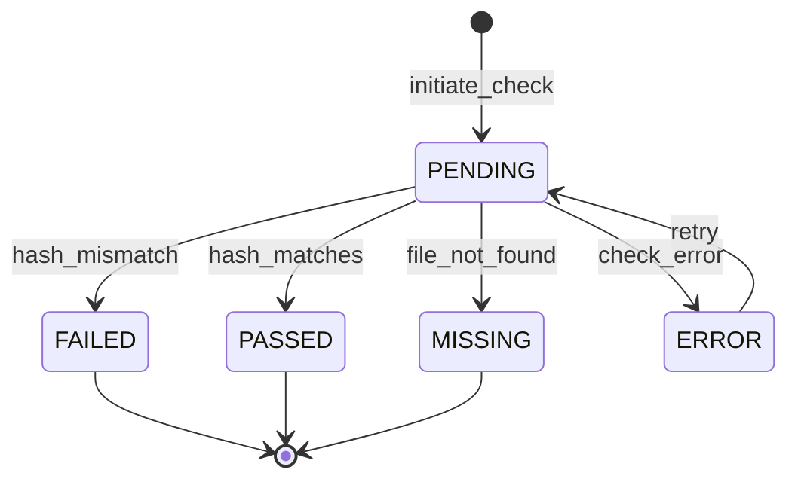

# Audit & Compliance Domain

## Overview

This domain handles **audit logging, chain of custody tracking, evidence integrity verification, and compliance reporting**, including **immutable event recording, tamper-proof evidence handling, regulatory compliance checks, and forensic audit trails**.

It acts as **a core foundational service** that provides accountability, traceability, and legal admissibility across the entire Sentinel360 platform.

---

## Use Cases

---

### UC-AC-01: Record Audit Event

- **Purpose**: Capture and persist an immutable audit log entry for any system action
- **Actors**: System (triggered automatically by other domains)
- **Preconditions**: A domain event has been emitted

#### Main Success Flow

1. System receives a domain event (e.g., `USER_LOGGED_IN`, `EVIDENCE_UPLOADED`, `CASE_UPDATED`)
2. System extracts event metadata: actor, action, target, timestamp, IP, user agent
3. System generates a cryptographic hash of the log entry payload
4. System persists the audit log entry as an immutable, append-only record
5. System chains the hash with the previous entry's hash (hash chain)
6. System indexes the entry for efficient querying

#### Alternate / Exception Flows

- **Missing required fields** → System logs a warning and persists with available data, flagging as `INCOMPLETE`
- **Storage failure** → System queues the event for retry; emits `AUDIT_WRITE_FAILURE` alert
- **Hash chain broken** → System emits `INTEGRITY_VIOLATION` alert to Super Admin

#### Result

Immutable, hash-chained audit log entry persisted and indexed.

---

### UC-AC-02: Query Audit Logs

- **Purpose**: Search and retrieve audit log entries with filters
- **Actors**: Administrator, Super Administrator, Law Enforcement (with permission)
- **Preconditions**: Actor has `VIEW_AUDIT_LOGS` permission

#### Main Success Flow

1. Actor submits query with filters (actor, action type, target entity, date range, domain)
2. System validates permissions
3. System executes query against the audit log index
4. System returns paginated results with metadata
5. System records that the audit log was queried (meta-audit)

#### Alternate / Exception Flows

- **Insufficient permissions** → 403 Forbidden
- **Invalid date range** → 422 Unprocessable Entity
- **No results** → 200 OK with empty array

#### Result

Paginated audit log entries returned; query action itself is audited.

---

### UC-AC-03: Establish Chain of Custody

- **Purpose**: Create a chain of custody record when evidence is created or transferred
- **Actors**: System, Security Operator, Law Enforcement Officer
- **Preconditions**: Evidence item exists in the system

#### Main Success Flow

1. Evidence is created or transferred between parties
2. System records a custody event: who, what, when, from whom, to whom, reason
3. System calculates and stores the evidence file hash (SHA-256)
4. System creates a custody chain entry linked to the evidence
5. System emits `CUSTODY_TRANSFERRED` event
6. System records audit log entry

#### Alternate / Exception Flows

- **Evidence not found** → 404 Not Found
- **Hash mismatch on transfer** → System rejects transfer; emits `EVIDENCE_TAMPERED` alert
- **Missing custody reason** → 422: "Custody transfer reason is required"

#### Result

Chain of custody entry recorded with cryptographic evidence hash.

---

### UC-AC-04: Verify Evidence Integrity

- **Purpose**: Verify that evidence has not been tampered with since collection
- **Actors**: Law Enforcement Officer, Administrator, System (automated)
- **Preconditions**: Evidence exists with an initial hash record

#### Main Success Flow

1. Actor or system initiates integrity check for an evidence item
2. System retrieves the current file from storage
3. System calculates SHA-256 hash of the current file
4. System compares with the hash recorded at time of ingestion
5. System records the verification result
6. If valid → System marks integrity check as `PASSED`
7. System emits `INTEGRITY_CHECK_COMPLETED` event

#### Alternate / Exception Flows

- **Hash mismatch** → System marks as `FAILED`; emits `EVIDENCE_TAMPERED` alert; notifies Super Admin
- **Evidence file missing** → System marks as `MISSING`; emits `EVIDENCE_MISSING` alert
- **Storage access failure** → System retries; logs failure

#### Result

Evidence integrity status recorded; alerts generated if tampered or missing.

---

### UC-AC-05: Generate Compliance Report

- **Purpose**: Generate a compliance report for a specific time period or case
- **Actors**: Administrator, Super Administrator
- **Preconditions**: Actor has `GENERATE_REPORTS` permission

#### Main Success Flow

1. Actor requests compliance report with parameters (date range, scope, report type)
2. System validates parameters
3. System aggregates audit data: access logs, evidence handling, policy violations
4. System compiles the report with summary statistics and detailed entries
5. System generates the report in requested format (PDF, CSV)
6. System stores the report and emits `REPORT_GENERATED` event
7. System records audit log entry

#### Alternate / Exception Flows

- **Insufficient permissions** → 403 Forbidden
- **Date range too large** → 422: "Maximum report period is 1 year"
- **No data for period** → Report generated with zero entries and a note

#### Result

Compliance report generated, stored, and available for download.

---

### UC-AC-06: Detect Audit Integrity Violation

- **Purpose**: Automatically detect tampering with the audit log itself
- **Actors**: System (scheduled job)
- **Preconditions**: Audit log entries exist with hash chain

#### Main Success Flow

1. System initiates periodic integrity check (e.g., hourly)
2. System walks the hash chain from a random starting point
3. System verifies each entry's hash matches the expected chain
4. If all entries valid → System records `AUDIT_INTEGRITY_CHECK_PASSED`
5. System updates last verified checkpoint

#### Alternate / Exception Flows

- **Hash chain break detected** → System emits `AUDIT_TAMPER_DETECTED` critical alert; notifies all Super Admins
- **Missing entries in chain** → System emits `AUDIT_ENTRIES_MISSING` alert

#### Result

Audit log integrity verified or violation detected and escalated.

---

### UC-AC-07: Export Audit Trail for Legal Proceedings

- **Purpose**: Export a certified, tamper-proof audit trail for use in legal proceedings
- **Actors**: Law Enforcement Officer, Super Administrator
- **Preconditions**: Actor has `EXPORT_AUDIT_TRAIL` permission; case exists

#### Main Success Flow

1. Actor requests audit trail export for a specific case or evidence item
2. System gathers all related audit entries, custody records, and integrity checks
3. System compiles a complete chronological timeline
4. System generates a digitally signed export package (PDF + JSON)
5. System includes hash verification certificates
6. System records the export action in audit log

#### Alternate / Exception Flows

- **Case not found** → 404 Not Found
- **Insufficient permissions** → 403 Forbidden

#### Result

Digitally signed audit trail package generated for legal use.

---

## Core Entities

---

### Entity: AuditLogEntry

- **Description**: An immutable record of a system action or event

#### Fields

- `id`: UUID — Unique identifier
- `event_type`: String — Event code (e.g., `USER_LOGGED_IN`, `EVIDENCE_UPLOADED`)
- `domain`: String — Originating domain (e.g., `IDENTITY`, `INCIDENT`)
- `actor_id`: UUID (nullable) — User who performed the action (null for system actions)
- `actor_type`: Enum — `USER`, `SYSTEM`, `EXTERNAL`
- `target_entity_type`: String — Type of affected entity
- `target_entity_id`: UUID — ID of the affected entity
- `action`: String — Human-readable action description
- `payload`: JSONB — Snapshot of relevant data (sensitive fields redacted)
- `ip_address`: String (nullable) — Client IP address
- `user_agent`: String (nullable) — Client user agent
- `entry_hash`: String — SHA-256 hash of this entry's content
- `previous_hash`: String — Hash of the previous audit entry (hash chain)
- `status`: Enum — `COMPLETE`, `INCOMPLETE`
- `created_at`: Timestamp — When the event occurred

#### Constraints

- Entries are **immutable** — no updates or deletes allowed
- `entry_hash` must be computed deterministically from entry content
- `previous_hash` must reference the immediately preceding entry's hash
- `created_at` must be server-side UTC timestamp (not client-provided)

#### Relationships

- References `User` as actor (optional)
- References target entity polymorphically

---

### Entity: CustodyChainEntry

- **Description**: Records a transfer or access event in the chain of custody for evidence

#### Fields

- `id`: UUID — Unique identifier
- `evidence_id`: UUID — Reference to the evidence item
- `evidence_type`: String — Type of evidence (video, image, document)
- `action`: Enum — `CREATED`, `ACCESSED`, `TRANSFERRED`, `EXPORTED`, `ARCHIVED`, `DELETED`
- `from_user_id`: UUID (nullable) — User transferring custody (null for creation)
- `to_user_id`: UUID (nullable) — User receiving custody (null for access/export)
- `reason`: String — Reason for custody action
- `evidence_hash`: String — SHA-256 hash of evidence file at time of action
- `location`: String (nullable) — Physical or logical location
- `metadata`: JSONB — Additional context
- `created_at`: Timestamp

#### Constraints

- Entries are **immutable** — append-only
- `evidence_hash` must be computed from the actual file
- `reason` is required for all transfer actions

#### Relationships

- References evidence item (cross-domain)
- References `User` for from/to parties

---

### Entity: IntegrityCheck

- **Description**: Records the result of an evidence or audit integrity verification

#### Fields

- `id`: UUID — Unique identifier
- `target_type`: Enum — `EVIDENCE`, `AUDIT_LOG`
- `target_id`: UUID — ID of the checked entity
- `expected_hash`: String — Hash recorded at creation
- `actual_hash`: String — Hash computed during check
- `status`: Enum — `PASSED`, `FAILED`, `MISSING`, `ERROR`
- `checked_by`: UUID (nullable) — User who initiated check (null for automated)
- `check_type`: Enum — `MANUAL`, `SCHEDULED`, `ON_ACCESS`
- `notes`: String (nullable) — Additional notes
- `created_at`: Timestamp

#### Constraints

- Check results are immutable
- `FAILED` or `MISSING` status must trigger alerts

#### Relationships

- References target entity polymorphically
- References `User` as checker (optional)

---

### Entity: ComplianceReport

- **Description**: A generated compliance or audit report

#### Fields

- `id`: UUID — Unique identifier
- `report_type`: Enum — `COMPLIANCE_SUMMARY`, `ACCESS_AUDIT`, `EVIDENCE_HANDLING`, `FULL_AUDIT`
- `title`: String — Report title
- `date_range_start`: Timestamp — Report period start
- `date_range_end`: Timestamp — Report period end
- `scope`: JSONB — Report scope parameters
- `summary`: JSONB — Summary statistics
- `file_url`: String — URL to generated report file
- `file_hash`: String — SHA-256 hash of generated file
- `format`: Enum — `PDF`, `CSV`, `JSON`
- `generated_by`: UUID — User who generated the report
- `status`: Enum — `GENERATING`, `COMPLETED`, `FAILED`
- `created_at`: Timestamp

#### Constraints

- Reports are immutable once `COMPLETED`
- File hash must be computed and stored

#### Relationships

- References `User` as generator

---

## State Machines

### Integrity Check Lifecycle

---

### States

| State     | Description                                  |
| --------- | -------------------------------------------- |
| `PENDING` | Integrity check initiated, awaiting result   |
| `PASSED`  | Hash matches — evidence integrity confirmed  |
| `FAILED`  | Hash mismatch — potential tampering detected |
| `MISSING` | Evidence file not found in storage           |
| `ERROR`   | Technical error during check                 |

---

### Transitions & Guards

| From → To         | Event          | Condition                             |
| ----------------- | -------------- | ------------------------------------- |
| PENDING → PASSED  | hash_matches   | Current hash equals stored hash       |
| PENDING → FAILED  | hash_mismatch  | Current hash differs from stored hash |
| PENDING → MISSING | file_not_found | File does not exist in storage        |
| PENDING → ERROR   | check_error    | Technical failure during verification |
| ERROR → PENDING   | retry          | Retry count < max retries             |

---

## Business Rules (Invariants)

1. **Immutability**: Audit log entries and custody chain entries can never be modified or deleted
2. **Hash chain integrity**: Each audit entry's hash must incorporate the previous entry's hash
3. **Evidence hash at every transfer**: A SHA-256 hash must be computed and recorded at every custody event
4. **Mandatory custody reason**: All custody transfers must include a documented reason
5. **Automated integrity checks**: Evidence integrity must be verified on every access and periodically (configurable interval)
6. **Alert on tampering**: Any hash mismatch must immediately generate a critical alert
7. **Meta-auditing**: Queries and exports of audit data must themselves be audited
8. **Retention policy**: Audit logs must be retained for a minimum of 7 years (configurable)
9. **Timestamp authority**: All audit timestamps must be server-generated UTC; client timestamps are recorded as metadata only
10. **Redaction**: Sensitive data (passwords, tokens) must be redacted from audit payloads

---

## Processing Flows

### Audit Event Recording Flow

1. Receive domain event from event bus
2. Extract metadata: actor, action, target, context
3. Redact sensitive fields from payload
4. Retrieve hash of previous audit entry
5. Compute SHA-256 hash of current entry + previous hash
6. Persist immutable audit entry
7. Update hash chain pointer
8. Index entry for search

### Chain of Custody Flow

1. Evidence action occurs (create, access, transfer, export)
2. System identifies current custodian
3. System computes SHA-256 hash of evidence file
4. System creates custody chain entry
5. If transfer: validate both parties exist and have permission
6. Record custody event with hash, parties, reason, timestamp
7. Emit `CUSTODY_TRANSFERRED` event
8. Record audit log entry

### Evidence Integrity Verification Flow

1. Retrieve evidence file from storage
2. Compute SHA-256 hash of current file
3. Retrieve original hash from custody chain (creation entry)
4. Compare hashes
5. Record IntegrityCheck result
6. If mismatch: emit `EVIDENCE_TAMPERED` critical alert
7. If missing: emit `EVIDENCE_MISSING` alert

### Compliance Report Generation Flow

1. Validate report parameters and permissions
2. Query audit logs for specified date range and scope
3. Aggregate statistics (event counts by type, actor activity, evidence handling)
4. Compile detailed entries chronologically
5. Generate report file (PDF/CSV)
6. Compute and store file hash
7. Persist report record
8. Emit `REPORT_GENERATED` event

---

## Interfaces

### Audit Log View

- **Filters**: Event type, domain, actor, target entity, date range, status
- **Columns**: Timestamp, Event Type, Actor, Target, Action, Domain
- **Sorting**: By timestamp (default: descending)
- **Pagination**: 50 per page, cursor-based

### Chain of Custody View

- **Filters**: Evidence ID, action type, date range, custodian
- **Columns**: Timestamp, Action, From, To, Reason, Hash Status
- **Sorting**: Chronological (ascending)
- **Detail**: Full timeline visualization per evidence item

### Integrity Dashboard

- **Summary cards**: Total checks, passed, failed, missing
- **Charts**: Integrity check trends over time
- **Alerts**: Active integrity violations
- **Actions**: Run manual check, export report

### Compliance Report View

- **Filters**: Report type, date range, status
- **Columns**: Title, Type, Period, Generated By, Status, Date
- **Actions**: Generate new report, download, view details

---

## Notifications

| Event                  | Recipient               | Channel               | Message                                                       |
| ---------------------- | ----------------------- | --------------------- | ------------------------------------------------------------- |
| EVIDENCE_TAMPERED      | Super Admin, Case Owner | Email + Push + In-app | "CRITICAL: Evidence integrity check FAILED for {evidence_id}" |
| EVIDENCE_MISSING       | Super Admin, Case Owner | Email + Push + In-app | "ALERT: Evidence file missing for {evidence_id}"              |
| AUDIT_TAMPER_DETECTED  | All Super Admins        | Email + Push + SMS    | "CRITICAL: Audit log integrity violation detected"            |
| CUSTODY_TRANSFERRED    | From User, To User      | In-app                | "Evidence {evidence_id} custody transferred to {to_user}"     |
| REPORT_GENERATED       | Requesting User         | In-app                | "Compliance report '{title}' is ready for download"           |
| INTEGRITY_CHECK_PASSED | (logged only)           | —                     | —                                                             |

---

## Audit Logging

- All audit log queries (meta-auditing)
- All audit trail exports
- All custody chain events
- All integrity check results
- All compliance report generations
- All permission checks for audit access

Includes:

- **Actor**: User ID or `SYSTEM`
- **Timestamp**: ISO 8601 UTC
- **Action**: Event code
- **Target**: Affected entity ID and type
- **Payload snapshot**: Relevant data (sensitive fields redacted)
- **IP Address**: Client IP
- **Hash**: Entry hash for chain integrity

---

## Invariants

1. Audit entries are immutable — no update or delete operations exist
2. Hash chain must be continuous and verifiable
3. Evidence integrity must be verifiable at any point in time
4. Chain of custody must have no gaps — every transfer is recorded
5. Compliance reports, once generated, cannot be modified
6. All access to audit data must itself be audited
