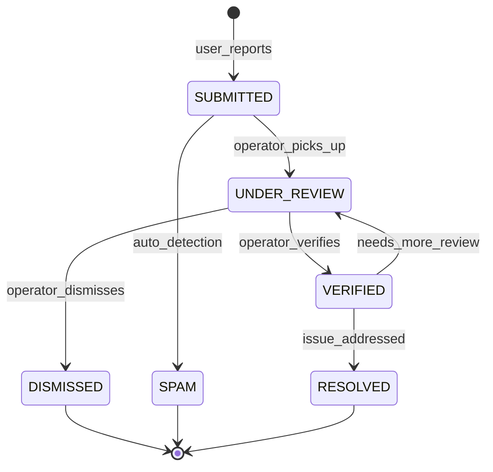
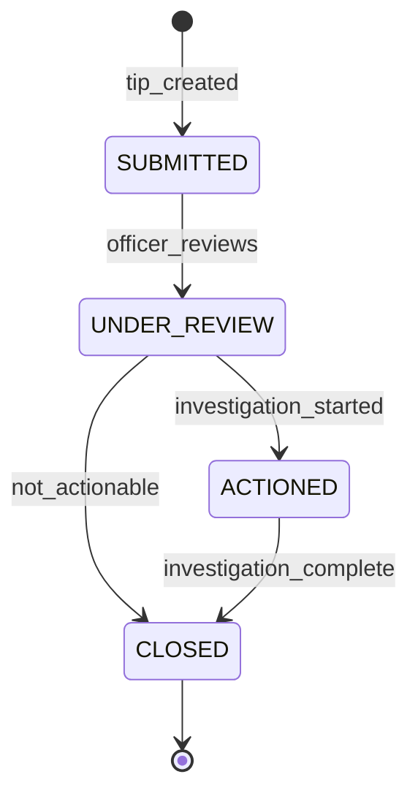

# Community Domain# Community Domain

6. Reference codes are unique and immutable5. Rate limits prevent submission spam4. Community feed never exposes sensitive investigation data3. Location-based alerts respect user-configured radius2. All user-generated content passes moderation before public display1. Anonymous submissions never contain traceable user identity## Invariants---- **Payload snapshot**: Sighting type, location (no personal data for anonymous)- **Target**: Sighting ID, tip reference, feed item ID- **Action**: Event code- **Timestamp**: ISO 8601 UTC- **Actor**: User ID (not stored for anonymous actions) or `SYSTEM`Includes:- Interaction tracking (helpful marks, shares)- User preference changes- Feed item publications- Community alert distributions- Content moderation actions- Anonymous tip submissions (no identity data)- Sighting status changes- Sighting submissions (excluding anonymous identity data)## Audit Logging---| COMMUNITY_ANNOUNCEMENT | All community members | In-app | "{title}: {body}" || SIGHTING_RESOLVED | Sighting reporter | In-app | "Your sighting #{ref} has been resolved" || SIGHTING_ACKNOWLEDGED | Sighting reporter | In-app | "Your sighting #{ref} has been acknowledged" || SIGHTING_STATUS_UPDATE | Sighting reporter | Push + In-app | "Your sighting #{ref} has been {status}" || SIGHTING_NEARBY | Opted-in community members | Push | "New sighting reported near you: {type}" || PUBLIC_SAFETY_ALERT | Community members in area | Push + In-app | "Safety Alert: {title} in {area}" ||-------|-----------|---------|---------|| Event | Recipient | Channel | Message |## Notifications---- **Privacy**: Visibility level configuration- **Notifications**: Toggle alert types, set radius, quiet hours- **Location**: Home address/neighborhood setup### Community Settings- **Radius**: User's configured alert radius visualized- **Details**: Tap for alert details, safety instructions, share- **Map view**: Active alerts plotted by location### Safety Alerts Map- **Actions**: View status, add additional info (if under review)- **Detail**: Individual sighting with timeline of status updates- **List**: User's submitted sightings with status badges### My Sightings- **Confirmation**: Reference code for follow-up- **Privacy notice**: Clear statement about anonymity guarantees- **Form**: Minimal — text description, optional media, optional location### Anonymous Tip Screen- **Confirmation**: Reference code displayed after submission- **Preview**: Preview before submission- **Privacy**: Option to submit anonymously- **Form**: Type selector, description field, location picker (GPS or manual), media upload, date/time### Report Sighting Screen- **Actions**: Mark helpful, share, report content- **Location**: Map toggle showing nearby items- **Filters**: By type, distance, date- **Content types**: Alerts (red), sightings (orange), resolved (green), tips (blue), announcements- **Layout**: Scrollable card-based feed### Community Feed (Mobile + Web)## Interfaces---7. Record delivery stats6. Dispatch push notifications to affected users5. Create community feed item4. Filter by notification preferences (push enabled, alert radius)3. Query community members within the area2. Determine affected geographic area1. Receive public safety alert from Security Operations### Community Alert Distribution Flow6. No notification to submitter (preserving anonymity)5. Route to Law Enforcement queue4. Generate unique reference code3. Create anonymous tip record with no user reference2. Strip EXIF data from media1. Strip all identifying metadata from submission### Anonymous Tip Flow9. Emit `SIGHTING_SUBMITTED` event8. Notify nearby community members (if opted in)7. Route to Security Operations queue6. Compute media file hashes5. If moderation flags: hold for manual review4. If moderation passes: create sighting with `SUBMITTED` status3. Run content moderation on text and media2. Process and optimize attached media1. Validate input fields and location### Sighting Submission Flow## Processing Flows---10. **Moderation speed**: Flagged content must be reviewed within configurable SLA (default: 2 hours)9. **Privacy enforcement**: User privacy level settings must be respected in all community interactions8. **Reference codes**: All community submissions get a unique reference code for tracking7. **Rate limiting**: Maximum 5 sighting submissions per user per hour to prevent spam6. **No investigation details**: Community feed must never expose sensitive investigation details5. **Geo-fenced notifications**: Community members only receive location-based alerts within their configured radius4. **Metadata stripping**: Anonymous submissions must have all identifying metadata removed from media3. **Location requirement**: Sightings require a location for routing and notification2. **Content moderation**: All community-submitted content must pass moderation before public display1. **Anonymity protection**: Anonymous tips and sightings must never be linked to a user identity## Business Rules (Invariants)---| ACKNOWLEDGED → RESOLVED | resolved_directly | Issue addressed without formal incident || ACKNOWLEDGED → LINKED_TO_INCIDENT | escalated | Incident created or existing incident linked || UNDER_REVIEW → DISMISSED | operator_dismisses | Reason provided || UNDER_REVIEW → ACKNOWLEDGED | operator_acknowledges | Review completed; valid sighting || SUBMITTED → UNDER_REVIEW | operator_picks_up | Operator has `REVIEW_SIGHTINGS` permission ||-----------|-------|-----------|| From → To | Event | Condition |### Transitions & Guards---| `DISMISSED` | Sighting dismissed (false alarm, insufficient info) || `RESOLVED` | Sighting resolved || `LINKED_TO_INCIDENT` | Sighting escalated and linked to a formal incident || `ACKNOWLEDGED` | Sighting verified and acknowledged by operator || `UNDER_REVIEW` | Security operator is reviewing the sighting || `SUBMITTED` | Sighting reported by community member; awaiting review ||-------|-------------|| State | Description |### States---`  RESOLVED --> [*]  DISMISSED --> [*]  LINKED_TO_INCIDENT --> RESOLVED: incident_resolved  ACKNOWLEDGED --> RESOLVED: resolved_directly  ACKNOWLEDGED --> LINKED_TO_INCIDENT: escalated  UNDER_REVIEW --> DISMISSED: operator_dismisses  UNDER_REVIEW --> ACKNOWLEDGED: operator_acknowledges  SUBMITTED --> UNDER_REVIEW: operator_picks_up  [*] --> SUBMITTED: user_reportsstateDiagram-v2`mermaid### Community Sighting Lifecycle## State Machines---- Belongs to `User`#### Relationships- `privacy_level` controls what other community members can see about the user- `alert_radius_km` must be between 1 and 50#### Constraints- `updated_at`: Timestamp- `created_at`: Timestamp- `privacy_level`: Enum — `PUBLIC`, `NEIGHBORHOOD_ONLY`, `PRIVATE`- `sighting_notifications_enabled`: Boolean — Whether nearby sighting notifications are on- `feed_notifications_enabled`: Boolean — Whether feed update notifications are on- `push_alerts_enabled`: Boolean — Whether push alerts are enabled- `alert_radius_km`: Float — Alert radius in kilometers (default: 5)- `home_location`: JSONB — Home neighborhood `{lat, lng, address}`- `user_id`: UUID — Reference to user- `id`: UUID — Unique identifier#### Fields- **Description**: Community member's personalized settings### Entity: CommunityPreference---- References source entity (polymorphic)#### Relationships- Expired items are hidden from feed but not deleted- Location-filtered items require `location` and `radius_km`- Public content only — no sensitive investigation details#### Constraints- `created_at`: Timestamp- `helpful_count`: Integer — Number of "helpful" interactions- `expires_at`: Timestamp (nullable) — When the item should stop appearing- `published_at`: Timestamp- `is_pinned`: Boolean — Whether the item is pinned to top of feed- `source_entity_id`: UUID (nullable) — Reference to source entity- `radius_km`: Float (nullable) — Visibility radius for location-based filtering- `location`: JSONB (nullable) — Relevant location- `media_url`: String (nullable) — Featured image/video URL- `body`: String — Content body- `title`: String — Feed item title- `item_type`: Enum — `PUBLIC_ALERT`, `RESOLVED_INCIDENT`, `COMMUNITY_SIGHTING`, `SAFETY_TIP`, `ANNOUNCEMENT`- `id`: UUID — Unique identifier#### Fields- **Description**: An item in the community feed### Entity: CommunityFeedItem---- Optionally linked to `Case`#### Relationships- Reference code is the only way to follow up- All metadata stripped from attached media- No user identity information stored or linked#### Constraints- `created_at`: Timestamp- `linked_case_id`: UUID (nullable) — Linked case if actionable- `review_notes`: String (nullable) — Internal review notes (not visible to submitter)- `status`: Enum — `SUBMITTED`, `UNDER_REVIEW`, `ACTIONED`, `DISMISSED`- `location`: JSONB (nullable) — Location if provided- `media_ids`: JSONB (nullable) — Attached media (metadata stripped)- `content`: String — Tip description- `reference_code`: String — Unique tip reference code- `id`: UUID — Unique identifier#### Fields- **Description**: An anonymous tip submitted by a community member### Entity: AnonymousTip---- Optionally linked to `Incident`- Has many `MediaAsset` (attached media)- Optionally reported by `User`#### Relationships- Media must pass content moderation before public display- Location is required- Anonymous sightings must not store `reporter_id`- `reference_code` must be unique and system-generated#### Constraints- `updated_at`: Timestamp- `created_at`: Timestamp- `moderation_status`: Enum — `PENDING`, `APPROVED`, `FLAGGED`, `REMOVED`- `linked_incident_id`: UUID (nullable) — Linked incident if escalated- `review_notes`: String (nullable) — Notes from reviewer (visible to reporter)- `status`: Enum — `SUBMITTED`, `UNDER_REVIEW`, `ACKNOWLEDGED`, `LINKED_TO_INCIDENT`, `RESOLVED`, `DISMISSED`- `media_ids`: JSONB (nullable) — Array of attached media asset IDs- `occurred_at`: Timestamp — When the sighting occurred- `location`: JSONB — Location `{lat, lng, address, neighborhood}`- `description`: String — Detailed description- `sighting_type`: Enum — `SUSPICIOUS_PERSON`, `SUSPICIOUS_VEHICLE`, `SUSPICIOUS_ACTIVITY`, `PROPERTY_CRIME`, `SAFETY_HAZARD`, `MISSING_PERSON`, `OTHER`- `is_anonymous`: Boolean — Whether the report is anonymous- `reporter_id`: UUID (nullable) — Reporter (null for anonymous)- `reference_code`: String — Public reference code (e.g., `SIGHT-2026-ABC123`)- `id`: UUID — Unique identifier#### Fields- **Description**: A community-reported sighting or safety concern### Entity: CommunitySighting---## Core Entities---Community profile and preferences updated.#### Result- **Invalid address** → 422: "Could not determine neighborhood from address"#### Alternate / Exception Flows4. Settings take effect immediately for feed and alert routing3. System validates and persists preferences2. User configures: home neighborhood, alert radius, notification preferences, privacy settings1. User accesses profile/settings#### Main Success Flow- **Preconditions**: User is authenticated- **Actors**: Community Member (authenticated)- **Purpose**: Allow community members to manage their neighborhood, alert preferences, and profile### UC-CM-07: Manage Community Profile and Preferences---Engagement recorded; metrics updated.#### Result- **Content removed** → 404: "This content is no longer available"#### Alternate / Exception Flows4. System updates engagement metrics3. System records interaction2. User optionally shares the item (within the platform or via share sheet)1. User marks a feed item as "helpful" or "relevant"#### Main Success Flow- **Preconditions**: User is authenticated- **Actors**: Community Member (authenticated)- **Purpose**: Allow community members to engage with feed content (helpful markers, sharing)### UC-CM-06: Interact with Community Content---User's sighting history displayed with current statuses.#### Result- **No sightings** → Empty state with prompt to report#### Alternate / Exception Flows4. System shows status: `SUBMITTED`, `UNDER_REVIEW`, `ACKNOWLEDGED`, `RESOLVED`, `DISMISSED`3. User can view individual sighting detail with timeline updates2. System returns user's sightings with current status1. User views their sightings list#### Main Success Flow- **Preconditions**: User has submitted at least one sighting- **Actors**: Community Member (authenticated)- **Purpose**: Allow community members to track the status of their submitted sightings### UC-CM-05: View Sighting Status---Location-targeted safety alert delivered to community members.#### Result- **Push disabled** → Alert appears in in-app feed only- **User outside affected area** → No notification (unless opted into system-wide alerts)#### Alternate / Exception Flows5. Users receive real-time alert with details and safety instructions4. System delivers alerts via push notification and in-app feed3. System creates push notifications for affected users2. System identifies community members in the affected area1. Security Operations or System generates a public safety alert (area evacuation, active incident, missing person)#### Main Success Flow- **Preconditions**: User has enabled location-based alerts- **Actors**: Community Member (authenticated, with push enabled)- **Purpose**: Deliver real-time safety alerts to community members based on location### UC-CM-04: Receive Public Safety Alert---Anonymous tip submitted with reference code; routed to law enforcement.#### Result- **Content moderation triggered** → Tip held for review before routing- **Empty tip** → 422: "Tip description is required"#### Alternate / Exception Flows6. System emits `ANONYMOUS_TIP_SUBMITTED` event5. System routes the tip to Law Enforcement review queue4. System generates a unique tip reference code for follow-up3. System creates an anonymous tip record (no link to user identity)2. System strips all identifying metadata from the submission1. User submits tip with description and optional media#### Main Success Flow- **Preconditions**: Tip submission feature is enabled- **Actors**: Community Member (authenticated or anonymous)- **Purpose**: Allow community members to submit anonymous tips about criminal activity### UC-CM-03: Submit Anonymous Tip---Sighting reported; routed to security operations for review; nearby users optionally notified.#### Result- **Anonymous report** → Allowed with reduced detail; flagged as `ANONYMOUS`- **Large media files** → Compress/optimize before upload; warn if over limit- **Inappropriate content** → Content moderation filter triggers; sighting held for review- **No location** → 422: "Location is required for sighting reports"#### Alternate / Exception Flows8. System records audit log7. System emits `SIGHTING_SUBMITTED` event6. System routes the sighting to the appropriate monitoring queue (Security Ops)5. System notifies nearby community members (opt-in)4. System processes attached media (upload, hash, thumbnail)3. System creates sighting record with status `SUBMITTED`2. System validates input fields1. User fills in sighting report: description, type, location (GPS or manual), time, attached media (photos/video)#### Main Success Flow- **Preconditions**: User is authenticated and has `REPORT_SIGHTING` permission- **Actors**: Community Member (authenticated)- **Purpose**: Allow community members to report suspicious activities or safety concerns### UC-CM-02: Report Community Sighting---Community feed displayed with location-relevant safety content.#### Result- **No feed items** → Display empty state with safety tips- **No location data** → Show system-wide public feed#### Alternate / Exception Flows5. System returns paginated feed items4. System orders by relevance and recency3. System filters content by user's location/neighborhood (if location enabled)2. System retrieves feed items: public safety alerts, resolved incidents (public view), community sightings, safety tips1. User opens the community feed#### Main Success Flow- **Preconditions**: Community app is accessible- **Actors**: Community Member (authenticated or anonymous for public-level content)- **Purpose**: Display a curated feed of public safety updates, alerts, and community sightings### UC-CM-01: View Community Feed---## Use Cases---It acts as **a user interface domain** that connects the general public with the Sentinel360 platform, enabling community-driven safety reporting and real-time public safety awareness.This domain handles **the public-facing community application** for civilians and community members, including **community news feeds, public safety alerts, sighting reports, anonymous tips, neighborhood watch features, and community engagement through the mobile and web apps**.## Overview

## Overview

This domain handles **public-facing community engagement features**, including **community feed with safety updates, public sighting reporting, neighborhood alert subscriptions, community safety resources, and anonymous tip submissions**.

It acts as **a user interface domain** that enables community members to actively participate in public safety by reporting sightings, receiving local alerts, and engaging with safety information through the Sentinel360 public mobile application.

---

## Use Cases

---

### UC-CM-01: View Community Safety Feed

- **Purpose**: Display a localized feed of safety updates, alerts, and community activity
- **Actors**: Community Member (authenticated or anonymous)
- **Preconditions**: None (public access with optional personalization for authenticated users)

#### Main Success Flow

1. User opens the community app
2. System determines user's location (GPS or configured neighborhood)
3. System fetches relevant feed items: safety alerts, resolved incidents (non-sensitive), community sightings, safety tips
4. System filters by geographic relevance and recency
5. System returns a paginated feed ordered by timestamp / relevance
6. System tracks engagement metrics (views, taps)

#### Alternate / Exception Flows

- **Location unavailable** → Prompt user to set neighborhood manually; show general feed
- **No content for area** → Display wider area content with note
- **Anonymous user** → Limited feed; prompt to sign up for full alerts

#### Result

Localized safety feed displayed to the community member.

---

### UC-CM-02: Report Community Sighting

- **Purpose**: Allow community members to report suspicious activity, safety hazards, or incidents
- **Actors**: Community Member (authenticated)
- **Preconditions**: User is authenticated and has `REPORT_SIGHTING` permission

#### Main Success Flow

1. User initiates a new sighting report
2. User provides details: type (suspicious person, suspicious vehicle, hazard, crime in progress, other), description, location (auto from GPS or manual pin), optional photos/video
3. System validates input
4. System creates sighting record with status `SUBMITTED`
5. System flags for moderation if content contains sensitive keywords
6. System emits `SIGHTING_REPORTED` event
7. System triggers alert to nearby community members and security operators
8. System records audit log

#### Alternate / Exception Flows

- **No location provided** → 422: "Location is required for sighting reports"
- **Media upload fails** → Sighting created without media; user prompted to retry upload
- **Spam detection** → Sighting flagged for moderation; not publicly visible until reviewed
- **Reporter is anonymous** → Sighting accepted but marked as unverified; lower visibility

#### Result

Community sighting submitted; visible to local users and routed to security operators.

---

### UC-CM-03: Receive Neighborhood Alerts

- **Purpose**: Send real-time alerts to community members in affected areas
- **Actors**: System (automated), Security Operator (manual broadcast)
- **Preconditions**: Community member has alert subscriptions configured

#### Main Success Flow

1. A relevant alert is generated (from AI detection, incident report, or manual broadcast)
2. System identifies community members in the affected geographic area
3. System filters by user alert preferences (types, severity, quiet hours)
4. System dispatches push notifications to subscribed users
5. System adds alert to community feed
6. System records delivery metrics

#### Alternate / Exception Flows

- **No subscribed users in area** → Alert posted to feed only
- **Alert is sensitive/restricted** → Only non-sensitive summary shared with community
- **User in quiet hours** → Queued for delivery after quiet hours (except CRITICAL)

#### Result

Neighborhood alert delivered to community members in affected area.

---

### UC-CM-04: Submit Anonymous Tip

- **Purpose**: Allow community members to submit anonymous tips about criminal activity
- **Actors**: Community Member (anonymous or authenticated choosing anonymous)
- **Preconditions**: None

#### Main Success Flow

1. User selects "Submit Anonymous Tip"
2. User provides tip category, description, optional location, optional media
3. System explicitly strips all identifying information from the submission
4. System assigns a random tip reference code (for follow-up without identity)
5. System creates tip record
6. System routes tip to appropriate law enforcement queue
7. System returns the reference code to the user

#### Alternate / Exception Flows

- **Tip contains personal identifiable information about tipster** → System attempts to strip; warns user
- **Empty or nonsensical tip** → 422: "Please provide a meaningful description"

#### Result

Anonymous tip submitted with reference code; routed to law enforcement without identifying data.

---

### UC-CM-05: Follow Up on Submitted Sighting

- **Purpose**: Allow community members to check the status of their sighting reports
- **Actors**: Community Member (authenticated)
- **Preconditions**: User has submitted at least one sighting

#### Main Success Flow

1. User accesses "My Sightings" section
2. System retrieves all sightings by the user
3. System displays sightings with current status (submitted, under review, verified, resolved, dismissed)
4. User can view details and any operator responses
5. User can add supplementary information to pending sightings

#### Alternate / Exception Flows

- **No sightings** → Empty state with prompt to report
- **Sighting linked to confidential case** → Status shown as "Under Review" without revealing case details

#### Result

User views status of their sighting reports with available updates.

---

### UC-CM-06: Configure Alert Subscriptions

- **Purpose**: Allow community members to customize which alerts they receive and for which areas
- **Actors**: Community Member (authenticated)
- **Preconditions**: User is authenticated

#### Main Success Flow

1. User accesses alert subscription settings
2. User configures:
   - Monitored areas (home, work, custom zones on map)
   - Alert types (crime, suspicious activity, hazards, community updates, weather)
   - Severity threshold (all, medium+, high+ only)
   - Notification channels (push, email)
   - Quiet hours
3. System validates and persists preferences
4. System applies preferences to future alert routing

#### Alternate / Exception Flows

- **No areas selected** → 422: "Select at least one monitored area"
- **Too many areas** → Limit to configurable max (default: 10)

#### Result

Alert subscriptions configured; future alerts filtered accordingly.

---

### UC-CM-07: View Community Safety Map

- **Purpose**: Display an interactive map showing recent incidents, sightings, and safety zones
- **Actors**: Community Member
- **Preconditions**: None

#### Main Success Flow

1. User opens the safety map
2. System loads the map centered on user's location
3. System overlays markers for: recent sightings (last 7 days), public incident locations (anonymized), safety zones, points of interest
4. User can filter by type, date range, and severity
5. User can tap markers for details
6. System displays heatmap layer showing incident density

#### Alternate / Exception Flows

- **Location unavailable** → Map centered on configured neighborhood or city center
- **No data in area** → Show empty map with message

#### Result

Interactive safety map displayed with community incidents and sightings.

---

## Core Entities

---

### Entity: CommunitySighting

- **Description**: A community-reported observation of suspicious or safety-relevant activity

#### Fields

- `id`: UUID — Unique identifier
- `reporter_id`: UUID — Community member who reported
- `sighting_type`: Enum — `SUSPICIOUS_PERSON`, `SUSPICIOUS_VEHICLE`, `HAZARD`, `CRIME_IN_PROGRESS`, `MISSING_PERSON`, `OTHER`
- `title`: String — Short description
- `description`: String — Detailed description
- `location`: JSONB — GPS coordinates `{lat, lng, address}`
- `media_ids`: JSONB (nullable) — Array of attached media asset IDs
- `status`: Enum — `SUBMITTED`, `UNDER_REVIEW`, `VERIFIED`, `RESOLVED`, `DISMISSED`, `SPAM`
- `severity`: Enum (nullable) — `LOW`, `MEDIUM`, `HIGH` (set during review)
- `visibility`: Enum — `PUBLIC`, `RESTRICTED`, `HIDDEN`
- `operator_notes`: String (nullable) — Notes from reviewing operator (not visible to public)
- `linked_incident_id`: UUID (nullable) — Linked to formal incident if escalated
- `moderation_status`: Enum — `PENDING`, `APPROVED`, `REJECTED`
- `moderation_reason`: String (nullable) — Reason for moderation action
- `reported_at`: Timestamp
- `created_at`: Timestamp
- `updated_at`: Timestamp

#### Constraints

- Location is required
- Description minimum 10 characters
- `SPAM` status permanently hides the sighting
- Only `APPROVED` sightings are publicly visible

#### Relationships

- Reported by `User`
- Has many `SightingComment`
- Optionally linked to `Incident` (cross-domain)
- Has many `MediaAsset` (cross-domain)

---

### Entity: SightingComment

- **Description**: A community comment on a sighting

#### Fields

- `id`: UUID — Unique identifier
- `sighting_id`: UUID — Reference to sighting
- `author_id`: UUID — Comment author
- `content`: String — Comment text
- `is_operator_response`: Boolean — Whether from an official operator
- `status`: Enum — `VISIBLE`, `HIDDEN`, `FLAGGED`
- `created_at`: Timestamp

#### Constraints

- Content must be sanitized (no HTML injection)
- Maximum 500 characters
- Rate limit: 5 comments per sighting per user per hour

#### Relationships

- Belongs to `CommunitySighting`
- Belongs to `User`

---

### Entity: AnonymousTip

- **Description**: An anonymous tip submitted by a community member

#### Fields

- `id`: UUID — Unique identifier
- `reference_code`: String — Random code for anonymous follow-up (e.g., `TIP-A3F9K2`)
- `category`: Enum — `DRUG_ACTIVITY`, `THEFT`, `VIOLENCE`, `GANG_ACTIVITY`, `FRAUD`, `MISSING_PERSON`, `OTHER`
- `description`: String — Tip content
- `location`: JSONB (nullable) — Optional location
- `media_ids`: JSONB (nullable) — Attached media (stripped of EXIF data)
- `status`: Enum — `SUBMITTED`, `UNDER_REVIEW`, `ACTIONED`, `CLOSED`
- `priority`: Enum (nullable) — Assigned during review
- `assigned_to`: UUID (nullable) — Assigned law enforcement officer
- `created_at`: Timestamp
- `updated_at`: Timestamp

#### Constraints

- No field may contain or reference the tipster's identity
- `reference_code` must be unique and randomly generated
- EXIF data must be stripped from all uploaded media
- No IP address logged for tip creation

#### Relationships

- Optionally assigned to `User` (law enforcement)
- Has many `MediaAsset` (cross-domain, EXIF-stripped)

---

### Entity: AlertSubscription

- **Description**: A community member's alert subscription configuration

#### Fields

- `id`: UUID — Unique identifier
- `user_id`: UUID — Reference to community member
- `monitored_areas`: JSONB — Array of geographic zones `[{name, center, radius_km}]`
- `alert_types`: JSONB — Subscribed alert types
- `severity_threshold`: Enum — `ALL`, `MEDIUM_PLUS`, `HIGH_PLUS`, `CRITICAL_ONLY`
- `channels`: JSONB — `{push: true, email: false}`
- `quiet_hours`: JSONB (nullable) — `{start: "22:00", end: "07:00", timezone}`
- `is_active`: Boolean
- `created_at`: Timestamp
- `updated_at`: Timestamp

#### Constraints

- Maximum 10 monitored areas
- At least one channel must be enabled

#### Relationships

- Belongs to `User`

---

### Entity: CommunityFeedItem

- **Description**: An item displayed in the community safety feed

#### Fields

- `id`: UUID — Unique identifier
- `item_type`: Enum — `ALERT`, `SIGHTING`, `SAFETY_TIP`, `INCIDENT_RESOLVED`, `COMMUNITY_UPDATE`
- `title`: String — Feed item title
- `summary`: String — Short summary
- `content`: String (nullable) — Full content
- `location`: JSONB (nullable) — Location relevance
- `media_url`: String (nullable) — Associated image/thumbnail
- `action_url`: String (nullable) — Link to full details
- `source_entity_id`: UUID (nullable) — Reference to source entity
- `source_entity_type`: String (nullable) — Type of source entity
- `visibility_radius_km`: Float — How far from event this item is shown
- `expires_at`: Timestamp (nullable) — When item drops out of feed
- `created_at`: Timestamp

#### Constraints

- Feed items must not contain sensitive investigation details
- Incident information must be anonymized for public display

#### Relationships

- References source entity polymorphically

---

## State Machines

### Community Sighting Lifecycle

### Anonymous Tip Lifecycle

---

### States — Sighting

| State          | Description                                                       |
| -------------- | ----------------------------------------------------------------- |
| `SUBMITTED`    | Sighting submitted by community member; pending moderation/review |
| `UNDER_REVIEW` | Operator is reviewing the sighting                                |
| `VERIFIED`     | Sighting verified as legitimate                                   |
| `RESOLVED`     | Underlying issue has been addressed                               |
| `DISMISSED`    | Sighting determined not actionable                                |
| `SPAM`         | Detected or reported as spam                                      |

### States — Tip

| State          | Description                       |
| -------------- | --------------------------------- |
| `SUBMITTED`    | Tip submitted; pending review     |
| `UNDER_REVIEW` | Law enforcement reviewing the tip |
| `ACTIONED`     | Tip led to investigative action   |
| `CLOSED`       | Tip processing complete           |

---

### Transitions & Guards

| From → To                | Event              | Condition                                  |
| ------------------------ | ------------------ | ------------------------------------------ |
| SUBMITTED → UNDER_REVIEW | operator_picks_up  | Operator has `REVIEW_SIGHTINGS` permission |
| UNDER_REVIEW → VERIFIED  | operator_verifies  | Sighting confirms legitimate concern       |
| UNDER_REVIEW → DISMISSED | operator_dismisses | Reason provided                            |
| VERIFIED → RESOLVED      | issue_addressed    | Resolution description provided            |
| SUBMITTED → SPAM         | auto_detection     | ML spam detector confidence ≥ 0.9          |

---

## Business Rules (Invariants)

1. **Anonymous tip privacy**: No identifying information (IP, device ID, user ID) is stored with anonymous tips
2. **Content moderation**: All community sightings must pass moderation before public visibility
3. **EXIF stripping**: All media uploaded with anonymous tips must have EXIF/metadata stripped
4. **Location requirement**: Sightings require location for geographic routing and display
5. **Sensitive data protection**: Public feed items must not contain investigation details, suspect identities, or evidence data
6. **Spam prevention**: Rate limiting on sighting reports (max 5 per user per hour)
7. **Geographic relevance**: Feed items and alerts are filtered by geographic proximity to the user
8. **Comment moderation**: Offensive or harmful comments are auto-flagged and hidden pending review
9. **Incident escalation**: Verified sightings can be escalated to formal incidents (cross-domain)
10. **Audit for operators**: All moderation and review actions by operators are audited

---

## Processing Flows

### Sighting Submission Flow

1. Validate user authentication and rate limits
2. Validate required fields (type, description, location)
3. Process and store uploaded media
4. Create sighting record with `SUBMITTED` status
5. Run auto-moderation (spam detection, content filtering)
6. If auto-approved: set visibility to `PUBLIC`; add to community feed
7. If flagged: set moderation_status to `PENDING`; queue for review
8. Notify nearby community members
9. Route to security operator queue
10. Record audit log

### Anonymous Tip Flow

1. Accept tip without authentication
2. Strip all identifying metadata from request (IP, user agent not logged)
3. Strip EXIF from uploaded media
4. Generate random reference code
5. Create anonymized tip record
6. Route to law enforcement review queue
7. Return reference code to submitter

### Feed Generation Flow

1. Determine user's location (GPS or configured areas)
2. Query feed items within relevance radius
3. Apply user's alert type and severity preferences
4. Sort by relevance score (recency × proximity × severity)
5. Return paginated feed
6. Track engagement metrics (impressions, taps)

### Community Alert Dispatch Flow

1. Receive alert event from Alert domain
2. Determine affected geographic area
3. Query community members with active subscriptions covering the area
4. Filter by subscription preferences (types, severity, channels)
5. Create feed item for the community feed
6. Dispatch push notifications to subscribed users
7. Record delivery metrics

---

## Interfaces

### Community Feed (Mobile App)

- **Layout**: Scrollable card feed with pull-to-refresh
- **Cards**: Title, summary, type badge, time, distance, thumbnail
- **Filters**: Type, severity, date
- **Actions**: Tap for detail, share, report, follow up

### Report Sighting Screen

- **Form**: Type selector, description, location map picker, media upload (photo/video)
- **Location**: Auto-detect GPS with manual adjustment
- **Media**: Camera capture or gallery upload (up to 5 items)
- **Actions**: Submit, save draft

### Safety Map

- **Map**: Interactive map with clustered markers
- **Layers**: Sightings, incidents, safety zones, heatmap
- **Filters**: Type, date range, severity
- **Detail**: Tap marker for summary popup

### My Sightings

- **List**: User's submitted sightings with status badges
- **Detail**: Full sighting details, status timeline, operator responses
- **Actions**: Add supplementary info, delete own sighting (if unreviewed)

### Anonymous Tip Submission

- **Form**: Category, description, optional location, optional media
- **Privacy notice**: Clear explanation of anonymity protections
- **Result**: Reference code displayed (advised to save)
- **Follow-up**: Check status by reference code

### Alert Subscription Settings

- **Map**: Draw/configure monitored areas
- **Toggles**: Alert type checkboxes
- **Severity**: Slider or selector
- **Channels**: Push/email toggles
- **Quiet hours**: Time picker

---

## Notifications

| Event                  | Recipient                        | Channel                      | Message                                       |
| ---------------------- | -------------------------------- | ---------------------------- | --------------------------------------------- |
| SIGHTING_NEARBY        | Nearby community members         | Push                         | "New sighting near you: {type} at {location}" |
| NEIGHBORHOOD_ALERT     | Subscribed community members     | Push (+ email if configured) | "Safety alert: {title}"                       |
| SIGHTING_STATUS_UPDATE | Sighting reporter                | In-app + Push                | "Your sighting has been {status}"             |
| SIGHTING_RESOLVED      | Sighting reporter, local members | In-app                       | "Sighting resolved: {title}"                  |
| COMMUNITY_UPDATE       | All subscribed members           | In-app                       | "{update_title}"                              |

---

## Audit Logging

- Sighting submissions (type, location, but not reporter for anonymous)
- Sighting moderation actions (approve, reject, flag)
- Sighting status changes
- Anonymous tip routing (no identifying data)
- Community alert dispatches
- Feed access patterns (aggregate, not individual)
- Subscription changes
- Comment moderation actions
- Content flagging and removal

Includes:

- **Actor**: User ID (operators only), `ANONYMOUS` (for tips), `SYSTEM`
- **Timestamp**: ISO 8601 UTC
- **Action**: Event code
- **Target**: Sighting ID, tip reference code
- **Payload snapshot**: Non-sensitive metadata only

---

## Invariants

1. Anonymous tips must contain zero identifying information about the submitter
2. Public feed content must never expose investigation details or suspect identities
3. Community sightings must be moderated before public display
4. Geographic filtering must ensure users only see locally relevant content
5. Media attached to anonymous tips must have all metadata stripped
6. Rate limiting must prevent abuse of the sighting reporting system
