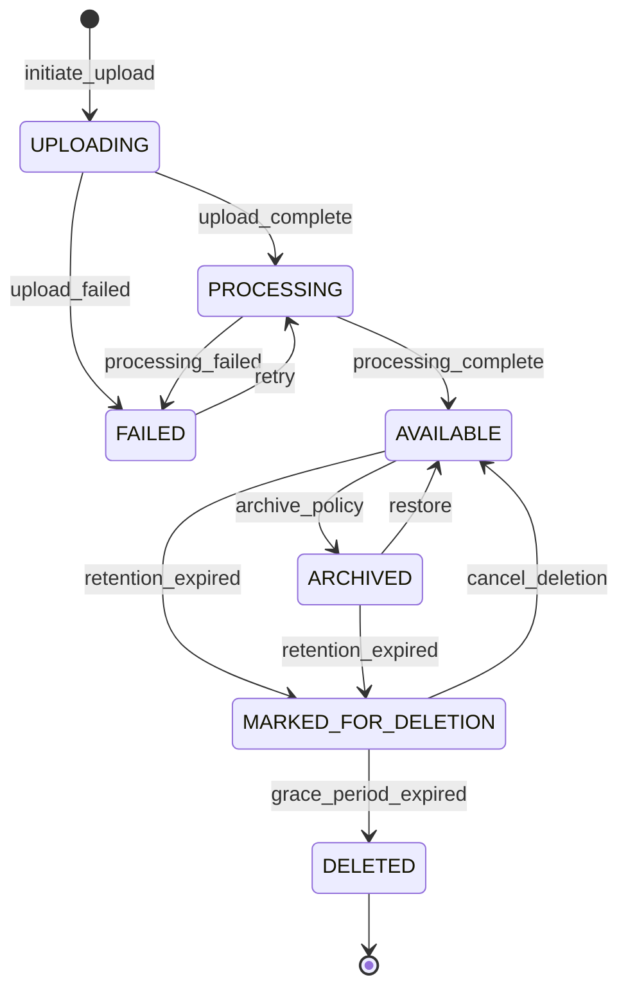

# Data Management Domain

## Overview

This domain handles **video storage, metadata management, media retrieval, and data lifecycle operations**, including **video ingestion and transcoding, metadata extraction and indexing, storage tiering, retention policy enforcement, and secure media delivery**.

It acts as **a core foundational service** responsible for the reliable storage, organization, and retrieval of all media assets (video, images, documents) across the Sentinel360 platform.

---

## Use Cases

---

### UC-DM-01: Upload Video Footage

- **Purpose**: Ingest video footage from CCTV systems or user uploads into the platform
- **Actors**: Security Operator, System (automated CCTV feed)
- **Preconditions**: Actor has `UPLOAD_FOOTAGE` permission; storage quota not exceeded

#### Main Success Flow

1. Actor initiates video upload with metadata (source camera, location, timestamp, description)
2. System validates file format (MP4, AVI, MOV, MKV) and size limits
3. System generates a unique media ID
4. System uploads file to primary storage (cloud object storage)
5. System computes SHA-256 hash of the uploaded file
6. System creates media record with status `PROCESSING`
7. System queues the video for transcoding and thumbnail generation
8. System emits `VIDEO_UPLOADED` event
9. System records audit log and creates chain of custody entry

#### Alternate / Exception Flows

- **Unsupported format** → 422: "File format not supported. Accepted: MP4, AVI, MOV, MKV"
- **File too large** → 413: "File exceeds maximum upload size of {max_size}"
- **Storage quota exceeded** → 507: "Storage quota exceeded. Contact administrator."
- **Upload interrupted** → System supports resumable uploads; partial uploads expire after 24 hours
- **Duplicate file detected** → System warns but allows upload (different context may be relevant)

#### Result

Video file stored; processing queued; media record created with `PROCESSING` status.

---

### UC-DM-02: Process and Transcode Video

- **Purpose**: Transcode uploaded video into standardized formats and extract metadata
- **Actors**: System (background worker)
- **Preconditions**: Video file uploaded and in `PROCESSING` state

#### Main Success Flow

1. System retrieves uploaded video from storage
2. System extracts video metadata (duration, resolution, codec, framerate, GPS if available)
3. System transcodes video into standardized formats (H.264 MP4 at multiple resolutions)
4. System generates thumbnail images at key intervals
5. System generates a preview clip (low-res, first 30 seconds)
6. System stores transcoded files and thumbnails
7. System updates media record with extracted metadata and status `AVAILABLE`
8. System emits `VIDEO_PROCESSED` event

#### Alternate / Exception Flows

- **Corrupt file** → Status set to `FAILED`; emits `PROCESSING_FAILED` event; notifies uploader
- **Transcoding timeout** → Retries up to 3 times; then marks as `FAILED`
- **Unsupported codec** → Attempts fallback transcoding; if fails, marks `FAILED`

#### Result

Video transcoded, metadata extracted, thumbnails generated, status set to `AVAILABLE`.

---

### UC-DM-03: Retrieve Media Asset

- **Purpose**: Retrieve a video, image, or document with appropriate access controls
- **Actors**: Authenticated User (with permission)
- **Preconditions**: Actor has permission to view the media; media exists and is `AVAILABLE`

#### Main Success Flow

1. Actor requests media by ID
2. System validates actor's permission to access the media
3. System retrieves media metadata
4. System generates a time-limited signed URL for secure access
5. System records access in chain of custody
6. System returns media metadata and signed download/stream URL

#### Alternate / Exception Flows

- **Media not found** → 404 Not Found
- **Access denied** → 403 Forbidden
- **Media not yet processed** → 202 Accepted: "Media is still processing"
- **Media archived** → System initiates retrieval from archive tier; returns estimated wait time

#### Result

Signed URL returned for secure media access; access logged in custody chain.

---

### UC-DM-04: Stream Video

- **Purpose**: Stream video footage with adaptive bitrate
- **Actors**: Authenticated User (with permission)
- **Preconditions**: Video is `AVAILABLE`; actor has viewing permission

#### Main Success Flow

1. Actor requests video stream
2. System validates permissions
3. System returns HLS/DASH manifest URL (signed, time-limited)
4. Client streams video with adaptive bitrate based on network conditions
5. System logs streaming access

#### Alternate / Exception Flows

- **Video not transcoded for streaming** → System queues HLS packaging; returns fallback progressive download
- **Signed URL expired** → Client requests new URL

#### Result

Video streamed to client with adaptive bitrate; access logged.

---

### UC-DM-05: Search Media by Metadata

- **Purpose**: Search and filter media assets by metadata fields
- **Actors**: Authenticated User (with permission)
- **Preconditions**: Actor has `VIEW_MEDIA` permission

#### Main Success Flow

1. Actor submits search query with filters (date range, location, camera source, tags, description keywords)
2. System executes search against metadata index
3. System applies access control filters (user can only see media they have permission for)
4. System returns paginated results with thumbnails and metadata summaries
5. System records search action in audit log

#### Alternate / Exception Flows

- **No results** → 200 OK with empty array
- **Invalid filters** → 422 Unprocessable Entity

#### Result

Paginated list of matching media assets returned.

---

### UC-DM-06: Tag and Annotate Media

- **Purpose**: Add tags, labels, or annotations to media for better organization and search
- **Actors**: Security Operator, Law Enforcement Officer, AI System
- **Preconditions**: Media exists; actor has `ANNOTATE_MEDIA` permission

#### Main Success Flow

1. Actor submits tags/annotations for a media item (timestamps, bounding boxes, labels)
2. System validates input
3. System persists annotations linked to the media item
4. System updates search index with new tags
5. System emits `MEDIA_ANNOTATED` event
6. System records audit log entry

#### Alternate / Exception Flows

- **Media not found** → 404 Not Found
- **Invalid annotation format** → 422 Unprocessable Entity

#### Result

Annotations stored and indexed; media searchable by new tags.

---

### UC-DM-07: Apply Retention Policy

- **Purpose**: Automatically manage media lifecycle based on retention policies
- **Actors**: System (scheduled job)
- **Preconditions**: Retention policies configured

#### Main Success Flow

1. System identifies media items that have exceeded their retention period
2. System checks if any item is linked to an active case (legal hold)
3. For items without legal hold: System transitions to archive or deletion
4. For archival: System moves media to cold storage tier
5. For deletion: System performs soft delete (30-day grace period)
6. System emits `MEDIA_ARCHIVED` or `MEDIA_MARKED_FOR_DELETION` events
7. System records audit log entries

#### Alternate / Exception Flows

- **Legal hold active** → Skip item; log that retention was deferred
- **Archive tier full** → Alert admin; defer archival

#### Result

Media lifecycle managed according to retention policy; legal holds respected.

---

### UC-DM-08: Delete Media

- **Purpose**: Permanently delete media after retention period and grace period
- **Actors**: System (scheduled), Super Administrator (manual)
- **Preconditions**: Media is in `MARKED_FOR_DELETION` state; grace period expired

#### Main Success Flow

1. System identifies media in `MARKED_FOR_DELETION` past grace period
2. System verifies no active legal holds
3. System deletes all associated files (original, transcoded, thumbnails)
4. System retains metadata record with `DELETED` status (for audit purposes)
5. System emits `MEDIA_DELETED` event
6. System records audit log entry

#### Alternate / Exception Flows

- **Legal hold added during grace period** → Cancel deletion; restore to previous state
- **Super Admin manual delete** → Requires confirmation and reason; bypasses grace period

#### Result

Media files permanently removed; metadata retained for audit.

---

## Core Entities

---

### Entity: MediaAsset

- **Description**: Represents a stored media item (video, image, document)

#### Fields

- `id`: UUID — Unique identifier
- `type`: Enum — `VIDEO`, `IMAGE`, `DOCUMENT`
- `title`: String — Descriptive title
- `description`: String (nullable) — Detailed description
- `source`: Enum — `CCTV_UPLOAD`, `USER_UPLOAD`, `SYSTEM_CAPTURE`, `EXTERNAL_IMPORT`
- `source_camera_id`: String (nullable) — Identifier of the source camera
- `original_filename`: String — Original uploaded filename
- `mime_type`: String — MIME type of the original file
- `file_size`: BigInteger — File size in bytes
- `file_hash`: String — SHA-256 hash of the original file
- `storage_url`: String — URL/path to the file in primary storage
- `storage_tier`: Enum — `HOT`, `WARM`, `COLD`, `ARCHIVE`
- `duration`: Integer (nullable) — Video duration in seconds
- `resolution`: String (nullable) — Video resolution (e.g., "1920x1080")
- `codec`: String (nullable) — Video codec
- `framerate`: Float (nullable) — Video framerate
- `gps_latitude`: Float (nullable) — GPS latitude
- `gps_longitude`: Float (nullable) — GPS longitude
- `captured_at`: Timestamp (nullable) — When the media was originally captured
- `uploaded_by`: UUID — User who uploaded the media
- `status`: Enum — Media processing status
- `retention_policy_id`: UUID (nullable) — Applied retention policy
- `legal_hold`: Boolean — Whether a legal hold prevents deletion
- `expires_at`: Timestamp (nullable) — When the media becomes eligible for retention action
- `deleted_at`: Timestamp (nullable) — Soft delete timestamp
- `created_at`: Timestamp
- `updated_at`: Timestamp

#### Constraints

- `file_hash` must be computed on upload and verified on access
- `storage_url` must be a valid internal storage reference
- `legal_hold = true` prevents any deletion or archival action
- `status` must follow the media lifecycle state machine

#### Relationships

- Has many `MediaVariant` (transcoded versions)
- Has many `MediaAnnotation`
- Has many `CustodyChainEntry` (via Audit domain)
- Belongs to `User` as uploader
- Optionally belongs to `RetentionPolicy`

---

### Entity: MediaVariant

- **Description**: A transcoded or derived version of a media asset

#### Fields

- `id`: UUID — Unique identifier
- `media_asset_id`: UUID — Reference to parent MediaAsset
- `variant_type`: Enum — `TRANSCODED`, `THUMBNAIL`, `PREVIEW`, `HLS_MANIFEST`, `HLS_SEGMENT`
- `resolution`: String — Variant resolution
- `format`: String — File format (e.g., "mp4", "jpg", "m3u8")
- `file_size`: BigInteger — File size in bytes
- `storage_url`: String — URL/path to variant in storage
- `quality`: String (nullable) — Quality label (e.g., "720p", "1080p", "low", "high")
- `created_at`: Timestamp

#### Constraints

- Must be linked to an existing `MediaAsset`
- Deleted when parent asset is deleted

#### Relationships

- Belongs to `MediaAsset`

---

### Entity: MediaAnnotation

- **Description**: A tag, label, or spatial/temporal annotation on a media asset

#### Fields

- `id`: UUID — Unique identifier
- `media_asset_id`: UUID — Reference to MediaAsset
- `annotation_type`: Enum — `TAG`, `LABEL`, `BOUNDING_BOX`, `TEMPORAL_MARKER`, `TEXT_NOTE`
- `value`: String — The annotation value (tag text, label, note)
- `timestamp_start`: Float (nullable) — Start time in seconds (for video annotations)
- `timestamp_end`: Float (nullable) — End time in seconds
- `bounding_box`: JSONB (nullable) — Spatial coordinates `{x, y, width, height}`
- `confidence`: Float (nullable) — AI confidence score (0.0–1.0) if AI-generated
- `source`: Enum — `MANUAL`, `AI_GENERATED`
- `created_by`: UUID — User or system that created the annotation
- `created_at`: Timestamp

#### Constraints

- `timestamp_start` must be less than `timestamp_end` (if both provided)
- `confidence` must be between 0.0 and 1.0

#### Relationships

- Belongs to `MediaAsset`
- References `User` as creator

---

### Entity: RetentionPolicy

- **Description**: Defines rules for media lifecycle management

#### Fields

- `id`: UUID — Unique identifier
- `name`: String — Policy name
- `description`: String — Policy description
- `retention_days`: Integer — Number of days to retain in hot/warm storage
- `archive_after_days`: Integer (nullable) — Days after which to move to archive
- `delete_after_days`: Integer (nullable) — Days after which to permanently delete
- `grace_period_days`: Integer — Days of grace period before permanent deletion (default: 30)
- `applies_to`: Enum — `ALL`, `VIDEO`, `IMAGE`, `DOCUMENT`
- `is_default`: Boolean — Whether this is the default policy
- `created_at`: Timestamp
- `updated_at`: Timestamp

#### Constraints

- Only one policy can be `is_default = true` per `applies_to` type
- `archive_after_days` must be less than `delete_after_days`
- `retention_days` must be positive

#### Relationships

- Has many `MediaAsset`

---

## State Machines

### Media Asset Lifecycle

---

### States

| State                 | Description                                                    |
| --------------------- | -------------------------------------------------------------- |
| `UPLOADING`           | File upload in progress                                        |
| `PROCESSING`          | File uploaded, transcoding and metadata extraction in progress |
| `AVAILABLE`           | Fully processed and accessible                                 |
| `ARCHIVED`            | Moved to cold/archive storage tier                             |
| `MARKED_FOR_DELETION` | Scheduled for permanent deletion after grace period            |
| `FAILED`              | Upload or processing failed                                    |
| `DELETED`             | Permanently deleted (metadata retained)                        |

---

### Transitions & Guards

| From → To                       | Event                | Condition                                                 |
| ------------------------------- | -------------------- | --------------------------------------------------------- |
| UPLOADING → PROCESSING          | upload_complete      | File fully received and hash computed                     |
| PROCESSING → AVAILABLE          | processing_complete  | Transcoding and metadata extraction successful            |
| PROCESSING → FAILED             | processing_failed    | Retry count exceeded                                      |
| AVAILABLE → ARCHIVED            | archive_policy       | Retention policy archive threshold reached; no legal hold |
| AVAILABLE → MARKED_FOR_DELETION | retention_expired    | Retention period expired; no legal hold                   |
| ARCHIVED → AVAILABLE            | restore              | Admin or system initiates restore                         |
| MARKED_FOR_DELETION → DELETED   | grace_period_expired | Grace period expired; no legal hold                       |
| MARKED_FOR_DELETION → AVAILABLE | cancel_deletion      | Admin cancels deletion or legal hold applied              |

---

## Business Rules (Invariants)

1. **Hash integrity**: SHA-256 hash must be computed on upload and verified on every retrieval
2. **Legal hold override**: Media under legal hold cannot be archived, deleted, or moved
3. **Resumable uploads**: Interrupted uploads must be resumable within 24 hours
4. **Format validation**: Only supported media formats may be uploaded
5. **Storage tiering**: Media must be automatically tiered based on access patterns and retention policy
6. **Transcoding completeness**: Videos must be transcoded to at least 720p and 1080p variants
7. **Metadata preservation**: Original file metadata must be preserved alongside extracted metadata
8. **Access control on delivery**: Signed URLs must expire within configured TTL (default: 1 hour)
9. **Soft delete**: All deletions are soft deletes with a grace period; metadata is never fully deleted
10. **Audit trail**: Every upload, access, modification, and deletion must be recorded

---

## Processing Flows

### Upload Flow

1. Validate file format and size
2. Initialize resumable upload session
3. Stream file to object storage
4. Compute SHA-256 hash during upload
5. Create `MediaAsset` record with `UPLOADING` status
6. On completion, transition to `PROCESSING`
7. Create chain of custody entry
8. Emit `VIDEO_UPLOADED` event
9. Queue transcoding job

### Transcoding Flow

1. Retrieve original file from storage
2. Extract metadata (ffprobe)
3. Transcode to standard formats (H.264, multiple resolutions)
4. Generate thumbnails at intervals (every 10 seconds)
5. Generate preview clip (30 seconds, low-res)
6. Package for HLS streaming
7. Store all variants
8. Update `MediaAsset` with metadata and `AVAILABLE` status
9. Emit `VIDEO_PROCESSED` event

### Retrieval Flow

1. Validate access permissions
2. Check media status (must be `AVAILABLE`)
3. If archived, initiate restore and return estimated time
4. Generate signed URL with TTL
5. Record access in custody chain
6. Return metadata + signed URL

### Retention Enforcement Flow

1. Scan for media past retention threshold (scheduled job)
2. Skip items with legal hold
3. Apply retention action (archive or mark for deletion)
4. For items past grace period, permanently delete files
5. Retain metadata records with `DELETED` status
6. Record all actions in audit log

---

## Interfaces

### Media Library View

- **Filters**: Type (video/image/document), date range, source, camera, location, tags, status
- **Columns**: Thumbnail, Title, Type, Source, Duration, Size, Status, Uploaded At
- **Sorting**: By date, size, title, status
- **Pagination**: 24 per page (grid view), 50 per page (list view)

### Media Detail View

- **Entity details**: Full metadata, all variants, annotations
- **Video player**: Adaptive bitrate streaming, timeline scrubbing
- **Annotations**: Timeline markers, bounding boxes, tags
- **Related entities**: Linked cases, incidents
- **Custody chain**: Full chain of custody timeline
- **Actions**: Download, annotate, link to case, apply legal hold, delete

### Storage Dashboard (Admin)

- **Summary cards**: Total storage, by tier, by type
- **Charts**: Storage growth over time, tier distribution
- **Retention status**: Items approaching retention, archived, pending deletion
- **Policies**: View and manage retention policies

---

## Notifications

| Event                     | Recipient    | Channel        | Message                                                   |
| ------------------------- | ------------ | -------------- | --------------------------------------------------------- |
| VIDEO_UPLOADED            | Uploader     | In-app         | "Video '{title}' uploaded successfully. Processing…"      |
| VIDEO_PROCESSED           | Uploader     | In-app         | "Video '{title}' is now available for viewing."           |
| PROCESSING_FAILED         | Uploader     | In-app + Email | "Video '{title}' processing failed. Please re-upload."    |
| MEDIA_ARCHIVED            | Owner        | In-app         | "Media '{title}' has been archived per retention policy." |
| MEDIA_MARKED_FOR_DELETION | Owner, Admin | In-app         | "Media '{title}' scheduled for deletion in {days} days."  |
| LEGAL_HOLD_APPLIED        | Admin        | In-app         | "Legal hold applied to '{title}' — retention suspended."  |
| STORAGE_QUOTA_WARNING     | Admin        | Email + In-app | "Storage usage at {percentage}% of quota."                |

---

## Audit Logging

- File upload initiation and completion
- Processing start, completion, and failure
- Media access (view, stream, download)
- Annotation creation and modification
- Retention policy application
- Archival actions
- Deletion (soft and permanent)
- Legal hold application and removal
- Storage tier transitions

Includes:

- **Actor**: User ID or `SYSTEM`
- **Timestamp**: ISO 8601 UTC
- **Action**: Event code
- **Target**: Media asset ID
- **Payload snapshot**: File hash, size, metadata changes
- **IP Address**: Client IP

---

## Invariants

1. Every media file must have a verified SHA-256 hash at rest
2. Media lifecycle must follow the state machine — no skipping states
3. Legal holds absolutely prevent any destructive action
4. Signed URLs must be time-bounded and single-use where possible
5. Metadata records persist even after file deletion for audit continuity
6. All storage operations must be recorded in the audit and custody chain
