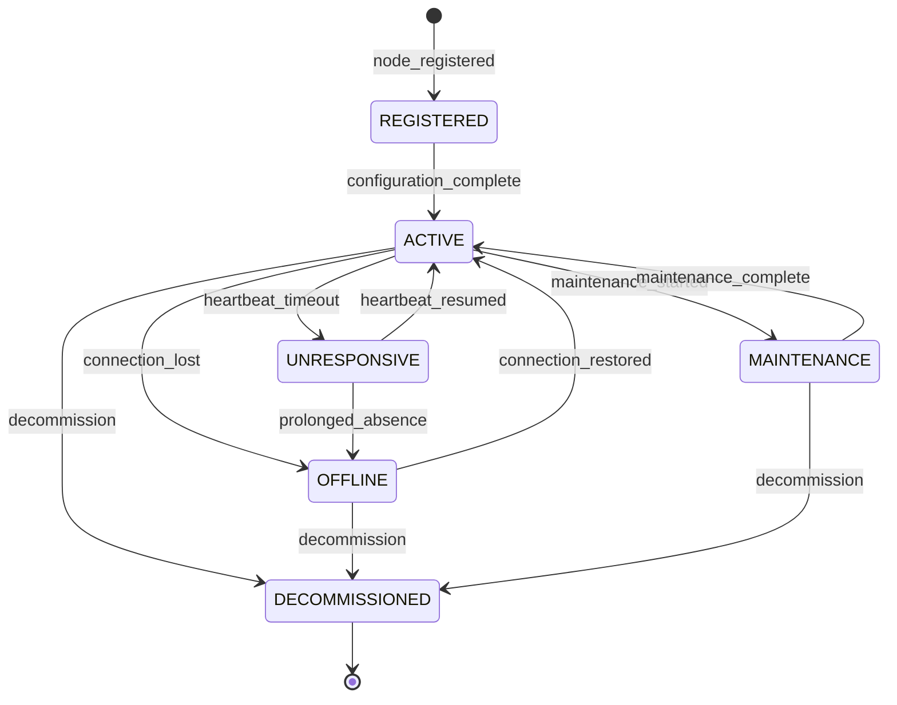
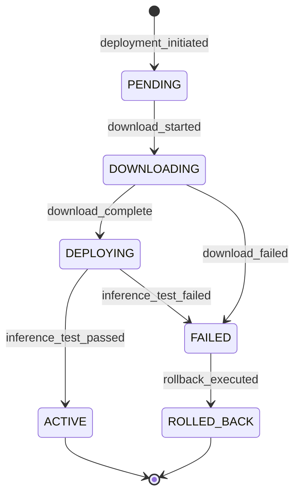

# Edge Processing Domain

## Overview

This domain handles **AI processing on edge devices (cameras and local compute nodes) for real-time inference**, including **edge node management, on-device AI model deployment, real-time video analytics at the edge, edge-to-cloud synchronization, and resource management for edge compute**.

It acts as **an infrastructure domain** that manages the distributed computing layer where AI inference runs closest to the camera hardware, enabling low-latency detection, reducing cloud bandwidth costs, and supporting offline/intermittent connectivity scenarios.

---

## Use Cases

---

### UC-EP-01: Register Edge Node

- **Purpose**: Register a new edge compute device (camera with embedded AI or local compute node)
- **Actors**: Security Operator, Administrator
- **Preconditions**: Actor has `MANAGE_EDGE_NODES` permission; edge device is network-accessible

#### Main Success Flow

1. Operator initiates edge node registration
2. Operator provides: name, location, device type, hardware specs, network address, associated cameras
3. System verifies connectivity to the edge node
4. System queries device capabilities (CPU, GPU/NPU, memory, storage)
5. System creates edge node record with status `REGISTERED`
6. System pushes baseline configuration to the node
7. System deploys default AI models based on device capabilities
8. System activates the node
9. System records audit log

#### Alternate / Exception Flows

- **Device unreachable** → Status set to `OFFLINE`; retry scheduled
- **Insufficient hardware** → Warning: "Device does not meet minimum specs for AI inference"
- **Duplicate device** → 409: "Device with this identifier already registered"

#### Result

Edge node registered, configured, and ready for inference workloads.

---

### UC-EP-02: Deploy AI Model to Edge

- **Purpose**: Deploy or update an AI model on edge compute nodes
- **Actors**: System (automated), Administrator
- **Preconditions**: Edge node is `ACTIVE`; model is validated

#### Main Success Flow

1. System selects target edge nodes for model deployment
2. System validates model compatibility with node hardware (architecture, memory, compute)
3. System packages model with runtime dependencies
4. System pushes model package to edge nodes
5. Edge nodes download and verify package integrity (hash check)
6. Edge nodes load model into inference engine
7. Edge nodes report deployment status
8. System validates inference works (test frame)
9. System updates deployment record
10. System emits `MODEL_DEPLOYED` event

#### Alternate / Exception Flows

- **Model too large** → 422: "Model exceeds available memory on node {name}"
- **Download interrupted** → Automatic retry with resume
- **Inference test fails** → Rollback to previous model version; alert admin
- **Node offline during deploy** → Queued for deployment when node reconnects

#### Result

AI model deployed to edge nodes; inference validated and active.

---

### UC-EP-03: Execute Real-Time Inference

- **Purpose**: Run AI inference on live video streams at the edge for real-time detection
- **Actors**: System (automated)
- **Preconditions**: Edge node is `ACTIVE`; models are deployed; camera is streaming

#### Main Success Flow

1. Edge node receives video frames from connected camera(s)
2. Edge node preprocesses frames (resize, normalize, format conversion)
3. Edge node runs inference on deployed models (object detection, behavior analysis, face detection)
4. Edge node applies confidence thresholds and detection zones
5. Edge node generates detection events for positive results
6. Edge node sends detection metadata to cloud (bounding boxes, labels, confidence, timestamp, thumbnail)
7. Edge node stores frame buffer locally for context retrieval
8. Cloud system receives and processes detection events via AI Detection domain

#### Alternate / Exception Flows

- **GPU/NPU overloaded** → Frame skip; reduce processing FPS; alert admin
- **Cloud unreachable** → Buffer detections locally; sync when connection restored
- **Model inference error** → Log error; skip frame; alert if error rate exceeds threshold

#### Result

Real-time AI detections generated at the edge; metadata synced to cloud.

---

### UC-EP-04: Synchronize Edge Data to Cloud

- **Purpose**: Sync detection results, telemetry, and requested footage from edge to cloud
- **Actors**: System (automated)
- **Preconditions**: Edge node has pending data to sync

#### Main Success Flow

1. Edge node batches pending detection events and telemetry
2. Edge node compresses and encrypts the sync payload
3. Edge node transmits to cloud via secure channel
4. Cloud receives and validates payload integrity
5. Cloud ingests detection events into the AI Detection pipeline
6. Cloud processes telemetry data for monitoring
7. Cloud acknowledges successful receipt
8. Edge node marks synced data as confirmed

#### Alternate / Exception Flows

- **Connectivity lost** → Buffer locally; implement exponential backoff retry
- **Sync payload corrupted** → Request retransmission from edge
- **Cloud rejects data** → Edge node logs rejection; alert admin
- **Bandwidth limited** → Prioritize high-severity detections; queue lower priority

#### Result

Edge data successfully synchronized to cloud; integrity verified.

---

### UC-EP-05: Monitor Edge Node Health

- **Purpose**: Continuously monitor the health and performance of edge nodes
- **Actors**: System (automated), Administrator
- **Preconditions**: Edge nodes are registered

#### Main Success Flow

1. Edge nodes periodically report health metrics:
   - CPU/GPU/NPU utilization
   - Memory usage
   - Storage capacity and usage
   - Temperature
   - Network bandwidth and latency
   - Inference FPS and latency per model
   - Camera stream status
   - Detection event rate
2. Cloud system collects and aggregates metrics
3. System evaluates against health thresholds
4. System triggers alerts for unhealthy conditions
5. System updates node health status

#### Alternate / Exception Flows

- **Node stops reporting** → Mark as `UNRESPONSIVE` after timeout; alert admin
- **Disk full** → Auto-purge oldest buffered data; alert admin
- **Thermal throttling** → Reduce inference load; alert admin

#### Result

Edge node health continuously monitored; issues detected and alerted.

---

### UC-EP-06: Manage Edge Node Configuration

- **Purpose**: Update configuration on edge nodes (detection zones, thresholds, schedules)
- **Actors**: Security Operator, Administrator
- **Preconditions**: Actor has `MANAGE_EDGE_NODES` permission

#### Main Success Flow

1. Operator or admin updates edge configuration:
   - Detection zone definitions
   - Confidence thresholds
   - Processing schedule (e.g., full inference during business hours, reduced at night)
   - Frame rate and resolution settings
   - Model priority (which models to run if resources limited)
   - Local buffer retention period
2. System validates configuration
3. System pushes configuration to edge node
4. Edge node applies configuration (may require brief inference pause)
5. Edge node confirms application
6. System records audit log

#### Alternate / Exception Flows

- **Node offline** → Configuration queued for push on reconnection
- **Invalid config** → Rejected at edge; current config retained

#### Result

Edge node configuration updated and applied.

---

### UC-EP-07: Retrieve Edge-Buffered Footage

- **Purpose**: Request footage clips from the edge node's local buffer
- **Actors**: Security Operator, Law Enforcement Officer
- **Preconditions**: Edge node is online; footage exists in local buffer

#### Main Success Flow

1. Actor requests footage for a camera and time range
2. System routes request to the appropriate edge node
3. Edge node locates the footage in its local buffer
4. Edge node extracts the requested clip
5. Edge node transmits clip to cloud storage via secure channel
6. System creates a media asset for the footage
7. System notifies the requester
8. System records audit log

#### Alternate / Exception Flows

- **Footage expired from buffer** → 404: "Footage outside local buffer retention window"
- **Node offline** → Request queued for when node reconnects
- **Large clip** → Split into chunks; background transfer

#### Result

Edge-buffered footage retrieved and stored in cloud; available for review.

---

## Core Entities

---

### Entity: EdgeNode

- **Description**: An edge compute device that runs AI inference

#### Fields

- `id`: UUID — Unique identifier
- `name`: String — Human-readable name
- `device_type`: Enum — `EMBEDDED_CAMERA`, `LOCAL_COMPUTE`, `GATEWAY`, `NVR_WITH_AI`
- `location`: JSONB — Physical location `{lat, lng, address, building, floor}`
- `hardware`: JSONB — Hardware specs `{cpu, gpu, npu, memory_gb, storage_gb, architecture}`
- `network_address`: String — Network address for communication
- `status`: Enum — `REGISTERED`, `ACTIVE`, `OFFLINE`, `UNRESPONSIVE`, `MAINTENANCE`, `DECOMMISSIONED`
- `firmware_version`: String (nullable) — Current firmware version
- `agent_version`: String (nullable) — Sentinel360 edge agent version
- `camera_ids`: JSONB — Array of connected camera IDs
- `deployed_models`: JSONB — Array of deployed model versions
- `health_metrics`: JSONB (nullable) — Latest health snapshot
- `last_heartbeat_at`: Timestamp (nullable)
- `last_sync_at`: Timestamp (nullable)
- `registered_by`: UUID
- `created_at`: Timestamp
- `updated_at`: Timestamp

#### Constraints

- `network_address` must be unique
- `DECOMMISSIONED` nodes are retained for history but not activated
- Must report heartbeat within configurable interval (default: 60 seconds)

#### Relationships

- Has many `Camera`
- Has many `ModelDeployment`
- Has many `EdgeSyncRecord`
- Registered by `User`

---

### Entity: ModelDeployment

- **Description**: Record of an AI model deployment to an edge node

#### Fields

- `id`: UUID — Unique identifier
- `edge_node_id`: UUID — Target edge node
- `model_id`: UUID — Reference to AI model
- `model_version`: String — Model version deployed
- `model_hash`: String — Hash of the model package
- `status`: Enum — `PENDING`, `DOWNLOADING`, `DEPLOYING`, `ACTIVE`, `FAILED`, `ROLLED_BACK`
- `inference_config`: JSONB — Inference parameters (batch size, precision, thresholds)
- `test_result`: JSONB (nullable) — Deployment test results
- `deployed_at`: Timestamp (nullable)
- `previous_version`: String (nullable) — Previous model version (for rollback)
- `created_at`: Timestamp
- `updated_at`: Timestamp

#### Constraints

- Only one `ACTIVE` deployment per model per edge node
- `FAILED` must retain logs for diagnostics
- `model_hash` must match the distributed package

#### Relationships

- Belongs to `EdgeNode`
- References `AIModel`

---

### Entity: EdgeSyncRecord

- **Description**: Record of a data synchronization from edge to cloud

#### Fields

- `id`: UUID — Unique identifier
- `edge_node_id`: UUID — Source edge node
- `sync_type`: Enum — `DETECTIONS`, `TELEMETRY`, `FOOTAGE`, `CONFIGURATION_ACK`
- `payload_size_bytes`: BigInteger — Size of sync payload
- `items_count`: Integer — Number of items synced
- `status`: Enum — `PENDING`, `IN_PROGRESS`, `COMPLETED`, `FAILED`
- `payload_hash`: String — Hash of the sync payload
- `started_at`: Timestamp
- `completed_at`: Timestamp (nullable)
- `error_message`: String (nullable)
- `created_at`: Timestamp

#### Constraints

- Completed syncs must have `payload_hash` verified
- Failed syncs must have `error_message`

#### Relationships

- Belongs to `EdgeNode`

---

### Entity: EdgeConfiguration

- **Description**: Configuration profile for an edge node

#### Fields

- `id`: UUID — Unique identifier
- `edge_node_id`: UUID — Target edge node
- `config_type`: Enum — `DETECTION_ZONES`, `THRESHOLDS`, `SCHEDULE`, `PROCESSING`, `BUFFER`
- `config_data`: JSONB — Configuration payload
- `version`: Integer — Incrementing version number
- `status`: Enum — `PENDING`, `PUSHED`, `APPLIED`, `REJECTED`
- `pushed_at`: Timestamp (nullable)
- `applied_at`: Timestamp (nullable)
- `updated_by`: UUID
- `created_at`: Timestamp

#### Constraints

- Version must auto-increment
- `REJECTED` must include reason in `config_data`

#### Relationships

- Belongs to `EdgeNode`
- Updated by `User`

---

## State Machines

### Edge Node Lifecycle

### Model Deployment Lifecycle

---

### States — Edge Node

| State            | Description                                       |
| ---------------- | ------------------------------------------------- |
| `REGISTERED`     | Node registered; awaiting initial configuration   |
| `ACTIVE`         | Node is online, configured, and running inference |
| `OFFLINE`        | Node is not reachable                             |
| `UNRESPONSIVE`   | Node missed heartbeat but was recently active     |
| `MAINTENANCE`    | Node in scheduled maintenance                     |
| `DECOMMISSIONED` | Node permanently retired                          |

### States — Model Deployment

| State         | Description                              |
| ------------- | ---------------------------------------- |
| `PENDING`     | Deployment queued                        |
| `DOWNLOADING` | Edge node downloading model package      |
| `DEPLOYING`   | Model being loaded into inference engine |
| `ACTIVE`      | Model deployed and inference running     |
| `FAILED`      | Deployment failed at any stage           |
| `ROLLED_BACK` | Reverted to previous model version       |

---

### Transitions & Guards

| From → To             | Event                  | Condition                                             |
| --------------------- | ---------------------- | ----------------------------------------------------- |
| REGISTERED → ACTIVE   | configuration_complete | Models deployed and inference test passed             |
| ACTIVE → OFFLINE      | connection_lost        | No heartbeat for > configurable timeout               |
| ACTIVE → UNRESPONSIVE | heartbeat_timeout      | No heartbeat for > 60 seconds but < offline threshold |
| DEPLOYING → ACTIVE    | inference_test_passed  | Test frame returns valid results                      |
| DEPLOYING → FAILED    | inference_test_failed  | Test frame fails or crashes                           |
| FAILED → ROLLED_BACK  | rollback_executed      | Previous model version restored                       |

---

## Business Rules (Invariants)

1. **Model hash verification**: Edge nodes must verify model package integrity (hash check) before loading
2. **Rollback capability**: Every model deployment must maintain the previous version for rollback
3. **Heartbeat monitoring**: Nodes missing heartbeats beyond threshold are marked unresponsive then offline
4. **Local buffering**: Edge nodes must buffer detections locally when cloud connectivity is unavailable
5. **Priority sync**: High-severity detections are prioritized during bandwidth-limited sync
6. **Encrypted communication**: All edge-to-cloud communication must use TLS encryption
7. **Configuration versioning**: Edge configurations are versioned; nodes must confirm application
8. **Resource management**: Edge nodes must not exceed resource limits; reduce inference if necessary
9. **Secure boot**: Edge agent must validate its own integrity on startup
10. **Firmware updates**: Edge firmware updates require staged rollout with health checks

---

## Processing Flows

### Edge Inference Pipeline

1. Camera pushes frames to edge node (or edge node pulls from stream)
2. Frame preprocessor: resize, normalize, format conversion
3. Detection zone mask applied (only process configured regions)
4. Models run sequentially or in parallel (based on hardware):
   - Object detection model
   - Behavior analysis model
   - Face/plate detection model (if enabled)
5. Post-processing: NMS, confidence filtering, zone filtering
6. Detection events generated for positive results
7. Thumbnails/clips extracted for context
8. Detection events queued for cloud sync
9. Local buffer updated with frame reference

### Model Deployment Pipeline

1. System selects nodes and validates compatibility
2. System packages model with runtime and config
3. System pushes package to edge node(s)
4. Edge downloads and verifies hash
5. Edge loads model into inference engine
6. Edge runs test inference on sample frame
7. If success: activate new model, archive previous
8. If failure: keep previous model, report failure
9. System records deployment status

### Edge-Cloud Sync Pipeline

1. Edge node batches pending sync items
2. Items prioritized by severity and type
3. Payload compressed and encrypted
4. Transmitted to cloud ingestion endpoint
5. Cloud validates payload hash
6. Cloud ingests detection events → AI Detection domain
7. Cloud ingests telemetry → System Infrastructure monitoring
8. Cloud sends acknowledgment
9. Edge marks items as synced

---

## Interfaces

### Edge Node Management Dashboard

- **Node list**: All registered edge nodes with status indicators
- **Map view**: Node locations with health color coding
- **Node detail**: Hardware specs, deployed models, health metrics, camera connections
- **Actions**: Register, configure, maintain, decommission, restart

### Model Deployment Manager

- **Models**: Available AI models with versions and compatibility
- **Deployments**: Active deployments per node with status
- **Rollout**: Staged deployment configuration
- **Actions**: Deploy, rollback, update, test

### Edge Health Monitor

- **Real-time metrics**: CPU, GPU, memory, temp, FPS, latency per node
- **Alerts**: Threshold violations, offline nodes, failed deployments
- **Trends**: Historical performance graphs
- **Diagnostics**: Log viewer, connectivity test, inference test

### Sync Monitor

- **Queue**: Pending sync items with size and priority
- **History**: Completed syncs with throughput and success rate
- **Bandwidth**: Current bandwidth usage and allocation
- **Issues**: Failed syncs with error details

---

## Notifications

| Event                   | Recipient               | Channel       | Message                                                        |
| ----------------------- | ----------------------- | ------------- | -------------------------------------------------------------- |
| EDGE_NODE_OFFLINE       | Admin, On-duty Operator | Push + In-app | "Edge node '{name}' is offline"                                |
| EDGE_NODE_UNRESPONSIVE  | Admin                   | In-app        | "Edge node '{name}' is unresponsive"                           |
| MODEL_DEPLOYMENT_FAILED | Admin                   | Push + Email  | "Model deployment failed on node '{name}': {reason}"           |
| MODEL_DEPLOYED          | Admin                   | In-app        | "Model {model_name} v{version} deployed to {node_count} nodes" |
| EDGE_RESOURCE_WARNING   | Admin                   | In-app        | "Edge node '{name}' resource usage HIGH: {metric} at {value}"  |
| EDGE_SYNC_FAILED        | Admin                   | In-app        | "Sync failed for node '{name}': {reason}"                      |
| EDGE_DISK_FULL          | Admin                   | Push + Email  | "Edge node '{name}' disk is full — buffered data at risk"      |

---

## Audit Logging

- Edge node registration and decommission
- Model deployments (push, success, failure, rollback)
- Configuration changes and pushes
- Edge node status changes
- Firmware updates
- Footage retrieval requests
- Sync operations (metadata only, not payload content)
- Health alert triggers

Includes:

- **Actor**: User ID (for manual actions), `SYSTEM` (for automated)
- **Timestamp**: ISO 8601 UTC
- **Action**: Event code
- **Target**: Edge node ID, model ID, deployment ID
- **Payload snapshot**: Configuration changes, deployment status

---

## Invariants

1. Model packages must be hash-verified before loading into inference engine
2. Edge nodes must always maintain the previous model version for rollback
3. All edge-to-cloud communication must be encrypted
4. Local detection buffers must be preserved when cloud connectivity is lost
5. Edge node hardware utilization must not exceed safe operational limits
6. Configuration changes must be versioned and confirmed by the edge node
