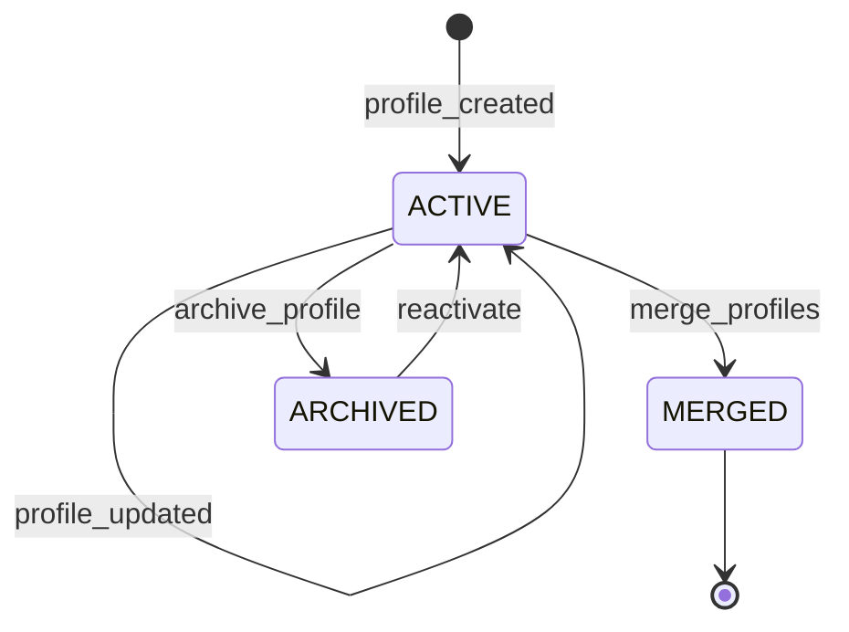
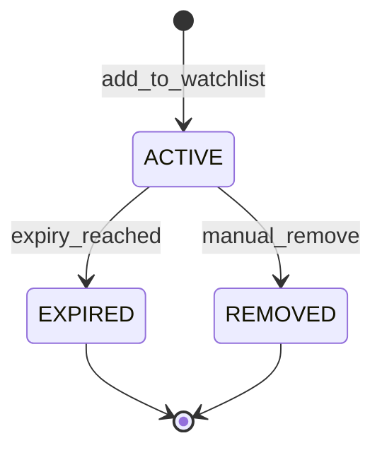

# Entity Intelligence Domain

## Overview

This domain handles **identification and analysis of entities from visual data**, including **facial recognition, license plate recognition (LPR/ANPR), person attribute extraction, vehicle identification, and entity profiling**.

It acts as **a core intelligence service** that transforms visual data into structured entity profiles, enabling identification, matching, and correlation of persons and vehicles across the Sentinel360 platform.

---

## Use Cases

---

### UC-EI-01: Detect and Extract Faces from Video/Images

- **Purpose**: Detect faces in video frames or images and extract facial embeddings for recognition
- **Actors**: System (AI engine)
- **Preconditions**: Media is available; face detection model is active

#### Main Success Flow

1. System receives video frame or image for face detection
2. System runs face detection model to locate faces in the frame
3. For each detected face, system extracts facial region (crop and align)
4. System generates a facial embedding vector (128/512-dimensional)
5. System assesses face quality (blur, angle, occlusion, lighting)
6. System stores face detection record with embedding, quality score, and spatial/temporal metadata
7. System emits `FACE_DETECTED` event

#### Alternate / Exception Flows

- **No faces detected** → No event emitted; frame processed and discarded
- **Low quality face** → Stored with low quality flag; not used for matching unless no better image available
- **Multiple faces** → Each face processed independently
- **Partial/occluded face** → Stored with reduced quality score

#### Result

Face detections stored with embeddings, quality scores, and metadata.

---

### UC-EI-02: Match Face Against Known Entities

- **Purpose**: Compare a detected face against the database of known entity profiles
- **Actors**: System (automated), Law Enforcement Officer (manual search)
- **Preconditions**: Face embedding extracted; entity database populated

#### Main Success Flow

1. System receives face embedding for matching
2. System searches the entity database using approximate nearest neighbor (ANN) search
3. System retrieves top-N matches with similarity scores
4. System filters matches by similarity threshold (configurable, default ≥ 0.85)
5. System generates match records with similarity scores and candidate profiles
6. If high-confidence match found (≥ 0.95): System emits `ENTITY_MATCHED` event
7. If match is against a watchlist entity: System emits `WATCHLIST_MATCH` event with priority alert
8. System stores match record

#### Alternate / Exception Flows

- **No matches above threshold** → Entity treated as unknown; system creates new entity profile candidate
- **Multiple close matches** → All returned with scores; flagged for human verification
- **Database unavailable** → Queue for retry; log error

#### Result

Face matched against known entities; match records stored; alerts for watchlist matches.

---

### UC-EI-03: Recognize License Plates

- **Purpose**: Detect and read license plates from video/images
- **Actors**: System (AI engine)
- **Preconditions**: Vehicle visible in frame; LPR model active

#### Main Success Flow

1. System detects vehicles in frame
2. System locates license plate regions on detected vehicles
3. System applies OCR to extract plate text
4. System normalizes plate text (remove spaces, standardize format)
5. System validates plate format against known regional patterns
6. System stores plate detection with text, confidence, vehicle image, and metadata
7. System checks plate against vehicle watchlist
8. If watchlist match → Emits `PLATE_WATCHLIST_MATCH` event
9. System emits `PLATE_DETECTED` event

#### Alternate / Exception Flows

- **Plate obscured/dirty** → Lower confidence OCR; flagged for human review
- **Non-standard plate format** → Stored but flagged as `UNVERIFIED`
- **Multiple plates in frame** → Each processed independently
- **Illegible plate** → Stored as `UNREADABLE` with vehicle image for manual review

#### Result

License plates detected, read, and stored; watchlist matches trigger alerts.

---

### UC-EI-04: Extract Person Attributes

- **Purpose**: Extract descriptive attributes of a person (clothing, accessories, appearance)
- **Actors**: System (AI engine)
- **Preconditions**: Person detected in frame

#### Main Success Flow

1. System detects person in frame
2. System runs attribute extraction models
3. System identifies: clothing color/type, gender presentation, estimated age range, height estimate, accessories (bag, hat, glasses), posture
4. System stores attribute set linked to the person detection
5. System emits `PERSON_ATTRIBUTES_EXTRACTED` event

#### Alternate / Exception Flows

- **Partial view** → Extract available attributes; flag incomplete
- **Low confidence attributes** → Stored with confidence; not used for primary matching

#### Result

Person attributes extracted and stored for search and correlation.

---

### UC-EI-05: Create/Update Entity Profile

- **Purpose**: Build and maintain entity profiles from accumulated detections
- **Actors**: System (automated), Law Enforcement Officer (manual)
- **Preconditions**: Detection data available (faces, plates, attributes)

#### Main Success Flow

1. System clusters related detections (same face embedding cluster, same plate)
2. System creates or updates entity profile with best-quality face image, attributes, known plates
3. System merges confirmed matches into the profile
4. System calculates entity activity summary (locations, times, frequency)
5. System emits `ENTITY_PROFILE_UPDATED` event

#### Alternate / Exception Flows

- **Merge conflict** → Two profiles may be the same person; flagged for human resolution
- **False merge detected** → Admin splits profiles

#### Result

Entity profile created or updated with latest detection data.

---

### UC-EI-06: Search Entities by Attributes

- **Purpose**: Search for entities matching a set of descriptive attributes
- **Actors**: Law Enforcement Officer, Security Operator
- **Preconditions**: Actor has `SEARCH_ENTITIES` permission

#### Main Success Flow

1. Actor submits search criteria (face image upload, plate number, physical description, time range, location)
2. System executes multi-modal search:
   - Face image → embedding similarity search
   - Plate → text match search
   - Attributes → filter-based search
3. System returns ranked results with match scores
4. System records search in audit log

#### Alternate / Exception Flows

- **No matches** → 200 OK with empty results
- **Uploaded face too low quality** → 422: "Image quality too low for facial search"

#### Result

Matching entity profiles returned with relevance scores.

---

### UC-EI-07: Manage Watchlist

- **Purpose**: Add or remove entities from monitoring watchlists
- **Actors**: Law Enforcement Officer, Administrator
- **Preconditions**: Actor has `MANAGE_WATCHLIST` permission

#### Main Success Flow

1. Actor adds entity to watchlist with priority level, reason, and expiry date
2. System validates entity profile exists
3. System adds watchlist entry
4. System notifies all active detection pipelines of the updated watchlist
5. System emits `WATCHLIST_UPDATED` event
6. System records audit log

#### Alternate / Exception Flows

- **Entity already on watchlist** → 409 Conflict
- **Invalid expiry date** → 422: "Expiry date must be in the future"

#### Result

Entity added to watchlist; all detection systems updated.

---

## Core Entities

---

### Entity: EntityProfile

- **Description**: A consolidated profile of a person or vehicle identified across the system

#### Fields

- `id`: UUID — Unique identifier
- `entity_type`: Enum — `PERSON`, `VEHICLE`
- `display_name`: String (nullable) — Known name (if identified)
- `primary_face_image_url`: String (nullable) — Best-quality face image
- `primary_face_embedding`: Vector (nullable) — Primary facial embedding
- `known_plate_numbers`: JSONB (nullable) — Array of associated license plates
- `attributes`: JSONB — Aggregated physical attributes
- `first_seen_at`: Timestamp — First detection timestamp
- `last_seen_at`: Timestamp — Most recent detection timestamp
- `detection_count`: Integer — Total number of detections
- `locations_seen`: JSONB — Array of locations where entity was detected
- `status`: Enum — `ACTIVE`, `INACTIVE`, `MERGED`, `ARCHIVED`
- `watchlist_status`: Enum — `NONE`, `ACTIVE`, `EXPIRED`
- `notes`: String (nullable) — Human-added notes
- `created_at`: Timestamp
- `updated_at`: Timestamp

#### Constraints

- Entity profiles are auto-generated from clustered detections
- `MERGED` profiles cannot be directly queried (redirect to surviving profile)
- Facial embeddings must be stored encrypted at rest

#### Relationships

- Has many `FaceDetection`
- Has many `PlateDetection`
- Has many `EntitySighting` (via Tracking domain)
- Optionally on `Watchlist`

---

### Entity: FaceDetection

- **Description**: A single detected face with its embedding and metadata

#### Fields

- `id`: UUID — Unique identifier
- `entity_profile_id`: UUID (nullable) — Linked entity profile (null if unmatched)
- `media_asset_id`: UUID — Source media
- `camera_id`: String (nullable) — Source camera
- `embedding`: Vector — Facial embedding vector
- `face_image_url`: String — Cropped face image URL
- `quality_score`: Float — Face quality assessment (0.0–1.0)
- `bounding_box`: JSONB — Face location in frame `{x, y, width, height}`
- `timestamp`: Float — Time in video (seconds)
- `match_confidence`: Float (nullable) — Confidence of entity match
- `attributes`: JSONB (nullable) — Detected facial attributes (age, gender, expression)
- `created_at`: Timestamp

#### Constraints

- `quality_score` must be between 0.0 and 1.0
- `embedding` must be encrypted at rest
- Immutable after creation

#### Relationships

- Optionally belongs to `EntityProfile`
- Belongs to `MediaAsset`

---

### Entity: PlateDetection

- **Description**: A detected license plate with OCR result

#### Fields

- `id`: UUID — Unique identifier
- `entity_profile_id`: UUID (nullable) — Linked entity profile
- `media_asset_id`: UUID — Source media
- `camera_id`: String (nullable) — Source camera
- `plate_text`: String — Recognized plate text
- `plate_region`: String (nullable) — Detected region/country format
- `confidence`: Float — OCR confidence (0.0–1.0)
- `plate_image_url`: String — Cropped plate image URL
- `vehicle_image_url`: String (nullable) — Full vehicle image URL
- `vehicle_type`: String (nullable) — Detected vehicle type
- `vehicle_color`: String (nullable) — Detected vehicle color
- `bounding_box`: JSONB — Plate location in frame
- `timestamp`: Float — Time in video
- `is_verified`: Boolean — Whether plate reading has been verified
- `created_at`: Timestamp

#### Constraints

- `plate_text` is normalized (uppercase, no spaces)
- `confidence` must be between 0.0 and 1.0
- Immutable after creation

#### Relationships

- Optionally belongs to `EntityProfile`
- Belongs to `MediaAsset`

---

### Entity: WatchlistEntry

- **Description**: An entity placed on a monitoring watchlist

#### Fields

- `id`: UUID — Unique identifier
- `entity_profile_id`: UUID — Reference to entity profile
- `priority`: Enum — `LOW`, `MEDIUM`, `HIGH`, `CRITICAL`
- `reason`: String — Reason for watchlisting
- `added_by`: UUID — User who added the entry
- `case_id`: UUID (nullable) — Associated case
- `expires_at`: Timestamp (nullable) — Watchlist expiry
- `status`: Enum — `ACTIVE`, `EXPIRED`, `REMOVED`
- `removed_by`: UUID (nullable) — User who removed the entry
- `removed_reason`: String (nullable) — Reason for removal
- `created_at`: Timestamp
- `updated_at`: Timestamp

#### Constraints

- Only one `ACTIVE` entry per entity profile
- `priority` determines alert routing
- Cannot watchlist a `MERGED` entity profile

#### Relationships

- Belongs to `EntityProfile`
- References `User` (added_by, removed_by)
- Optionally linked to a Case (cross-domain)

---

## State Machines

### Entity Profile Lifecycle

### Watchlist Entry Lifecycle

---

### States

| State                 | Description                                                    |
| --------------------- | -------------------------------------------------------------- |
| `ACTIVE` (Profile)    | Entity profile is active and being updated with new detections |
| `MERGED` (Profile)    | Profile has been merged into another profile (redirect)        |
| `ARCHIVED` (Profile)  | Profile is no longer actively updated                          |
| `ACTIVE` (Watchlist)  | Entity is actively being monitored                             |
| `EXPIRED` (Watchlist) | Watchlist entry has passed its expiry date                     |
| `REMOVED` (Watchlist) | Watchlist entry manually removed                               |

---

### Transitions & Guards

| From → To         | Event           | Condition                                                |
| ----------------- | --------------- | -------------------------------------------------------- |
| ACTIVE → MERGED   | merge_profiles  | Admin confirms merger; surviving profile exists          |
| ACTIVE → ARCHIVED | archive_profile | No detections in configured inactivity period            |
| ARCHIVED → ACTIVE | reactivate      | New detection matched to archived profile                |
| ACTIVE → EXPIRED  | expiry_reached  | Current time > `expires_at`                              |
| ACTIVE → REMOVED  | manual_remove   | Actor has `MANAGE_WATCHLIST` permission; reason provided |

---

## Business Rules (Invariants)

1. **Facial data encryption**: All facial embeddings must be encrypted at rest and in transit
2. **Matching threshold**: Face match below 0.85 similarity is never auto-confirmed
3. **Watchlist priority routing**: `CRITICAL` watchlist matches trigger multi-channel alerts (push, SMS, email)
4. **Profile merge integrity**: Merged profiles must redirect all references to the surviving profile
5. **License plate normalization**: All plate text must be normalized before storage and comparison
6. **Quality filtering**: Face images below quality threshold (0.3) are not used for matching
7. **Consent and legal compliance**: Facial recognition data must comply with applicable privacy regulations
8. **Retention**: Entity profiles with no detections for configurable period (default 2 years) are auto-archived
9. **Audit completeness**: All watchlist additions, searches, and matches must be fully audited
10. **Detection immutability**: Individual face and plate detection records cannot be modified after creation

---

## Processing Flows

### Face Recognition Pipeline

1. Receive frame from detection pipeline
2. Run face detection (locate faces, extract crops)
3. Assess face quality (reject below 0.3)
4. Generate facial embedding
5. Search entity database for matches (ANN search)
6. If match ≥ 0.95: auto-link to entity profile
7. If match 0.85–0.95: create candidate match for human review
8. If no match: create new entity profile candidate
9. Check against watchlist
10. Store detection record
11. Emit appropriate events

### License Plate Pipeline

1. Receive frame with detected vehicle
2. Locate license plate region
3. Apply OCR engine
4. Normalize plate text
5. Validate against regional formats
6. Check against watchlist
7. Match to existing entity profiles
8. Store detection record
9. Emit appropriate events

### Entity Profile Merging Flow

1. System or admin identifies potential duplicate profiles
2. System presents profiles side by side with evidence
3. Admin confirms or rejects merge
4. System consolidates detections, attributes, and activity records
5. System marks source profile as `MERGED` with redirect to target
6. System updates all references
7. System records audit log

---

## Interfaces

### Entity Search View

- **Search modes**: Face upload, plate number, attribute filters, free text
- **Filters**: Entity type, last seen date, location, watchlist status
- **Results**: Profile cards with photo, attributes, match score
- **Sorting**: By relevance, last seen, detection count
- **Pagination**: 20 per page

### Entity Profile Detail View

- **Identity**: Best face image, name (if known), plates, attributes
- **Activity timeline**: Chronological sightings with locations and times
- **Detection gallery**: All captured face images and plate readings
- **Location map**: Map of all sighting locations
- **Related entities**: Co-occurring entities (seen together)
- **Watchlist info**: Current watchlist status and history
- **Actions**: Add to watchlist, merge profiles, link to case, export

### Watchlist Management View

- **Filters**: Priority, status, expiry, added by
- **Columns**: Entity photo, Name/Plate, Priority, Reason, Added By, Expires
- **Actions**: Add entity, remove, edit priority/expiry
- **Stats**: Active entries, matches today, upcoming expiries

### License Plate Dashboard

- **Recent reads**: Latest plate detections with vehicle images
- **Search**: Plate number lookup with wildcard support
- **Alerts**: Recent watchlist plate matches
- **Statistics**: Reads per camera, per hour, accuracy rate

---

## Notifications

| Event                      | Recipient                     | Channel             | Message                                                 |
| -------------------------- | ----------------------------- | ------------------- | ------------------------------------------------------- |
| WATCHLIST_MATCH (CRITICAL) | Law Enforcement, Security Ops | Push + SMS + In-app | "CRITICAL WATCHLIST MATCH: {entity_name} at {location}" |
| WATCHLIST_MATCH (HIGH)     | Security Operator             | Push + In-app       | "Watchlist match: {entity_name} at {location}"          |
| PLATE_WATCHLIST_MATCH      | Law Enforcement, Security Ops | Push + In-app       | "Watchlist plate {plate_text} detected at {location}"   |
| ENTITY_PROFILE_UPDATED     | Case Owner (if linked)        | In-app              | "Entity profile updated with new sighting"              |
| WATCHLIST_EXPIRING         | Watchlist Owner               | In-app              | "Watchlist entry for {entity} expires in 24 hours"      |
| POTENTIAL_DUPLICATE_ENTITY | Admin                         | In-app              | "Potential duplicate entity profiles detected"          |

---

## Audit Logging

- Face detection and matching events
- Plate detection events
- Entity profile creation, updates, and merges
- Entity searches (who searched for what)
- Watchlist additions, modifications, and removals
- Watchlist match events
- Profile access events
- Attribute extraction results

Includes:

- **Actor**: User ID or `SYSTEM`
- **Timestamp**: ISO 8601 UTC
- **Action**: Event code
- **Target**: Entity profile ID, detection ID
- **Payload snapshot**: Match scores, search criteria (privacy-safe)
- **Legal justification**: Required for watchlist operations

---

## Invariants

1. Facial embeddings are always encrypted at rest and in transit
2. No face matching occurs below the configured confidence threshold
3. Watchlist matches always generate alerts according to priority routing rules
4. Merged entity profiles maintain full referential integrity
5. All entity searches are audited with search criteria and results count
6. License plate text is always normalized before any comparison
