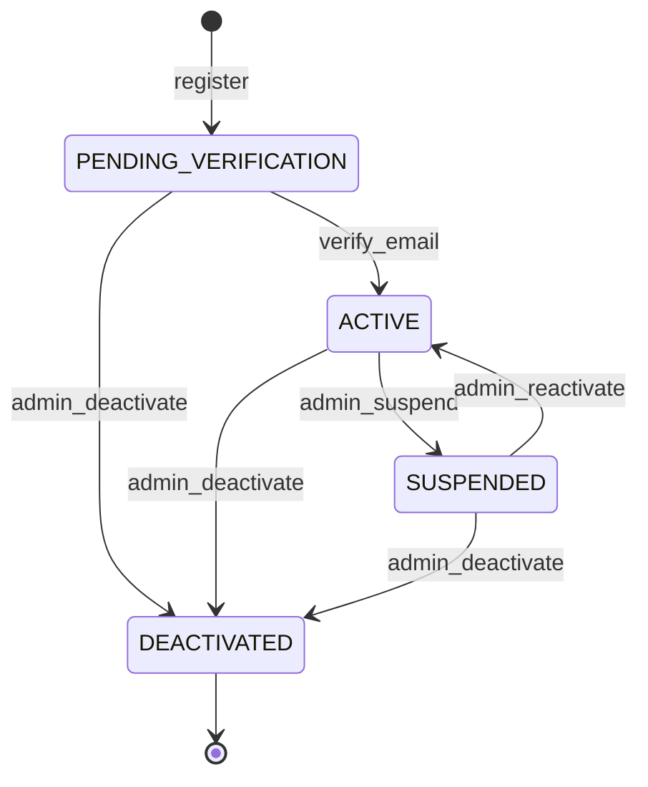

# Identity & Access Domain

## Overview

This domain handles **authentication, authorization, user management, and role-based access control (RBAC)**, including **user registration, login, session management, role assignment, permission enforcement, and credential lifecycle management**.

It acts as **a core foundational service** that every other domain depends on to verify identity and enforce access policies across the Sentinel360 platform.

---

## Use Cases

---

### UC-IAM-01: User Registration

- **Purpose**: Allow a new user to create an account on the Sentinel360 platform
- **Actors**: Public User (Community Member, Security Operator, Law Enforcement Officer)
- **Preconditions**: User does not already have an account with the provided email

#### Main Success Flow

1. User submits registration form with name, email, password, and account type
2. System validates input fields (format, length, required fields)
3. System checks for existing account with same email
4. System hashes password using bcrypt/argon2
5. System creates user record with status `PENDING_VERIFICATION`
6. System sends email verification link
7. System emits `USER_REGISTERED` event
8. System records audit log entry

#### Alternate / Exception Flows

- **Email already exists** → 409 Conflict: "An account with this email already exists"
- **Invalid input** → 422 Unprocessable Entity with field-level errors
- **Weak password** → 422: Password must meet complexity requirements (min 8 chars, uppercase, lowercase, number, special char)
- **Email service failure** → User created but flagged for retry; system queues verification email

#### Result

User account created in `PENDING_VERIFICATION` state; verification email sent.

---

### UC-IAM-02: Email Verification

- **Purpose**: Verify the user's email address to activate their account
- **Actors**: User (via email link)
- **Preconditions**: User has a pending verification token

#### Main Success Flow

1. User clicks verification link containing a signed token
2. System validates token signature and expiry
3. System transitions user status from `PENDING_VERIFICATION` to `ACTIVE`
4. System invalidates the verification token
5. System emits `USER_VERIFIED` event
6. System records audit log entry

#### Alternate / Exception Flows

- **Token expired** → 410 Gone: "Verification link has expired. Request a new one."
- **Token already used** → 409 Conflict: "Email already verified"
- **Invalid token** → 400 Bad Request

#### Result

User account is now `ACTIVE` and can authenticate.

---

### UC-IAM-03: User Authentication (Login)

- **Purpose**: Authenticate a user and establish a session
- **Actors**: Registered User
- **Preconditions**: User account exists and is in `ACTIVE` state

#### Main Success Flow

1. User submits email and password
2. System retrieves user record by email
3. System verifies password hash
4. System checks account status is `ACTIVE`
5. System generates session token (JWT + refresh token)
6. System records login metadata (IP, user agent, timestamp)
7. System emits `USER_LOGGED_IN` event
8. System returns access token and refresh token

#### Alternate / Exception Flows

- **Invalid credentials** → 401 Unauthorized: "Invalid email or password" (generic to prevent enumeration)
- **Account suspended** → 403 Forbidden: "Account has been suspended. Contact support."
- **Account pending verification** → 403: "Please verify your email before logging in."
- **Account locked (too many attempts)** → 429 Too Many Requests: "Account temporarily locked. Try again in 15 minutes."
- **Brute force detected** → System increments failed attempt counter; locks after 5 consecutive failures

#### Result

User receives access and refresh tokens; session is established.

---

### UC-IAM-04: Token Refresh

- **Purpose**: Obtain a new access token using a valid refresh token
- **Actors**: Authenticated User (System)
- **Preconditions**: User has a valid, non-expired refresh token

#### Main Success Flow

1. Client submits refresh token
2. System validates refresh token signature and expiry
3. System checks token has not been revoked
4. System issues new access token (and optionally rotates refresh token)
5. System returns new token pair

#### Alternate / Exception Flows

- **Refresh token expired** → 401: "Session expired. Please log in again."
- **Refresh token revoked** → 401: Revoke all tokens for this user (possible theft detected)

#### Result

New access token issued; session extended.

---

### UC-IAM-05: User Logout

- **Purpose**: Terminate the user's active session
- **Actors**: Authenticated User
- **Preconditions**: User has an active session

#### Main Success Flow

1. User initiates logout
2. System revokes the current access and refresh tokens
3. System emits `USER_LOGGED_OUT` event
4. System records audit log entry

#### Alternate / Exception Flows

- **Token already invalid** → 200 OK (idempotent)

#### Result

Session terminated; tokens invalidated.

---

### UC-IAM-06: Password Reset

- **Purpose**: Allow a user to reset a forgotten password
- **Actors**: User (unauthenticated)
- **Preconditions**: User has an active account

#### Main Success Flow

1. User submits password reset request with email
2. System generates a time-limited reset token (15-minute expiry)
3. System sends password reset email with secure link
4. User clicks link and submits new password
5. System validates token and new password strength
6. System hashes new password and updates user record
7. System invalidates all existing sessions for the user
8. System emits `PASSWORD_RESET` event
9. System records audit log entry

#### Alternate / Exception Flows

- **Email not found** → 200 OK (prevent email enumeration — always respond success)
- **Token expired** → 410 Gone: "Reset link has expired"
- **Weak new password** → 422: Password complexity requirements not met

#### Result

Password updated; all previous sessions revoked.

---

### UC-IAM-07: Assign Role to User

- **Purpose**: Assign one or more roles to a user to control system access
- **Actors**: Administrator, Super Administrator
- **Preconditions**: Target user exists; role exists; assigning actor has permission

#### Main Success Flow

1. Admin selects a user and a role to assign
2. System validates the admin has `MANAGE_ROLES` permission
3. System checks the user does not already have the role
4. System assigns the role to the user
5. System emits `ROLE_ASSIGNED` event
6. System records audit log entry with actor, target user, and role

#### Alternate / Exception Flows

- **Insufficient permissions** → 403 Forbidden
- **Role already assigned** → 409 Conflict: "User already has this role"
- **User not found** → 404 Not Found
- **Role not found** → 404 Not Found

#### Result

User now has the assigned role and its associated permissions.

---

### UC-IAM-08: Revoke Role from User

- **Purpose**: Remove a role from a user
- **Actors**: Administrator, Super Administrator
- **Preconditions**: User has the role; actor has permission

#### Main Success Flow

1. Admin selects a user and role to revoke
2. System validates admin has `MANAGE_ROLES` permission
3. System removes the role from the user
4. System invalidates any cached permissions
5. System emits `ROLE_REVOKED` event
6. System records audit log entry

#### Alternate / Exception Flows

- **Insufficient permissions** → 403 Forbidden
- **Cannot remove last Super Admin role** → 400: "At least one Super Admin must exist"
- **User does not have role** → 404 Not Found

#### Result

Role removed from user; permissions updated immediately.

---

### UC-IAM-09: Manage Roles and Permissions

- **Purpose**: Create, update, or delete roles and their associated permissions
- **Actors**: Super Administrator
- **Preconditions**: Actor has `MANAGE_SYSTEM_ROLES` permission

#### Main Success Flow

1. Super Admin creates/updates a role with a name and set of permissions
2. System validates role name uniqueness
3. System validates all permission codes are valid
4. System persists the role configuration
5. System emits `ROLE_UPDATED` event
6. System records audit log entry

#### Alternate / Exception Flows

- **Duplicate role name** → 409 Conflict
- **Invalid permission code** → 422 Unprocessable Entity
- **Cannot delete role with active assignments** → 400: "Role is assigned to users. Reassign or remove first."

#### Result

Role created/updated with specified permissions.

---

### UC-IAM-10: View User Profile

- **Purpose**: View the profile details of a specific user
- **Actors**: Authenticated User (own profile), Administrator (any profile)
- **Preconditions**: User is authenticated

#### Main Success Flow

1. User/Admin requests profile by user ID
2. System validates authorization (own profile or admin permission)
3. System retrieves user record with roles and metadata
4. System returns profile data (excluding sensitive fields like password hash)

#### Alternate / Exception Flows

- **Unauthorized** → 403 Forbidden
- **User not found** → 404 Not Found

#### Result

User profile data returned.

---

### UC-IAM-11: Update User Profile

- **Purpose**: Update profile information for a user
- **Actors**: Authenticated User (own profile), Administrator
- **Preconditions**: User is authenticated

#### Main Success Flow

1. User submits updated profile fields (name, phone, avatar)
2. System validates input
3. System updates user record
4. System emits `PROFILE_UPDATED` event
5. System records audit log entry

#### Alternate / Exception Flows

- **Unauthorized** → 403 Forbidden
- **Invalid input** → 422 Unprocessable Entity

#### Result

User profile updated.

---

### UC-IAM-12: Deactivate / Suspend User Account

- **Purpose**: Suspend or deactivate a user account
- **Actors**: Administrator, Super Administrator
- **Preconditions**: Target user exists and is `ACTIVE`

#### Main Success Flow

1. Admin initiates account suspension with reason
2. System validates admin permission
3. System transitions user status to `SUSPENDED`
4. System revokes all active sessions for the user
5. System emits `USER_SUSPENDED` event
6. System records audit log entry with suspension reason

#### Alternate / Exception Flows

- **Cannot suspend Super Admin** → 400 (unless by another Super Admin)
- **User already suspended** → 409 Conflict

#### Result

User account suspended; all sessions terminated.

---

## Core Entities

---

### Entity: User

- **Description**: Represents a registered individual on the Sentinel360 platform

#### Fields

- `id`: UUID — Unique identifier
- `email`: String — Unique email address
- `password_hash`: String — Hashed password (never exposed via API)
- `name`: String — Full display name
- `phone`: String (nullable) — Contact phone number
- `avatar_url`: String (nullable) — Profile image URL
- `status`: Enum — Account status
- `email_verified_at`: Timestamp (nullable) — When email was verified
- `last_login_at`: Timestamp (nullable) — Last successful login
- `failed_login_attempts`: Integer — Consecutive failed login count
- `locked_until`: Timestamp (nullable) — Account lockout expiry
- `created_at`: Timestamp — Account creation time
- `updated_at`: Timestamp — Last modification time

#### Constraints

- `email` must be unique (case-insensitive)
- `password_hash` must use bcrypt or argon2
- `status` must be one of: `PENDING_VERIFICATION`, `ACTIVE`, `SUSPENDED`, `DEACTIVATED`
- `failed_login_attempts` resets to 0 on successful login

#### Relationships

- Has many `UserRole` (many-to-many with Role)
- Has many `Session`
- Has many `AuditLogEntry` (as actor)

---

### Entity: Role

- **Description**: Defines a set of permissions that can be assigned to users

#### Fields

- `id`: UUID — Unique identifier
- `name`: String — Unique role name (e.g., `COMMUNITY_MEMBER`, `SECURITY_OPERATOR`, `LAW_ENFORCEMENT`, `ADMIN`, `SUPER_ADMIN`)
- `description`: String — Human-readable description
- `is_system`: Boolean — Whether the role is system-defined (cannot be deleted)
- `created_at`: Timestamp
- `updated_at`: Timestamp

#### Constraints

- `name` must be unique
- System roles (`is_system = true`) cannot be deleted or renamed

#### Relationships

- Has many `RolePermission` (many-to-many with Permission)
- Has many `UserRole` (many-to-many with User)

---

### Entity: Permission

- **Description**: Represents a granular access right within the system

#### Fields

- `id`: UUID — Unique identifier
- `code`: String — Unique permission code (e.g., `VIEW_INCIDENTS`, `MANAGE_USERS`, `UPLOAD_FOOTAGE`)
- `description`: String — Human-readable description
- `domain`: String — The domain this permission belongs to
- `created_at`: Timestamp

#### Constraints

- `code` must be unique
- Permissions are system-managed (not user-editable)

#### Relationships

- Has many `RolePermission` (many-to-many with Role)

---

### Entity: UserRole

- **Description**: Junction entity linking users to roles

#### Fields

- `id`: UUID — Unique identifier
- `user_id`: UUID — Reference to User
- `role_id`: UUID — Reference to Role
- `assigned_by`: UUID — Reference to the admin who assigned the role
- `assigned_at`: Timestamp

#### Constraints

- Unique constraint on (`user_id`, `role_id`)

#### Relationships

- Belongs to `User`
- Belongs to `Role`

---

### Entity: Session

- **Description**: Represents an active authenticated session

#### Fields

- `id`: UUID — Unique identifier
- `user_id`: UUID — Reference to User
- `access_token_hash`: String — Hashed access token
- `refresh_token_hash`: String — Hashed refresh token
- `ip_address`: String — Client IP address
- `user_agent`: String — Client user agent string
- `expires_at`: Timestamp — Session expiry time
- `revoked_at`: Timestamp (nullable) — When the session was revoked
- `created_at`: Timestamp

#### Constraints

- Sessions expire after configured TTL (e.g., access: 15 min, refresh: 7 days)
- Revoked sessions cannot be refreshed

#### Relationships

- Belongs to `User`

---

## State Machines

### User Account Lifecycle

---

### States

| State                  | Description                                           |
| ---------------------- | ----------------------------------------------------- |
| `PENDING_VERIFICATION` | User has registered but has not verified their email  |
| `ACTIVE`               | User is fully verified and can access the system      |
| `SUSPENDED`            | User is temporarily blocked from accessing the system |
| `DEACTIVATED`          | User account is permanently disabled                  |

---

### Transitions & Guards

| From → To                     | Event            | Condition                                                  |
| ----------------------------- | ---------------- | ---------------------------------------------------------- |
| PENDING_VERIFICATION → ACTIVE | verify_email     | Valid, non-expired verification token                      |
| ACTIVE → SUSPENDED            | admin_suspend    | Actor has `MANAGE_USERS` permission                        |
| SUSPENDED → ACTIVE            | admin_reactivate | Actor has `MANAGE_USERS` permission                        |
| ACTIVE → DEACTIVATED          | admin_deactivate | Actor has `MANAGE_USERS` permission; not self-deactivation |
| SUSPENDED → DEACTIVATED       | admin_deactivate | Actor has `MANAGE_USERS` permission                        |

---

## Business Rules (Invariants)

1. **Email uniqueness**: No two users may share the same email address (case-insensitive comparison)
2. **Password complexity**: Passwords must be at least 8 characters with uppercase, lowercase, digit, and special character
3. **Account lockout**: After 5 consecutive failed login attempts, the account is locked for 15 minutes
4. **Session limits**: A user may have at most 10 concurrent active sessions; oldest session is revoked when limit exceeded
5. **Role protection**: At least one user must always hold the `SUPER_ADMIN` role
6. **Self-role restriction**: Users cannot modify their own role assignments
7. **Token security**: Access tokens expire in 15 minutes; refresh tokens in 7 days
8. **Password reset invalidation**: All active sessions must be revoked after a password reset
9. **Permission enforcement**: Every API request must be authorized against the user's effective permissions (union of all role permissions)
10. **Audit completeness**: All authentication and authorization events must be logged

---

## Processing Flows

### Registration Flow

1. Receive registration payload (name, email, password, account_type)
2. Validate input format and required fields
3. Check email uniqueness
4. Hash password (argon2)
5. Create user record with `PENDING_VERIFICATION` status
6. Generate signed verification token (24-hour expiry)
7. Send verification email
8. Emit `USER_REGISTERED` event
9. Record audit log

### Login Flow

1. Receive email and password
2. Look up user by email
3. Check account is not locked
4. Verify password hash
5. Check account status is `ACTIVE`
6. Reset failed login attempts counter
7. Generate access + refresh token pair
8. Create session record
9. Emit `USER_LOGGED_IN` event
10. Return tokens

### Role Assignment Flow

1. Validate requesting admin has `MANAGE_ROLES` permission
2. Validate target user exists and is not self
3. Validate role exists
4. Check for duplicate assignment
5. Create `UserRole` record
6. Invalidate cached permissions for user
7. Emit `ROLE_ASSIGNED` event
8. Record audit log

### Permission Check Flow

1. Extract user ID from access token
2. Load user roles (from cache or DB)
3. Aggregate all permissions from all roles
4. Check if required permission code exists in the set
5. Allow or deny the request (403 if denied)

---

## Interfaces

### User List View (Admin)

- **Filters**: Status, role, registration date range, search by name/email
- **Columns**: Name, Email, Status, Roles, Last Login, Created At
- **Sorting**: By name, email, created_at, last_login_at
- **Pagination**: 25 per page, cursor-based

### User Detail View (Admin)

- **Entity details**: Full profile, account status, assigned roles
- **Related entities**: Active sessions, recent audit logs
- **Audit history**: Login history, role changes, status changes
- **Actions**: Assign role, revoke role, suspend, reactivate, deactivate, reset password link

### Role Management View (Super Admin)

- **Filters**: System/custom roles
- **Columns**: Role name, description, permission count, user count
- **Actions**: Create role, edit role, delete role (if not system), view assigned users

---

## Notifications

| Event                    | Recipient | Channel        | Message                                                    |
| ------------------------ | --------- | -------------- | ---------------------------------------------------------- |
| USER_REGISTERED          | User      | Email          | "Welcome to Sentinel360. Please verify your email."        |
| USER_VERIFIED            | User      | Email + In-app | "Your email has been verified. You can now log in."        |
| PASSWORD_RESET_REQUESTED | User      | Email          | "Password reset link (expires in 15 min)"                  |
| PASSWORD_RESET           | User      | Email + In-app | "Your password has been changed successfully."             |
| USER_SUSPENDED           | User      | Email          | "Your account has been suspended. Contact support."        |
| ROLE_ASSIGNED            | User      | In-app         | "You have been assigned the role: {role_name}"             |
| ROLE_REVOKED             | User      | In-app         | "The role {role_name} has been removed from your account." |
| SUSPICIOUS_LOGIN         | User      | Email + Push   | "New login detected from {ip} / {location}"                |

---

## Audit Logging

- User registration
- Email verification
- Login success / failure
- Logout
- Password reset request and completion
- Token refresh
- Role assignment / revocation
- Account status changes (suspend, reactivate, deactivate)
- Permission changes on roles
- Profile updates

Includes:

- **Actor**: User ID or `SYSTEM`
- **Timestamp**: ISO 8601
- **Action**: Event code (e.g., `USER_REGISTERED`, `LOGIN_FAILED`)
- **Target**: Affected entity ID and type
- **Payload snapshot**: Relevant data (excluding sensitive fields)
- **IP Address**: Client IP
- **User Agent**: Client user agent string

---

## Invariants

1. Data consistency: Email uniqueness and password hash integrity must always hold
2. State transitions must follow the User Account Lifecycle state machine
3. Role assignments must maintain the minimum Super Admin constraint
4. All authentication/authorization events must produce audit log entries
5. Tokens must be cryptographically signed and time-bounded
6. Passwords must never be stored or transmitted in plaintext
