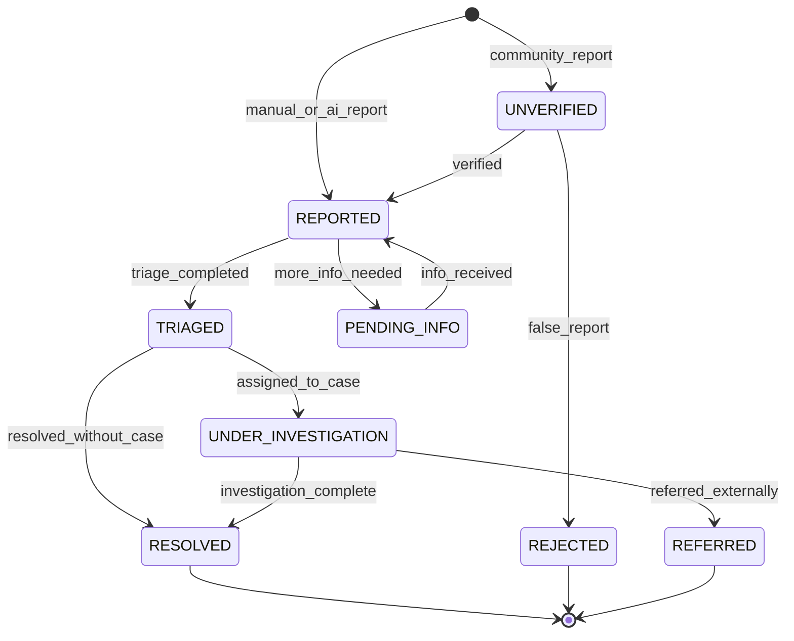
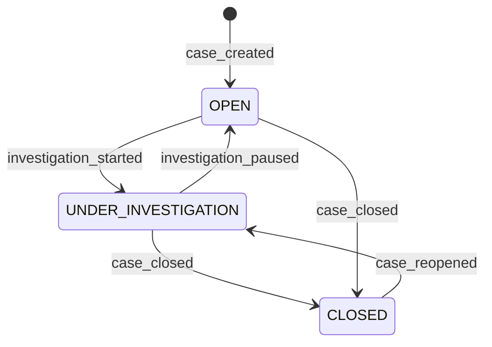

# Incident & Case Management Domain

## Overview

This domain handles **incident creation and lifecycle management, case investigations, evidence linking, and report generation**, including **incident reporting, case creation and assignment, evidence chain management, investigation workflows, status tracking, and formal report compilation**.

It acts as **a core intelligence service** that orchestrates the investigative workflow across the Sentinel360 platform, connecting detections, evidence, entity intelligence, and scene data into structured cases for resolution.

---

## Use Cases

---

### UC-IC-01: Report Incident

- **Purpose**: Create a new incident record from a detection, manual report, or community sighting
- **Actors**: Security Operator, Community Member (via public app), System (automated from detections)
- **Preconditions**: Actor has `REPORT_INCIDENT` permission or is submitting via community app

#### Main Success Flow

1. Actor submits incident details: type, description, location, time, severity, attached media
2. System validates input fields
3. System generates unique incident number (e.g., `INC-2026-000123`)
4. System creates incident record with status `REPORTED`
5. System links any attached media as initial evidence
6. System assigns incident to the appropriate queue based on type and location
7. System emits `INCIDENT_REPORTED` event
8. System records audit log and chain of custody for any evidence

#### Alternate / Exception Flows

- **Duplicate incident** → System suggests potential duplicates; actor can link or proceed
- **Missing required fields** → 422: Field-level validation errors
- **Community report (unverified)** → Status set to `UNVERIFIED` instead of `REPORTED`
- **Auto-generated from AI detection** → System creates with detection evidence pre-linked

#### Result

Incident created with unique number; assigned to triage queue; evidence linked.

---

### UC-IC-02: Triage Incident

- **Purpose**: Review and prioritize a newly reported incident
- **Actors**: Security Operator, Law Enforcement Officer
- **Preconditions**: Incident exists in `REPORTED` or `UNVERIFIED` state; actor has `TRIAGE_INCIDENT` permission

#### Main Success Flow

1. Actor reviews incident details, evidence, and related detections
2. Actor assesses severity and priority: `LOW`, `MEDIUM`, `HIGH`, `CRITICAL`
3. Actor assigns incident category (theft, assault, vandalism, suspicious activity, etc.)
4. Actor verifies or rejects the incident (for unverified reports)
5. System transitions status to `TRIAGED`
6. System emits `INCIDENT_TRIAGED` event
7. System records audit log

#### Alternate / Exception Flows

- **Duplicate confirmed** → Merge into existing incident; close as duplicate
- **False report** → Status set to `REJECTED` with reason
- **Insufficient information** → Status set to `PENDING_INFO`; requester notified

#### Result

Incident triaged with assigned priority, category, and verified status.

---

### UC-IC-03: Create Case from Incident(s)

- **Purpose**: Escalate one or more incidents into a formal investigation case
- **Actors**: Law Enforcement Officer, Administrator
- **Preconditions**: Incident(s) triaged; actor has `CREATE_CASE` permission

#### Main Success Flow

1. Actor selects one or more triaged incidents to group into a case
2. Actor provides case details: title, description, case type, priority
3. System generates unique case number (e.g., `CASE-2026-000045`)
4. System creates case record with status `OPEN`
5. System links all selected incidents to the case
6. System consolidates evidence from all linked incidents
7. System assigns case to an investigating officer (manual or auto-assign)
8. System emits `CASE_CREATED` event
9. System records audit log

#### Alternate / Exception Flows

- **Incident already linked to a case** → Warning; actor can add to existing case or create new
- **Auto-assignment failure** → Case created without assignment; admin notified

#### Result

Case created with linked incidents, consolidated evidence, and assigned investigator.

---

### UC-IC-04: Assign/Reassign Case

- **Purpose**: Assign a case to an investigating officer or team
- **Actors**: Administrator, Senior Law Enforcement Officer
- **Preconditions**: Case exists; actor has `ASSIGN_CASE` permission

#### Main Success Flow

1. Actor selects an officer or team to assign
2. System validates assignee has appropriate role and clearance
3. System updates case assignment
4. System notifies the new assignee
5. System emits `CASE_ASSIGNED` event
6. System records audit log with previous and new assignee

#### Alternate / Exception Flows

- **Assignee at capacity** → Warning: "Officer has {n} active cases"
- **Clearance insufficient** → 403: "Assignee lacks required clearance level"
- **Self-assignment** → Allowed if actor has permission

#### Result

Case assigned to investigating officer; officer notified.

---

### UC-IC-05: Link Evidence to Case

- **Purpose**: Attach evidence (media, documents, detections, entity profiles) to a case
- **Actors**: Law Enforcement Officer, Security Operator
- **Preconditions**: Case exists and is not `CLOSED`; actor has `MANAGE_EVIDENCE` permission

#### Main Success Flow

1. Actor selects evidence items to link (media assets, detections, entity profiles, documents)
2. System validates evidence items exist
3. System creates evidence links with relationship description
4. System creates chain of custody entry for each evidence item
5. System computes/verifies SHA-256 hash for each evidence file
6. System emits `EVIDENCE_LINKED` event
7. System records audit log

#### Alternate / Exception Flows

- **Evidence already linked** → 409: "Evidence already linked to this case"
- **Evidence from restricted domain** → Permission check against evidence type

#### Result

Evidence linked to case; chain of custody established.

---

### UC-IC-06: Update Investigation Progress

- **Purpose**: Record investigation notes, findings, and status updates
- **Actors**: Law Enforcement Officer (assigned investigator)
- **Preconditions**: Case is `OPEN` or `UNDER_INVESTIGATION`; actor is assigned or has override permission

#### Main Success Flow

1. Actor adds an investigation note with type (finding, interview, observation, action)
2. Actor optionally updates case status
3. Actor optionally adds new evidence links
4. System persists the investigation note
5. System updates case timeline
6. System emits `INVESTIGATION_UPDATED` event
7. System records audit log

#### Alternate / Exception Flows

- **Case is closed** → 400: "Cannot update a closed case. Reopen first."
- **Actor not assigned** → 403 (unless has override permission)

#### Result

Investigation note recorded; case timeline updated.

---

### UC-IC-07: Close Case

- **Purpose**: Close a case with a resolution
- **Actors**: Law Enforcement Officer, Administrator
- **Preconditions**: Case is `OPEN` or `UNDER_INVESTIGATION`; actor has `CLOSE_CASE` permission

#### Main Success Flow

1. Actor selects resolution: `RESOLVED`, `UNRESOLVED`, `REFERRED`, `DISMISSED`
2. Actor provides closing summary and findings
3. System validates all linked incidents have been addressed
4. System transitions case to `CLOSED`
5. System transitions all linked incidents to their final state
6. System generates case closure report
7. System emits `CASE_CLOSED` event
8. System records audit log

#### Alternate / Exception Flows

- **Open incidents remain** → Warning: "Case has {n} open incidents. Close or address them first."
- **Missing closing summary** → 422: "Closing summary is required"

#### Result

Case closed with resolution; closure report generated.

---

### UC-IC-08: Reopen Case

- **Purpose**: Reopen a previously closed case due to new evidence or information
- **Actors**: Law Enforcement Officer, Administrator
- **Preconditions**: Case is `CLOSED`; actor has `REOPEN_CASE` permission

#### Main Success Flow

1. Actor provides reason for reopening
2. System transitions case back to `UNDER_INVESTIGATION`
3. System notifies original investigator and stakeholders
4. System emits `CASE_REOPENED` event
5. System records audit log with reason

#### Alternate / Exception Flows

- **Missing reason** → 422: "Reopening reason is required"

#### Result

Case reopened; investigator and stakeholders notified.

---

### UC-IC-09: Generate Case Report

- **Purpose**: Generate a formal report for a case including all evidence, findings, and timeline
- **Actors**: Law Enforcement Officer, Administrator
- **Preconditions**: Case exists; actor has `GENERATE_REPORT` permission

#### Main Success Flow

1. Actor selects report type and sections to include (summary, timeline, evidence list, investigation notes, entity profiles, scene data)
2. System compiles all selected data
3. System generates formatted report (PDF)
4. System digitally signs the report
5. System stores report linked to the case
6. System emits `REPORT_GENERATED` event
7. System records audit log and chain of custody

#### Alternate / Exception Flows

- **Large case** → System estimates generation time; notifies when ready
- **Missing critical data** → Warning: "Report generated with incomplete sections"

#### Result

Signed formal report generated and linked to case.

---

### UC-IC-10: Search Incidents and Cases

- **Purpose**: Search across incidents and cases with multiple criteria
- **Actors**: Authenticated User (with appropriate permission)
- **Preconditions**: Actor has `VIEW_INCIDENTS` or `VIEW_CASES` permission

#### Main Success Flow

1. Actor submits search with filters (date range, type, status, location, severity, assignee, keyword)
2. System executes search with access control filtering
3. System returns paginated results
4. System records search action in audit log

#### Alternate / Exception Flows

- **No results** → 200 OK with empty array
- **Access restriction** → Results filtered to only show permitted items

#### Result

Filtered, paginated list of incidents/cases returned.

---

## Core Entities

---

### Entity: Incident

- **Description**: A reported security event or occurrence

#### Fields

- `id`: UUID — Unique identifier
- `incident_number`: String — Human-readable number (e.g., `INC-2026-000123`)
- `title`: String — Short title
- `description`: String — Detailed description
- `type`: Enum — `THEFT`, `ASSAULT`, `VANDALISM`, `SUSPICIOUS_ACTIVITY`, `TRESPASSING`, `FIRE`, `ACCIDENT`, `OTHER`
- `severity`: Enum — `LOW`, `MEDIUM`, `HIGH`, `CRITICAL`
- `priority`: Enum — `LOW`, `MEDIUM`, `HIGH`, `URGENT`
- `status`: Enum — Incident lifecycle status
- `location`: JSONB — Incident location `{lat, lng, address, zone_id}`
- `occurred_at`: Timestamp — When the incident occurred
- `reported_at`: Timestamp — When the incident was reported
- `reported_by`: UUID — User who reported the incident
- `source`: Enum — `MANUAL`, `AI_DETECTION`, `COMMUNITY_REPORT`, `CCTV_OPERATOR`
- `source_detection_id`: UUID (nullable) — Source AI detection if auto-generated
- `case_id`: UUID (nullable) — Linked case
- `assigned_to`: UUID (nullable) — Assigned operator/officer
- `resolution`: String (nullable) — Resolution description
- `resolution_type`: Enum (nullable) — `RESOLVED`, `DUPLICATE`, `FALSE_REPORT`, `REFERRED`, `UNRESOLVED`
- `closed_at`: Timestamp (nullable) — When the incident was closed
- `closed_by`: UUID (nullable) — User who closed the incident
- `metadata`: JSONB — Additional type-specific data
- `created_at`: Timestamp
- `updated_at`: Timestamp

#### Constraints

- `incident_number` must be unique and system-generated
- `severity` and `priority` must be set during triage
- Cannot close without resolution_type
- Cannot delete incidents (soft delete only)

#### Relationships

- Belongs to `Case` (optional)
- Has many `EvidenceLink`
- Has many `IncidentNote`
- Reported by `User`
- Assigned to `User`

---

### Entity: Case

- **Description**: A formal investigation grouping one or more related incidents

#### Fields

- `id`: UUID — Unique identifier
- `case_number`: String — Human-readable number (e.g., `CASE-2026-000045`)
- `title`: String — Case title
- `description`: String — Case description
- `type`: Enum — `CRIMINAL`, `CIVIL`, `INTERNAL`, `COMMUNITY`
- `priority`: Enum — `LOW`, `MEDIUM`, `HIGH`, `CRITICAL`
- `status`: Enum — Case lifecycle status
- `assigned_to`: UUID (nullable) — Primary investigating officer
- `team_ids`: JSONB (nullable) — Array of team member user IDs
- `location`: JSONB — Primary case location
- `opened_at`: Timestamp — When the case was opened
- `closed_at`: Timestamp (nullable) — When the case was closed
- `closed_by`: UUID (nullable) — User who closed the case
- `resolution`: Enum (nullable) — `RESOLVED`, `UNRESOLVED`, `REFERRED`, `DISMISSED`
- `closing_summary`: String (nullable) — Summary of findings at closure
- `created_by`: UUID — User who created the case
- `created_at`: Timestamp
- `updated_at`: Timestamp

#### Constraints

- `case_number` must be unique and system-generated
- Cannot close without `resolution` and `closing_summary`
- At least one incident must be linked

#### Relationships

- Has many `Incident`
- Has many `EvidenceLink`
- Has many `InvestigationNote`
- Has many `CaseReport`
- Assigned to `User`
- Created by `User`

---

### Entity: EvidenceLink

- **Description**: Links an evidence item (of any type) to a case or incident

#### Fields

- `id`: UUID — Unique identifier
- `case_id`: UUID (nullable) — Linked case
- `incident_id`: UUID (nullable) — Linked incident
- `evidence_type`: Enum — `MEDIA_ASSET`, `DETECTION`, `ENTITY_PROFILE`, `RECONSTRUCTION`, `DOCUMENT`, `EXTERNAL`
- `evidence_id`: UUID — ID of the evidence item
- `relationship`: String — Description of how the evidence relates
- `added_by`: UUID — User who linked the evidence
- `evidence_hash`: String (nullable) — Hash of evidence at time of linking
- `notes`: String (nullable) — Additional notes
- `created_at`: Timestamp

#### Constraints

- Either `case_id` or `incident_id` must be set (or both)
- Evidence integrity hash should be recorded at time of linking
- Immutable after creation (cannot change the link, only add notes)

#### Relationships

- Belongs to `Case` and/or `Incident`
- References evidence item polymorphically
- Added by `User`

---

### Entity: InvestigationNote

- **Description**: A note, finding, or action record in an investigation

#### Fields

- `id`: UUID — Unique identifier
- `case_id`: UUID — Reference to case
- `note_type`: Enum — `FINDING`, `INTERVIEW`, `OBSERVATION`, `ACTION`, `STATUS_UPDATE`, `GENERAL`
- `title`: String — Note title
- `content`: String — Note content (rich text)
- `attachments`: JSONB (nullable) — Array of attachment references
- `is_confidential`: Boolean — Whether the note is restricted to senior investigators
- `created_by`: UUID — Author
- `created_at`: Timestamp
- `updated_at`: Timestamp

#### Constraints

- Confidential notes only visible to case assignee, senior officers, and admins
- Notes cannot be deleted, only archived
- Rich text content is sanitized on input

#### Relationships

- Belongs to `Case`
- Created by `User`

---

### Entity: CaseReport

- **Description**: A formal report generated for a case

#### Fields

- `id`: UUID — Unique identifier
- `case_id`: UUID — Reference to case
- `report_type`: Enum — `PRELIMINARY`, `PROGRESS`, `FINAL`, `SUPPLEMENTAL`
- `title`: String — Report title
- `sections`: JSONB — Array of included sections
- `file_url`: String — URL to generated report file
- `file_hash`: String — SHA-256 hash of report file
- `format`: Enum — `PDF`, `DOCX`
- `is_signed`: Boolean — Whether the report is digitally signed
- `generated_by`: UUID — User who generated the report
- `created_at`: Timestamp

#### Constraints

- Reports are immutable once generated
- `FINAL` reports must be digitally signed

#### Relationships

- Belongs to `Case`
- Generated by `User`

---

## State Machines

### Incident Lifecycle

### Case Lifecycle

---

### States — Incident

| State                 | Description                                     |
| --------------------- | ----------------------------------------------- |
| `UNVERIFIED`          | Community-reported incident; not yet verified   |
| `REPORTED`            | Incident reported and pending triage            |
| `PENDING_INFO`        | More information needed before triage           |
| `TRIAGED`             | Incident assessed, prioritized, and categorized |
| `UNDER_INVESTIGATION` | Linked to a case and actively investigated      |
| `RESOLVED`            | Incident resolved                               |
| `REJECTED`            | Incident was a false report                     |
| `REFERRED`            | Incident referred to external authority         |

### States — Case

| State                 | Description                                 |
| --------------------- | ------------------------------------------- |
| `OPEN`                | Case created; not yet actively investigated |
| `UNDER_INVESTIGATION` | Active investigation in progress            |
| `CLOSED`              | Case closed with resolution                 |

---

### Transitions & Guards

| From → To                      | Event                  | Condition                                               |
| ------------------------------ | ---------------------- | ------------------------------------------------------- |
| UNVERIFIED → REPORTED          | verified               | Actor has `TRIAGE_INCIDENT` permission                  |
| UNVERIFIED → REJECTED          | false_report           | Actor has `TRIAGE_INCIDENT` permission; reason provided |
| REPORTED → TRIAGED             | triage_completed       | Priority and category assigned                          |
| TRIAGED → UNDER_INVESTIGATION  | assigned_to_case       | Case created or incident linked to existing case        |
| UNDER_INVESTIGATION → RESOLVED | investigation_complete | Resolution type and description provided                |
| OPEN → UNDER_INVESTIGATION     | investigation_started  | Investigator assigned                                   |
| UNDER_INVESTIGATION → CLOSED   | case_closed            | Resolution and closing summary provided                 |
| CLOSED → UNDER_INVESTIGATION   | case_reopened          | Reason provided; actor has `REOPEN_CASE` permission     |

---

## Business Rules (Invariants)

1. **Unique numbering**: Incident and case numbers are system-generated, sequential, and immutable
2. **Evidence chain**: Every evidence link must trigger a chain of custody entry
3. **Closure requirements**: Cases require resolution type and closing summary; incidents require resolution type
4. **Assignment validation**: Case assignees must have appropriate role and clearance
5. **Incident-case linking**: An incident can belong to at most one case (but a case has many incidents)
6. **Community report verification**: Community-reported incidents must be verified before triage
7. **Confidential notes**: Confidential investigation notes are only visible to authorized investigators
8. **Report integrity**: Generated reports must be hashed and optionally digitally signed
9. **No deletion**: Incidents and cases cannot be deleted — only closed, rejected, or archived
10. **Auto-escalation**: `CRITICAL` severity incidents that are not triaged within 30 minutes trigger escalation alerts

---

## Processing Flows

### Incident Reporting Flow

1. Receive incident details from actor (manual, API, or AI detection event)
2. Validate input and assign incident number
3. Create incident record
4. If media attached: link as evidence with hash
5. Determine routing (by type, location, severity)
6. Assign to appropriate triage queue
7. Emit `INCIDENT_REPORTED` event
8. If CRITICAL: trigger immediate notification to on-duty operators

### Case Creation Flow

1. Validate actor permissions
2. Validate selected incidents are triaged and not already in a case
3. Generate case number
4. Create case record
5. Link selected incidents
6. Consolidate all evidence from incidents
7. Create chain of custody entries for evidence
8. Assign investigator (manual or round-robin)
9. Emit `CASE_CREATED` event
10. Notify assigned investigator

### Evidence Linking Flow

1. Validate evidence item exists and actor has access
2. Verify evidence isn't already linked to this case
3. Compute/verify SHA-256 hash of evidence
4. Create EvidenceLink record
5. Create CustodyChainEntry in Audit domain
6. Emit `EVIDENCE_LINKED` event
7. Record audit log

### Report Generation Flow

1. Validate actor permissions and report parameters
2. Gather case data: incidents, evidence, notes, timeline, entities, reconstructions
3. Compile sections based on requested report type
4. Generate formatted document (PDF)
5. Compute file hash
6. Digitally sign if FINAL report
7. Store report record
8. Emit `REPORT_GENERATED` event
9. Record in chain of custody

---

## Interfaces

### Incident Queue View

- **Filters**: Status, type, severity, priority, date range, location, source, assigned to
- **Columns**: Number, Title, Type, Severity, Priority, Status, Location, Reported At, Assigned To
- **Sorting**: By priority (default), date, severity
- **Pagination**: 25 per page
- **Actions**: View, triage, assign, link to case, close
- **Indicators**: Overdue triage (highlight), unverified (badge)

### Incident Detail View

- **Header**: Incident number, title, status badge, severity, priority
- **Details**: Description, location (map), type, timeline, reporter info
- **Evidence**: Gallery of linked evidence items
- **Notes**: Chronological notes and updates
- **Related**: Linked AI detections, entity profiles, similar incidents
- **Actions**: Triage, assign, link evidence, create case, add note, close

### Case Management View

- **Filters**: Status, type, priority, date range, assignee, keyword
- **Columns**: Number, Title, Type, Priority, Status, Assignee, Incidents, Opened At
- **Sorting**: By priority, date, status
- **Pagination**: 25 per page
- **Actions**: View, assign, close, generate report

### Case Detail View

- **Header**: Case number, title, status, priority, assignee
- **Dashboard**: Summary stats (incidents, evidence items, notes, days open)
- **Incidents**: List of linked incidents with status
- **Evidence**: All linked evidence (media, detections, entities, reconstructions)
- **Investigation timeline**: Chronological notes and status changes
- **Team**: Assigned investigators and roles
- **Reports**: Generated reports list
- **Actions**: Add incident, link evidence, add note, assign, close, reopen, generate report

### Case Map View

- **Map**: All incident locations for the case plotted on map
- **Overlays**: Entity movement paths, camera locations, geofences
- **Timeline slider**: Filter map markers by time range

---

## Notifications

| Event                        | Recipient                    | Channel             | Message                                              |
| ---------------------------- | ---------------------------- | ------------------- | ---------------------------------------------------- |
| INCIDENT_REPORTED (CRITICAL) | On-duty operators, Admin     | Push + SMS + In-app | "CRITICAL INCIDENT: {title} at {location}"           |
| INCIDENT_REPORTED            | Queue operators              | In-app              | "New incident #{number}: {title}"                    |
| INCIDENT_TRIAGED             | Reporter                     | In-app              | "Your incident #{number} has been reviewed"          |
| CASE_CREATED                 | Assigned investigator        | Push + In-app       | "New case #{number} assigned to you: {title}"        |
| CASE_ASSIGNED                | New assignee                 | Push + In-app       | "Case #{number} has been assigned to you"            |
| EVIDENCE_LINKED              | Case team                    | In-app              | "New evidence added to case #{number}"               |
| INVESTIGATION_UPDATED        | Case team                    | In-app              | "Update on case #{number}: {note_title}"             |
| CASE_CLOSED                  | All stakeholders             | In-app + Email      | "Case #{number} has been closed: {resolution}"       |
| CASE_REOPENED                | Original investigator, Admin | Push + In-app       | "Case #{number} has been reopened"                   |
| TRIAGE_OVERDUE               | Supervisor                   | Push + In-app       | "Incident #{number} has not been triaged within SLA" |
| REPORT_GENERATED             | Requesting user              | In-app              | "Report for case #{number} is ready"                 |

---

## Audit Logging

- Incident creation, triage, assignment, status changes, and closure
- Case creation, assignment, status changes, and closure
- Evidence linking and access
- Investigation note creation
- Report generation and access
- Search queries
- Reassignment actions with before/after states
- Reopening actions with reasons

Includes:

- **Actor**: User ID or `SYSTEM`
- **Timestamp**: ISO 8601 UTC
- **Action**: Event code
- **Target**: Incident number, case number, evidence ID
- **Payload snapshot**: Status changes, assignments, resolution data
- **IP Address**: Client IP

---

## Invariants

1. Incident and case numbers are immutable once assigned
2. Evidence links must maintain chain of custody integrity
3. Case closure requires resolution and closing summary
4. Confidential investigation notes enforce role-based visibility
5. Community reports must be verified before entering the triage workflow
6. No incidents or cases can be permanently deleted
7. Reports once generated are immutable and stored with hash verification
