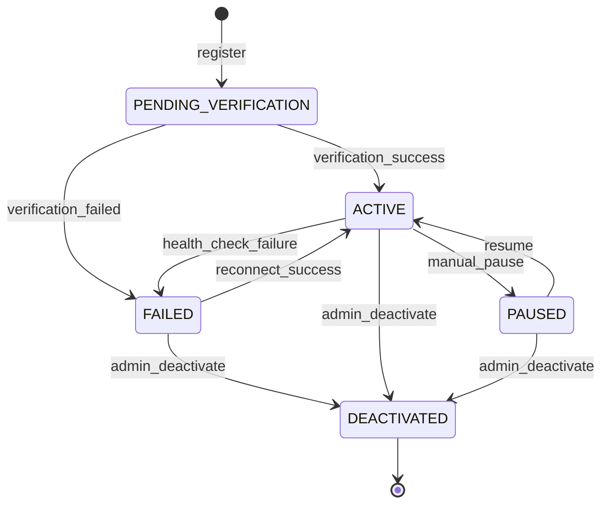

# Integration Domain

## Overview

This domain handles **integration with external systems, third-party APIs, data import/export, and interoperability**, including **external API gateway management, webhook delivery, data format transformation (JSON/XML), third-party system connectors, bulk data export, real-time data feeds, and integration health monitoring**.

It acts as **an integration layer service** that enables Sentinel360 to communicate with external law enforcement systems, government databases, third-party security platforms, and partner organizations through standardized interfaces.

---

## Use Cases

---

### UC-IN-01: Register External System Integration

- **Purpose**: Register and configure a new external system for data exchange
- **Actors**: Administrator, Super Administrator
- **Preconditions**: Actor has `MANAGE_INTEGRATIONS` permission

#### Main Success Flow

1. Admin provides integration details: name, type, endpoint URL, authentication method, data format
2. System validates endpoint reachability (health check)
3. System generates API credentials for the external system
4. System creates integration record with status `PENDING_VERIFICATION`
5. System performs a test handshake with the external system
6. On success: status transitions to `ACTIVE`
7. System emits `INTEGRATION_REGISTERED` event
8. System records audit log

#### Alternate / Exception Flows

- **Endpoint unreachable** → Status remains `PENDING_VERIFICATION`; admin notified
- **Auth method unsupported** → 422: "Authentication method not supported"
- **Duplicate integration** → 409: "Integration with this endpoint already exists"

#### Result

External system integration registered and active; API credentials generated.

---

### UC-IN-02: Export Data to External System

- **Purpose**: Export case data, incident reports, or evidence metadata to an external system
- **Actors**: Law Enforcement Officer, Administrator, System (automated)
- **Preconditions**: Integration is `ACTIVE`; actor has `EXPORT_DATA` permission

#### Main Success Flow

1. Actor initiates data export (manual) or system triggers scheduled export
2. System validates the target integration is active
3. System gathers requested data (incidents, cases, evidence metadata, entity profiles)
4. System transforms data into the target format (JSON or XML)
5. System applies data filtering/redaction based on the integration's access level
6. System sends data to external system via configured protocol (REST API, SFTP, webhook)
7. System receives acknowledgment/confirmation
8. System creates export record with data hash and delivery status
9. System emits `DATA_EXPORTED` event
10. System records audit log and chain of custody entry

#### Alternate / Exception Flows

- **External system unavailable** → Queue for retry; mark as `PENDING`
- **Data too large** → System chunks data and sends in batches
- **Transformation error** → 500: Log error; notify admin
- **External system rejects data** → Record rejection reason; notify actor

#### Result

Data exported to external system in requested format; delivery confirmed.

---

### UC-IN-03: Import Data from External System

- **Purpose**: Receive and process data from an external system (tips, BOLOs, intelligence feeds)
- **Actors**: External System (via API), System (automated polling)
- **Preconditions**: Integration is `ACTIVE`; incoming data passes validation

#### Main Success Flow

1. External system sends data via API endpoint or system polls external source
2. System authenticates the request using integration credentials
3. System validates the data schema and content
4. System transforms data from external format to internal model
5. System deduplicates against existing records
6. System creates internal records (incidents, entity updates, intelligence notes)
7. System emits `DATA_IMPORTED` event
8. System records audit log with source integration reference

#### Alternate / Exception Flows

- **Authentication failure** → 401 Unauthorized; log attempt
- **Schema validation failure** → 422: Return validation errors; log rejected payload
- **Duplicate data** → Skip or merge based on dedup strategy; log action
- **Rate limit exceeded** → 429 Too Many Requests

#### Result

External data imported, transformed, and integrated into the platform.

---

### UC-IN-04: Configure Webhook Delivery

- **Purpose**: Configure webhook endpoints for real-time event notifications to external systems
- **Actors**: Administrator
- **Preconditions**: Actor has `MANAGE_INTEGRATIONS` permission

#### Main Success Flow

1. Admin configures webhook: URL, events to subscribe to, secret key, format
2. System validates the webhook URL (sends test payload)
3. System creates webhook configuration record
4. System generates a signing secret for payload verification
5. When subscribed events occur, system delivers webhook payloads
6. System records audit log

#### Alternate / Exception Flows

- **Webhook URL unreachable** → Warning; allow saving but mark as `UNVERIFIED`
- **Invalid event type** → 422: "Unknown event type"

#### Result

Webhook configured; events will be delivered to the endpoint.

---

### UC-IN-05: Deliver Webhook Event

- **Purpose**: Send a real-time event notification to a registered webhook endpoint
- **Actors**: System (automated on event)
- **Preconditions**: Webhook is `ACTIVE`; event matches subscription

#### Main Success Flow

1. System detects a domain event matching a webhook subscription
2. System composes webhook payload (JSON/XML)
3. System signs the payload with the webhook secret (HMAC-SHA256)
4. System sends HTTP POST to the webhook URL
5. System records delivery attempt with response status
6. If 2xx response: mark as `DELIVERED`
7. If non-2xx: queue for retry (exponential backoff, max 5 retries)

#### Alternate / Exception Flows

- **Timeout** → Queue for retry
- **SSL certificate error** → Log warning; retry if configured to allow
- **All retries exhausted** → Mark as `FAILED`; disable webhook after N consecutive failures

#### Result

Webhook payload delivered or queued for retry.

---

### UC-IN-06: Generate API Key for External Consumers

- **Purpose**: Create API keys for external systems to access the Sentinel360 API
- **Actors**: Administrator, Super Administrator
- **Preconditions**: Actor has `MANAGE_API_KEYS` permission

#### Main Success Flow

1. Admin creates API key with name, associated integration, scope (permissions), and expiry
2. System generates a cryptographic API key
3. System hashes the key for storage (only shown once)
4. System creates API key record
5. System returns the full key to the admin (display once)
6. System records audit log

#### Alternate / Exception Flows

- **Excessive scope requested** → 422: "Requested scope exceeds integration's allowed permissions"
- **Too many active keys** → Warning: "Consider revoking unused keys"

#### Result

API key generated and returned (shown once); stored as hash.

---

### UC-IN-07: Monitor Integration Health

- **Purpose**: Monitor the health and performance of all active integrations
- **Actors**: Administrator, System (automated)
- **Preconditions**: Integrations exist

#### Main Success Flow

1. System periodically pings all active integration endpoints (health checks)
2. System records response time and status
3. System tracks success/failure rates over time
4. System identifies degraded or failing integrations
5. If integration health drops below threshold → Emit `INTEGRATION_DEGRADED` alert
6. If integration is completely down → Emit `INTEGRATION_DOWN` alert; auto-pause data exchange

#### Alternate / Exception Flows

- **Intermittent failures** → System uses circuit breaker pattern before marking as down
- **Scheduled maintenance** → Integration can be manually paused without alerts

#### Result

Integration health monitored; alerts generated for degraded or failed integrations.

---

### UC-IN-08: Bulk Data Export

- **Purpose**: Export large datasets for regulatory compliance, archival, or partner sharing
- **Actors**: Administrator, Super Administrator
- **Preconditions**: Actor has `BULK_EXPORT` permission

#### Main Success Flow

1. Admin configures bulk export: data scope, date range, format (JSON/XML/CSV), destination
2. System validates parameters and estimates export size
3. System queues the export job
4. System processes data in chunks, applying access filters and redaction
5. System packages export with manifest and hash
6. System delivers to configured destination (download, SFTP, cloud storage)
7. System emits `BULK_EXPORT_COMPLETED` event
8. System records audit log and chain of custody

#### Alternate / Exception Flows

- **Export too large** → System splits into multiple files with manifest
- **Processing failure** → Resume from last successful chunk
- **Destination unavailable** → Queue; notify admin

#### Result

Bulk data export completed and delivered; fully audited.

---

## Core Entities

---

### Entity: Integration

- **Description**: A registered external system connection

#### Fields

- `id`: UUID — Unique identifier
- `name`: String — Integration name
- `description`: String (nullable) — Description
- `type`: Enum — `INBOUND`, `OUTBOUND`, `BIDIRECTIONAL`
- `protocol`: Enum — `REST_API`, `WEBHOOK`, `SFTP`, `GRAPHQL`, `SOAP`
- `endpoint_url`: String — External system endpoint
- `auth_method`: Enum — `API_KEY`, `OAUTH2`, `BASIC`, `MUTUAL_TLS`, `NONE`
- `auth_config`: JSONB — Authentication configuration (encrypted)
- `data_format`: Enum — `JSON`, `XML`, `CSV`
- `access_level`: Enum — `READ_ONLY`, `READ_WRITE`, `FULL`
- `allowed_data_types`: JSONB — Array of data types this integration can access
- `status`: Enum — `PENDING_VERIFICATION`, `ACTIVE`, `PAUSED`, `FAILED`, `DEACTIVATED`
- `health_status`: Enum — `HEALTHY`, `DEGRADED`, `DOWN`, `UNKNOWN`
- `last_health_check`: Timestamp (nullable) — Last health check timestamp
- `last_successful_exchange`: Timestamp (nullable) — Last successful data exchange
- `failure_count`: Integer — Consecutive failure count
- `circuit_breaker_open`: Boolean — Whether circuit breaker is open
- `created_by`: UUID — User who registered the integration
- `created_at`: Timestamp
- `updated_at`: Timestamp

#### Constraints

- `endpoint_url` must be a valid URL (HTTPS required for production)
- `auth_config` must be encrypted at rest
- `DEACTIVATED` integrations cannot exchange data

#### Relationships

- Has many `DataExchange`
- Has many `WebhookConfig`
- Has many `APIKey`
- Created by `User`

---

### Entity: DataExchange

- **Description**: A record of a data import or export transaction

#### Fields

- `id`: UUID — Unique identifier
- `integration_id`: UUID — Reference to integration
- `direction`: Enum — `IMPORT`, `EXPORT`
- `data_type`: String — Type of data exchanged
- `record_count`: Integer — Number of records exchanged
- `data_size_bytes`: BigInteger — Size of exchanged data
- `data_hash`: String — SHA-256 hash of the exchanged data
- `format`: Enum — `JSON`, `XML`, `CSV`
- `status`: Enum — `PENDING`, `IN_PROGRESS`, `COMPLETED`, `FAILED`, `PARTIAL`
- `error_message`: String (nullable) — Error details if failed
- `initiated_by`: UUID (nullable) — User who initiated (null for automated)
- `started_at`: Timestamp
- `completed_at`: Timestamp (nullable)
- `created_at`: Timestamp

#### Constraints

- `data_hash` must be computed for all exchanges
- Failed exchanges must retain error details

#### Relationships

- Belongs to `Integration`
- Optionally references initiating `User`

---

### Entity: WebhookConfig

- **Description**: Webhook endpoint configuration for event delivery

#### Fields

- `id`: UUID — Unique identifier
- `integration_id`: UUID — Reference to parent integration
- `url`: String — Webhook endpoint URL
- `subscribed_events`: JSONB — Array of event types to subscribe to
- `format`: Enum — `JSON`, `XML`
- `secret`: String — HMAC signing secret (encrypted at rest)
- `status`: Enum — `ACTIVE`, `PAUSED`, `FAILED`
- `consecutive_failures`: Integer — Count of consecutive delivery failures
- `max_retries`: Integer — Maximum retry attempts per event (default: 5)
- `last_delivery_at`: Timestamp (nullable)
- `last_failure_at`: Timestamp (nullable)
- `created_at`: Timestamp
- `updated_at`: Timestamp

#### Constraints

- URL must be HTTPS in production
- Secret must be encrypted at rest
- Auto-pause after configurable consecutive failures (default: 50)

#### Relationships

- Belongs to `Integration`
- Has many `WebhookDelivery`

---

### Entity: WebhookDelivery

- **Description**: A single webhook delivery attempt

#### Fields

- `id`: UUID — Unique identifier
- `webhook_config_id`: UUID — Reference to webhook configuration
- `event_type`: String — Event type delivered
- `event_id`: UUID — Reference to the source event
- `payload_hash`: String — Hash of delivered payload
- `http_status`: Integer (nullable) — Response HTTP status code
- `response_time_ms`: Integer (nullable) — Response time in milliseconds
- `delivery_status`: Enum — `PENDING`, `DELIVERED`, `FAILED`, `RETRYING`
- `attempt_number`: Integer — Which attempt this is (1-based)
- `error_message`: String (nullable) — Error details
- `next_retry_at`: Timestamp (nullable) — Scheduled retry time
- `created_at`: Timestamp

#### Constraints

- `attempt_number` must not exceed `max_retries`
- Immutable after final status (DELIVERED or max retries exhausted)

#### Relationships

- Belongs to `WebhookConfig`

---

### Entity: APIKey

- **Description**: An API key for external system authentication

#### Fields

- `id`: UUID — Unique identifier
- `integration_id`: UUID — Reference to integration
- `name`: String — Key name/description
- `key_hash`: String — Hashed API key (original shown once)
- `key_prefix`: String — First 8 characters of key (for identification)
- `scope`: JSONB — Allowed permissions/data types
- `status`: Enum — `ACTIVE`, `REVOKED`, `EXPIRED`
- `last_used_at`: Timestamp (nullable) — Last usage timestamp
- `usage_count`: BigInteger — Total usage count
- `rate_limit_per_minute`: Integer — Rate limit (default: 60)
- `expires_at`: Timestamp (nullable) — Expiry date
- `revoked_at`: Timestamp (nullable) — When revoked
- `revoked_by`: UUID (nullable) — Who revoked
- `created_by`: UUID — Who created the key
- `created_at`: Timestamp

#### Constraints

- Key is only shown once at creation time; only the hash is stored
- `REVOKED` keys cannot be reactivated
- Rate limits are enforced per key per minute

#### Relationships

- Belongs to `Integration`
- Created by `User`

---

## State Machines

### Integration Lifecycle

---

### States

| State                  | Description                                             |
| ---------------------- | ------------------------------------------------------- |
| `PENDING_VERIFICATION` | Integration registered; awaiting verification handshake |
| `ACTIVE`               | Integration is operational and exchanging data          |
| `PAUSED`               | Integration manually paused (e.g., for maintenance)     |
| `FAILED`               | Integration has failed health checks or repeated errors |
| `DEACTIVATED`          | Integration permanently disabled                        |

---

### Transitions & Guards

| From → To                     | Event                | Condition                                                |
| ----------------------------- | -------------------- | -------------------------------------------------------- |
| PENDING_VERIFICATION → ACTIVE | verification_success | Test handshake succeeds                                  |
| ACTIVE → PAUSED               | manual_pause         | Actor has `MANAGE_INTEGRATIONS` permission               |
| ACTIVE → FAILED               | health_check_failure | Circuit breaker trips (consecutive failures ≥ threshold) |
| FAILED → ACTIVE               | reconnect_success    | Health check passes; circuit breaker resets              |
| Any → DEACTIVATED             | admin_deactivate     | Actor has `MANAGE_INTEGRATIONS` permission               |

---

## Business Rules (Invariants)

1. **HTTPS enforcement**: All production integrations must use HTTPS endpoints
2. **Credential encryption**: All authentication credentials and secrets must be encrypted at rest
3. **Data redaction**: Exported data must be filtered based on the integration's access level
4. **Rate limiting**: All API keys and integrations are subject to rate limits
5. **Circuit breaker**: Failing integrations must be circuit-broken to prevent cascade failures
6. **Webhook signing**: All webhook payloads must be signed with HMAC-SHA256 for verification
7. **Export hashing**: All data exports must include a SHA-256 hash for integrity verification
8. **API key security**: API keys are shown exactly once; only hashes are stored
9. **Import validation**: All imported data must be schema-validated and sanitized before processing
10. **Audit completeness**: All data exchanges, API key usage, and integration state changes must be audited

---

## Processing Flows

### Data Export Flow

1. Validate actor permissions and integration status
2. Gather requested data with access-level filtering
3. Apply redaction rules based on integration's allowed data types
4. Transform to target format (JSON/XML/CSV)
5. Compute SHA-256 hash of export payload
6. Deliver via configured protocol
7. Await confirmation
8. Record DataExchange with hash and status
9. Record audit log and chain of custody

### Data Import Flow

1. Authenticate incoming request (API key, OAuth2, etc.)
2. Validate rate limits
3. Validate payload against expected schema
4. Transform from external format to internal model
5. Deduplicate against existing records
6. Create internal records (incidents, intelligence, entity updates)
7. Record DataExchange
8. Emit `DATA_IMPORTED` event
9. Record audit log

### Webhook Delivery Flow

1. Domain event occurs matching webhook subscription
2. Compose webhook payload in target format
3. Sign payload with webhook secret (HMAC-SHA256)
4. Send HTTP POST to webhook URL (timeout: 30 seconds)
5. Record delivery attempt
6. If success (2xx): mark as DELIVERED
7. If failure: schedule retry with exponential backoff (1m, 5m, 30m, 2h, 12h)
8. If max retries exhausted: mark as FAILED; increment webhook failure count

### Health Monitoring Flow

1. Scheduled job pings all active integration endpoints (every 5 minutes)
2. Record response time and status
3. If failure: increment failure count
4. If failure count ≥ threshold: open circuit breaker; emit `INTEGRATION_DOWN` alert
5. If circuit breaker open: retry with reduced frequency (every 30 minutes)
6. If successful during circuit breaker: close breaker; resume normal operations

---

## Interfaces

### Integration Dashboard

- **Summary cards**: Total integrations, active, paused, failed, data exchanged today
- **Health indicators**: Green/yellow/red status per integration
- **Charts**: Data exchange volume over time, response times, error rates
- **Actions**: Register new integration, pause, resume, deactivate

### Integration Detail View

- **Config**: Endpoint, auth method, data format, access level, allowed data types
- **Health**: Current status, response times, uptime chart, circuit breaker state
- **Exchange log**: Recent data imports/exports with status
- **Webhooks**: Configured webhooks with delivery statistics
- **API keys**: Active keys with usage stats
- **Actions**: Edit config, rotate credentials, test connection, manage webhooks/keys

### API Key Management

- **List**: Active keys with prefix, scope, usage count, last used, expiry
- **Actions**: Create new, revoke, view usage statistics
- **Security**: Copy key once; regenerate if needed

### Webhook Management

- **List**: Configured webhooks with subscription, status, success rate
- **Delivery log**: Recent deliveries with status, response time, attempts
- **Actions**: Create, edit subscriptions, pause, delete, retry failed

### Data Exchange Log

- **Filters**: Direction (import/export), integration, date range, status, data type
- **Columns**: Timestamp, Integration, Direction, Type, Records, Size, Status
- **Details**: Full exchange details with data hash, error messages

---

## Notifications

| Event                 | Recipient              | Channel        | Message                                                     |
| --------------------- | ---------------------- | -------------- | ----------------------------------------------------------- |
| INTEGRATION_DOWN      | Admin                  | Email + In-app | "Integration '{name}' is DOWN — data exchange paused"       |
| INTEGRATION_DEGRADED  | Admin                  | In-app         | "Integration '{name}' is experiencing degraded performance" |
| INTEGRATION_RECOVERED | Admin                  | In-app         | "Integration '{name}' has recovered"                        |
| DATA_EXPORT_COMPLETED | Requesting user        | In-app         | "Data export to '{integration}' completed: {count} records" |
| DATA_EXPORT_FAILED    | Requesting user, Admin | Email + In-app | "Data export to '{integration}' failed: {reason}"           |
| DATA_IMPORTED         | Relevant operators     | In-app         | "New data imported from '{integration}': {count} records"   |
| API_KEY_EXPIRING      | Key owner, Admin       | Email + In-app | "API key '{name}' expires in {days} days"                   |
| WEBHOOK_FAILURES      | Admin                  | Email + In-app | "Webhook '{name}' has {count} consecutive failures"         |
| BULK_EXPORT_COMPLETED | Requesting user        | In-app + Email | "Bulk export completed: {file_count} files, {total_size}"   |

---

## Audit Logging

- Integration registration, configuration changes, and deactivation
- API key creation, usage, and revocation
- All data imports with source, schema, and record counts
- All data exports with destination, scope, and hash
- Webhook configuration changes
- Webhook delivery attempts and outcomes
- Health check results and circuit breaker state changes
- Rate limit violations
- Authentication failures from external systems

Includes:

- **Actor**: User ID, API Key ID, or `SYSTEM`
- **Timestamp**: ISO 8601 UTC
- **Action**: Event code
- **Target**: Integration ID, API Key ID, webhook ID
- **Payload snapshot**: Exchange metadata, configuration changes (credentials redacted)
- **Source IP**: External system IP address

---

## Invariants

1. All external communication must use encrypted channels (HTTPS/TLS)
2. Authentication credentials are never logged or exposed in plaintext
3. Data exports must be filtered and redacted per integration access level
4. Webhook payloads must be cryptographically signed
5. Circuit breakers must prevent cascade failures from unhealthy integrations
6. All data exchanges are audited with integrity hashes
