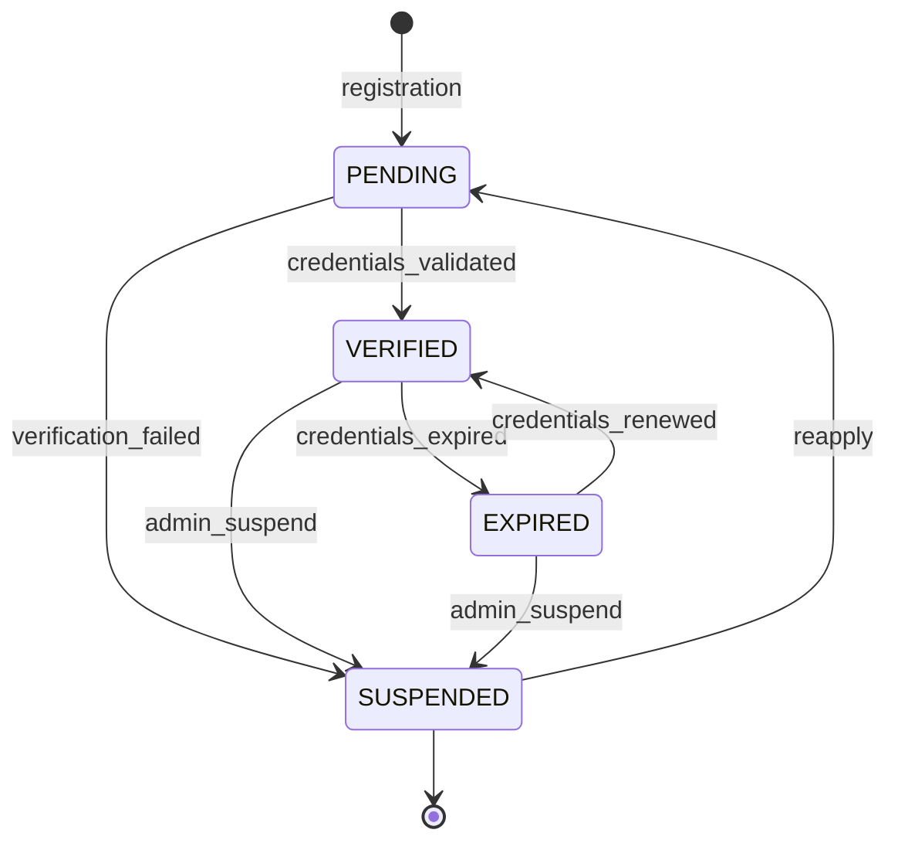
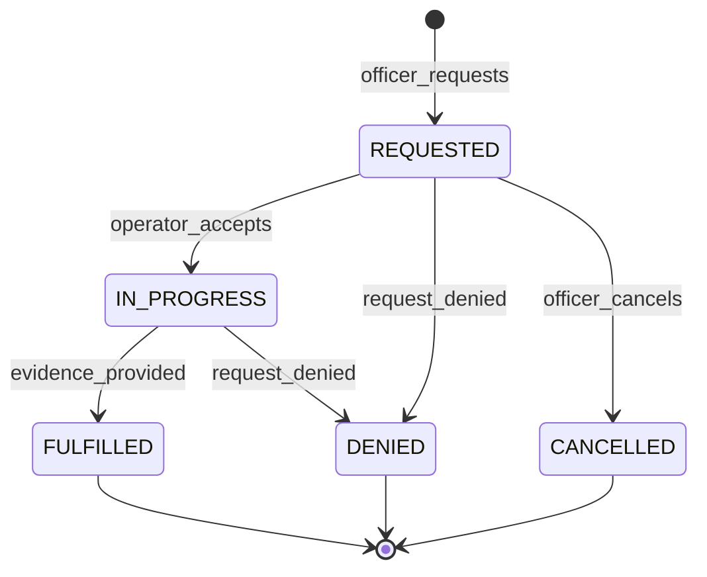

# Law Enforcement Domain

## Overview

This domain handles **the law enforcement officer interface for identity verification, investigations, case management access, and inter-agency coordination**, including **officer verification and credential management, investigation tooling, evidence review, case updates, arrest/warrant workflows, inter-agency data sharing, and chain of custody management**.

It acts as **a user interface domain** for law enforcement officers and investigators who use the Sentinel360 platform for criminal investigations, evidence management, and coordination with security operations.

---

## Use Cases

---

### UC-LE-01: Verify Law Enforcement Identity

- **Purpose**: Verify and authenticate a law enforcement officer's credentials and authority
- **Actors**: Law Enforcement Officer, System
- **Preconditions**: Officer has registered an account

#### Main Success Flow

1. Officer provides law enforcement credentials (badge number, department, rank, jurisdiction)
2. System validates credential format
3. System submits for verification (manual admin review or automated agency DB check)
4. On verification: officer's account is granted `LAW_ENFORCEMENT` role
5. System emits `OFFICER_VERIFIED` event
6. System records audit log

#### Alternate / Exception Flows

- **Verification failed** → Account retains `PENDING_VERIFICATION` status; officer notified
- **Credentials expired** → Prompt re-verification
- **Department not recognized** → Flag for manual admin review

#### Result

Officer identity verified; law enforcement permissions granted.

---

### UC-LE-02: Access Investigation Dashboard

- **Purpose**: Provide officers with a unified view of their assigned cases and investigations
- **Actors**: Law Enforcement Officer
- **Preconditions**: Officer is verified and authenticated

#### Main Success Flow

1. Officer opens the investigation dashboard
2. System retrieves:
   - Assigned cases with status and priority
   - Pending detection reviews
   - Recent sightings relevant to active cases
   - Watchlist match alerts
   - Entity intelligence updates for case-related entities
3. System presents unified dashboard view

#### Alternate / Exception Flows

- **No active cases** → Display available case queue and recent community reports

#### Result

Investigation dashboard displayed with all relevant officer-specific data.

---

### UC-LE-03: Conduct Investigation

- **Purpose**: Use investigation tools to analyze evidence, track entities, and build cases
- **Actors**: Law Enforcement Officer
- **Preconditions**: Officer has active case assignment; has `INVESTIGATE` permission

#### Main Success Flow

1. Officer selects an active case
2. Officer uses investigation tools:
   - **Entity search**: Search by face, plate, attributes
   - **Timeline reconstruction**: Build movement timelines for entities
   - **Evidence review**: View and annotate linked evidence
   - **Scene reconstruction**: View 3D crime scenes
   - **Cross-reference**: Find connections between entities and incidents
3. Officer records investigation notes and findings
4. System records all investigation actions in audit log

#### Alternate / Exception Flows

- **Access denied to evidence** → 403: "You don't have access to this evidence"
- **Entity not found** → Suggest broadening search criteria

#### Result

Investigation tools used; findings recorded; all actions audited.

---

### UC-LE-04: Review and Request Evidence

- **Purpose**: Review evidence linked to a case or request new evidence (footage, records)
- **Actors**: Law Enforcement Officer
- **Preconditions**: Officer has case access

#### Main Success Flow

1. Officer reviews existing evidence in the case
2. Officer can request additional evidence:
   - Request CCTV footage from a specific camera and time range
   - Request entity intelligence analysis
   - Request scene reconstruction
3. System creates evidence request with status `REQUESTED`
4. System routes request to appropriate operator/department
5. System notifies the requester when evidence is available
6. System records audit log

#### Alternate / Exception Flows

- **Footage not available** → System searches available archives; notifies if unavailable
- **Request denied** → Requester notified with reason

#### Result

Evidence reviewed or requested; requests routed and tracked.

---

### UC-LE-05: Update Case with Findings

- **Purpose**: Record investigation findings and update case status
- **Actors**: Law Enforcement Officer (assigned investigator)
- **Preconditions**: Case is open; officer is assigned

#### Main Success Flow

1. Officer adds investigation note (finding, interview record, forensic result, action taken)
2. Officer optionally links new evidence
3. Officer optionally updates case status or priority
4. System persists updates via Incident & Case Management domain
5. System notifies case stakeholders
6. System records audit log

#### Alternate / Exception Flows

- **Case closed** → 400: "Case is closed. Request reopening first."

#### Result

Case updated with new findings; stakeholders notified.

---

### UC-LE-06: Manage Watchlist Entries

- **Purpose**: Add, modify, or remove entities from the monitoring watchlist
- **Actors**: Law Enforcement Officer
- **Preconditions**: Officer has `MANAGE_WATCHLIST` permission

#### Main Success Flow

1. Officer selects an entity profile
2. Officer adds to watchlist with: priority, reason, case link, expiry date
3. System validates entry via Entity Intelligence domain
4. System activates watchlist monitoring
5. System emits `WATCHLIST_UPDATED` event
6. System records audit log with legal justification

#### Alternate / Exception Flows

- **Entity already on watchlist** → Update existing entry
- **Missing justification** → 422: "Legal justification is required for watchlist entries"

#### Result

Watchlist entry created/updated; all cameras now monitoring for the entity.

---

### UC-LE-07: Generate Investigation Report

- **Purpose**: Generate a formal investigation report for a case
- **Actors**: Law Enforcement Officer
- **Preconditions**: Case exists; officer has `GENERATE_REPORT` permission

#### Main Success Flow

1. Officer selects report type: preliminary, progress, final, supplemental
2. Officer selects sections to include
3. System compiles report from case data, evidence, findings, timelines, entity profiles
4. System generates digitally signed PDF
5. System stores report and records in chain of custody
6. System emits `REPORT_GENERATED` event

#### Alternate / Exception Flows

- **Large case** → System provides progress indicator; notifies when ready

#### Result

Formal investigation report generated, signed, and stored.

---

### UC-LE-08: Share Case Data with External Agency

- **Purpose**: Share case information with another law enforcement agency
- **Actors**: Law Enforcement Officer, Administrator
- **Preconditions**: Actor has `SHARE_CASE_DATA` permission; target agency integration exists

#### Main Success Flow

1. Officer selects case and data to share
2. Officer specifies target agency and sharing scope
3. System validates the target agency integration is active
4. System applies data redaction based on sharing agreement
5. System exports data via Integration domain
6. System records sharing action in audit log and chain of custody
7. System emits `CASE_DATA_SHARED` event

#### Alternate / Exception Flows

- **Agency not configured** → 404: "Target agency integration not available"
- **Sharing agreement violation** → 403: "Data sharing exceeds agreement scope"

#### Result

Case data shared with external agency; fully audited.

---

### UC-LE-09: Credential Renewal

- **Purpose**: Renew law enforcement credentials before expiry
- **Actors**: Law Enforcement Officer
- **Preconditions**: Current credentials approaching or past expiry

#### Main Success Flow

1. System notifies officer that credentials are expiring
2. Officer submits renewed credential information
3. System re-validates credentials
4. System extends verification period
5. System records audit log

#### Alternate / Exception Flows

- **Credentials expired without renewal** → Officer access reduced to read-only pending re-verification
- **Re-verification fails** → Account permissions suspended; admin notified

#### Result

Credentials renewed; officer retains full access.

---

## Core Entities

---

### Entity: OfficerProfile

- **Description**: Extended profile for a verified law enforcement officer

#### Fields

- `id`: UUID — Unique identifier
- `user_id`: UUID — Reference to the base user account
- `badge_number`: String — Officer badge/ID number
- `department`: String — Department or agency name
- `department_id`: String (nullable) — External department identifier
- `rank`: String — Officer's rank
- `jurisdiction`: String — Jurisdiction area
- `specialization`: JSONB (nullable) — Areas of expertise
- `verification_status`: Enum — `PENDING`, `VERIFIED`, `EXPIRED`, `SUSPENDED`
- `verified_at`: Timestamp (nullable) — When verification was completed
- `verified_by`: UUID (nullable) — Admin who verified
- `credentials_expire_at`: Timestamp (nullable) — Credential expiry date
- `clearance_level`: Enum — `BASIC`, `STANDARD`, `ELEVATED`, `TOP`
- `active_case_count`: Integer — Number of currently assigned cases
- `created_at`: Timestamp
- `updated_at`: Timestamp

#### Constraints

- `badge_number` must be unique per `department`
- `VERIFIED` status required for investigation access
- `EXPIRED` credentials reduce to read-only access

#### Relationships

- Belongs to `User`
- Has many `Case` (assigned investigations)
- Has many `EvidenceRequest`

---

### Entity: EvidenceRequest

- **Description**: A request for evidence from an officer to security operations or data management

#### Fields

- `id`: UUID — Unique identifier
- `requesting_officer_id`: UUID — Officer making the request
- `case_id`: UUID — Associated case
- `request_type`: Enum — `FOOTAGE`, `ANALYSIS`, `RECONSTRUCTION`, `RECORDS`
- `description`: String — What evidence is needed
- `parameters`: JSONB — Request-specific parameters (camera, time range, etc.)
- `status`: Enum — `REQUESTED`, `IN_PROGRESS`, `FULFILLED`, `DENIED`, `CANCELLED`
- `assigned_to`: UUID (nullable) — Operator assigned to fulfill
- `fulfillment_notes`: String (nullable) — Notes from fulfiller
- `evidence_ids`: JSONB (nullable) — IDs of evidence items provided
- `requested_at`: Timestamp
- `fulfilled_at`: Timestamp (nullable)
- `created_at`: Timestamp
- `updated_at`: Timestamp

#### Constraints

- Must be linked to an active case
- `DENIED` must include reason
- Fulfilled requests must link to actual evidence items

#### Relationships

- Belongs to `User` (requesting officer)
- Belongs to `Case`
- Optionally assigned to `User` (fulfilling operator)

---

### Entity: CaseShareRecord

- **Description**: Record of case data shared with an external agency

#### Fields

- `id`: UUID — Unique identifier
- `case_id`: UUID — Reference to the case
- `shared_by`: UUID — Officer/admin who shared
- `target_agency`: String — Name of the receiving agency
- `integration_id`: UUID — Integration used for sharing
- `scope`: JSONB — What data was shared (incidents, evidence, entities, etc.)
- `data_hash`: String — Hash of shared data
- `sharing_agreement_ref`: String (nullable) — Reference to the governing data sharing agreement
- `shared_at`: Timestamp
- `created_at`: Timestamp

#### Constraints

- Sharing must be within the bounds of a data sharing agreement
- All shared data must be hashed for integrity

#### Relationships

- Belongs to `Case`
- References `Integration`
- Shared by `User`

---

## State Machines

### Officer Verification Lifecycle

### Evidence Request Lifecycle

---

### States — Officer Verification

| State       | Description                                              |
| ----------- | -------------------------------------------------------- |
| `PENDING`   | Officer has submitted credentials; awaiting verification |
| `VERIFIED`  | Officer's identity and credentials confirmed             |
| `EXPIRED`   | Credentials have passed their validity period            |
| `SUSPENDED` | Officer's access has been suspended                      |

### States — Evidence Request

| State         | Description                                   |
| ------------- | --------------------------------------------- |
| `REQUESTED`   | Evidence request submitted                    |
| `IN_PROGRESS` | Operator is working on fulfilling the request |
| `FULFILLED`   | Evidence has been provided                    |
| `DENIED`      | Request was denied (with reason)              |
| `CANCELLED`   | Officer cancelled the request                 |

---

### Transitions & Guards

| From → To               | Event                 | Condition                                      |
| ----------------------- | --------------------- | ---------------------------------------------- |
| PENDING → VERIFIED      | credentials_validated | Admin or automated system confirms credentials |
| VERIFIED → EXPIRED      | credentials_expired   | Current date > `credentials_expire_at`         |
| EXPIRED → VERIFIED      | credentials_renewed   | New credentials validated                      |
| REQUESTED → IN_PROGRESS | operator_accepts      | Operator has `FULFILL_EVIDENCE` permission     |
| IN_PROGRESS → FULFILLED | evidence_provided     | Evidence items linked                          |
| REQUESTED → DENIED      | request_denied        | Reason provided                                |

---

## Business Rules (Invariants)

1. **Credential verification required**: Officers must be verified before accessing investigation features
2. **Expired credential grace period**: Officers have a 7-day grace period with read-only access after expiry
3. **Case assignment required**: Officers can only access cases they are assigned to (plus supervisory overrides)
4. **Legal justification**: Watchlist additions require documented legal justification
5. **Evidence request tracking**: All evidence requests must be tracked from request to fulfillment
6. **Inter-agency sharing audit**: All data shared with external agencies must be recorded with hash and scope
7. **Clearance levels**: Evidence and case access respects officer clearance levels
8. **Investigation audit trail**: Every investigation action (search, view, annotate) must be fully audited
9. **Report signing**: Final investigation reports must be digitally signed
10. **Chain of custody**: All evidence handling by officers must maintain chain of custody

---

## Processing Flows

### Officer Verification Flow

1. Officer submits credentials during registration or separately
2. System validates format against known department patterns
3. System creates officer profile with `PENDING` status
4. Admin reviews (or automated check against agency database)
5. On approval: grant `LAW_ENFORCEMENT` role and permissions
6. On denial: suspend with reason; notify officer

### Investigation Workflow

1. Officer receives case assignment notification
2. Officer opens case in investigation dashboard
3. Officer reviews existing evidence and incidents
4. Officer uses entity search to find related individuals/vehicles
5. Officer uses timeline tools to trace entity movements
6. Officer uses scene reconstruction to understand physical context
7. Officer records findings as investigation notes
8. Officer links new evidence as discovered
9. Officer generates reports at milestone points
10. All actions audited throughout

### Evidence Request Flow

1. Officer creates evidence request with parameters
2. Request routed to Security Operations queue
3. Operator accepts and begins fulfillment
4. Operator uploads/locates evidence
5. Operator links evidence to the request and case
6. System notifies requesting officer
7. Chain of custody updated

---

## Interfaces

### Investigation Dashboard

- **Summary cards**: Active cases, pending reviews, watchlist hits, evidence requests
- **Cases list**: Assigned cases with priority, status, and recent activity
- **Alerts**: Watchlist match notifications, case updates
- **Quick actions**: Search entity, request evidence, add investigation note

### Case Investigation View

- **Header**: Case number, title, status, priority
- **Evidence panel**: All case evidence (media, detections, entities, reconstructions)
- **Entity map**: Linked entity profiles with photos and IDs
- **Timeline**: Chronological investigation timeline
- **Movement map**: Entity movement traces on map
- **Notes**: Investigation notes with filters by type
- **Tools**: Entity search, timeline builder, path reconstruction
- **Actions**: Add evidence, request evidence, add note, update status, generate report

### Entity Search (Law Enforcement)

- **Modes**: Face upload, plate number, physical description, combined
- **Results**: Entity profiles with match scores, photos, known plates
- **Actions**: View full profile, add to case, add to watchlist, generate timeline

### Evidence Request Management

- **Submitted**: Officer's pending requests with status tracking
- **Incoming** (for operators): Requests to fulfill with priority
- **Filters**: Status, case, request type, date

### Inter-Agency Sharing

- **Share wizard**: Select case, choose data scope, select target agency
- **History**: Past shares with data hash, scope, and timestamp
- **Agreements**: Active data sharing agreements with scope details

---

## Notifications

| Event                      | Recipient          | Channel             | Message                                               |
| -------------------------- | ------------------ | ------------------- | ----------------------------------------------------- |
| OFFICER_VERIFIED           | Officer            | Email + In-app      | "Your law enforcement credentials have been verified" |
| CASE_ASSIGNED              | Officer            | Push + In-app       | "New case assigned: #{case_number} — {title}"         |
| WATCHLIST_MATCH            | Case Officer       | Push + SMS + In-app | "Watchlist match for entity in case #{case_number}"   |
| EVIDENCE_REQUEST_FULFILLED | Requesting Officer | Push + In-app       | "Evidence request fulfilled for case #{case_number}"  |
| EVIDENCE_REQUEST_DENIED    | Requesting Officer | In-app              | "Evidence request denied: {reason}"                   |
| CREDENTIALS_EXPIRING       | Officer            | Email + In-app      | "Your credentials expire in {days} days — renew now"  |
| CREDENTIALS_EXPIRED        | Officer            | Email + Push        | "Your credentials have expired — access reduced"      |
| CASE_DATA_SHARED           | Case Team          | In-app              | "Case data shared with {agency}"                      |
| INVESTIGATION_UPDATE       | Case Team          | In-app              | "New update on case #{case_number}"                   |

---

## Audit Logging

- Officer verification events
- Case access and assignment
- Entity searches (who searched, what criteria, results count)
- Evidence access, request, and fulfillment
- Investigation notes and findings
- Watchlist additions and modifications with justification
- Report generation
- Inter-agency data sharing (what, to whom, hash)
- All investigation tool usage

Includes:

- **Actor**: Officer User ID
- **Timestamp**: ISO 8601 UTC
- **Action**: Event code
- **Target**: Case number, entity ID, evidence ID
- **Payload snapshot**: Search criteria, evidence metadata (redacted)
- **Legal context**: Badge number, department, justification
- **Case reference**: Linked case number

---

## Invariants

1. Only verified officers can access investigation features
2. Officers can only access their own assigned cases (plus supervisory access)
3. All investigation actions produce audit entries with legal context
4. Watchlist entries require documented legal justification
5. Inter-agency data sharing must comply with sharing agreements
6. Expired credentials must reduce access to read-only within the grace period
