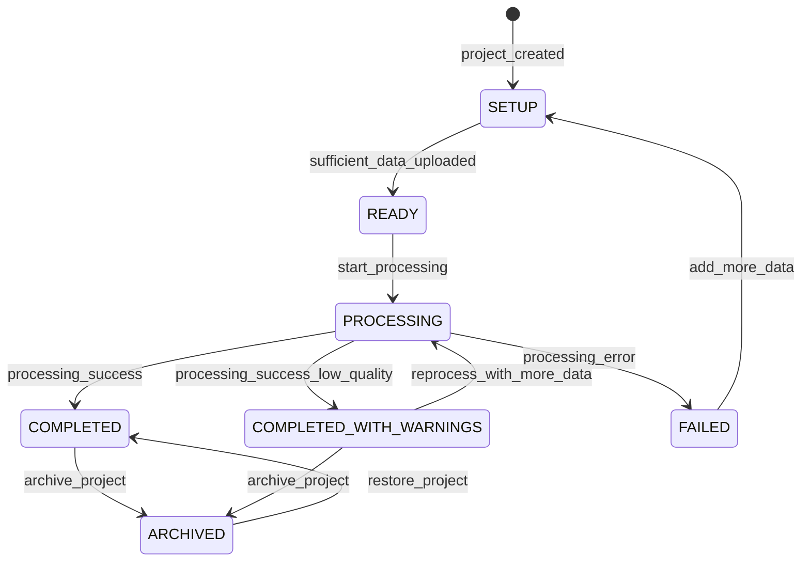

# Scene Reconstruction Domain

## Overview

This domain handles **3D and 360° crime scene modeling, spatial reconstruction, and immersive scene visualization**, including **photogrammetric reconstruction from multiple camera angles, point cloud generation, 3D mesh creation, evidence placement mapping, virtual scene walkthroughs, and measurement tools**.

It acts as **a core intelligence service** that transforms 2D video and image data into spatial 3D models, enabling investigators and prosecutors to understand, analyze, and present crime scenes with spatial accuracy.

---

## Use Cases

---

### UC-SR-01: Create Scene Reconstruction Project

- **Purpose**: Initialize a new 3D/360° reconstruction project for a crime scene or incident site
- **Actors**: Law Enforcement Officer, Security Operator
- **Preconditions**: Actor has `CREATE_RECONSTRUCTION` permission; related incident/case exists or can be created

#### Main Success Flow

1. Actor initiates a new reconstruction project with title, description, and location
2. Actor links the project to an existing incident or case
3. System creates the project record with status `SETUP`
4. System generates a unique project workspace
5. System emits `RECONSTRUCTION_CREATED` event
6. System records audit log

#### Alternate / Exception Flows

- **Missing required fields** → 422: "Title and location are required"
- **Invalid case reference** → 404: "Referenced case not found"

#### Result

Reconstruction project created in `SETUP` state; ready for data input.

---

### UC-SR-02: Upload Source Data for Reconstruction

- **Purpose**: Upload images, video frames, and 360° captures for reconstruction processing
- **Actors**: Law Enforcement Officer, Security Operator
- **Preconditions**: Reconstruction project exists; actor has permission

#### Main Success Flow

1. Actor uploads source data (multi-angle photos, video extracts, LIDAR scans, 360° images)
2. System validates file formats (JPEG, PNG, TIFF, PLY, LAS, E57)
3. System extracts EXIF/metadata (GPS, camera params, focal length)
4. System stores source files linked to the project
5. System updates project data inventory
6. System emits `SOURCE_DATA_UPLOADED` event

#### Alternate / Exception Flows

- **Unsupported format** → 422: "File format not supported"
- **Missing camera metadata** → Warning: "No EXIF data; manual camera params may be needed"
- **Corrupt file** → 422: "File is corrupt or unreadable"

#### Result

Source data uploaded and cataloged in the reconstruction project.

---

### UC-SR-03: Process 3D Reconstruction

- **Purpose**: Generate a 3D model from uploaded source data
- **Actors**: System (processing pipeline)
- **Preconditions**: Sufficient source data uploaded; project in `SETUP` or `READY` state

#### Main Success Flow

1. Actor initiates reconstruction processing
2. System transitions project to `PROCESSING`
3. System performs feature detection and matching across images
4. System runs Structure from Motion (SfM) to estimate camera poses
5. System generates dense point cloud
6. System performs mesh generation from point cloud
7. System applies texture mapping from source images
8. System generates multiple LOD (Level of Detail) versions
9. System calculates scene scale and coordinates
10. System stores 3D model assets (point cloud, mesh, textures)
11. System transitions project to `COMPLETED`
12. System emits `RECONSTRUCTION_COMPLETED` event

#### Alternate / Exception Flows

- **Insufficient overlap between images** → Status `FAILED`: "Insufficient image overlap for reconstruction"
- **Processing timeout** → Status `FAILED` with partial results preserved; admin notified
- **Low quality result** → Status `COMPLETED_WITH_WARNINGS`; quality metrics below threshold
- **Processing error** → Retry up to 2 times; then `FAILED` with error details

#### Result

3D model generated with point cloud, mesh, and textures; project marked `COMPLETED`.

---

### UC-SR-04: View and Navigate 3D Scene

- **Purpose**: Interactively view and navigate the reconstructed 3D scene
- **Actors**: Law Enforcement Officer, Security Operator, Administrator
- **Preconditions**: Reconstruction is `COMPLETED`; actor has `VIEW_RECONSTRUCTION` permission

#### Main Success Flow

1. Actor opens the 3D scene viewer
2. System loads the 3D model with appropriate LOD based on device capability
3. Actor navigates the scene (orbit, pan, zoom, walk-through mode)
4. System renders the scene in real-time with textures
5. Actor can switch between view modes (textured, wireframe, point cloud)
6. System records access in audit log

#### Alternate / Exception Flows

- **Device lacks WebGL/3D support** → Fallback to 2D gallery with annotations
- **Large model** → Progressive loading with LOD streaming
- **Mobile device** → Reduced LOD automatically selected

#### Result

Interactive 3D scene displayed with navigation controls.

---

### UC-SR-05: Place Evidence Markers in Scene

- **Purpose**: Mark and annotate evidence locations within the 3D reconstruction
- **Actors**: Law Enforcement Officer
- **Preconditions**: Reconstruction is `COMPLETED`; actor has `ANNOTATE_RECONSTRUCTION` permission

#### Main Success Flow

1. Actor enters annotation mode in the 3D viewer
2. Actor clicks a point in the 3D scene to place a marker
3. Actor fills in marker details: label, description, evidence type, linked evidence ID
4. System calculates 3D coordinates of the placement point
5. System stores the evidence marker linked to the reconstruction
6. System emits `EVIDENCE_MARKER_PLACED` event
7. System records audit log

#### Alternate / Exception Flows

- **Invalid placement** → 422: "Marker must be placed on a reconstructed surface"
- **Duplicate marker at same location** → Warning displayed; allowed (different evidence)

#### Result

Evidence marker placed in 3D scene with coordinates and metadata.

---

### UC-SR-06: Measure Distances and Areas in Scene

- **Purpose**: Take spatial measurements within the reconstructed scene
- **Actors**: Law Enforcement Officer, Security Operator
- **Preconditions**: Reconstruction is `COMPLETED` with calibrated scale

#### Main Success Flow

1. Actor selects measurement tool (point-to-point distance, area, height)
2. Actor clicks reference points in the 3D scene
3. System calculates distance/area using the reconstructed 3D coordinates and scene scale
4. System displays measurement with estimated accuracy margin
5. Actor can save measurement as a scene annotation
6. System records measurement in project data

#### Alternate / Exception Flows

- **Scene not calibrated** → Warning: "Measurements may be inaccurate — scene scale not calibrated"
- **Points too far apart** → Warning about reduced accuracy at extremes

#### Result

Spatial measurement calculated and optionally saved as annotation.

---

### UC-SR-07: Export Reconstruction

- **Purpose**: Export the 3D reconstruction and annotations for external use
- **Actors**: Law Enforcement Officer, Administrator
- **Preconditions**: Reconstruction is `COMPLETED`; actor has `EXPORT_RECONSTRUCTION` permission

#### Main Success Flow

1. Actor selects export format (OBJ, FBX, glTF, PLY, PDF report)
2. Actor chooses what to include (model, textures, annotations, measurements, evidence markers)
3. System packages the export with selected components
4. System generates a digitally signed export package
5. System records export in chain of custody
6. System emits `RECONSTRUCTION_EXPORTED` event

#### Alternate / Exception Flows

- **Large export** → System estimates time and notifies when ready for download
- **Unsupported format** → 422: "Export format not supported"

#### Result

Reconstruction exported as a signed package in the requested format.

---

### UC-SR-08: Compare Scene States (Before/After)

- **Purpose**: Compare two reconstructions of the same location at different times
- **Actors**: Law Enforcement Officer
- **Preconditions**: Two reconstructions exist for the same or overlapping location

#### Main Success Flow

1. Actor selects two reconstructions to compare
2. System aligns the models using common reference points
3. System generates a difference view highlighting changes
4. System displays side-by-side or overlay comparison
5. Actor can annotate differences

#### Alternate / Exception Flows

- **Cannot align** → 422: "Insufficient common reference points for alignment"
- **Different scales** → System attempts auto-scaling with confidence indicator

#### Result

Comparative view of two scene states with highlighted differences.

---

## Core Entities

---

### Entity: ReconstructionProject

- **Description**: A 3D/360° reconstruction project for a specific scene or incident

#### Fields

- `id`: UUID — Unique identifier
- `title`: String — Project title
- `description`: String (nullable) — Detailed description
- `location`: JSONB — Scene location `{lat, lng, address}`
- `incident_id`: UUID (nullable) — Linked incident
- `case_id`: UUID (nullable) — Linked case
- `status`: Enum — Project processing status
- `quality_score`: Float (nullable) — Reconstruction quality metric (0.0–1.0)
- `model_url`: String (nullable) — URL to the primary 3D model
- `point_cloud_url`: String (nullable) — URL to the point cloud
- `thumbnail_url`: String (nullable) — Preview thumbnail
- `scene_scale`: Float (nullable) — Scale factor (meters per unit)
- `scene_bounds`: JSONB (nullable) — Bounding box of the reconstructed scene
- `source_image_count`: Integer — Number of source images used
- `processing_time_seconds`: Integer (nullable) — Time taken to process
- `created_by`: UUID — User who created the project
- `created_at`: Timestamp
- `updated_at`: Timestamp

#### Constraints

- `title` is required
- Only `COMPLETED` projects can be viewed and exported
- `FAILED` projects retain partial data for diagnostics

#### Relationships

- Has many `SourceFile`
- Has many `SceneAnnotation`
- Has many `SceneMeasurement`
- Optionally linked to `Incident` and `Case` (cross-domain)

---

### Entity: SourceFile

- **Description**: An uploaded image, video extract, or scan used as input for reconstruction

#### Fields

- `id`: UUID — Unique identifier
- `project_id`: UUID — Reference to reconstruction project
- `file_type`: Enum — `IMAGE`, `VIDEO_FRAME`, `LIDAR_SCAN`, `PANORAMA_360`
- `file_url`: String — Storage URL
- `file_hash`: String — SHA-256 hash
- `mime_type`: String — File MIME type
- `file_size`: BigInteger — File size in bytes
- `camera_params`: JSONB (nullable) — Camera intrinsics (focal length, sensor size)
- `gps_location`: JSONB (nullable) — GPS coordinates from EXIF
- `capture_timestamp`: Timestamp (nullable) — When the image was captured
- `processing_status`: Enum — `PENDING`, `PROCESSED`, `REJECTED`
- `rejection_reason`: String (nullable) — Why the file was rejected
- `created_at`: Timestamp

#### Constraints

- `file_hash` must be computed on upload
- Rejected files are retained for reference but not used in reconstruction

#### Relationships

- Belongs to `ReconstructionProject`

---

### Entity: SceneAnnotation

- **Description**: An evidence marker, label, or note placed on the 3D scene

#### Fields

- `id`: UUID — Unique identifier
- `project_id`: UUID — Reference to reconstruction project
- `annotation_type`: Enum — `EVIDENCE_MARKER`, `LABEL`, `NOTE`, `POI`
- `title`: String — Annotation title
- `description`: String (nullable) — Annotation description
- `position_3d`: JSONB — 3D coordinates `{x, y, z}`
- `normal_vector`: JSONB (nullable) — Surface normal at placement point
- `linked_evidence_id`: UUID (nullable) — Reference to evidence item
- `icon`: String (nullable) — Icon identifier for rendering
- `color`: String (nullable) — Color code for rendering
- `created_by`: UUID — User who created the annotation
- `created_at`: Timestamp
- `updated_at`: Timestamp

#### Constraints

- `position_3d` must be within the scene bounds
- Evidence markers should be linked to actual evidence records where possible

#### Relationships

- Belongs to `ReconstructionProject`
- Optionally references evidence (cross-domain)
- Created by `User`

---

### Entity: SceneMeasurement

- **Description**: A spatial measurement taken in the 3D scene

#### Fields

- `id`: UUID — Unique identifier
- `project_id`: UUID — Reference to reconstruction project
- `measurement_type`: Enum — `DISTANCE`, `AREA`, `HEIGHT`, `ANGLE`
- `points_3d`: JSONB — Array of 3D coordinates used for measurement
- `value`: Float — Calculated measurement value
- `unit`: String — Measurement unit (m, m², degrees)
- `accuracy_margin`: Float (nullable) — Estimated accuracy margin
- `label`: String (nullable) — User-provided label
- `created_by`: UUID — User who took the measurement
- `created_at`: Timestamp

#### Constraints

- `value` must be positive
- `points_3d` must contain at least 2 points for distance, 3 for area, 2 for height
- `accuracy_margin` may be null if scene is not calibrated

#### Relationships

- Belongs to `ReconstructionProject`
- Created by `User`

---

## State Machines

### Reconstruction Project Lifecycle

---

### States

| State                     | Description                                                   |
| ------------------------- | ------------------------------------------------------------- |
| `SETUP`                   | Project created; awaiting source data upload                  |
| `READY`                   | Sufficient source data uploaded; ready for processing         |
| `PROCESSING`              | 3D reconstruction pipeline is running                         |
| `COMPLETED`               | Reconstruction successful; 3D model available                 |
| `COMPLETED_WITH_WARNINGS` | Reconstruction done but quality below threshold               |
| `FAILED`                  | Processing failed; may be retried with more data              |
| `ARCHIVED`                | Project archived (still viewable but not actively maintained) |

---

### Transitions & Guards

| From → To                            | Event                          | Condition                                            |
| ------------------------------------ | ------------------------------ | ---------------------------------------------------- |
| SETUP → READY                        | sufficient_data_uploaded       | Minimum source images met (≥ 5 for 3D, ≥ 1 for 360°) |
| READY → PROCESSING                   | start_processing               | Actor has `PROCESS_RECONSTRUCTION` permission        |
| PROCESSING → COMPLETED               | processing_success             | Quality score ≥ threshold (0.6)                      |
| PROCESSING → COMPLETED_WITH_WARNINGS | processing_success_low_quality | Quality score < threshold but model generated        |
| PROCESSING → FAILED                  | processing_error               | Unrecoverable error or retry limit reached           |
| FAILED → SETUP                       | add_more_data                  | Additional source data uploaded                      |
| COMPLETED → ARCHIVED                 | archive_project                | Admin action                                         |

---

## Business Rules (Invariants)

1. **Minimum source data**: At least 5 overlapping images required for 3D reconstruction; at least 1 panoramic image for 360° view
2. **Source integrity**: All source files must have SHA-256 hash verified before processing
3. **Scale calibration**: Measurements are only reliable when scene scale is calibrated against a known reference
4. **Evidence markers integrity**: Evidence markers must preserve their 3D positions when the model is re-processed
5. **Export signing**: All exports must be digitally signed for forensic admissibility
6. **Chain of custody**: All source data and exports must be tracked in the chain of custody
7. **Quality threshold**: Reconstructions with quality score below 0.3 are marked as `FAILED`
8. **Concurrent access**: Multiple users can view a scene simultaneously but only one can annotate at a time (optimistic locking)
9. **Data preservation**: Source data must never be deleted even if the reconstruction fails
10. **Audit completeness**: All interactions with reconstruction data (view, annotate, measure, export) must be audited

---

## Processing Flows

### Reconstruction Pipeline

1. Validate sufficient source data (minimum image count, overlap estimation)
2. Extract and validate camera parameters from EXIF
3. Run feature detection (SIFT/SURF/ORB) on all images
4. Perform feature matching across image pairs
5. Run Structure from Motion (SfM) for camera pose estimation
6. Generate sparse point cloud
7. Run Multi-View Stereo (MVS) for dense point cloud
8. Perform surface reconstruction (meshing)
9. Apply texture mapping
10. Generate LOD variants (high, medium, low)
11. Calculate quality metrics
12. Store all outputs (point cloud, mesh, textures, thumbnails)
13. Update project status

### Annotation Flow

1. Actor opens 3D viewer in annotation mode
2. Actor clicks on surface to place marker
3. System raycasts click position to find 3D surface intersection
4. System records 3D position and surface normal
5. Actor fills in annotation metadata
6. System persists annotation
7. System notifies other viewers of the update
8. Record audit log

### Measurement Flow

1. Actor selects measurement tool
2. Actor clicks reference points on 3D surfaces
3. System calculates measurement using 3D coordinates and scene scale
4. System estimates accuracy margin based on reconstruction quality and scale confidence
5. System displays result
6. Actor optionally saves measurement

---

## Interfaces

### 3D Scene Viewer

- **Renderer**: WebGL-based 3D viewer (Three.js / Babylon.js)
- **Navigation**: Orbit, pan, zoom, first-person walkthrough
- **View modes**: Textured, wireframe, point cloud, split view
- **Overlays**: Evidence markers, measurements, annotations
- **Controls**: Toggle annotations, toggle measurements, LOD selector
- **Actions**: Annotate, measure, export, share, take screenshot

### Reconstruction Projects List

- **Filters**: Status, date range, linked case, created by
- **Columns**: Thumbnail, Title, Status, Location, Source Count, Quality, Date
- **Sorting**: By date, status, quality
- **Pagination**: 12 per page (card grid)
- **Actions**: Create new, view, archive, delete

### Source Data Manager

- **Upload**: Drag-and-drop multi-file upload
- **Gallery**: Grid view of all source files with metadata
- **Status**: Processing status per file
- **Actions**: Upload, remove (before processing), view EXIF data

### Comparison View

- **Layout**: Side-by-side or overlay slider
- **Sync**: Synchronized navigation between two models
- **Highlights**: Automated difference detection overlay
- **Actions**: Annotate differences, export comparison

---

## Notifications

| Event                    | Recipient       | Channel        | Message                                                      |
| ------------------------ | --------------- | -------------- | ------------------------------------------------------------ |
| RECONSTRUCTION_COMPLETED | Project Creator | In-app + Email | "3D reconstruction '{title}' is complete and ready to view." |
| RECONSTRUCTION_FAILED    | Project Creator | In-app + Email | "3D reconstruction '{title}' failed: {reason}"               |
| COMPLETED_WITH_WARNINGS  | Project Creator | In-app         | "Reconstruction '{title}' completed with quality warnings."  |
| EVIDENCE_MARKER_PLACED   | Case Team       | In-app         | "Evidence marker added to reconstruction '{title}'"          |
| RECONSTRUCTION_EXPORTED  | Case Team       | In-app         | "Reconstruction '{title}' exported by {user}"                |

---

## Audit Logging

- Project creation and configuration
- Source data upload and removal
- Processing initiation, completion, and failure
- 3D scene access (who viewed when)
- Annotation creation, modification, and deletion
- Measurement actions
- Export actions with format and contents
- Comparison view access
- Source data integrity checks

Includes:

- **Actor**: User ID or `SYSTEM`
- **Timestamp**: ISO 8601 UTC
- **Action**: Event code
- **Target**: Project ID, annotation ID, measurement ID
- **Payload snapshot**: Relevant data (coordinates, parameters)
- **Case context**: Linked case/incident ID

---

## Invariants

1. Source data integrity hashes must be verified before any processing
2. Only `COMPLETED` reconstructions can be viewed, annotated, measured, or exported
3. Exports must be digitally signed for forensic admissibility
4. Annotation mode enforces single-writer at a time
5. Scene measurements must include accuracy margins
6. All interactions with reconstruction data produce audit trail entries
