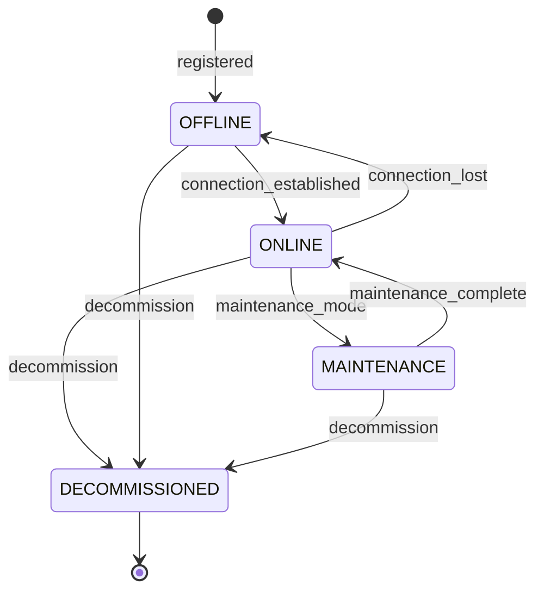

# Security Operations Domain

## Overview

This domain handles **the security operator interface for CCTV monitoring, footage upload, real-time surveillance, and alert management**, including **live camera feed monitoring, CCTV footage upload management, detection review, operator alert handling, camera system management, and shift/duty scheduling**.

It acts as **a user interface domain** for security professionals who operate the surveillance infrastructure and serve as the first line of response for AI-generated detections and community reports.

---

## Use Cases

---

### UC-SO-01: Monitor Live Camera Feeds

- **Purpose**: View and monitor live CCTV camera feeds in real-time
- **Actors**: Security Operator
- **Preconditions**: Actor has `MONITOR_CAMERAS` permission; cameras are online

#### Main Success Flow

1. Operator opens the live monitoring dashboard
2. System displays camera grid (configurable layout: 1, 4, 9, 16 feeds)
3. System streams live feeds from assigned cameras
4. AI detection overlays appear in real-time (bounding boxes, labels)
5. Alert indicators flash when detections occur on a feed
6. Operator can click to expand any feed to full-screen
7. Operator can switch between camera groups/presets
8. System logs monitoring session activity

#### Alternate / Exception Flows

- **Camera offline** → Display offline indicator with last-seen timestamp
- **Stream quality degraded** → Auto-reduce resolution; display quality indicator
- **Network issues** → Buffering indicator; auto-reconnect

#### Result

Operator actively monitoring live camera feeds with AI detection overlays.

---

### UC-SO-02: Upload CCTV Footage

- **Purpose**: Upload recorded CCTV footage for storage and AI analysis
- **Actors**: Security Operator
- **Preconditions**: Actor has `UPLOAD_FOOTAGE` permission

#### Main Success Flow

1. Operator selects footage files for upload
2. Operator provides metadata: source camera, location, date/time range, description
3. System validates file formats and sizes
4. System initiates upload (supports resumable uploads)
5. System creates media asset records via Data Management domain
6. System queues footage for AI analysis
7. System emits `FOOTAGE_UPLOADED` event
8. System records audit log and chain of custody

#### Alternate / Exception Flows

- **Duplicate footage detected** → Warning with option to proceed or cancel
- **Upload interrupted** → Resumable from last chunk
- **Invalid format** → 422: "Unsupported format"

#### Result

CCTV footage uploaded, stored, and queued for AI processing.

---

### UC-SO-03: Review AI Detection Alert

- **Purpose**: Review and respond to AI-generated detection alerts
- **Actors**: Security Operator
- **Preconditions**: Detection alerts exist; actor has `REVIEW_DETECTIONS` permission

#### Main Success Flow

1. Operator views alert in detection queue or real-time feed overlay
2. System presents detection with video context (10 seconds before/after)
3. Operator reviews the detection evidence
4. Operator takes action:
   - **Confirm**: Validates the detection as real
   - **Dismiss**: Marks as false positive
   - **Escalate**: Creates incident or alerts law enforcement
5. System updates detection record via AI Detection domain
6. System records feedback for model training
7. System emits appropriate event

#### Alternate / Exception Flows

- **Multiple concurrent alerts** → Queue prioritizes by severity
- **Alert expired** → Still reviewable but marked as late

#### Result

Detection reviewed and actioned; feedback recorded for AI improvement.

---

### UC-SO-04: Manage Camera Systems

- **Purpose**: Register, configure, and manage connected camera systems
- **Actors**: Security Operator, Administrator
- **Preconditions**: Actor has `MANAGE_CAMERAS` permission

#### Main Success Flow

1. Operator registers a new camera: name, location, type, stream URL, capabilities
2. System validates connectivity to the camera stream
3. System creates camera record
4. System tests AI detection pipeline on the feed
5. System activates the camera for monitoring
6. System records audit log

#### Alternate / Exception Flows

- **Camera unreachable** → Status set to `OFFLINE`; admin notified
- **Duplicate camera** → 409: "Camera with this stream URL already exists"
- **Incompatible stream format** → 422: "Stream format not supported"

#### Result

Camera registered and active in the monitoring system.

---

### UC-SO-05: Create Monitoring Zone

- **Purpose**: Define logical monitoring zones grouping cameras and detection rules
- **Actors**: Security Operator, Administrator
- **Preconditions**: Actor has `MANAGE_ZONES` permission

#### Main Success Flow

1. Operator defines a zone: name, boundary (map polygon), assigned cameras, threat level
2. System validates zone configuration
3. System links cameras to the zone
4. System applies default detection configuration for the zone
5. System creates zone record
6. System records audit log

#### Alternate / Exception Flows

- **No cameras in zone** → Warning: "Zone has no camera coverage"
- **Overlapping zones** → Allowed; cameras can belong to multiple zones

#### Result

Monitoring zone created with camera assignments and detection configuration.

---

### UC-SO-06: Handle Real-Time Alert

- **Purpose**: Respond to a real-time security alert from the operator console
- **Actors**: Security Operator
- **Preconditions**: Alert received on operator console

#### Main Success Flow

1. Alert notification appears on operator console (visual + audio)
2. Operator acknowledges the alert
3. Operator views the associated camera feed and detection
4. Operator assesses the situation
5. Operator takes action:
   - **Dispatch security** → Creates dispatch request
   - **Create incident** → Routes to Incident domain
   - **Alert law enforcement** → Triggers law enforcement notification
   - **Resolve** → Marks alert as resolved
6. System records all actions and timestamps
7. System records audit log

#### Alternate / Exception Flows

- **Operator unavailable** → Alert escalates per escalation rules
- **Multiple operators acknowledge** → First ack takes ownership; others see as handled

#### Result

Alert handled by operator; appropriate response action taken.

---

### UC-SO-07: Manage Operator Shifts and Duty Schedule

- **Purpose**: Define and manage operator duty schedules for alert routing
- **Actors**: Administrator, Senior Security Operator
- **Preconditions**: Actor has `MANAGE_SCHEDULES` permission

#### Main Success Flow

1. Admin creates shift schedule: operator assignments, zones, time periods
2. System validates no coverage gaps for critical zones
3. System persists the schedule
4. System updates alert routing to route to on-duty operators
5. System records audit log

#### Alternate / Exception Flows

- **Coverage gap detected** → Warning: "Zone {name} has no operator coverage during {time_range}"
- **Operator unavailable** → Admin adjusts schedule; system suggests alternatives

#### Result

Operator duty schedule configured; alert routing updated accordingly.

---

## Core Entities

---

### Entity: Camera

- **Description**: A registered CCTV camera in the system

#### Fields

- `id`: UUID — Unique identifier
- `name`: String — Camera name
- `description`: String (nullable) — Description
- `location`: JSONB — Camera location `{lat, lng, address, floor, direction}`
- `stream_url`: String — RTSP/HLS stream URL
- `stream_type`: Enum — `RTSP`, `HLS`, `RTMP`, `ONVIF`
- `capabilities`: JSONB — Camera capabilities `{ptz: true, ir: true, resolution: "4K", audio: false}`
- `zone_ids`: JSONB — Array of assigned zone IDs
- `status`: Enum — `ONLINE`, `OFFLINE`, `MAINTENANCE`, `DECOMMISSIONED`
- `health_status`: JSONB — Health metrics `{fps, bitrate, uptime, last_frame_at}`
- `ai_detection_enabled`: Boolean — Whether AI detection is active on this feed
- `installed_by`: UUID — User who registered the camera
- `installed_at`: Timestamp — When the camera was added
- `last_online_at`: Timestamp (nullable) — Last confirmed online timestamp
- `created_at`: Timestamp
- `updated_at`: Timestamp

#### Constraints

- `stream_url` must be unique
- `DECOMMISSIONED` cameras are retained for historical reference but not active
- Must be `ONLINE` for live monitoring and AI detection

#### Relationships

- Belongs to many `DetectionZone`
- Has many `MediaAsset` (footage from this camera)
- Has many `Detection` (AI detections from this camera)

---

### Entity: MonitoringSession

- **Description**: Records an operator's active monitoring session

#### Fields

- `id`: UUID — Unique identifier
- `operator_id`: UUID — Reference to operator user
- `cameras_monitored`: JSONB — Array of camera IDs being monitored
- `zone_ids`: JSONB — Zones being monitored
- `started_at`: Timestamp — Session start
- `ended_at`: Timestamp (nullable) — Session end
- `alerts_handled`: Integer — Number of alerts handled during session
- `detections_reviewed`: Integer — Number of detections reviewed
- `created_at`: Timestamp

#### Constraints

- Only one active session per operator at a time
- Session duration is tracked for shift compliance

#### Relationships

- Belongs to `User` (operator)

---

### Entity: OperatorShift

- **Description**: A scheduled duty shift for an operator

#### Fields

- `id`: UUID — Unique identifier
- `operator_id`: UUID — Reference to operator
- `zone_ids`: JSONB — Zones assigned for this shift
- `shift_start`: Timestamp — Shift start time
- `shift_end`: Timestamp — Shift end time
- `status`: Enum — `SCHEDULED`, `ACTIVE`, `COMPLETED`, `CANCELLED`
- `created_by`: UUID — Admin who created the shift
- `created_at`: Timestamp
- `updated_at`: Timestamp

#### Constraints

- Shifts cannot overlap for the same operator
- All critical zones must have at least one operator per shift

#### Relationships

- Belongs to `User` (operator)
- Created by `User` (admin)

---

## State Machines

### Camera Lifecycle

---

### States

| State            | Description                                |
| ---------------- | ------------------------------------------ |
| `ONLINE`         | Camera is connected and streaming          |
| `OFFLINE`        | Camera is not reachable or not streaming   |
| `MAINTENANCE`    | Camera is under scheduled maintenance      |
| `DECOMMISSIONED` | Camera is permanently removed from service |

---

### Transitions & Guards

| From → To            | Event                  | Condition                                                    |
| -------------------- | ---------------------- | ------------------------------------------------------------ |
| OFFLINE → ONLINE     | connection_established | Stream is accessible and producing frames                    |
| ONLINE → OFFLINE     | connection_lost        | No frames received for configurable timeout (default: 60s)   |
| ONLINE → MAINTENANCE | maintenance_mode       | Operator/admin initiates; maintenance window scheduled       |
| MAINTENANCE → ONLINE | maintenance_complete   | Stream restored and verified                                 |
| Any → DECOMMISSIONED | decommission           | Actor has `MANAGE_CAMERAS` permission; confirmation required |

---

## Business Rules (Invariants)

1. **Coverage requirement**: All critical zones must have at least one online camera and one on-duty operator
2. **Alert ownership**: First operator to acknowledge an alert takes ownership
3. **Monitoring session tracking**: All operator monitoring time must be logged for compliance
4. **Camera health monitoring**: Cameras offline for > 5 minutes must trigger health alerts
5. **Feed authentication**: Camera stream URLs must not be exposed to unauthorized users
6. **Upload integrity**: All uploaded footage must have its hash computed and recorded
7. **Detection review SLA**: Detection alerts must be reviewed within configured SLA per severity
8. **Shift continuity**: Shift handoffs must ensure no coverage gaps for critical zones
9. **Stream security**: All camera streams must use authenticated/encrypted protocols where supported
10. **Audit completeness**: All monitoring actions, camera changes, and alert responses must be audited

---

## Processing Flows

### Live Monitoring Flow

1. Operator logs into monitoring console
2. System creates monitoring session
3. System loads operator's assigned cameras and zones
4. System establishes stream connections
5. System overlays AI detection results in real-time
6. System routes alerts to the operator
7. Operator works through alert queue
8. On session end: system records session statistics

### Footage Upload Flow

1. Operator selects files and provides metadata
2. System validates files and metadata
3. System initiates resumable uploads via Data Management domain
4. System creates chain of custody entries
5. System queues for AI analysis
6. System notifies operator on completion

### Alert Handling Flow

1. Alert arrives on operator console
2. System highlights relevant camera feed
3. Operator acknowledges (takes ownership)
4. Operator reviews detection context
5. Operator selects response action
6. System routes to appropriate domain (Incident, Alert, Law Enforcement)
7. System records response time and action

---

## Interfaces

### Live Monitoring Dashboard

- **Layout**: Configurable camera grid (1/4/9/16 feeds)
- **Overlays**: AI detection bounding boxes, labels, confidence
- **Alert panel**: Priority-sorted alert queue
- **Camera controls**: PTZ controls (if supported), snapshot, record clip
- **Zone selector**: Switch between monitoring zones
- **Status bar**: Online cameras, active alerts, shift info

### Camera Management

- **List**: Cameras with status indicators, zone assignment, health metrics
- **Map**: Camera locations on facility/area map with coverage visualization
- **Actions**: Register, edit, maintenance mode, decommission, test connection
- **Health**: Per-camera health dashboard (FPS, uptime, bitrate)

### Footage Upload

- **Upload**: Drag-and-drop with progress bars
- **Metadata form**: Camera source, location, date range, description
- **Queue**: Upload queue with processing status
- **Actions**: Upload, cancel, retry failed

### Alert Queue

- **Priority list**: Alerts sorted by severity and time
- **Preview**: Quick view with camera snapshot and detection info
- **Actions**: Acknowledge, confirm, dismiss, escalate, create incident
- **Stats**: Review time, completion rate, false positive rate

### Schedule Management

- **Calendar view**: Weekly/monthly shift schedule
- **Coverage map**: Visual representation of zone coverage per time slot
- **Conflicts**: Highlights gaps and overlaps
- **Actions**: Create shift, edit, swap, cancel

---

## Notifications

| Event                   | Recipient               | Channel               | Message                                                  |
| ----------------------- | ----------------------- | --------------------- | -------------------------------------------------------- |
| CAMERA_OFFLINE          | On-duty Operator, Admin | Push + In-app         | "Camera '{name}' is offline"                             |
| CAMERA_ONLINE           | On-duty Operator        | In-app                | "Camera '{name}' is back online"                         |
| HIGH_SEVERITY_DETECTION | On-duty Operator        | Push + In-app + Audio | "HIGH ALERT on {camera}: {detection_type}"               |
| SHIFT_STARTING          | Operator                | Push                  | "Your shift starts in 15 minutes for zone {zone}"        |
| SHIFT_HANDOFF           | Incoming Operator       | In-app                | "Shift handoff: {count} active alerts in {zone}"         |
| FOOTAGE_PROCESSED       | Uploader                | In-app                | "Footage '{title}' processed — {count} detections found" |
| COVERAGE_GAP            | Admin                   | Email + In-app        | "Coverage gap detected in zone {zone} for {time_range}"  |

---

## Audit Logging

- Monitoring session start/end
- Camera registration, configuration changes, decommission
- Alert acknowledgment and response actions
- Detection reviews (confirm, dismiss, escalate)
- Footage uploads
- Shift schedule creation and modifications
- Camera PTZ control usage
- Zone configuration changes

Includes:

- **Actor**: Operator User ID
- **Timestamp**: ISO 8601 UTC
- **Action**: Event code
- **Target**: Camera ID, alert ID, detection ID
- **Payload snapshot**: Action details, response times
- **Session context**: Monitoring session ID

---

## Invariants

1. Critical zones must always have at least one online camera and on-duty operator
2. Alert ownership is exclusive — first acknowledgment takes ownership
3. All monitoring sessions must be recorded with start/end times
4. Camera stream credentials must never be exposed in logs or API responses
5. Footage uploads must create chain of custody entries
6. Operator response times must be tracked for SLA compliance
