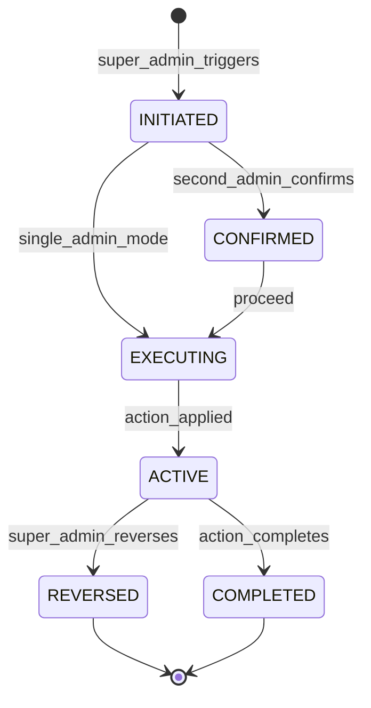

# Super Administration Domain

## Overview

This domain handles **full platform control**, including **complete user management across all roles, system-wide audit access, platform infrastructure oversight, security policy enforcement, emergency operations, and compliance management**.

It acts as **a user interface domain** for Super Administrators who have the highest level of authority in the Sentinel360 platform, with unrestricted access to all system functions, audit data, and configuration.

---

## Use Cases

---

### UC-SA-01: Manage All Users Including Administrators

- **Purpose**: Create, modify, and control all user accounts including other administrators
- **Actors**: Super Administrator
- **Preconditions**: Actor has `SUPER_ADMIN` role

#### Main Success Flow

1. Super Admin accesses the master user management panel
2. Super Admin can perform all standard user management actions PLUS:
   - Create Administrator accounts
   - Create other Super Administrator accounts
   - Modify Administrator and Super Admin roles
   - Override role restrictions
   - Access any user's full audit history
3. System applies changes
4. System records enhanced audit log (Super Admin actions are specially flagged)

#### Alternate / Exception Flows

- **Last Super Admin protection** → Cannot remove Super Admin role from the last Super Admin
- **Self-demotion** → Requires confirmation: "This will remove your Super Admin privileges"

#### Result

User account managed with full Super Admin authority; enhanced audit trail recorded.

---

### UC-SA-02: Access Full Audit System

- **Purpose**: Access the complete audit log system without restrictions
- **Actors**: Super Administrator
- **Preconditions**: Actor has `SUPER_ADMIN` role

#### Main Success Flow

1. Super Admin accesses the audit console
2. System provides unrestricted access to all audit logs across all domains
3. Super Admin can:
   - Search all audit entries (no domain restriction)
   - View detailed payloads including admin actions
   - Verify audit log integrity (hash chain validation)
   - Export audit trails for legal and compliance purposes
   - View meta-audit logs (who accessed the audit system)
4. System records Super Admin's audit access in meta-audit log

#### Alternate / Exception Flows

- **Integrity violation detected** → System displays alert with details of chain break

#### Result

Full audit system accessed; access itself recorded in meta-audit.

---

### UC-SA-03: Manage Platform Security Policies

- **Purpose**: Configure and enforce platform-wide security policies
- **Actors**: Super Administrator
- **Preconditions**: Actor has `SUPER_ADMIN` role

#### Main Success Flow

1. Super Admin accesses security policy configuration
2. Super Admin configures policies:
   - Password complexity requirements
   - Session timeout and token lifetime
   - Multi-factor authentication requirements
   - IP allowlisting/blocklisting
   - Rate limiting thresholds
   - Encryption standards
   - Data classification levels
   - Account lockout parameters
3. System validates policy changes
4. System applies policies platform-wide
5. System emits `SECURITY_POLICY_UPDATED` event
6. System records audit log

#### Alternate / Exception Flows

- **Policy weakens security** → Warning: "This change reduces security posture"
- **Conflicting policies** → 422: "This policy conflicts with {existing_policy}"

#### Result

Security policies updated and enforced platform-wide.

---

### UC-SA-04: Emergency System Operations

- **Purpose**: Execute emergency operations to protect the platform in critical situations
- **Actors**: Super Administrator
- **Preconditions**: Actor has `SUPER_ADMIN` role

#### Main Success Flow

1. Super Admin initiates emergency action:
   - **Emergency lockout**: Disable all user sessions except Super Admins
   - **Emergency broadcast**: Send priority message to all users
   - **System pause**: Temporarily halt specific system functions
   - **Force password rotation**: Require all users to change passwords
   - **Revoke all API keys**: Disable all external integrations
   - **Enable maintenance mode**: Put system in read-only mode
2. System validates the emergency action
3. System requires secondary confirmation (re-authentication or two-person rule if configured)
4. System executes the emergency action
5. System notifies all affected parties
6. System emits `EMERGENCY_ACTION_EXECUTED` event
7. System records enhanced audit log

#### Alternate / Exception Flows

- **Re-authentication failure** → Action denied; alert other Super Admins
- **Action already active** → 409: "Emergency lockout already active"

#### Result

Emergency action executed; all users notified; enhanced audit trail recorded.

---

### UC-SA-05: Configure Role and Permission Structure

- **Purpose**: Define the complete role and permission hierarchy for the platform
- **Actors**: Super Administrator
- **Preconditions**: Actor has `SUPER_ADMIN` role

#### Main Success Flow

1. Super Admin accesses role management
2. Super Admin can:
   - Create new roles with custom permission sets
   - Modify existing roles (including system roles)
   - Create custom permissions
   - Define permission hierarchies
   - Set role constraints (max users per role, role exclusivity)
3. System validates role configuration
4. System applies changes
5. System recalculates all user permissions in real-time
6. System records audit log

#### Alternate / Exception Flows

- **System role modification** → Warning: "Modifying system roles may affect core functionality"
- **Permission conflict** → 422: Details of conflicting permissions

#### Result

Role and permission structure updated; user permissions recalculated.

---

### UC-SA-06: Platform Health Monitoring

- **Purpose**: Monitor complete platform health, performance, and infrastructure status
- **Actors**: Super Administrator
- **Preconditions**: Actor has `SUPER_ADMIN` role

#### Main Success Flow

1. Super Admin accesses the system health dashboard
2. System displays:
   - Server/container health (CPU, memory, disk, network)
   - Database performance (connections, query times, replication lag)
   - AI processing pipeline health (queue depth, inference times, GPU utilization)
   - Storage system status (usage, tier distribution, throughput)
   - Integration health across all connections
   - Error rates and logs
   - Active user sessions and API usage
   - Background job queue status
3. Super Admin can drill down into any subsystem

#### Alternate / Exception Flows

- **Monitoring service down** → Show last known state with staleness warning

#### Result

Complete platform health overview displayed.

---

### UC-SA-07: Manage Data Classification and Access Controls

- **Purpose**: Define data classification levels and access control matrices
- **Actors**: Super Administrator
- **Preconditions**: Actor has `SUPER_ADMIN` role

#### Main Success Flow

1. Super Admin defines data classification levels (e.g., PUBLIC, INTERNAL, CONFIDENTIAL, RESTRICTED)
2. Super Admin maps data types to classification levels
3. Super Admin maps roles to allowed classification levels
4. System enforces access controls based on classification
5. System records audit log

#### Alternate / Exception Flows

- **Lowering classification** → Warning: "Lowering classification may expose sensitive data to additional roles"

#### Result

Data classification and access controls configured and enforced.

---

### UC-SA-08: Compliance Management

- **Purpose**: Manage regulatory compliance settings and generate compliance reports
- **Actors**: Super Administrator
- **Preconditions**: Actor has `SUPER_ADMIN` role

#### Main Success Flow

1. Super Admin configures compliance frameworks (POPIA, GDPR, local regulations)
2. Super Admin maps platform features to compliance requirements
3. Super Admin schedules automated compliance checks
4. System runs compliance validation:
   - Data retention compliance
   - Access control compliance
   - Audit log completeness
   - Encryption compliance
   - Privacy policy enforcement
5. System generates compliance report with findings
6. System flags non-compliant areas for remediation

#### Alternate / Exception Flows

- **Non-compliance detected** → System generates remediation recommendations
- **Unknown regulation** → Manual configuration required

#### Result

Compliance status assessed; report generated; non-compliance flagged.

---

### UC-SA-09: Database and Backup Management

- **Purpose**: Monitor database health and manage backup/restore operations
- **Actors**: Super Administrator
- **Preconditions**: Actor has `SUPER_ADMIN` role

#### Main Success Flow

1. Super Admin accesses database management panel
2. Super Admin can:
   - View database health metrics and statistics
   - View backup status and history
   - Initiate manual backup
   - Test backup restoration (to staging)
   - Configure backup schedules and retention
   - View replication status
3. System executes requested operations
4. System records audit log

#### Alternate / Exception Flows

- **Backup in progress** → 409: "Backup already running"
- **Restore operation** → Requires double confirmation and separate staging environment

#### Result

Database operations executed; audit trail recorded.

---

## Core Entities

---

### Entity: SecurityPolicy

- **Description**: A platform-wide security policy configuration

#### Fields

- `id`: UUID — Unique identifier
- `name`: String — Policy name
- `category`: Enum — `AUTHENTICATION`, `SESSION`, `ENCRYPTION`, `NETWORK`, `DATA`, `ACCESS`
- `policy_data`: JSONB — Policy configuration data
- `is_active`: Boolean — Whether the policy is active
- `severity`: Enum — `LOW`, `MEDIUM`, `HIGH`, `CRITICAL`
- `compliance_frameworks`: JSONB (nullable) — Related compliance frameworks
- `updated_by`: UUID
- `effective_from`: Timestamp — When the policy takes effect
- `created_at`: Timestamp
- `updated_at`: Timestamp

#### Constraints

- Only one active policy per `name`
- Changes require enhanced audit logging

#### Relationships

- Updated by `User` (Super Admin)

---

### Entity: EmergencyAction

- **Description**: A record of an emergency system action taken by a Super Admin

#### Fields

- `id`: UUID — Unique identifier
- `action_type`: Enum — `EMERGENCY_LOCKOUT`, `FORCE_PASSWORD_ROTATION`, `REVOKE_ALL_API_KEYS`, `MAINTENANCE_MODE`, `SYSTEM_PAUSE`, `EMERGENCY_BROADCAST`
- `reason`: String — Justification for the emergency action
- `initiated_by`: UUID — Super Admin who initiated
- `confirmed_by`: UUID (nullable) — Second Super Admin confirmation (if two-person rule)
- `status`: Enum — `INITIATED`, `CONFIRMED`, `EXECUTING`, `ACTIVE`, `REVERSED`, `COMPLETED`
- `affected_users_count`: Integer — Number of users affected
- `reversed_by`: UUID (nullable) — Who reversed the action
- `reversed_at`: Timestamp (nullable)
- `reversal_reason`: String (nullable)
- `executed_at`: Timestamp
- `created_at`: Timestamp
- `updated_at`: Timestamp

#### Constraints

- Requires `reason` for all emergency actions
- `REVERSED` must include `reversed_by` and `reversal_reason`
- Immutable except for reversal

#### Relationships

- Initiated by `User` (Super Admin)
- Confirmed by `User` (Super Admin, optional)

---

### Entity: ComplianceCheck

- **Description**: A compliance validation check result

#### Fields

- `id`: UUID — Unique identifier
- `framework`: String — Compliance framework (e.g., `POPIA`, `GDPR`)
- `check_type`: Enum — `DATA_RETENTION`, `ACCESS_CONTROL`, `AUDIT_COMPLETENESS`, `ENCRYPTION`, `PRIVACY`
- `status`: Enum — `COMPLIANT`, `NON_COMPLIANT`, `PARTIALLY_COMPLIANT`, `NOT_ASSESSED`
- `findings`: JSONB — Detailed findings
- `recommendations`: JSONB (nullable) — Remediation recommendations
- `checked_at`: Timestamp
- `checked_by`: UUID (nullable) — User who initiated (null for automated)
- `next_check_at`: Timestamp (nullable) — Scheduled next check
- `created_at`: Timestamp

#### Constraints

- Non-compliant findings require recommendations
- Checks are immutable after creation

#### Relationships

- Optionally initiated by `User`

---

### Entity: DataClassification

- **Description**: Defines a data classification level and its access rules

#### Fields

- `id`: UUID — Unique identifier
- `level`: String — Classification level name (e.g., `PUBLIC`, `INTERNAL`, `CONFIDENTIAL`, `RESTRICTED`)
- `rank`: Integer — Numeric rank (higher = more sensitive)
- `description`: String — Description of the classification level
- `allowed_roles`: JSONB — Roles permitted to access this classification
- `handling_requirements`: JSONB — Required handling procedures
- `retention_override_days`: Integer (nullable) — Override retention if set
- `created_at`: Timestamp
- `updated_at`: Timestamp

#### Constraints

- `level` must be unique
- `rank` must be unique
- Higher rank levels must have stricter handling requirements

#### Relationships

- References multiple `Role` entities for access control

---

### Entity: SystemBackup

- **Description**: A record of a system backup operation

#### Fields

- `id`: UUID — Unique identifier
- `backup_type`: Enum — `FULL`, `INCREMENTAL`, `DIFFERENTIAL`
- `scope`: Enum — `DATABASE`, `MEDIA`, `FULL_SYSTEM`, `CONFIGURATION`
- `status`: Enum — `SCHEDULED`, `IN_PROGRESS`, `COMPLETED`, `FAILED`, `VERIFIED`
- `file_url`: String (nullable) — Backup file location
- `file_size_bytes`: BigInteger (nullable) — Backup size
- `file_hash`: String (nullable) — Backup integrity hash
- `started_at`: Timestamp
- `completed_at`: Timestamp (nullable)
- `duration_seconds`: Integer (nullable) — Backup duration
- `initiated_by`: UUID (nullable) — User who initiated (null for scheduled)
- `verification_status`: Enum (nullable) — `PENDING`, `VERIFIED`, `CORRUPTED`
- `created_at`: Timestamp

#### Constraints

- `COMPLETED` backups must have `file_hash`
- Backup verification should run after completion

#### Relationships

- Optionally initiated by `User`

---

## State Machines

### Emergency Action Lifecycle

---

### States

| State       | Description                                              |
| ----------- | -------------------------------------------------------- |
| `INITIATED` | Emergency action requested by Super Admin                |
| `CONFIRMED` | Second Super Admin confirmed (if two-person rule active) |
| `EXECUTING` | Action is being applied to the system                    |
| `ACTIVE`    | Emergency action is in effect                            |
| `REVERSED`  | Emergency action has been rolled back                    |
| `COMPLETED` | Emergency action completed its purpose                   |

---

### Transitions & Guards

| From → To             | Event                 | Condition                                              |
| --------------------- | --------------------- | ------------------------------------------------------ |
| INITIATED → CONFIRMED | second_admin_confirms | Two-person rule active; different Super Admin confirms |
| INITIATED → EXECUTING | single_admin_mode     | Two-person rule not active or urgent override          |
| EXECUTING → ACTIVE    | action_applied        | System successfully applied the action                 |
| ACTIVE → REVERSED     | super_admin_reverses  | Super Admin provides reversal reason                   |
| ACTIVE → COMPLETED    | action_completes      | Time-limited action expires or manually completed      |

---

## Business Rules (Invariants)

1. **Last Super Admin**: The platform must always have at least one active Super Admin account
2. **Self-demotion confirmation**: Super Admins removing their own role requires explicit confirmation
3. **Emergency action justification**: All emergency actions require documented justification
4. **Two-person rule**: Critical emergency actions can optionally require confirmation from a second Super Admin
5. **Enhanced audit**: All Super Admin actions are flagged with enhanced audit priority
6. **Meta-audit**: Access to audit logs by Super Admins is itself audited
7. **Security policy validation**: Security policy changes must not weaken below regulatory minimum requirements
8. **Backup verification**: Backup integrity must be verified after completion
9. **Compliance continuous**: Compliance checks must run on a scheduled basis
10. **Data classification cascade**: Changing classification levels cascades to all affected data and access controls
11. **Irreversible action protection**: Destructive operations require re-authentication and confirmation

---

## Processing Flows

### Emergency Lockout Flow

1. Super Admin initiates emergency lockout with reason
2. System requires re-authentication
3. If two-person rule: system notifies other Super Admins for confirmation
4. On confirmation: system revokes ALL non-Super-Admin sessions
5. System sets platform to restricted mode
6. System notifies all affected users via queued email
7. System records enhanced audit log
8. Super Admins can reverse when emergency is resolved

### Compliance Check Flow

1. Scheduled job triggers compliance check (or Super Admin manually initiates)
2. System evaluates each compliance area:
   - Data retention: verify all data meets retention requirements
   - Access control: verify roles and permissions match classification
   - Audit completeness: verify hash chain integrity and entry completeness
   - Encryption: verify all sensitive data is encrypted at rest and in transit
   - Privacy: verify data handling complies with privacy regulations
3. System compiles findings
4. System generates compliance report
5. System flags non-compliant areas
6. If critical non-compliance: alert Super Admins

### Backup Management Flow

1. Backup job triggers (scheduled or manual)
2. System takes consistent snapshot (database, media, configuration)
3. System compresses and encrypts backup
4. System transfers to backup storage
5. System computes integrity hash
6. System creates backup record
7. System runs verification (spot check restore test)
8. System records results

---

## Interfaces

### Super Admin Dashboard

- **Overview**: System-wide health, user counts, active emergencies, compliance status
- **Quick actions**: Emergency lockout, broadcast, maintenance mode
- **Alerts**: Critical system issues, compliance warnings, security alerts
- **Navigation**: Quick access to all admin functions

### Security Policy Management

- **Categories**: Authentication, session, encryption, network, data, access
- **Policy editor**: Structured form with validation and impact preview
- **History**: Change log with before/after comparison
- **Compliance mapping**: Show which compliance frameworks each policy addresses

### Emergency Operations Console

- **Actions**: Listed emergency actions with descriptions and impact
- **Confirmation**: Two-step confirmation with re-authentication
- **Active emergencies**: Currently active emergency actions with duration
- **Reversal**: Quick reversal with reason
- **History**: Complete emergency action history

### Full Audit Console

- **Unrestricted search**: All audit entries across all domains
- **Hash chain verifier**: Visual hash chain integrity checker
- **Export**: Legal-grade audit trail export with digital signature
- **Meta-audit**: Who accessed the audit system and when
- **Statistics**: Audit volume, event types, actor activity

### Compliance Dashboard

- **Status grid**: Compliance framework × check area matrix
- **Health**: Overall compliance score with trend
- **Findings**: Active non-compliance findings with remediation status
- **Reports**: Generated compliance reports
- **Schedule**: Upcoming automated checks

### Backup Management

- **Schedule**: Backup schedule configuration
- **History**: Backup history with size, duration, and verification status
- **Storage**: Backup storage utilization
- **Actions**: Manual backup, verify, restore test

### Data Classification Management

- **Levels**: Classification levels with rank, description, and access rules
- **Mapping**: Data type → classification level mapping
- **Access matrix**: Role ↔ classification level access grid
- **Audit**: Classification changes and access control modifications

---

## Notifications

| Event                      | Recipient        | Channel            | Message                                                   |
| -------------------------- | ---------------- | ------------------ | --------------------------------------------------------- |
| EMERGENCY_ACTION_INITIATED | All Super Admins | Push + SMS + Email | "EMERGENCY: {action_type} initiated by {admin}: {reason}" |
| EMERGENCY_ACTION_REVERSED  | All Super Admins | Push + Email       | "Emergency {action_type} reversed by {admin}"             |
| SECURITY_POLICY_CHANGED    | All Super Admins | Email + In-app     | "Security policy '{name}' changed by {admin}"             |
| COMPLIANCE_CHECK_FAILED    | All Super Admins | Email + Push       | "Compliance check FAILED for {framework}: {details}"      |
| AUDIT_INTEGRITY_VIOLATION  | All Super Admins | Push + SMS + Email | "CRITICAL: Audit log integrity violation detected"        |
| BACKUP_FAILED              | All Super Admins | Email + Push       | "System backup FAILED: {reason}"                          |
| BACKUP_VERIFIED            | System log       | In-app             | "Backup verified: {backup_id}"                            |
| LAST_SUPER_ADMIN_WARNING   | Super Admin      | Email + Push       | "WARNING: You are the last Super Admin"                   |

---

## Audit Logging

- All Super Admin actions (enhanced flag)
- User management actions on admin/super admin accounts
- Security policy changes with before/after
- Emergency action initiation, confirmation, execution, and reversal
- Audit system access (meta-audit)
- Compliance check results
- Data classification changes
- Backup operations
- Role and permission structure changes
- Feature flag modifications

Includes:

- **Actor**: Super Admin User ID
- **Timestamp**: ISO 8601 UTC
- **Action**: Event code (with `SUPER_ADMIN` flag)
- **Target**: Affected entity ID and type
- **Payload snapshot**: Full before/after state
- **IP Address**: Admin IP
- **Confirmation**: Second admin ID if two-person rule applied
- **Justification**: Reason/justification for the action

---

## Invariants

1. At least one active Super Admin must exist at all times
2. All Super Admin actions produce enhanced audit log entries
3. Emergency actions require documented justification
4. Security policies cannot weaken below regulatory minimum
5. Audit log access by any user (including Super Admins) is itself audited
6. Backup integrity must be verifiable at any time
7. Compliance checks must run continuously and flag violations
