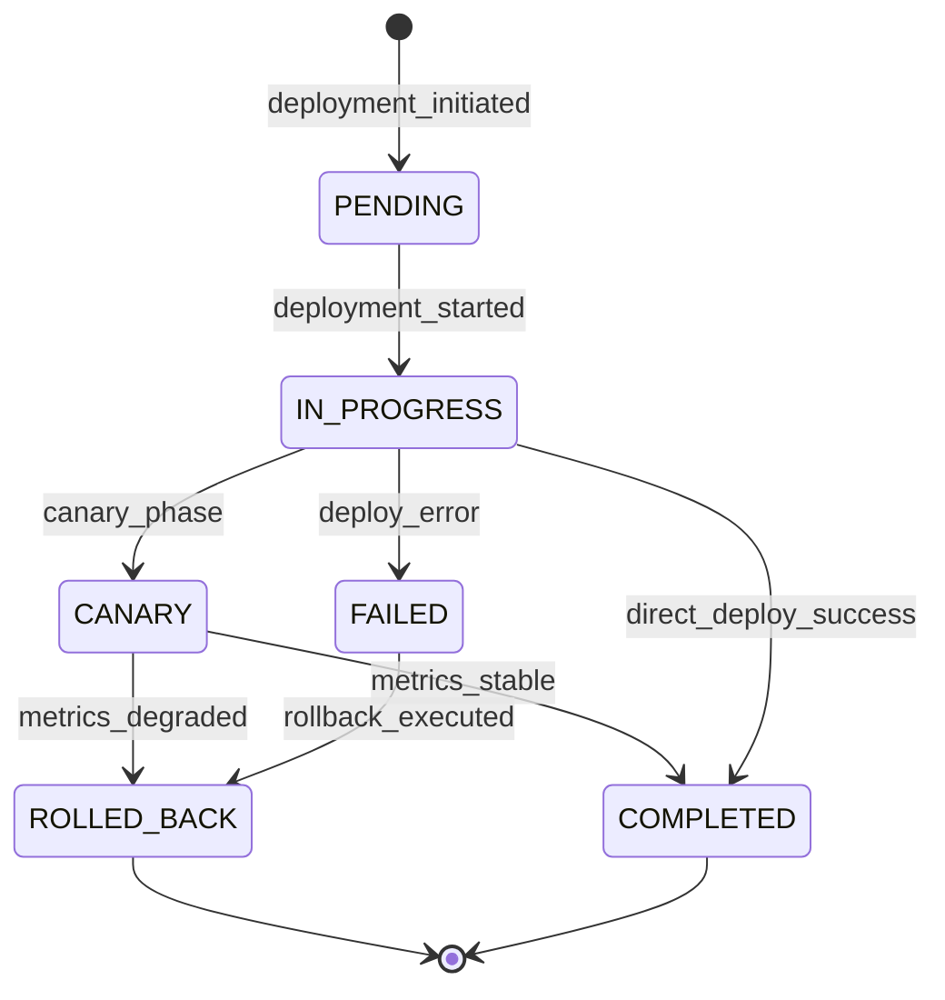
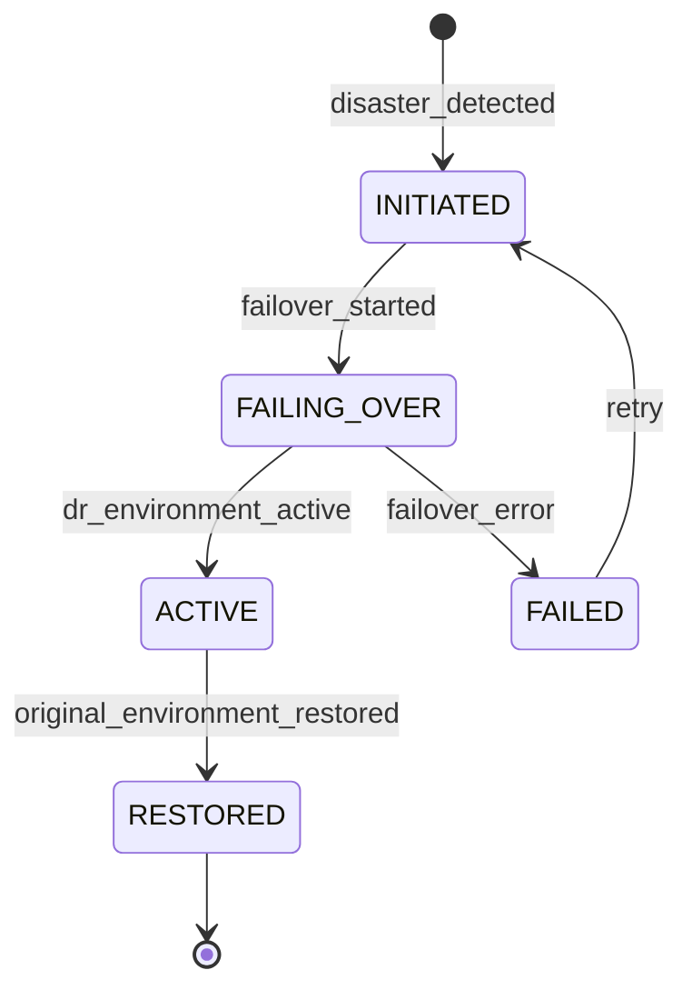

# System Infrastructure Domain

## Overview

This domain handles **cloud infrastructure, scaling, deployment, networking, and platform operations**, including **container orchestration, auto-scaling, load balancing, database infrastructure, storage infrastructure, CI/CD pipelines, networking and security, monitoring and observability, and disaster recovery**.

It acts as **an infrastructure domain** that underpins the entire Sentinel360 platform, managing the cloud and on-premises compute, storage, networking, and deployment infrastructure required to run all other domains reliably and at scale.

---

## Use Cases

---

### UC-SI-01: Provision Infrastructure Environment

- **Purpose**: Create and configure a new infrastructure environment (staging, production, DR)
- **Actors**: Super Administrator, DevOps Engineer (via CI/CD)
- **Preconditions**: Infrastructure-as-Code templates are available

#### Main Success Flow

1. Actor specifies environment type and parameters
2. System validates configuration against infrastructure templates
3. System provisions compute resources (containers/VMs)
4. System provisions database instances with replication
5. System provisions storage (object store, file storage)
6. System configures networking (VPC, subnets, security groups, load balancers)
7. System deploys platform services
8. System runs health checks on all provisioned resources
9. System records infrastructure state
10. System records audit log

#### Alternate / Exception Flows

- **Resource quota exceeded** → 422: "Insufficient quota for requested resources"
- **Provisioning failure** → Rollback partial provisioning; alert admin
- **Configuration drift** → Reconcile with desired state from templates

#### Result

Infrastructure environment provisioned and healthy.

---

### UC-SI-02: Auto-Scale Platform Services

- **Purpose**: Automatically scale services based on load metrics
- **Actors**: System (automated)
- **Preconditions**: Auto-scaling policies are configured

#### Main Success Flow

1. Monitoring system detects scaling trigger:
   - CPU utilization > threshold
   - Memory utilization > threshold
   - Request queue depth > threshold
   - AI inference queue depth > threshold
   - Active user sessions > threshold
2. System evaluates scaling policy(ies)
3. System determines scaling action (scale up/out or down/in)
4. System provisions or de-provisions instances
5. System rebalances load across instances
6. System verifies health of new instances
7. System records scaling event

#### Alternate / Exception Flows

- **Maximum capacity reached** → Alert admin; reject non-essential traffic
- **Scale-down cooldown** → Delay scale-down to prevent thrashing
- **New instance unhealthy** → Terminate and try with fresh instance

#### Result

Services scaled to meet current demand; resources optimized.

---

### UC-SI-03: Manage Database Infrastructure

- **Purpose**: Manage database instances, replication, and performance
- **Actors**: System (automated), Super Administrator
- **Preconditions**: Database infrastructure exists

#### Main Success Flow

1. System monitors database metrics:
   - Connection pool utilization
   - Query performance (p50, p95, p99)
   - Replication lag
   - Storage utilization
   - Index health
2. System auto-adjusts resources based on metrics
3. System manages connection pooling configuration
4. System manages read replicas for load distribution
5. System runs periodic maintenance (vacuum, analyze, reindex)
6. System records health metrics

#### Alternate / Exception Flows

- **Replication lag exceeds threshold** → Alert admin; potential failover
- **Slow query detected** → Log query details; alert if recurring
- **Storage approaching limit** → Alert admin; initiate storage expansion

#### Result

Database infrastructure healthy and performing within SLAs.

---

### UC-SI-04: Manage Storage Infrastructure

- **Purpose**: Manage object storage, media storage tiers, and content delivery
- **Actors**: System (automated), Administrator
- **Preconditions**: Storage infrastructure exists

#### Main Success Flow

1. System manages storage tiers:
   - **Hot**: Frequently accessed media (recent footage, active cases)
   - **Warm**: Less frequently accessed (30–90 days)
   - **Cold**: Archival storage (90+ days, retention compliance)
2. System automatically migrates data between tiers based on access patterns
3. System manages CDN for media delivery
4. System monitors storage utilization and costs
5. System enforces storage quotas

#### Alternate / Exception Flows

- **Storage quota exceeded** → Block new uploads; alert admin
- **Tier migration failed** → Retry; alert on persistent failure
- **CDN origin unavailable** → Serve directly from storage (degraded performance)

#### Result

Storage infrastructure optimized across tiers; costs managed.

---

### UC-SI-05: Deploy Platform Updates

- **Purpose**: Deploy new versions of platform services via CI/CD
- **Actors**: System (CI/CD pipeline), Super Administrator
- **Preconditions**: New version passes all pipeline checks

#### Main Success Flow

1. CI/CD pipeline triggers deployment:
   - Code committed and merged
   - Tests pass (unit, integration, e2e)
   - Security scan passes
   - Build artifacts created
2. System deploys to staging environment
3. System runs integration tests on staging
4. System performs canary deployment to production (small % of traffic)
5. System monitors error rates and latency during canary
6. If metrics stable: system rolls out to full production
7. If metrics degrade: system automatic rollback
8. System records deployment event

#### Alternate / Exception Flows

- **Test failure in staging** → Deployment blocked; team notified
- **Canary degradation** → Automatic rollback; incident created
- **Database migration required** → Run migration first; validate before proceeding

#### Result

Platform updated with zero-downtime deployment; rollback available.

---

### UC-SI-06: Monitor Platform Observability

- **Purpose**: Provide comprehensive monitoring, logging, and tracing across all services
- **Actors**: System (automated), Super Administrator, Administrator
- **Preconditions**: Observability stack is deployed

#### Main Success Flow

1. System collects:
   - **Metrics**: CPU, memory, disk, network, request rates, error rates, latency per service
   - **Logs**: Structured logs from all services (application, access, error)
   - **Traces**: Distributed traces across service boundaries
   - **Custom metrics**: Business metrics (detections/sec, active cases, user sessions)
2. System aggregates and stores observability data
3. System evaluates alerting rules
4. System triggers alerts for threshold violations
5. System provides dashboards for visualization
6. System retains data per retention policy

#### Alternate / Exception Flows

- **Observability pipeline overloaded** → Sample data; prioritize error logs
- **Storage full** → Rotate/archive oldest data

#### Result

Full platform observability with alerting and dashboards.

---

### UC-SI-07: Manage Network Security

- **Purpose**: Configure and maintain network security controls
- **Actors**: Super Administrator, System (automated)
- **Preconditions**: Network infrastructure exists

#### Main Success Flow

1. System manages network security layers:
   - **Firewall rules**: Ingress/egress rules for all services
   - **TLS/SSL**: Certificate management and rotation
   - **DDoS protection**: Rate limiting and traffic analysis
   - **VPN**: Secure access for edge nodes and remote admin
   - **API gateway**: Rate limiting, authentication, request validation
   - **WAF**: Web application firewall rules
2. System monitors for network anomalies
3. System auto-blocks detected threats
4. System rotates certificates before expiry
5. System records security events

#### Alternate / Exception Flows

- **Certificate expiry imminent** → Auto-renew; alert admin if renewal fails
- **DDoS detected** → Activate DDoS mitigation; alert admin
- **Brute force detected** → Auto-block source IP; log event

#### Result

Network security actively managed and threats mitigated.

---

### UC-SI-08: Execute Disaster Recovery

- **Purpose**: Execute disaster recovery procedures to restore platform operations
- **Actors**: Super Administrator, System (automated failover)
- **Preconditions**: DR plan exists; backups available

#### Main Success Flow

1. Disaster detected (region failure, data center outage, data corruption)
2. System evaluates DR procedure:
   - **Automated failover**: System switches to DR region automatically
   - **Manual failover**: Super Admin initiates DR procedure
3. System activates DR environment
4. System switches DNS/traffic to DR region
5. System restores from latest backup (if data corruption)
6. System validates service health
7. System notifies all stakeholders
8. System records DR event with timeline

#### Alternate / Exception Flows

- **DR environment not ready** → Manual provisioning required; extended recovery time
- **Backup verification fails** → Use last verified backup; alert admin of data gap
- **Partial failure** → Fail over only affected services

#### Result

Platform restored in DR environment; operations resumed.

---

### UC-SI-09: Manage Service Configuration and Secrets

- **Purpose**: Manage service configuration, environment variables, and secrets
- **Actors**: Super Administrator, System (CI/CD)
- **Preconditions**: Secrets management system is deployed

#### Main Success Flow

1. Actor manages configuration:
   - Service environment variables
   - Database connection strings
   - API keys and tokens
   - Encryption keys
   - Third-party service credentials
2. System stores secrets in encrypted vault
3. System injects configuration into services at deployment
4. System rotates secrets on schedule
5. System audits all secret access

#### Alternate / Exception Flows

- **Secret rotation failure** → Keep existing secret; alert admin; retry
- **Service cannot access secret** → Health check failure; alert admin

#### Result

Secrets managed securely; rotated on schedule; access audited.

---

## Core Entities

---

### Entity: InfrastructureEnvironment

- **Description**: A deployment environment (staging, production, DR)

#### Fields

- `id`: UUID — Unique identifier
- `name`: String — Environment name
- `type`: Enum — `DEVELOPMENT`, `STAGING`, `PRODUCTION`, `DR`
- `region`: String — Cloud region
- `status`: Enum — `PROVISIONING`, `ACTIVE`, `DEGRADED`, `MAINTENANCE`, `FAILED`, `DECOMMISSIONED`
- `services`: JSONB — Deployed services and versions
- `infrastructure_template_version`: String — IaC template version
- `provisioned_at`: Timestamp
- `last_deployment_at`: Timestamp (nullable)
- `created_at`: Timestamp
- `updated_at`: Timestamp

#### Constraints

- `name` must be unique
- `PRODUCTION` environment must always have an associated `DR` environment

#### Relationships

- Has many `ServiceInstance`
- Has many `DeploymentRecord`

---

### Entity: ServiceInstance

- **Description**: A running instance of a platform service

#### Fields

- `id`: UUID — Unique identifier
- `service_name`: String — Name of the service
- `environment_id`: UUID — Reference to environment
- `version`: String — Running version
- `instance_count`: Integer — Number of active instances
- `min_instances`: Integer — Minimum instances (auto-scaling)
- `max_instances`: Integer — Maximum instances (auto-scaling)
- `status`: Enum — `RUNNING`, `DEGRADED`, `STOPPED`, `DEPLOYING`
- `health_check_url`: String — Health endpoint
- `last_health_check_at`: Timestamp (nullable)
- `resource_allocation`: JSONB — CPU, memory, storage per instance
- `scaling_policy`: JSONB — Auto-scaling rules
- `created_at`: Timestamp
- `updated_at`: Timestamp

#### Constraints

- `instance_count` must be between `min_instances` and `max_instances`
- `RUNNING` status requires at least one healthy instance

#### Relationships

- Belongs to `InfrastructureEnvironment`

---

### Entity: DeploymentRecord

- **Description**: Record of a service deployment

#### Fields

- `id`: UUID — Unique identifier
- `environment_id`: UUID — Target environment
- `service_name`: String — Service being deployed
- `version`: String — Version being deployed
- `previous_version`: String (nullable) — Previous version (for rollback)
- `deployment_type`: Enum — `ROLLING`, `CANARY`, `BLUE_GREEN`, `IMMEDIATE`
- `status`: Enum — `PENDING`, `IN_PROGRESS`, `CANARY`, `COMPLETED`, `ROLLED_BACK`, `FAILED`
- `health_check_result`: JSONB (nullable) — Post-deployment health check
- `canary_metrics`: JSONB (nullable) — Metrics during canary phase
- `build_hash`: String — Build artifact hash
- `initiated_by`: UUID (nullable) — User or CI system
- `started_at`: Timestamp
- `completed_at`: Timestamp (nullable)
- `created_at`: Timestamp

#### Constraints

- `COMPLETED` must have passed health checks
- `ROLLED_BACK` must record `previous_version`
- Build hash must match artifact for integrity

#### Relationships

- Belongs to `InfrastructureEnvironment`

---

### Entity: ScalingEvent

- **Description**: Record of an auto-scaling event

#### Fields

- `id`: UUID — Unique identifier
- `service_name`: String — Service that was scaled
- `environment_id`: UUID — Environment
- `direction`: Enum — `SCALE_UP`, `SCALE_DOWN`, `SCALE_OUT`, `SCALE_IN`
- `trigger_metric`: String — Metric that triggered scaling
- `trigger_value`: Float — Metric value at trigger time
- `threshold`: Float — Configured threshold
- `from_count`: Integer — Previous instance count
- `to_count`: Integer — New instance count
- `status`: Enum — `INITIATED`, `COMPLETED`, `FAILED`
- `created_at`: Timestamp

#### Constraints

- Scaling events respect cooldown periods
- Cannot scale below `min_instances` or above `max_instances`

#### Relationships

- References `ServiceInstance`

---

### Entity: DisasterRecoveryEvent

- **Description**: Record of a disaster recovery execution

#### Fields

- `id`: UUID — Unique identifier
- `trigger`: Enum — `AUTOMATED`, `MANUAL`
- `trigger_reason`: String — What caused the DR event
- `source_environment_id`: UUID — Failed environment
- `target_environment_id`: UUID — DR environment
- `status`: Enum — `INITIATED`, `FAILING_OVER`, `ACTIVE`, `RESTORED`, `FAILED`
- `failover_started_at`: Timestamp
- `failover_completed_at`: Timestamp (nullable)
- `restoration_started_at`: Timestamp (nullable)
- `restoration_completed_at`: Timestamp (nullable)
- `data_loss_window`: String (nullable) — Estimated data loss window (RPO)
- `initiated_by`: UUID (nullable)
- `created_at`: Timestamp
- `updated_at`: Timestamp

#### Constraints

- All DR events must record timeline accurately
- `data_loss_window` must be documented

#### Relationships

- References `InfrastructureEnvironment` (source and target)

---

### Entity: NetworkSecurityRule

- **Description**: A network security configuration rule

#### Fields

- `id`: UUID — Unique identifier
- `rule_type`: Enum — `FIREWALL`, `WAF`, `RATE_LIMIT`, `IP_BLOCK`, `TLS`, `VPN`
- `name`: String — Rule name
- `description`: String — Rule description
- `configuration`: JSONB — Rule-specific configuration
- `is_active`: Boolean
- `priority`: Integer — Rule evaluation priority
- `expires_at`: Timestamp (nullable) — Optional auto-expiry (e.g., temp IP blocks)
- `created_by`: UUID
- `created_at`: Timestamp
- `updated_at`: Timestamp

#### Constraints

- Active rules must not conflict (same scope + contradictory actions)
- Expiring rules auto-deactivate after `expires_at`

#### Relationships

- Created by `User`

---

## State Machines

### Service Deployment Lifecycle

### Disaster Recovery Lifecycle

---

### States — Deployment

| State         | Description                                            |
| ------------- | ------------------------------------------------------ |
| `PENDING`     | Deployment queued                                      |
| `IN_PROGRESS` | Deployment executing                                   |
| `CANARY`      | Canary phase — monitoring metrics with partial traffic |
| `COMPLETED`   | Successfully deployed                                  |
| `FAILED`      | Deployment failed                                      |
| `ROLLED_BACK` | Rolled back to previous version                        |

### States — DR

| State          | Description                                |
| -------------- | ------------------------------------------ |
| `INITIATED`    | DR procedure started                       |
| `FAILING_OVER` | Traffic being switched to DR environment   |
| `ACTIVE`       | DR environment serving production traffic  |
| `RESTORED`     | Original environment restored and verified |
| `FAILED`       | Failover failed                            |

---

### Transitions & Guards

| From → To                | Event                 | Condition                                                  |
| ------------------------ | --------------------- | ---------------------------------------------------------- |
| PENDING → IN_PROGRESS    | deployment_started    | Resources available; previous deployment not in progress   |
| IN_PROGRESS → CANARY     | canary_phase          | Canary deployment type; partial traffic shifted            |
| CANARY → COMPLETED       | metrics_stable        | Error rate and latency within thresholds for canary period |
| CANARY → ROLLED_BACK     | metrics_degraded      | Error rate or latency exceeds thresholds                   |
| INITIATED → FAILING_OVER | failover_started      | DR environment available                                   |
| FAILING_OVER → ACTIVE    | dr_environment_active | All services healthy in DR environment                     |

---

## Business Rules (Invariants)

1. **Zero-downtime deployments**: Production deployments must use rolling, canary, or blue-green strategies
2. **Canary validation**: Canary deployments must pass health and metric checks before full rollout
3. **Automatic rollback**: Failed deployments must auto-rollback to the previous known-good version
4. **DR readiness**: Disaster recovery environment must be continuously validated
5. **RPO/RTO targets**: Recovery Point Objective < 1 hour; Recovery Time Objective < 30 minutes
6. **Secret encryption**: All secrets must be encrypted at rest and in transit
7. **Secret rotation**: Database passwords and API keys must rotate on schedule (configurable, default 90 days)
8. **Certificate management**: TLS certificates must auto-renew at least 30 days before expiry
9. **Scaling boundaries**: Auto-scaling must respect configured min/max instance bounds
10. **Network segmentation**: Services must only communicate through defined network paths
11. **Log retention**: Application logs retained for minimum 90 days; security logs for 1 year
12. **Build integrity**: Deployed artifacts must match their build hash

---

## Processing Flows

### Deployment Pipeline

1. Code merged to main branch
2. CI runs: lint, test (unit, integration), security scan, build
3. Build artifact created with hash
4. Deploy to staging environment
5. Run smoke tests and integration tests on staging
6. If pass: initiate canary deployment to production
7. Route 5% of traffic to canary
8. Monitor for configurable canary period (default: 15 minutes)
9. If metrics stable: roll out to 100%
10. If metrics degrade: automatic rollback
11. Record deployment result

### Auto-Scaling Flow

1. Monitoring system collects service metrics every 15 seconds
2. Scaling evaluator checks metrics against policies
3. If threshold exceeded for sustained period (default: 2 minutes):
   - Scale-out: provision new instances, add to load balancer
   - Scale-up: increase instance resources
4. If threshold drops below scale-down threshold for cooldown period:
   - Scale-in: drain and terminate excess instances
5. Health check new/remaining instances
6. Record scaling event

### Disaster Recovery Flow

1. Monitoring detects environment failure (automated) or admin triggers (manual)
2. System evaluates failure scope (full environment vs. partial)
3. System activates DR environment (or fails over specific services)
4. System switches DNS / load balancer to DR
5. System validates all services healthy in DR
6. System notifies all stakeholders
7. System enters DR-active mode
8. When original environment is restored:
   - Validate data consistency
   - Resync any missed data
   - Switch traffic back
   - Validate normal operations

### Certificate Rotation Flow

1. System monitors certificate expiry dates
2. 30 days before expiry: trigger renewal
3. System requests new certificate (ACME/CA)
4. System validates new certificate
5. System deploys new certificate to services
6. System verifies TLS handshakes succeed
7. System archives old certificate

---

## Interfaces

### Infrastructure Dashboard (Super Admin)

- **Environment overview**: All environments with status, service health, region
- **Service map**: Visual service dependency map with health indicators
- **Resource usage**: Compute, storage, network utilization
- **Cost tracking**: Infrastructure cost by service and environment
- **Actions**: Scale, deploy, configure, failover

### Deployment Manager

- **Pipeline view**: Current and recent deployments with stages
- **Canary metrics**: Real-time metrics during canary phase
- **Rollback**: One-click rollback to previous version
- **History**: Deployment history with durations and outcomes
- **Artifacts**: Build artifacts with versions and hashes

### Scaling Dashboard

- **Current state**: Instance counts per service
- **Scaling events**: Recent scaling actions with triggers
- **Policies**: Auto-scaling policy configuration
- **Projections**: Capacity projections based on trends

### Observability Console

- **Dashboards**: Pre-built and custom metric dashboards
- **Logs**: Centralized log search across all services
- **Traces**: Distributed trace viewer with latency analysis
- **Alerting**: Alert rules with notification routing
- **SLA tracking**: Uptime and performance SLA metrics

### Network Security Console

- **Firewall rules**: Active rules with traffic statistics
- **TLS status**: Certificate status and expiry dates
- **Threat monitoring**: Blocked requests, DDoS indicators, anomalies
- **WAF**: Web application firewall rules and violations

### DR Console

- **DR status**: Current DR environment readiness
- **Failover**: Manual failover controls with confirmation
- **DR tests**: Scheduled and ad-hoc DR test results
- **Timeline**: DR event timeline and recovery metrics

---

## Notifications

| Event                 | Recipient        | Channel            | Message                                                              |
| --------------------- | ---------------- | ------------------ | -------------------------------------------------------------------- |
| DEPLOYMENT_STARTED    | Team             | In-app             | "Deploying {service} v{version} to {environment}"                    |
| DEPLOYMENT_COMPLETED  | Team             | In-app             | "Deployment of {service} v{version} SUCCESSFUL"                      |
| DEPLOYMENT_FAILED     | Team + Admin     | Push + Email       | "Deployment FAILED: {service} v{version} — auto-rollback initiated"  |
| CANARY_DEGRADATION    | Team + Admin     | Push + Email       | "Canary degradation detected: {service} — rolling back"              |
| AUTO_SCALE_EVENT      | Admin            | In-app             | "{service} scaled {direction}: {from} → {to} instances"              |
| SERVICE_DEGRADED      | Admin + On-call  | Push + SMS         | "Service DEGRADED: {service} in {environment}"                       |
| DR_FAILOVER_INITIATED | All Super Admins | Push + SMS + Email | "DISASTER RECOVERY initiated: failing over to {dr_region}"           |
| DR_ACTIVE             | All Admins       | Email              | "DR environment ACTIVE — production traffic served from {dr_region}" |
| CERTIFICATE_EXPIRING  | Admin            | Email              | "TLS certificate for {domain} expires in {days} days"                |
| HIGH_ERROR_RATE       | On-call + Admin  | Push + SMS         | "High error rate on {service}: {rate}% (threshold: {threshold}%)"    |
| STORAGE_QUOTA_WARNING | Admin            | Email              | "Storage usage at {percent}% of quota"                               |

---

## Audit Logging

- Environment provisioning and configuration changes
- Service deployments (version, outcome, duration)
- Auto-scaling events (trigger, direction, counts)
- Database operations (backup, restore, failover)
- Secret access and rotation
- Network security rule changes
- Certificate operations
- Disaster recovery events
- Infrastructure configuration changes
- Maintenance window operations

Includes:

- **Actor**: User ID, CI/CD pipeline ID, or `SYSTEM`
- **Timestamp**: ISO 8601 UTC
- **Action**: Event code
- **Target**: Service name, environment, resource ID
- **Payload snapshot**: Configuration changes, deployment details
- **Duration**: Operation duration where applicable
- **Impact**: Affected services and users

---

## Invariants

1. Production deployments must use zero-downtime strategies
2. Failed deployments must auto-rollback to the last known-good version
3. DR environment must be continuously validated and ready for failover
4. All secrets must be encrypted at rest and in transit
5. TLS certificates must be renewed before expiry
6. Auto-scaling must respect configured bounds
7. All infrastructure changes must be audited with actor identification
