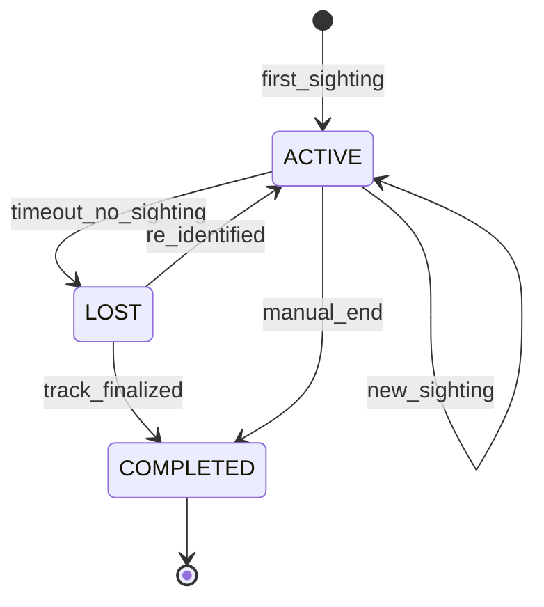

# Tracking & Movement Domain

## Overview

This domain handles **re-identification of entities across cameras, movement path reconstruction, and timeline generation**, including **cross-camera person and vehicle tracking, spatial-temporal movement analysis, trajectory prediction, dwell time analysis, and geofence monitoring**.

It acts as **a core intelligence service** that connects discrete entity detections into continuous movement narratives, enabling operators and investigators to trace entity journeys across the Sentinel360 camera network.

---

## Use Cases

---

### UC-TM-01: Track Entity Across Cameras

- **Purpose**: Re-identify and track a person or vehicle as they move between camera feeds
- **Actors**: System (automated), Security Operator (manual initiation)
- **Preconditions**: Entity detected in at least one camera; entity profile exists or can be created

#### Main Success Flow

1. Entity is detected and identified (face, plate, or attributes) in Camera A
2. System publishes entity sighting with spatial-temporal metadata
3. System queries adjacent/nearby cameras for matching detections within a time window
4. System applies re-identification model (appearance, gait, vehicle features)
5. System correlates sightings into a continuous track with match confidence
6. System calculates movement direction and speed estimate
7. System updates the entity's movement path
8. System emits `ENTITY_TRACK_UPDATED` event

#### Alternate / Exception Flows

- **Re-ID confidence below threshold** → Candidate match flagged for human review
- **Gap in coverage** → Track segment marked with estimated transition time
- **Entity lost** → Track ended with `LOST` status; monitoring continues on nearby cameras
- **ID switch detected** → System flags potential track swap for human verification

#### Result

Entity tracked across cameras with a continuous movement path and timeline.

---

### UC-TM-02: Generate Movement Timeline

- **Purpose**: Produce a chronological timeline of an entity's movements and activities
- **Actors**: Law Enforcement Officer, Security Operator
- **Preconditions**: Entity profile exists with multiple sightings

#### Main Success Flow

1. Actor requests movement timeline for a specific entity and time range
2. System retrieves all sightings for the entity within the time range
3. System orders sightings chronologically
4. System calculates transition times and distances between sightings
5. System identifies dwell periods (stationary > configurable threshold)
6. System identifies coverage gaps (no sightings for extended periods)
7. System compiles timeline with location, camera, timestamp, and duration at each point
8. System returns structured timeline with map visualization data

#### Alternate / Exception Flows

- **No sightings in range** → 200 OK with empty timeline
- **Single sighting only** → Timeline with one point; no movement path
- **Entity profile merged** → Automatically follows redirect to merged profile

#### Result

Chronological movement timeline generated with locations, transitions, and dwell times.

---

### UC-TM-03: Set Up Geofence

- **Purpose**: Define geographic zones that trigger alerts when an entity enters or exits
- **Actors**: Security Operator, Law Enforcement Officer
- **Preconditions**: Actor has `MANAGE_GEOFENCES` permission

#### Main Success Flow

1. Actor defines a geofence with boundary coordinates, name, and rule (enter/exit/both)
2. Actor optionally restricts geofence to specific entities or entity types
3. System validates boundary geometry
4. System activates the geofence
5. System monitors all entity sightings against active geofences
6. System emits `GEOFENCE_CREATED` event
7. System records audit log

#### Alternate / Exception Flows

- **Invalid geometry** → 422: "Geofence boundary must be a valid polygon"
- **Overlapping geofences** → Allowed; both trigger independently
- **No cameras in zone** → Warning: "No cameras cover this geofence area"

#### Result

Geofence active and monitoring entity movements.

---

### UC-TM-04: Detect Geofence Violation

- **Purpose**: Trigger an alert when an entity crosses a geofence boundary
- **Actors**: System (automated)
- **Preconditions**: Active geofence exists; entity sighting within monitoring range

#### Main Success Flow

1. Entity sighting occurs near a geofence boundary
2. System checks if the sighting location falls within any active geofence
3. System determines if this constitutes an entry or exit event
4. System checks if the entity matches geofence filter criteria
5. System generates a geofence violation record
6. System emits `GEOFENCE_VIOLATION` event
7. System triggers alert per geofence configuration

#### Alternate / Exception Flows

- **Same entity same zone multiple times** → Cooldown period to prevent alert spam (configurable)
- **Borderline location** → System applies buffer zone for hysteresis

#### Result

Geofence violation recorded; alerts dispatched per configuration.

---

### UC-TM-05: Analyze Movement Patterns

- **Purpose**: Identify recurring movement patterns and anomalies for an entity or zone
- **Actors**: Security Operator, Law Enforcement Officer, System (automated)
- **Preconditions**: Sufficient historical sighting data available

#### Main Success Flow

1. Actor requests pattern analysis for an entity or zone over a time range
2. System aggregates sighting data
3. System identifies:
   - Common routes (frequent paths between locations)
   - Regular schedules (recurring time patterns)
   - Unusual deviations from established patterns
   - Frequent stops/dwell locations
   - Speed anomalies
4. System generates pattern report with visualizations
5. System stores pattern analysis results
6. System emits `PATTERN_ANALYSIS_COMPLETED` event

#### Alternate / Exception Flows

- **Insufficient data** → 422: "Not enough sighting data for pattern analysis (minimum 10 sightings required)"
- **No patterns detected** → Report generated with "no significant patterns found"

#### Result

Movement pattern analysis completed with identified routes, schedules, and anomalies.

---

### UC-TM-06: Predict Entity Movement

- **Purpose**: Predict the likely next location of a tracked entity based on movement patterns
- **Actors**: System (automated), Security Operator
- **Preconditions**: Entity has active track with sufficient history

#### Main Success Flow

1. System analyzes current entity trajectory and historical patterns
2. System calculates probable next locations with probability scores
3. System identifies cameras likely to detect the entity next
4. System pre-alerts those camera feeds for enhanced monitoring
5. System emits `MOVEMENT_PREDICTION_GENERATED` event

#### Alternate / Exception Flows

- **Insufficient data for prediction** → No prediction generated
- **Entity pattern is random** → Low-confidence predictions flagged accordingly

#### Result

Movement predictions generated with probability scores; target cameras alerted.

---

### UC-TM-07: Reconstruct Historical Path

- **Purpose**: Reconstruct the full movement path of an entity for a past time period
- **Actors**: Law Enforcement Officer
- **Preconditions**: Actor has `INVESTIGATE` permission; sighting data exists

#### Main Success Flow

1. Officer requests historical path reconstruction for an entity and time window
2. System retrieves all sightings within the time window
3. System fills gaps using interpolation and camera network topology
4. System generates a complete path with confidence levels per segment
5. System identifies key locations (stops, interactions, activities)
6. System renders path on map with timeline
7. System records audit log (investigation action)

#### Alternate / Exception Flows

- **Large time window** → System segments into processable chunks
- **Significant gaps** → Displayed as dashed segments with time estimates

#### Result

Historical movement path reconstructed with map visualization and timeline.

---

## Core Entities

---

### Entity: EntityTrack

- **Description**: A continuous tracking session for an entity across one or more cameras

#### Fields

- `id`: UUID — Unique identifier
- `entity_profile_id`: UUID — Reference to tracked entity
- `status`: Enum — `ACTIVE`, `LOST`, `COMPLETED`
- `started_at`: Timestamp — When tracking began
- `ended_at`: Timestamp (nullable) — When tracking concluded
- `total_sightings`: Integer — Number of sightings in this track
- `total_cameras`: Integer — Number of cameras involved
- `total_distance_meters`: Float (nullable) — Estimated distance traveled
- `average_speed_mps`: Float (nullable) — Average speed (meters per second)
- `first_location`: JSONB — First sighting location `{lat, lng, camera_id}`
- `last_location`: JSONB — Most recent sighting location
- `path_geojson`: JSONB (nullable) — GeoJSON representation of the movement path
- `confidence`: Float — Overall track confidence (0.0–1.0)
- `created_at`: Timestamp
- `updated_at`: Timestamp

#### Constraints

- `ACTIVE` tracks are updated in real-time as new sightings arrive
- A track transitions to `LOST` after configurable timeout (default: 30 minutes) without sightings
- `confidence` reflects the average re-ID confidence across sighting links

#### Relationships

- Belongs to `EntityProfile` (cross-domain)
- Has many `Sighting`
- Has many `TrackSegment`

---

### Entity: Sighting

- **Description**: A single observation of an entity at a specific location and time

#### Fields

- `id`: UUID — Unique identifier
- `entity_track_id`: UUID — Reference to parent track
- `entity_profile_id`: UUID — Reference to entity profile
- `camera_id`: String — Camera that observed the entity
- `location`: JSONB — Geographic coordinates `{lat, lng}`
- `zone_id`: UUID (nullable) — Detection zone reference
- `timestamp`: Timestamp — When the entity was observed
- `detection_id`: UUID — Reference to the source detection (AI Detection domain)
- `re_id_confidence`: Float — Confidence of re-identification match
- `dwell_duration_seconds`: Integer (nullable) — How long entity remained in view
- `direction`: String (nullable) — Estimated movement direction (compass)
- `speed_estimate_mps`: Float (nullable) — Estimated speed (m/s)
- `frame_url`: String (nullable) — Evidence frame URL
- `created_at`: Timestamp

#### Constraints

- `re_id_confidence` must be between 0.0 and 1.0
- `timestamp` must be server-side UTC
- One sighting per entity per camera per second (dedup)

#### Relationships

- Belongs to `EntityTrack`
- Belongs to `EntityProfile`
- References `Detection` (cross-domain)

---

### Entity: TrackSegment

- **Description**: A segment of travel between two sightings

#### Fields

- `id`: UUID — Unique identifier
- `entity_track_id`: UUID — Reference to parent track
- `from_sighting_id`: UUID — Starting sighting
- `to_sighting_id`: UUID — Ending sighting
- `distance_meters`: Float — Estimated distance
- `duration_seconds`: Integer — Time between sightings
- `speed_mps`: Float — Calculated speed
- `is_interpolated`: Boolean — Whether the segment was interpolated (no direct observation)
- `confidence`: Float — Segment confidence
- `created_at`: Timestamp

#### Constraints

- `duration_seconds` must be positive
- `is_interpolated` segments are displayed differently (dashed lines)

#### Relationships

- Belongs to `EntityTrack`
- References `Sighting` (from and to)

---

### Entity: Geofence

- **Description**: A geographic boundary used for monitoring entity entry/exit

#### Fields

- `id`: UUID — Unique identifier
- `name`: String — Geofence name
- `description`: String (nullable) — Description
- `boundary`: JSONB — GeoJSON polygon defining the boundary
- `buffer_meters`: Float — Buffer zone for hysteresis (default: 10)
- `rule`: Enum — `ENTER`, `EXIT`, `BOTH`
- `entity_filter`: JSONB (nullable) — Filter criteria (specific entities, entity types, watchlist only)
- `alert_cooldown_seconds`: Integer — Minimum seconds between alerts for same entity (default: 300)
- `is_active`: Boolean — Whether the geofence is currently active
- `created_by`: UUID — User who created the geofence
- `expires_at`: Timestamp (nullable) — Auto-deactivation time
- `created_at`: Timestamp
- `updated_at`: Timestamp

#### Constraints

- `boundary` must be a valid GeoJSON polygon
- `buffer_meters` must be non-negative
- `alert_cooldown_seconds` must be positive

#### Relationships

- Has many `GeofenceViolation`
- Created by `User`

---

### Entity: GeofenceViolation

- **Description**: A recorded geofence boundary crossing event

#### Fields

- `id`: UUID — Unique identifier
- `geofence_id`: UUID — Reference to geofence
- `entity_profile_id`: UUID — Entity that violated the fence
- `sighting_id`: UUID — Triggering sighting
- `violation_type`: Enum — `ENTER`, `EXIT`
- `location`: JSONB — Exact violation coordinates
- `timestamp`: Timestamp
- `alert_sent`: Boolean — Whether an alert was dispatched
- `created_at`: Timestamp

#### Constraints

- Respects geofence alert cooldown period per entity

#### Relationships

- Belongs to `Geofence`
- References `EntityProfile`
- References `Sighting`

---

### Entity: MovementPattern

- **Description**: An identified recurring movement pattern

#### Fields

- `id`: UUID — Unique identifier
- `entity_profile_id`: UUID (nullable) — Specific entity (null for zone patterns)
- `zone_id`: UUID (nullable) — Specific zone (null for entity patterns)
- `pattern_type`: Enum — `ROUTE`, `SCHEDULE`, `ANOMALY`, `DWELL`, `SPEED`
- `description`: String — Human-readable description of the pattern
- `data`: JSONB — Pattern details (route waypoints, schedule times, anomaly description)
- `frequency`: Integer — Number of occurrences observed
- `confidence`: Float — Pattern confidence (0.0–1.0)
- `first_observed`: Timestamp — When pattern first detected
- `last_observed`: Timestamp — Most recent occurrence
- `created_at`: Timestamp

#### Constraints

- Either `entity_profile_id` or `zone_id` must be set (not both null)
- `frequency` must be ≥ 2 for a pattern to be established

#### Relationships

- Optionally belongs to `EntityProfile`
- Optionally belongs to `DetectionZone`

---

## State Machines

### Entity Track Lifecycle

---

### States

| State       | Description                                                           |
| ----------- | --------------------------------------------------------------------- |
| `ACTIVE`    | Entity is currently being tracked across cameras                      |
| `LOST`      | Entity has not been detected for timeout period; monitoring continues |
| `COMPLETED` | Track has been finalized (entity left coverage area or manual end)    |

---

### Transitions & Guards

| From → To          | Event               | Condition                                                   |
| ------------------ | ------------------- | ----------------------------------------------------------- |
| ACTIVE → ACTIVE    | new_sighting        | Re-ID confidence ≥ threshold                                |
| ACTIVE → LOST      | timeout_no_sighting | No sighting for configured timeout (default 30 min)         |
| LOST → ACTIVE      | re_identified       | New sighting matched to this track                          |
| LOST → COMPLETED   | track_finalized     | Lost duration exceeds max recovery window (default 2 hours) |
| ACTIVE → COMPLETED | manual_end          | Operator explicitly ends tracking                           |

---

## Business Rules (Invariants)

1. **Re-ID threshold**: Cross-camera matching below configured threshold (default 0.75) is rejected
2. **Temporal consistency**: Sightings must be temporally consistent (no time-travel — entity cannot appear at distant locations simultaneously)
3. **Speed reasonability**: Track segments with impossible speeds (>200 km/h for pedestrians) are flagged as errors
4. **Deduplication**: Maximum one sighting per entity per camera per second
5. **Geofence hysteresis**: Buffer zone prevents rapid enter/exit oscillation at boundaries
6. **Alert cooldown**: Geofence alerts for same entity respect configurable cooldown period
7. **Track linking**: Tracks for the same entity within a configurable window should be linked, not duplicated
8. **Pattern minimum**: Movement patterns require at least 2 occurrences to be established
9. **Privacy compliance**: Movement data must comply with retention and privacy policies
10. **Audit trail**: All tracking initiations, geofence configurations, and investigation queries must be audited

---

## Processing Flows

### Cross-Camera Tracking Flow

1. Receive entity sighting from AI Detection / Entity Intelligence domain
2. Find active tracks for the entity profile
3. If active track exists: add sighting, update path, calculate segment
4. If no active track: check for recently `LOST` tracks to resume
5. If no resumable track: create new track
6. Calculate direction and speed from latest segments
7. Check sighting against active geofences
8. Update track statistics and path GeoJSON
9. Emit `ENTITY_TRACK_UPDATED` event
10. If geofence violated: emit `GEOFENCE_VIOLATION` event

### Timeline Generation Flow

1. Validate actor permissions
2. Query sightings for entity within time range
3. Order chronologically
4. Group by location/camera with dwell calculations
5. Calculate transition distances and times
6. Identify coverage gaps
7. Build structured timeline response
8. Generate map visualization data (GeoJSON path)
9. Record audit log

### Geofence Monitoring Flow

1. Receive entity sighting
2. Query all active geofences
3. For each geofence: check if sighting location is within boundary (+ buffer)
4. Compare with entity's previous location (inside/outside)
5. If state changed (entered/exited): check against geofence rule
6. Check alert cooldown for this entity-geofence pair
7. If cooldown passed: create violation record, emit event, send alert
8. Update entity's geofence state cache

### Pattern Analysis Flow

1. Retrieve all sightings for entity/zone within analysis window
2. Compute movement graphs (locations as nodes, transitions as edges)
3. Identify frequently traversed routes (edge frequency)
4. Identify temporal patterns (clustering by time of day / day of week)
5. Detect anomalies (unusual routes, times, speeds)
6. Store pattern records
7. Generate visualization data

---

## Interfaces

### Live Tracking Map

- **Layout**: Full-screen map with camera locations and entity positions
- **Overlays**: Active entity positions (color-coded by type), movement trails, geofences
- **Real-time updates**: WebSocket-driven position updates
- **Controls**: Follow entity, zoom to camera, toggle layers
- **Actions**: Start tracking, set geofence, view entity details

### Entity Timeline View

- **Layout**: Dual-panel — timeline (left) + map (right)
- **Timeline**: Vertical chronological list of sightings with photos and metadata
- **Map**: Animated path showing movement between sightings
- **Controls**: Time range selector, playback speed, filter by camera/zone
- **Details**: Click sighting for video context, dwell time, attributes

### Geofence Management View

- **Map**: Interactive geofence drawing/editing tool
- **List**: Active geofences with stats (violations count, last violation)
- **Filters**: Status, rule type, created by
- **Actions**: Create, edit, activate/deactivate, delete

### Movement Analytics Dashboard

- **Heatmaps**: Foot traffic density by zone and time
- **Flow diagrams**: Common movement routes between locations
- **Charts**: Dwell time distribution, peak activity times
- **Anomaly alerts**: Detected movement anomalies
- **Filters**: Date range, zone, entity type

---

## Notifications

| Event                      | Recipient                      | Channel       | Message                                                     |
| -------------------------- | ------------------------------ | ------------- | ----------------------------------------------------------- |
| GEOFENCE_VIOLATION (ENTER) | Geofence Creator, Security Ops | Push + In-app | "Entity {name/type} entered geofence '{zone_name}'"         |
| GEOFENCE_VIOLATION (EXIT)  | Geofence Creator, Security Ops | Push + In-app | "Entity {name/type} exited geofence '{zone_name}'"          |
| ENTITY_LOST                | Security Operator              | In-app        | "Tracking lost for entity {name} — last seen at {location}" |
| ANOMALOUS_MOVEMENT         | Security Operator              | Push + In-app | "Unusual movement detected: {description}"                  |
| MOVEMENT_PREDICTION        | Security Operator              | In-app        | "Entity {name} predicted at {location} in ~{minutes} min"   |
| PATTERN_ANALYSIS_COMPLETED | Requesting User                | In-app        | "Pattern analysis complete for {entity/zone}"               |

---

## Audit Logging

- Track creation and updates
- Entity sighting records
- Geofence creation, modification, and deletion
- Geofence violation events
- Timeline and path reconstruction queries
- Pattern analysis requests
- Movement prediction generations
- Manual tracking actions (start, stop, follow)

Includes:

- **Actor**: User ID or `SYSTEM`
- **Timestamp**: ISO 8601 UTC
- **Action**: Event code
- **Target**: Track ID, entity ID, geofence ID
- **Payload snapshot**: Coordinates, match confidence, analysis parameters
- **Investigation context**: Case ID if applicable

---

## Invariants

1. Tracks must maintain temporal and spatial consistency
2. Geofence violations respect cooldown periods to prevent alert flooding
3. Cross-camera re-identification must exceed configured confidence threshold
4. Movement data must be retained and deleted per configured policies
5. All investigation-related path queries must be audited with case reference
6. Prediction algorithms must not be used as sole basis for enforcement actions
