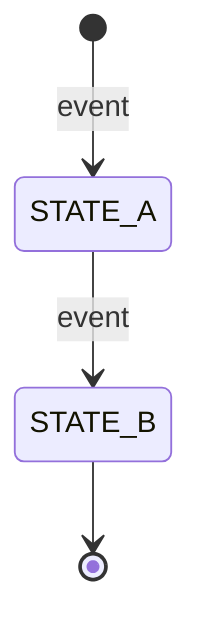

# Domain Specification Template

## Overview

Describe the bounded context / domain purpose.

This domain handles **[core responsibility]**, including **[key workflows and responsibilities]**.

It acts as **[role in system architecture, e.g. core service, supporting module, integration layer]**.

---

## Use Cases

Define each use case as `UC-XX`.

---

### UC-01: [Use Case Name]

- **Purpose**: What this use case achieves
- **Actors**: (User / Admin / System / External service)
- **Preconditions**: Required state before execution

#### Main Success Flow

1. Step-by-step happy path
2. Include validation steps where relevant
3. Include persistence points (DB writes, events)

#### Alternate / Exception Flows

- Validation errors (422)
- Unauthorized access (403)
- Conflict cases (409)
- Any domain-specific failure modes

#### Result

Final system state after successful execution

---

### UC-02: [Use Case Name]

(Repeat structure as needed)

---

## Core Entities

Define all key domain entities.

---

### Entity: [EntityName]

- **Description**: What this entity represents

#### Fields

- `id`: Unique identifier
- `created_at`: Timestamp
- `updated_at`: Timestamp

(Add domain-specific fields below)

#### Constraints

- Uniqueness rules
- Validation rules
- State restrictions

#### Relationships

- Relationships to other entities

---

## State Machines

---

### States

| State | Description |
|------|-------------|
| `STATE_A` | Description |
| `STATE_B` | Description |

---

### Transitions & Guards

| From → To | Event | Condition |
|----------|-------|----------|
| STATE_A → STATE_B | event_name | condition must be true |

---

## Business Rules (Invariants)

1. Define uniqueness constraints
2. Define validation rules
3. Define lifecycle rules
4. Define cross-entity constraints
5. Define system-wide rules

---

## Processing Flows

### Create Flow

1. Receive input
2. Validate request
3. Check constraints
4. Persist entity
5. Emit audit log / events

### Update Flow

1. Validate permissions
2. Validate current state
3. Apply updates
4. Persist changes
5. Record audit log

### Approval Flow (if applicable)

1. Validate requester role
2. Check entity state
3. Run domain checks
4. Apply approval
5. Trigger side effects

### Rejection Flow (if applicable)

1. Validate valid state
2. Require rejection reason
3. Persist rejection state
4. Record audit log
5. Trigger notification

---

## Interfaces

### List View
- Filters
- Columns
- Sorting
- Pagination

### Detail View
- Entity details
- Related entities
- Audit history
- Actions

---

## Notifications

| Event | Recipient | Channel | Message |
|------|-----------|----------|--------|
| CREATED | User | In-app | Created |
| APPROVED | User | In-app | Approved |
| REJECTED | User | In-app | Rejected |

---

## Audit Logging

- Creation
- Updates
- Status changes
- Admin actions

Includes:
- Actor
- Timestamp
- Action
- Payload snapshot

---

## Invariants

1. Data consistency must always hold
2. State transitions must follow state machine
3. Unique constraints must not be violated
4. Invalid transitions must be rejected
5. All sensitive actions must be logged

---

## Key Decisions

- Workflow type
- Conflict strategy
- Approval rules
- Data ownership
- Integration dependencies

---

## Optional Extensions

- Event-driven architecture
- External integrations
- Analytics
- Future phases
